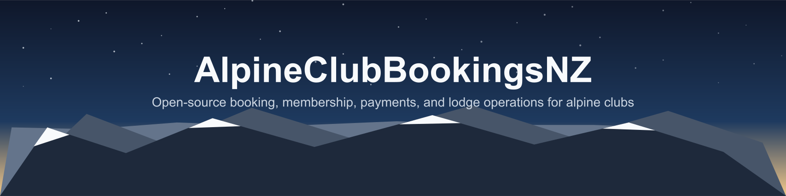
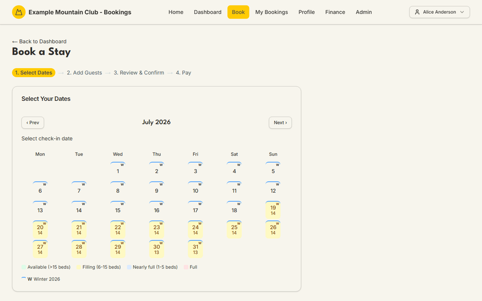
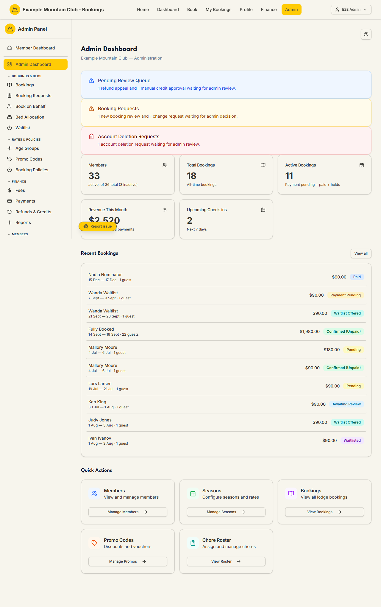
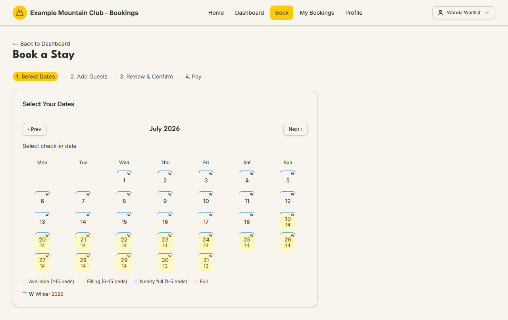
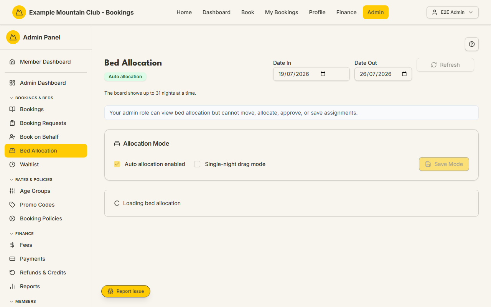
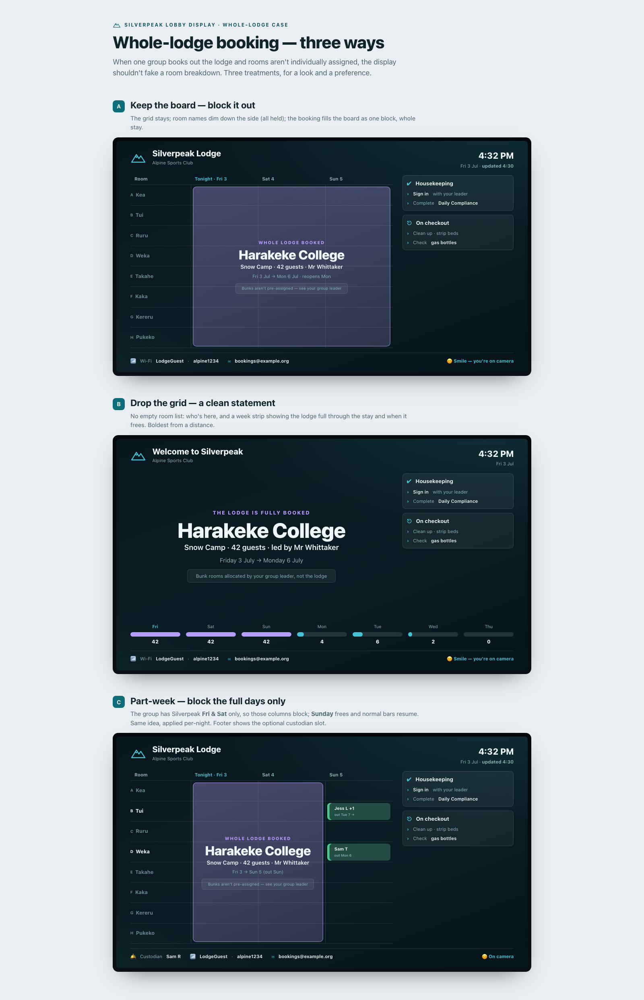
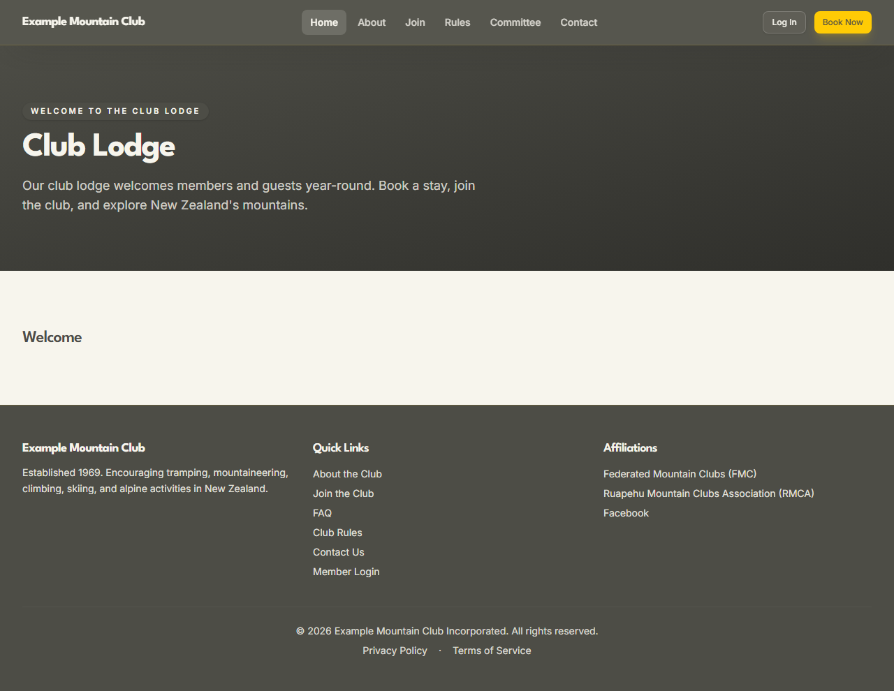
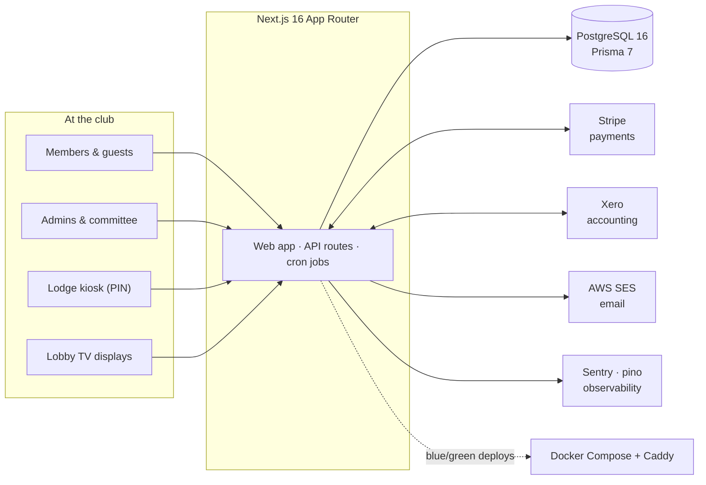

<h1 align="center">
  
</h1>

<p align="center">
  <a href="https://github.com/thatskiff33/AlpineClubBookingsNZ/actions/workflows/ci.yml"></a>
  <a href="https://github.com/thatskiff33/AlpineClubBookingsNZ/actions/workflows/e2e.yml"></a>
  <a href="https://github.com/thatskiff33/AlpineClubBookingsNZ/releases"></a>
  <a href="LICENSE"></a>
  
  
</p>

<p align="center">
  <a href="https://tokoroa.org.nz">Live club site</a> ·
  <a href="docs/README.md">Documentation</a> ·
  <a href="#quickstart">Quickstart</a> ·
  <a href="#see-it-in-action">Screenshots</a> ·
  <a href="https://github.com/thatskiff33/AlpineClubBookingsNZ/releases">Releases</a>
</p>

**AlpineClubBookingsNZ** is an open-source booking, membership, payment, and
lodge-operations platform for small clubs — built for and running
[Tokoroa Alpine Club](https://tokoroa.org.nz) in production today. It is also
published as a real-world reference implementation of a production Next.js
application with payments, accounting, email, scheduled jobs, and Docker-based
blue/green deployment.

Members book real beds against real capacity; admins run the whole club —
bookings, membership lifecycle, fees, Stripe and bank-transfer payments,
Xero accounting, lodge chores, even the TV in the lodge lobby — from one app.

<p align="center">
  
</p>

## What's in the box

| | |
|---|---|
| 🛏️ **Booking engine** — bed-capacity availability, NZ date-only lodge nights, waitlist and offers, holds, changes, cancellation rules, refunds, credits, promo and group discounts, exclusive whole-lodge holds → [guide](docs/guides/bookings.md) | 👪 **Membership lifecycle** — registration, families and partners, nominations, seasonal membership types and age tiers, annual subscription billing, cancellation with GST-aware refunds → [guide](docs/guides/members.md) |
| 💳 **Payments, two ways** — Stripe card payments (PaymentIntents + webhooks) and Xero-backed Internet Banking invoices with settlement tracking → [guide](docs/guides/payments.md) | 📒 **Xero accounting built in** — OAuth, webhooks, retry queues, invoice/credit-note lifecycle, and a native finance dashboard on Postgres snapshots → [finance docs](docs/finance-dashboard/README.md) |
| 🏔️ **Lodge operations** — rooms and beds, drag-and-drop bed allocation, chores and rosters, work parties, hut leaders, lockers, inductions, PIN lodge kiosk → [guide](docs/guides/bed-allocation.md) | 📺 **Lobby TV displays** — paired read-only screens showing arrivals, rooms, chores, and notices, driven by live booking data with privacy-reduced names → [display docs](docs/lobby-display/README.md) |
| 🏘️ **Multi-lodge core** — lodge-scoped rooms, seasons, lockers, and chores with a cross-lodge waitlist → [multi-lodge docs](docs/multi-lodge/README.md) | 🔐 **Granular admin roles** — seeded permission bundles (Booking Officer, Treasurer, …), custom roles, full audit log → [guide](docs/guides/access-roles.md) |
| 🌐 **Admin-editable public website** — sanitised rich-text pages, menus, banners, club theming with no redeploy → [guide](docs/guides/page-content.md) | ✉️ **Branded email** — AWS SES with suppression feedback, editable lifecycle templates that inherit the club theme → [guide](docs/guides/email-messages.md) |
| 💬 **In-app help everywhere** — a chat-style help widget on every surface answers page-specific questions from a curated corpus and shows a full page guide; with the optional **AI help assistant** module on (a club-supplied Anthropic key + a hard monthly spend cap), authenticated members can also ask free-text questions grounded strictly in that corpus → [configuration](CONFIGURATION.md#ai-help-assistant) | 🐛 **One-click issue reporting** — members and staff capture the current view and report a problem from any page straight into the admin triage queue |

Every feature above ships with an operator guide — 65 of them, nearly all
illustrated with captured screenshots — plus member-facing
[user guides](docs/user-guide/README.md), all indexed in the
[documentation hub](docs/README.md).

## See it in action

| | |
|---|---|
| [](docs/guides/dashboard.md) *Admin dashboard* | [](docs/user-guide/booking-a-stay.md) *Member booking wizard* |
| [](docs/guides/bed-allocation.md) *Drag-and-drop bed allocation* | [](docs/lobby-display/README.md) *Lobby TV board (design concept)* |
| [](docs/guides/reports.md) *Reports* | [](docs/guides/page-content.md) *Public club website* |

<details>
<summary>There are over 80 captured screens across the admin, member, and public surfaces.</summary>

Apart from the lobby-display design concept above, screenshots are generated
by a deterministic capture harness against seeded demo data
(`npm run docs:screenshots`, see [`docs/images/README.md`](docs/images/README.md))
and embedded throughout the [operator guides](docs/README.md).
</details>

## Architecture at a glance



TypeScript end to end: Next.js 16 App Router and React 19, PostgreSQL 16 with
Prisma 7, Auth.js credentials sessions (optional TOTP/email two-factor,
magic-link, and Google sign-in), Tailwind CSS and Radix UI, Vitest and
Playwright. The full system design — data model, booking capacity rules,
integration boundaries, cron, and deployment shape — is in
[`docs/ARCHITECTURE.md`](docs/ARCHITECTURE.md).

## Quickstart

```bash
git clone https://github.com/thatskiff33/AlpineClubBookingsNZ.git
cd AlpineClubBookingsNZ
cp .env.example .env                              # then edit — see CONFIGURATION.md
cp config/club.example.json config/club.json
npm ci && npx prisma generate
npm run setup:check                               # guided: npm run setup:wizard
```

Boot a full production-style stack (app + PostgreSQL) with Docker only:

```bash
cp .env.staging.example .env.staging
docker compose --env-file .env.staging -p tacbookings-staging \
  -f docker-compose.yml -f docker-compose.staging.yml up -d --build postgres app
docker compose --env-file .env.staging -p tacbookings-staging \
  -f docker-compose.yml -f docker-compose.staging.yml run --rm migrate
docker compose --env-file .env.staging -p tacbookings-staging \
  -f docker-compose.yml -f docker-compose.staging.yml exec app npx tsx prisma/seed.ts
```

Then open `http://localhost:3001` and sign in with your `SEED_ADMIN_*`
credentials.

**Adopting this for your club** is a documented, tested path:

1. Set your club name, beds, age tiers, and integer-cent rates in
   `config/club.json`.
2. Seed the first admin, then finish the in-app checklist at `/admin/setup`.
3. Brand it — colours, fonts, and logo at `/admin/site-style`, no redeploy
   needed — and replace the included club branding and copy with your own
   ([`NOTICE.md`](NOTICE.md)).
4. Toggle optional modules (kiosk, Xero, waitlist, lobby displays, Internet
   Banking, …) under **Admin → Modules**. Connecting Xero is fully in-app — a
   guided wizard at **Admin → Xero → Setup** walks you through creating the Xero
   app, entering its credentials (encrypted at rest), and the OAuth connect, with
   no `.env` edits or key generation.

The step-by-step adopter path from clone to first deployment is
[`docs/IMPLEMENTATION_GUIDE.md`](docs/IMPLEMENTATION_GUIDE.md); every
environment variable and the `config/club.json` schema are in
[`CONFIGURATION.md`](CONFIGURATION.md); the reference Lightsail + Docker +
Caddy blue/green production setup is in [`DEPLOYMENT.md`](DEPLOYMENT.md).

## Engineering quality

- **Money is property-tested.** Pricing, promo discounts, refund tiers, change
  fees, credits, and Xero settlement math are enforced as universally-quantified
  properties (integer cents; refund + retained = paid) with fast-check — see
  [`docs/DOMAIN_INVARIANTS.md`](docs/DOMAIN_INVARIANTS.md).
- **Critical journeys run in real browsers.** Playwright E2E suites cover
  booking, payments, waitlist, two-factor login, bed allocation, and more
  against a seeded staging stack ([`docs/E2E_PLAYWRIGHT.md`](docs/E2E_PLAYWRIGHT.md)).
- **Migrations are gated for zero-downtime.** Every schema change is classified
  under the blue/green ledger before it can merge
  ([`docs/BLUE_GREEN_MIGRATION_POLICY.md`](docs/BLUE_GREEN_MIGRATION_POLICY.md)).
- **Accessibility is a baseline, not a feature.** Semantic status tokens,
  icon-or-text redundancy, keyboard focus outlines, and a reduced-motion guard,
  verified by a staging Lighthouse workflow
  ([`docs/STAGING_ACCESSIBILITY.md`](docs/STAGING_ACCESSIBILITY.md)).
- **CI blocks the merge.** Lint, typecheck, unit + property tests, build,
  migration-drift, static-analysis, and E2E checks are all required on `main`
  ([`docs/MAINTENANCE.md`](docs/MAINTENANCE.md)).
- **Backups are drilled, not assumed.** S3-backed PostgreSQL backups are
  configured in-app at Admin → Integrations → Database Backups (no `.env`
  edits), run on demand or nightly, and ship with a scripted quarterly restore
  drill ([`DEPLOYMENT.md`](DEPLOYMENT.md),
  [`docs/MAINTENANCE.md`](docs/MAINTENANCE.md)).

## Releases and upgrades

Versioned, classified releases with written upgrade paths:
[GitHub Releases](https://github.com/thatskiff33/AlpineClubBookingsNZ/releases) ·
[`CHANGELOG.md`](CHANGELOG.md) ·
[release notes index](docs/releases/README.md) ·
[`docs/UPGRADING.md`](docs/UPGRADING.md) ·
[`docs/PRODUCTION_UPGRADE_RUNBOOK.md`](docs/PRODUCTION_UPGRADE_RUNBOOK.md).
Deploys ship from GHCR images (`alpineclubbookingsnz-app`,
`alpineclubbookingsnz-migrate`) via a single blue/green deploy script.

## Documentation

Start at the [documentation hub](docs/README.md) for recommended reading paths
by audience. Key entry points:

| Audience | Where to go |
|---|---|
| **Club members** | [User guides](docs/user-guide/README.md) — booking a stay, paying, waitlist, family, your account — also on the [project wiki](https://github.com/thatskiff33/AlpineClubBookingsNZ/wiki) |
| **Adopting clubs** | [`docs/IMPLEMENTATION_GUIDE.md`](docs/IMPLEMENTATION_GUIDE.md) · [`CONFIGURATION.md`](CONFIGURATION.md) · [`DEPLOYMENT.md`](DEPLOYMENT.md) · [`docs/UPGRADING.md`](docs/UPGRADING.md) |
| **Operators / committee** | [65 illustrated operator guides](docs/README.md) · feature hubs: [finance dashboard](docs/finance-dashboard/README.md), [multi-lodge](docs/multi-lodge/README.md), [lobby display](docs/lobby-display/README.md), [Xero](docs/xero/ARCHITECTURE.md), [config transfer](docs/config-transfer/README.md) · [`docs/CANCELLATIONS.md`](docs/CANCELLATIONS.md) · [`docs/AUTHORITATIVE_FEES.md`](docs/AUTHORITATIVE_FEES.md) |
| **Developers** | [`docs/ARCHITECTURE.md`](docs/ARCHITECTURE.md) · [`docs/DOMAIN_INVARIANTS.md`](docs/DOMAIN_INVARIANTS.md) · [`docs/STATE_MACHINES.md`](docs/STATE_MACHINES.md) · [`docs/UX_FLOW_MAP.md`](docs/UX_FLOW_MAP.md) · [`docs/E2E_PLAYWRIGHT.md`](docs/E2E_PLAYWRIGHT.md) · [`docs/MAINTENANCE.md`](docs/MAINTENANCE.md) · [`CONTRIBUTING.md`](CONTRIBUTING.md) |
| **Maintainers** | [`docs/ONGOING_DEVELOPMENT_WORKFLOW.md`](docs/ONGOING_DEVELOPMENT_WORKFLOW.md) · [`docs/BLUE_GREEN_MIGRATION_POLICY.md`](docs/BLUE_GREEN_MIGRATION_POLICY.md) · [`docs/PRODUCTION_UPGRADE_RUNBOOK.md`](docs/PRODUCTION_UPGRADE_RUNBOOK.md) · [`docs/SECURITY.md`](docs/SECURITY.md) |

## Community, security, and licence

- Questions and help: [`SUPPORT.md`](SUPPORT.md) · conduct:
  [`CODE_OF_CONDUCT.md`](CODE_OF_CONDUCT.md)
- Contributions welcome — read [`CONTRIBUTING.md`](CONTRIBUTING.md) first
- Report suspected vulnerabilities **privately** via [`SECURITY.md`](SECURITY.md);
  never post secrets, personal data, or accounting records in public issues
- MIT licensed ([`LICENSE`](LICENSE)). Club branding, logos, copy, and domains
  are included for context only — replace them before using a fork for another
  organisation ([`NOTICE.md`](NOTICE.md))

Built with ❤️ for [Tokoroa Alpine Club](https://tokoroa.org.nz), and for every
small club still running its lodge on spreadsheets.
