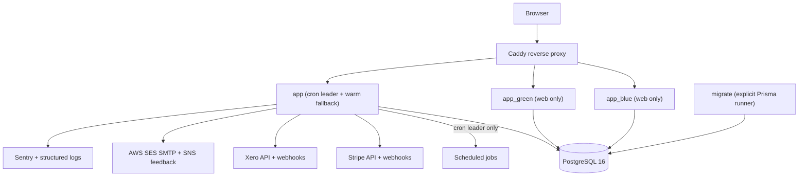
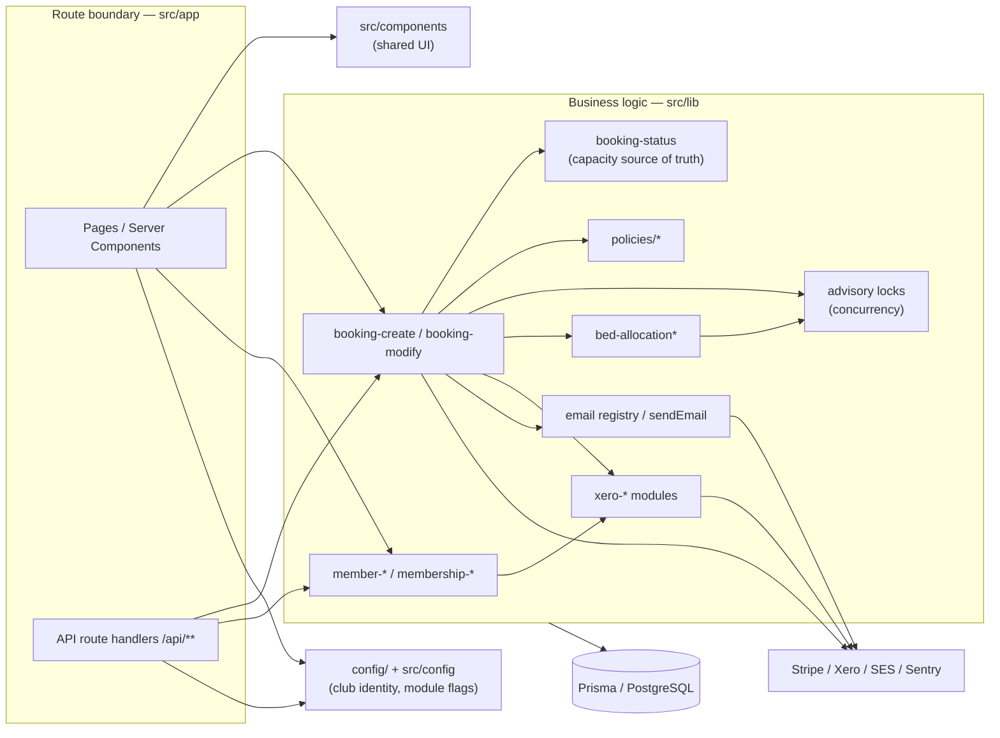
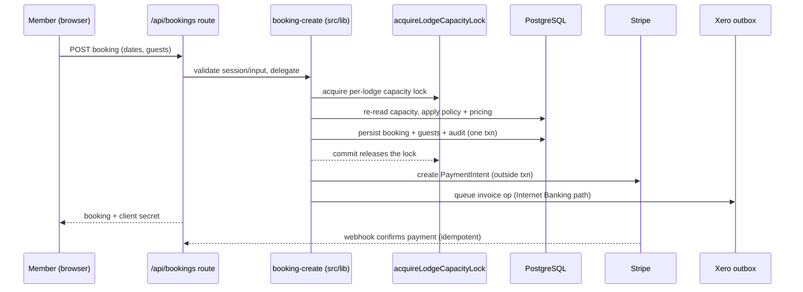
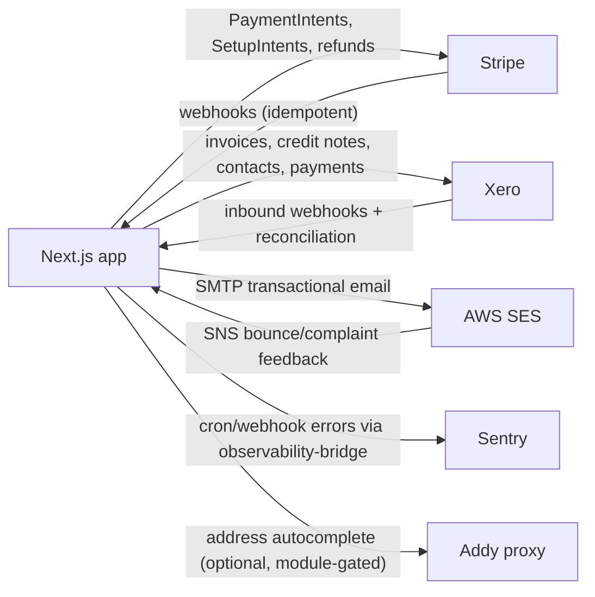
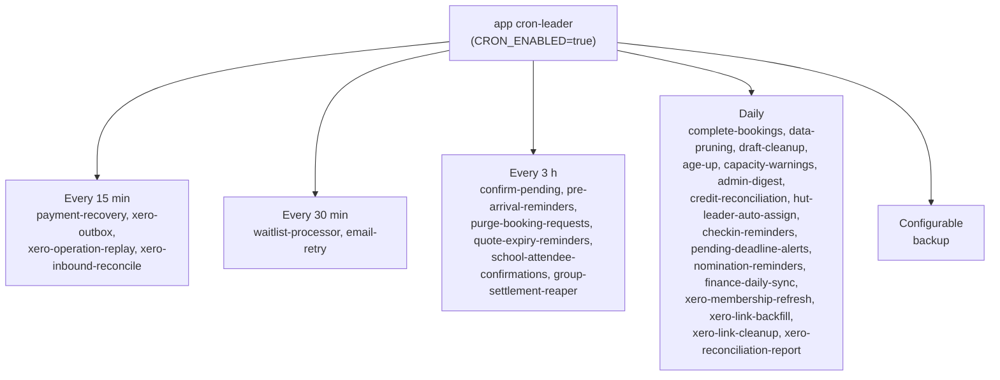

# Architecture

AlpineClubBookingsNZ is a full-stack TypeScript monolith for club booking and membership
operations. It is built around Next.js App Router route handlers,
Prisma/PostgreSQL, Stripe, Xero, AWS SES, cron jobs, and Docker Compose
deployment.

PageContent embeds use one server-only registry and renderer across home,
code-backed, catch-all, and database-backed 404 routes. Authoritative fee and
policy loaders return narrow display view models only. Default-false persisted
visibility gates and exact active-lodge lookup prevent accidental publication,
cross-lodge fallback, and leakage of provider or internal configuration fields.

## Runtime Shape

```text
Browser
  |
  v
Caddy reverse proxy
  |
  v
Next.js app container
  |
  +-- PostgreSQL 16
  +-- Stripe API and webhooks
  +-- Xero API and webhooks
  +-- AWS SES SMTP and SNS feedback
  +-- Sentry and structured logs
```

The production Compose model runs:

- `caddy` for HTTP/HTTPS routing
- `app` as the cron leader and warm fallback upstream
- `app_blue` and `app_green` as web-only blue/green slots
- `postgres` as the database
- `migrate` as an explicit Prisma migration runner

The same runtime shape as a diagram (the `app` container is the cron leader and
warm fallback; `app_blue`/`app_green` are web-only slots that disable cron):



## Project Structure

```text
prisma/
  schema.prisma                 database schema
  migrations/                   deployable migration history
  seed.ts                       local/staging seed data
  demo-seed.ts                  destructive local-only showcase seed data
src/
  app/                          Next.js App Router pages and API routes
  components/                   shared UI and feature components
  config/                       club identity, module flags, and runtime config
  data/                         static public-page content
  lib/                          business logic, integrations, cron helpers
  types/                        project type augmentation
docs/                           public architecture and runbooks
scripts/                        deploy, migration, staging, and repair helpers
deploy/                         production proxy/runtime support files
```

Important route groups:

- `src/app/(public)` contains unauthenticated pages such as login, register,
  password reset, email verification, payment, and public token flows.
- `src/app/(authenticated)` contains member dashboard, booking, profile, family,
  and booking-detail pages.
- `src/app/(admin)` contains administrative operations for members, member CSV
  import, bookings, bed allocation, payments, reports, lodge, Xero, audit logs,
  and policies.
- `src/app/api` contains route handlers for auth, bookings, payments, admin,
  finance, lodge, webhooks, cron, and health checks.

> **Theme substrate — the 3-seed model (#2187 P1).** Site Style stores THREE
> seed colours, not seven: `brandGold` (the required accent), `brandDeep` (an
> optional neutral character whose hue tints the grey ramp), and `brandSafety`
> (an optional support accent). The wizard's colour step is 1 required + 2
> optional hex-only pickers. Those seeds feed the vendored Radix custom-palette
> generator (`src/lib/theme/`), which derives the full 12-step light/dark
> substrate with cross-colour text contrast guaranteed by construction, so a
> low-contrast pick is **adjusted and disclosed (before → after), not rejected**
> — the old blocking contrast gate is gone. The four former columns
> (`brandCharcoal`/`brandRidge`/`brandMist`/`brandSnow`) are dead to code:
> `deriveBrandShims` derives those `--brand-*` shim values from the substrate
> neutral ramp so the website utilities and email palette keep working through
> P1 (P2/P3 delete the shims). The columns remain in the DB behind a default (an
> additive EXPAND migration) so pre-#2187 code stays compatible across a
> blue/green cutover; the destructive column drop ships in P4. Config-transfer
> bundles are **format version 2** and reject any version-1 bundle. The deeper
> substrate wire-up of `globals.css` (generated scale variables + alias blocks +
> the `.dark .app-theme-scope` rewrite) and the neutral/callout/kiosk remap
> deletions land in later phases; through P1 the `--brand-*` shims below still
> drive the app scope.

Every app-shell layout (`(public)`, `(authenticated)`, `(admin)`, `(finance)`)
injects the admin-configured theme via `getWebsiteThemeRenderState()` inside an
`app-theme-scope` wrapper, so never hardcode the brand accent (e.g. Tailwind
`teal-*`) in components: reach it through semantic tokens (`--primary`,
`bg-primary`, `text-primary-foreground`, `border-primary/30`, ...) so the saved
site colours apply in light and dark, and use the `--hue-*` tokens for
categorical status hues that must stay fixed across themes.

The same rule applies to raw NEUTRALS, though for a narrower reason than the
brand accent — and the reason is worth stating precisely, because a safety net
already exists.

Historically `globals.css` carried a **`.dark .app-theme-scope` neutral remap**
(the #1263 follow-up block) that rewrote literal `bg-white`,
`bg-{neutral}-50/100/200`, `text-{neutral}-300..950`, `border-{neutral}-100..300`
and their `divide-`/`hover:` variants onto `--card`, `--muted`, `--border`,
`--foreground`, `--muted-foreground` and `--accent`, treating
slate/gray/zinc/neutral/stone as one family. That shim covered dark mode only —
in LIGHT mode a literal `slate-*`/`bg-white` stayed slate/white and ignored a
strongly non-default club theme, so surfaces were correct-by-shim rather than at
source. **#2188 P2 removed the shim entirely** (see below); code inside
`app-theme-scope` now uses the semantic surface tokens at source:
`bg-card` / `text-card-foreground` for card surfaces, `bg-popover` /
`text-popover-foreground` for floating panels such as chart tooltips,
`text-muted-foreground` for secondary labels and footnotes, `bg-muted` for
tinted rows and recessed insets, and `border-border` for rules. Colored surfaces
likewise reach their hue through the signed-off scale vocabulary — the semantic
`bg/text/border-<success|warning|info|danger>-<step>` scales, the categorical
`cat1..cat5` scales, or `CHIP_TONE_CLASSES` — never raw Tailwind colour
utilities. The finance tree migrated in #2137, admin in #2144, the member-facing
`(authenticated)`/`(public)` trees in #2187 P1 (B4), and the remaining trees
(lodge, website, shared components, root) in #2188 P2, so the source is
token-only repo-wide and gated by
`src/lib/__tests__/brand-color-source-contract.test.ts`.

**Insets use `bg-muted`, outer surfaces use `bg-card`** (#2144 owner decision).
The shim's raw→token table maps `bg-white`/`bg-{neutral}-50` onto `--card`, but
inside `app-theme-scope` `--card` and `--background` share the same colour in
light mode, so a nested strip converted to `bg-card` renders flat against its
page. The #2137 finance precedent (`finance-dashboard-client.tsx`,
`ratio-explorer.tsx`) answers this: a Card/section root, page-level panel, or
popover takes `bg-card`; a nested strip inside a card, a zebra row, a table
header band, a read-only field fill, or a recessed well takes `bg-muted`.

**#2188 P2 completed the migration and deleted both `.dark .app-theme-scope`
remap blocks** — the neutral remap and the colored-callout remap — so
`grep "\.dark .app-theme-scope" globals.css` now returns only P1's generated
dark core-token block and the A6 J8 card-shadow rule, never a remap. The source
contract is now **repo-wide** (both the neutral contract and the new 16-family
colored contract), with a temporary kiosk-tree exclusion (B8) removed in P3.
The surfaces that legitimately keep raw neutrals are per-file allowlisted with a
stated reason: the roster/induction print pages and reports print variants
(paper output, not theme), the site-style wizard's raw-CSS editor pane, the
display/signage surfaces, solid opaque status chips, deliberate dark surfaces
(the roster-setup and kiosk-style instruction panels, same shape as the kiosk),
the un-themed React error/404 boundaries (rendered outside `app-theme-scope`),
and the Radix overlay scrims (`bg-black/80`). The kiosk tree itself is migrated
onto `--kiosk-*` tokens in P3.

**The app tokens resolve from a GENERATED substrate** (#2187 P1, the restyle
event). A club now picks three seeds (accent + optional neutral-character +
optional support); `buildThemeSubstrate` (`src/lib/theme/theme-substrate.ts`)
turns them into the full 12-step light/dark Radix-style scales, and
`buildClubThemeAppCss` emits the whole generated custom-property set —
`--gen-<scale>-<step>` raw steps plus the resolved role tokens
`--gen-<token>` (light) / `--gen-<token>-dark` (dark), per the data alias map
in `src/lib/theme/aliases.ts` (`src/lib/theme/app-tokens.ts` assembles them).
`globals.css`'s static `.app-theme-scope` (light) and `.dark .app-theme-scope`
(dark) blocks CONSUME those props via `var(--gen-<token>, <default-fallback>)`,
so an un-themed page still paints the shipped default palette. `--accent`
(neutral-4) is deliberately one band off `--muted`/`--secondary` (neutral-3) in
BOTH modes — the structural fix for the seven hover-dead `bg-muted
hover:bg-accent` #2144 buttons — and the dark core-token block is rewired onto
generated dark steps with **no `--brand-*` reference left inside it** (F1). The
legacy `--brand-*` values still ship as derived SHIMS (`deriveBrandShims`, from
the substrate neutral ramp) so the website `color-mix()` recipes, the app
`bg-brand-*` utilities, and the email palette keep working through P1; those
shims are deleted in P2/P3. The `.dark` neutral/colored remap blocks described
above were deleted by #2188 P2 once every tree was migrated at source.

The member-facing `src/app/(authenticated)` and `src/app/(public)` trees were
migrated off raw neutrals onto the semantic surface tokens in the same event
(#2187 B4), so at restyle their light mode follows the club theme at source
rather than by shim; the remaining raw neutrals live under `src/components`,
the kiosk/lodge display trees, and the allowlisted admin files.

**`--muted-foreground` is a DERIVED tone, not a brand colour** (#2145). Every
other app text token in the `.app-theme-scope` block resolves to a solid
generated-substrate endpoint (`--foreground` is the club ramp's neutral-12 in
each mode).
`--muted-foreground` used to do the same — which made it byte-identical to
`--foreground`, so `text-muted-foreground` rendered as primary text and the
`muted` role was inert. It is now computed by `deriveAppMutedForeground` in
`src/lib/club-theme-schema.ts` and injected as `--app-muted-foreground` /
`--app-muted-foreground-dark` by `buildClubThemeAppCss`; `globals.css` reads
those with a static fallback for the case where no ClubTheme stylesheet is
injected.

The derivation mixes each mode's foreground 30% toward that mode's base surface
(the same 70/30 sRGB mix `.website-theme` already uses for its own
`--muted-foreground`) and then steps the tone BACK toward the foreground until
it clears WCAG AA 4.5:1 against a **named, finite list** of surfaces. The list is
the whole substance of the guard, so it is stated here in full — it is
`APP_MUTED_FOREGROUND_LIGHT_SURFACE_TOKENS` /
`APP_MUTED_FOREGROUND_DARK_SURFACE_TOKENS` in `club-theme-schema.ts`:

| Mode  | Checked surfaces |
| ----- | ---------------- |
| Light | `--brand-snow` (`--background`/`--card`/`--popover`), `--brand-mist` (`--muted`/`--secondary`), `--accent` (neutral-4), and the curated `--warning-muted` / `--info-muted` / `--success-muted` / `--danger-muted` panel fills |
| Dark  | `--brand-deep` (`--background`), `--brand-charcoal` (`--card`/`--popover`/`--muted`/`--secondary`), `--accent` (neutral-4), and the same four curated `*-muted` fills in their `.dark` values |

Both **brand** surfaces are checked per mode, not only the base one, because
that is what makes the guard hold for an endpoint-crossing palette, where moving
toward one surface moves away from the other. **`--accent`** is checked as its
own surface because #2144 split it off `--muted`/`--secondary`: it is neutral-4,
one band DARKER than `--brand-mist` (neutral-3) in light and one band lighter in
dark, and it is a genuine muted-text background — dropdown and command-menu
shortcuts render `text-muted-foreground` inside `focus:bg-accent` items. Clamping
against `--brand-mist` alone left the Tokoroa light tone at 4.37:1 on the hover
surface; reading the true neutral-4 from each mode's substrate ramp restores it
to 4.64:1. The guarantee sweep (`guarantee-sweep.test.ts`, G2c) measures the
shipped derived tone against neutral steps 1–4 in both modes for both reference
seeds, so a sub-AA step-4 cell fails CI. The four **curated** `*-muted`
fills are checked because #1808 deliberately leaves them out of
`app-theme-scope`: they are fixed while the derived tone slides with the brand
ramp, which is the one pairing that can drift apart with nothing watching. They
are genuine muted-text backgrounds — `bg-warning-muted` and friends carry
`text-muted-foreground` footnotes in roughly 35 places across bed-allocation,
waitlist, committee, and family-suggestions.

Deliberately **not** in the list:

- `--border` / `--input`. Dark mode used to remap `bg-{neutral}-200` onto
  `--border` (the shim #2188 P2 deleted, when the trees moved to source tokens),
  so a `bg-slate-200` badge would be a muted-text surface — but the only such
  badge (`page-content-panel.tsx`) was moved to `bg-muted text-muted-foreground`
  instead. A mid-luminance hairline colour is the wrong background for body text
  at any weight, and a mid-luminance surface leaves the derived tone almost no
  headroom: clamping against it would force the tone to walk all the way back
  onto `--foreground` for a materially larger share of palettes than the muted
  derivation collapses on today — defeating #2145 (a distinct muted tone) for a
  surface no text should sit on. The AA guarantee that IS enforced (the
  neutral-ramp sweep in `club-theme-schema.test.ts`) covers only the surfaces in
  the clamp set; `--border`/`--input` are deliberately outside it.
- The (now-deleted, #2188 P2) dark coloured hue remaps. The `-50`
  (`oklch(0.29 …)`) and `-100` (`oklch(0.33 …)`) tiers sat at or below the
  `*-muted` tier already checked, so
  in dark mode — where the derived tone is the LIGHT one — clearing AA on
  `--success-muted` clears them too. The `-200` tier does NOT follow from that
  reasoning and is excluded on evidence instead: `bg-{hue}-200` remaps to
  `oklch(0.38 …)`, which is LIGHTER than the checked `oklch(0.33 …)` tier and so
  is the HARDER background for a light tone. The default dark tone measures
  6.10:1 on `--warning-muted` but 5.00:1 on `bg-amber-200` and 4.93:1 on
  `bg-sky-200`. Both shipped palettes still clear 4.5:1 there, and the only
  coloured `-200` background in the app
  (`admin-exclusive-hold-controls.tsx`) carries `text-amber-900`, not muted
  text — so nothing fails today. But a `bg-*-200` + `text-muted-foreground`
  pairing is NOT covered by the guard; on a lower-headroom palette it could drop
  below AA, so measure before shipping one.

Four things about this guard are worth stating precisely, because it is easy to
read more into it than it delivers:

- **It guarantees** a TWO-BRANCH outcome, over the surfaces **in the table
  above** and no others. Where `--foreground` itself clears 4.5:1 on a listed
  surface, the derived tone clears 4.5:1 there too. Where `--foreground` itself
  FAILS AA on a listed surface — an inherited failure the derivation cannot
  repair, because #1808 pins the curated `*-muted` fills while the brand ramp
  moves — the derived tone is no worse than `--foreground` there. It is computed
  from the saved palette every time the app stylesheet is rendered, so it also
  covers palettes already stored in the database — not only newly saved ones. It
  says nothing about a surface not in the table; a new always-on background that
  hosts muted text has to be added to the list.
- **It is deliberately LESS readable than `--foreground`, and that is the
  point.** Carrying measurably less contrast than the token it softens is the
  whole feature, so no clause here should be read as parity with `--foreground`.
  `club-theme-schema.test.ts` pins the shipped tones at 0.41 / 0.53 (default
  light/dark) and 0.51 / 0.59 (Tokoroa) of `--foreground`'s ratio on the same
  surface, and fails if that fraction ever climbs past 0.75 — which is what stops
  the role being tuned back into an invisible near-copy of `--foreground`.
- **It does not guarantee** that the tone is visually DISTINCT from
  `--foreground`. A palette with no contrast headroom walks all the way back and
  the two coincide again, exactly as before #2145. Accessibility wins over the
  semantic distinction; `getBlockingContrastWarnings` is what stops a palette
  that poor being saved at all.
- **It says nothing about ALPHA uses of the token.** Every ratio above is
  measured on the opaque tone. Where a call site applies an alpha — the dashed
  `border-muted-foreground/70` and `/80` provisional-chip outlines in
  bed-allocation, `border-muted-foreground/30` on the display-builder drop zone,
  the `text-muted-foreground/60` empty-state icon on the member dashboard — the
  composited colour is materially fainter than the token, and #2145 made those
  composites fainter still (the dashed chip outline went from 4.26:1 to 2.76:1
  in dark mode at `/50`, which is why it is now `/70`). None of them is a WCAG
  1.4.11 failure: each is either purely decorative alongside full-strength text,
  or redundantly encoded by border style, icon, and label — the reasoning is
  recorded at `allocation-chip.tsx`. But do not read the opaque guarantee onto
  an alpha variant; measure it. An opaque non-text use (the `bg-muted-foreground`
  meter fill on a `bg-muted` track in the Xero panel, 4.77:1 / 4.63:1) does
  inherit the stricter-than-3:1 bar.

The tone is computed in TypeScript and emitted as a resolved colour rather than
written as a CSS `color-mix()` on purpose: a mix is unmeasurable from the
contrast gate, and "app text tokens are solid, measurable endpoints" is the same
invariant that keeps `--foreground` / `--card-foreground` off interpolated
values. `src/lib/__tests__/club-theme-schema.test.ts` gates the derived values
(including a sweep over configurable neutral ramps) and
`src/lib/__tests__/app-theme-layout-contract.test.ts` pins the `globals.css`
wiring and its static fallback.

Two contract tests in `src/lib/__tests__/brand-color-source-contract.test.ts`
enforce this:

- **Brand accent.** No literal Tailwind `bg-`, `text-`, or `border-` `teal-*`
  utility under `src/` (the check is scoped to those three prefixes; `ring-`,
  `divide-`, `fill-`, and gradient `from-`/`to-` teal are not currently
  matched). One file is allowlisted (the final teal entry, evicted in P4):
  `src/components/admin-booking-calendar.tsx` paints each booking status as a
  SOLID swatch (`bg-teal-500`), and `--hue-*` is defined only as a
  muted-background / accent-text PAIR, so there is no clean token for a standalone
  solid fill. The dashboard Chore Roster tile was migrated onto the brand role
  tokens (`bg-accent` / `text-primary`, M9, #2188 P2) and is no longer
  allowlisted. Every other categorical teal (the waitlist-offered chip, the audit
  `family` badge, the family-group `GROUP_CREATE` badge) reaches its hue through
  `CHIP_TONE_CLASSES.teal` in `src/lib/chip-tones.ts`, the single source of
  truth for chip tone classes — those were already -100/-800 pairs, so the
  migration was value-identical.
- **Themed neutrals.** No raw `slate-`/`gray-`/`zinc-`/`neutral-`/`stone-`
  utility, `bg-white`, or `bg-`/`text-black` under `src/app/(admin)`,
  `src/app/(finance)`, `src/components/admin`, or `src/components/finance`,
  plus four admin-only files gated individually because they live under the
  ungated shared roots (`admin-booking-calendar.tsx`, `admin-hub-page.tsx`,
  `admin-permission-matrix-table.tsx`, `src/lib/admin-family-group-ui-helpers.ts`).
  The #2144 sweep migrated the admin tree, so the check now runs with a
  nine-entry PER-FILE allowlist, each entry carrying its stated reason in the
  test (print paper surfaces, signage `bg-black` letterboxes, the site-style
  code-preview panes that `app-theme-layout-contract` pins as literal slate,
  solid-fill status chips and swatches, and the member-import wizard's solid
  near-black active-step emphasis border). Per-file granularity means an entry forfeits
  gate coverage on that file's other occurrences — prefer fixing a stray over
  adding an entry. As of #2188 P2 the contract is **repo-wide** (the member-facing
  `(authenticated)`/`(public)`, `(lodge)`, `(website)`, shared `components`, and
  root trees are all migrated at source). #2189 P3 removed the last carve-out —
  the kiosk family — so all five source contracts now run **truly repo-wide** with
  no kiosk exclusion (see "Kiosk / wall-display" below).

The dark-mode colored-callout pass (#1248) that used to re-tint literal Tailwind
`bg-{family}-50/100/200` / `text-{family}-600..950` / `border-{family}-100..300`
inside `app-theme-scope` was **deleted in #2188 P2** — every colored surface now
carries a scale token at source (`bg-danger-3` / `text-danger-11` / the `cat1..5`
scales) that adapts per mode by construction, so no re-tint pass is needed. The
dashboard Chore Roster tile that used to depend on that pass (its `bg-teal-50` /
`text-teal-600` were what it re-tinted) was migrated onto the brand role tokens
(`bg-accent` / `text-primary`, M9) in the same phase. The only literal teal left
is the calendar's `bg-teal-500` status swatch (the final teal allowlist entry,
evicted in P4).

**Print and PDF always render the LIGHT palette** (#2146). Paper and the
generated PDF page are white, so dark mode must never reach them. Rather than
stacking `!important` overrides on the print block — which cannot win against a
token a descendant sets on itself, such as `Card`'s own `text-card-foreground` —
every rule that installs the dark palette is wrapped in `@media not print`: the
`:root`-level `.dark` token ramp and the `.dark .app-theme-scope` generated
core-token block (the two surviving dark blocks after #2188 P2 deleted the
neutral and colored-callout remaps). The `@media print` block then only pins
`color-scheme: light`
(the one `!important` it needs, because `next-themes` writes `color-scheme` as an
inline style on `<html>`) plus the page/section layout rules. The
`html2canvas`-based **Download PDF** path (`src/lib/report-pdf.ts`) is the same
hazard in a different medium: it composites onto a hard-coded white page, so its
`onclone` hook strips the theme class from the cloned capture document.

Two rules follow for anyone adding dark-mode styling, because the guarantee has
two halves with different enforcement:

1. **In `globals.css`:** wrap any new `.dark`-gated rule in `@media not print`,
   unless every value it assigns is a `var(--token)` for a token the light
   blocks genuinely restate. That qualifier is the whole point and is easy to
   get wrong: `--card` / `--foreground` are light/dark PAIRS, so excluding the
   `.dark` block from print leaves the light `:root` value standing and the rule
   self-heals — which is why the token-driven neutral remap is deliberately left
   unwrapped. `--brand-charcoal` / `-deep` / `-snow` / `-gold` / `-mist` are NOT
   pairs: they are fixed brand colours declared once on `:root` that no `.dark`
   block restates, so `background: var(--brand-deep)` in an unwrapped
   `.dark`-gated rule prints a near-black card. The contract test
   `src/lib/__tests__/print-light-palette-contract.test.ts` parses this file and
   fails on any `.dark`-gated rule left visible to print media that assigns
   anything else — a literal colour in any syntax, a fixed brand token, or a
   colourless but theme-dependent declaration such as `outline: none`. It
   derives the set of self-healing tokens from the stylesheet itself (declared
   by a print-visible light block AND by a `.dark`-gated block), so the set
   cannot drift away from what this file actually declares. Note the
   granularity, which pre-dates #2145 and #2146: the derived set is keyed by
   token NAME across the whole stylesheet, not per block. A token stays
   "healed" as long as *some* print-visible light rule and *some* `.dark` rule
   declare it — so `--muted-foreground` would still count as healed via
   `:root`/`.dark` even if the light `app-theme-scope` block stopped declaring
   it, and would then quietly fall back to the `:root` value on paper without
   the contract test objecting. A corollary that
   bites when a token stops being a plain brand alias: the derived
   `--muted-foreground` (#2145) reads a DIFFERENT injected variable per mode
   (`--app-muted-foreground` vs `--app-muted-foreground-dark`), but both blocks
   still declare `--muted-foreground` itself, so it stays a light/dark pair and
   paper keeps the light derived tone. Splitting a paired token across two
   differently-named declarations — light in one block, dark in the other, with
   no shared name — would silently drop it out of the healed set.
2. **In a class string, wherever it lives:** a Tailwind `dark:` utility carrying
   a **literal palette colour** — a named shade (`dark:bg-slate-900`,
   `dark:text-amber-200`) or an arbitrary value (`dark:bg-[#0b1220]`,
   `dark:text-[rgb(2,6,23)]`) — must not go on a printable surface, whatever
   variants are stacked in front of it. This is the half `globals.css` cannot
   protect: `dark:` utilities compile into Tailwind's own generated stylesheet,
   never into `globals.css`, so no `@media not print` wrapper here can ever
   reach them — they print exactly as written. Token-driven variants
   (`dark:bg-input/30`, `dark:checked:bg-primary`, `dark:bg-[var(--card)]`) are
   fine, since they resolve to `var(--token)` and self-heal like the rules
   above. The same contract test enforces this by scanning the printable trees
   (`(finance)`, `components/finance`, `admin/reports`, `admin/roster`,
   `admin/induction`, `lodge-instructions`, `hut-leader-instructions`, and
   `components/ui`, plus the shared components that render on a printable page)
   and keeps the handful of non-printable files that legitimately carry such
   utilities on an enumerated list. The scan covers `.ts` as well as `.tsx`,
   because this repo already keeps palette class strings in plain modules
   (`bed-allocation/_components/booking-accent.ts`). On a printable surface,
   reach the colour through a semantic token or the `--hue-*` pairs instead.

   **What the class-string scan does and does not see.** It is a regex over
   source text, not a Tailwind parse, so the boundary is worth stating exactly
   rather than implying it is total. It recognises any stack of variants in
   front of the utility — named (`dark:hover:`, `dark:md:`), the `*:` / `**:`
   descendant variants, bare arbitrary variants (`dark:[&>tr]:`), and functional
   bracket variants (`dark:data-[state=open]:`, `dark:has-[:checked]:`,
   `dark:aria-[…]:`, `dark:group-[…]:`, `dark:supports-[…]:`) — and, on the
   value side, named palette shades, `black` / `white`, and any arbitrary value
   containing a colour token anywhere in it (hex, or `rgb`/`hsl`/`hwb`/`oklch`/
   `oklab`/`lab`/`lch`/`color`/`color-mix`/`light-dark`/`theme(…)`, nested or
   not). It deliberately does NOT flag arbitrary values that reach a token
   (`dark:bg-[var(--card)]`) or that are not colours at all
   (`dark:text-[14px]`). What it cannot see is a class name that does not exist
   as literal text in the source: one assembled at runtime from fragments, or
   arriving from data or a CMS field. Keep printable-surface classes written out
   literally so this check can do its job.

`e2e/print-dark-mode.spec.ts` backs the CSS and class-string halves at the
medium the bug actually lives in: it renders `/admin/reports` and `/finance`
under `emulateMedia({ media: "print", colorScheme: "dark" })` and asserts the
computed ink is dark on a light surface, and that the printed result is
identical with and without the theme class.

**The `report-pdf.ts` Download PDF path has no browser-level coverage.**
`emulateMedia` changes the print medium; it does not exercise `html2canvas`, and
the spec never clicks Download PDF. What is covered is the jsdom unit test in
the contract file, which calls `forceLightPaletteInClone` on a hand-built
document and asserts the DOM mutation, plus a source-string assertion that the
hook is still wired as `onclone`. That is the function's behaviour and the
wiring — not the actual `html2canvas` contract, and not the produced PDF. Since
Download PDF is the button operators actually press (and was the second half of
#2146), a change to that path warrants a manual export check in both themes
until real coverage exists.

Chart colours are a documented carve-out. `FINANCE_MIX_COLORS` in
`src/components/finance/charts/finance-chart-theme.ts` stays a literal hex
palette (#1801, re-affirmed in #2137): the values feed Recharts `fill`/`stroke`
SVG presentation attributes, where `var()` does not resolve, and they are
categorical tones chosen to stay distinguishable independent of the club theme.
Chart neutrals (grid, axis, ticks) are themed in `globals.css` through the
`.finance-trend-chart .recharts-*` selectors, which override the light-mode
literal fallbacks that `trend-chart.tsx` passes as attributes.

**Kiosk / wall-display is the fixed-seed, mode-invariant exception** (#2189 P3,
epic #2181 A5/J4). The lodge kiosk (`src/app/(lodge)/lodge/kiosk/**`) and its two
sibling surfaces reached from it — the roster-setup wizard
(`lodge/roster/[date]/setup/page.tsx`) and `components/kiosk-lodge-instructions.tsx`
— are a glare-proof wall display, NOT a club-themed page. They are deliberately
literalist and must **not** follow the club accent and must **not** change with
the operator's light/dark toggle. So instead of the club-themed role/scale tokens,
they paint through a dedicated fixed **`--kiosk-*`** token set (`bg-kiosk-page`,
`text-kiosk-fg`, `bg-kiosk-card`, `border-kiosk-border`, `bg-kiosk-accent`, the
`kiosk-{danger,success,warning,orange}-{bg,fg,border,solid,solid-fg}` status
tokens, …). The set is generated ONCE from the fixed A5 kiosk seed (near-black
`#0a0a0b` page, neutral grey ramp from `#808080`, `#7dd3fc` accent) by
`buildKioskTokens()` in `src/lib/theme/kiosk-tokens.ts`; the status hues are
generated in that same fixed context. Because the values are static and club- AND
mode-independent, `globals.css` carries them as literal `--kiosk-*` custom
properties on `:root` plus `@theme` `--color-kiosk-*` utilities — declared once,
un-gated — and `src/lib/__tests__/kiosk-token-contract.test.ts` pins every literal
against the derivation (R9 fallback-pin). This is the **principled replacement for
the old #1249 light-mode kiosk readability remap**: that block existed only because
the kiosk was authored in literal dark slate/colour utilities that turned
unreadable under the LIGHT palette, so it re-mapped them whenever the document was
not in dark mode. With the kiosk authored on mode-invariant fixed tokens the remap
is unnecessary and has been deleted (grep-proof: `globals.css` matches neither
`theme-aware-kiosk` nor `html:not(.dark)`). The `theme-aware-kiosk` class remains
in the kiosk markup only as an inert semantic marker; it no longer keys any rule.
Mode invariance applies **on screen**; **on paper** the discipline still holds —
a near-black wall page is an ink flood, and the roster-setup wizard is realistically
printed — so a single `@media print { :root { … } }` block re-declares the neutral
surface + text `--kiosk-*` tokens as a light paper palette (page/card → white,
insets → light grey, foregrounds → ink), which every `bg-kiosk-*`/`text-kiosk-*`
utility then resolves light with no per-element print rules. The status and accent
tokens keep their tints on paper (small self-consistent badges/buttons/callouts,
not a flood). That print block is not `.dark`-gated, so it sits outside the
`print-light-palette` self-healing contract and does not perturb it. Note this is
distinct from the separate `display`
route (`src/app/display/`, `components/lodge-display`, `lib/lodge-display`), which
already paints via its own `--display-*` CSS custom properties in
`src/app/display/display.css` (a non-Tailwind, already-principled CSS-var surface)
and carries **zero** raw colour utilities, so P3 left it untouched.

## Module Boundaries

This application is intentionally still a single Next.js monolith. The
important boundary is not process separation; it is keeping route handlers thin,
business rules testable, and integration code behind narrow helpers.

The curated module-boundary map below shows the allowed dependency direction:
the route boundary (`src/app`) delegates into business logic (`src/lib`), which
owns the database and the external providers. UI and config are leaf
dependencies; providers and the database are the sinks. Arrows point from the
depender to its dependency — there is no arrow back up from `src/lib` into
`src/app`.



Use these ownership boundaries when adding new code:

| Area | Primary paths | Rule of thumb |
| --- | --- | --- |
| Club configuration | `config/`, `src/config/` | Club identity, capacities, rates, and feature switches must come from config or environment, not hard-coded deployment values. |
| Pages and route handlers | `src/app/` | Validate input and session state near the route boundary, then delegate decisions to `src/lib/`. |
| Route-private page UI | `src/app/(admin)/admin/xero/_components`, `src/app/(admin)/admin/xero/_hooks`, `src/app/(admin)/admin/members/**/_components`, `src/app/(admin)/admin/members/**/_hooks`, `src/app/(authenticated)/book/_components` | Large routes should be route shells plus local components/hooks before moving anything to shared UI. |
| Shared UI | `src/components/` | Reusable view pieces live here; route-specific view state can stay beside the page until it is reused. |
| Booking lifecycle | `src/lib/booking-create.ts`, `src/lib/booking-create-types.ts`, `src/lib/booking-create-promo.ts`, `src/lib/booking-create-guests.ts`, `src/lib/booking-modify.ts` (barrel over `booking-modify-validation` / `booking-modify-plan` / `booking-modify-settlement`), `src/lib/booking-payment-cleanup.ts`, `src/lib/payment-recovery.ts` | Keep route handlers thin; booking orchestration and durable payment recovery live behind these services. |
| Bed allocation | `src/lib/bed-allocation.ts`, `src/lib/bed-allocation-lifecycle.ts`, `src/lib/admin-bed-allocation.ts` | Room/bed inventory, family-aware allocation planning, lifecycle reconciliation, manual admin allocation, and approval state live behind focused services. Each `LodgeBed` carries a descriptive **bed type** (`SINGLE` / `BUNK_TOP` / `BUNK_BOTTOM` / `DOUBLE`) and an optional `bunkGroup` label; a group holds at most two beds — one top and one bottom — enforced in `admin-bed-allocation.ts` (serialised by a room-row lock, no partial index) and shown as an icon on the setup list and allocation board (#1675). Bed type is mostly descriptive, with one capacity exception (#1701): a **DOUBLE** bed may hold **two** occupants for a night when they are declared partners (two `ADULT` members holding a **CONFIRMED** `MemberPartnerLink` (#1742/#1744), the single-source `mayShareDoubleBed()` rule in `double-bed-sharing.ts`), added by an admin on the board onto a bed whose primary already holds capacity. Every other bed type stays one person per night. The bed-night uniqueness is `@@unique([bedId, stayDate, isSecondOccupant])` (≤1 primary + ≤1 second occupant) plus a raw-SQL partial unique index capping non-DOUBLE beds at exactly one (`WHERE "bedType" <> 'DOUBLE'`, in `prisma/partial-unique-indexes.tsv`); `BedAllocation.bedType` is a denormalized copy the partial index reads. The **base** capacity figure is unchanged — a shared double is still **one bed** of `activeBedCount` and each occupant is a full person-night — but each active DOUBLE adds one reserved, bounded **partner-shared admission slot** above it (#1745: `getLodgePartnerSharedCapacityStatus` + `checkCapacityForPartnerSharedAdmission`, admin-initiated only, never visible to public availability; see docs/CAPACITY_MODEL.md); auto-allocation never creates a second occupant. Beds may be pre-assigned on provisional statuses (`BED_ALLOCATABLE_BOOKING_STATUSES`) before a booking holds capacity, so the admin board tags each bed **Held** vs **Provisional** (#1251). The state is a server-computed flag from `bookingHoldsCapacity` (booking-status.ts) — not a per-row status check — because holding is no longer purely status-based: an accepted-but-unpaid quote is `PENDING` but holds (#1254). In the AUTOMATIC on-payment/confirmation reconcile (`bed-allocation-lifecycle.ts` → the planner's `prioritizeCapacityHolding` mode), **capacity-holding bookings get first claim**: they are allocated before provisional ones, and a held booking blocked only by a **Provisional** allocation moves that provisional aside (to a free bed) — or, if the night is otherwise full, unallocates it back to the awaiting-allocation queue — then takes the freed bed. A **Held** or admin-**approved** (#776 lock) allocation is never displaced, and displacement never strands a same-booking minor; each displacement is applied atomically and writes a `lodge` audit row on the displaced provisional booking (#1387). The planner enforces the cross-booking age-mix invariant on every placement path (#1768): a room-night holding one booking's minors never also holds another booking's adult (in either direction), minors may fill rooms of their own once the booking has an adult on-site that night (the adult count no longer caps the rooms a large group fills), a SCHOOL-request booking rooms its adults together and its students separately (`isSchoolGroup`), and persisted violations surface as `MINOR_ADULT_MIX` board warnings. That automatic reconcile auto-places **only the reconciled booking's own** guests on its current nights (#1686): editing, confirming, promoting, or cancelling one booking never opportunistically drafts *other* bookings' guests into idle or freed beds — a cancellation's freed beds stay in the awaiting-allocation queue rather than being auto-refilled. It still loads lodge-wide occupancy so it can seat that booking whole-stay and displace blocking provisionals to seat a held booking (#1387/#1677); opportunistic lodge-wide re-planning of *everyone* is exclusively the explicit board action below. The manual board **Run auto-allocation** button (`runAutoBedAllocation`) runs pure first-fit and does NOT displace — only the automatic reconcile does. |
| Policy rules | `src/lib/policies/` | Pricing, age-tier, cancellation, change-fee, minimum-stay, member-credit, and booking-route decisions live as testable policy helpers. |
| Operational Xero | `src/lib/xero-*.ts`, `src/lib/xero.ts` | `src/lib/xero.ts` is a compatibility facade. New code should import from the focused module that owns the behavior, not from the facade. |
| Admin/member services | `src/lib/admin-member-xero-actions.ts`, `src/lib/member-serialization.ts`, `src/lib/member-lifecycle-actions.ts`, `src/lib/membership-cancellation-*.ts` | Shared admin/member request wrappers, DTO shape, lifecycle actions, and cancellation workflows live outside page files. |
| Business logic | `src/lib/` | Keep money in integer cents, dates as New Zealand date-only lodge nights, and external calls outside long database transactions where practical. |
| Database | `prisma/schema.prisma`, `prisma/migrations/` | Schema changes must include deployable migrations and respect the blue/green migration policy. |
| Operations | `scripts/`, `deploy/`, Compose files | Deployment helpers should be reusable by forks through environment overrides. |

The largest current files are historical consolidation points rather than a
preferred style. When changing them, extract focused helpers around the code
being touched and keep tests close to the extracted domain helper so public
adopters can find the contract without reading the whole application.

### Xero integration layers

`src/lib/xero.ts` is a compatibility facade (re-exports only) for older
imports. Prefer direct imports from the focused modules below for new code.
[`docs/xero/ARCHITECTURE.md`](xero/ARCHITECTURE.md) maps the subsystem in
depth: runtime dataflow, ledger data model, and sequence diagrams for the
outbound-document, inbound-reconciliation, and repair flows.

| Concern | Focused modules | Notes |
| --- | --- | --- |
| Infrastructure | `xero-oauth`, `xero-token-store`, `xero-api-client`, `xero-mappings`, `xero-sync-cursors` | OAuth, encrypted tokens, metered/retried API calls, mapping lookup, and sync cursors. |
| Contacts | `xero-contacts`, `xero-contact-cache`, `xero-contact-groups`, `xero-duplicate-contacts`, `xero-bulk-contact-sync`, `xero-member-import` | Contact CRUD, local caches, managed groups, duplicate suggestions, bulk sync, and member import. |
| Membership | `xero-membership-sync` | Subscription invoice discovery, status checks, history flushing, and linked-contact sync. |
| Invoice documents | `xero-invoice-helpers`, `xero-invoice-payments`, `xero-booking-invoices`, `xero-credit-notes`, `xero-supplementary-invoices`, `xero-modification-credit-notes`, `xero-entrance-fee-invoices` | Booking invoices, entrance-fee invoices, supplementary invoices, payments, refunds, credit notes, and allocation helpers. |
| Operations and admin support | `xero-sync`, `xero-operation-outbox`, `xero-operation-retry`, `xero-operation-queue`, `xero-record-activity`, `xero-record-links`, `xero-hardening`, `xero-inbound-reconciliation`, `xero-booking-repair`, `xero-contact-link-mismatches`, `xero-contact-sync`, `xero-booking-edit-settlement`, `xero-admin-cache`, `xero-admin-failures`, `xero-admin-health`, `xero-api-usage`, `xero-api-errors`, `xero-config`, `xero-error-alert`, `xero-error-shape`, `xero-feature-flags`, `xero-links`, `xero-oauth-state`, `xero-record-types` | Existing boundaries for queues, reconciliation, repair tooling, admin health, diagnostics, config, links, and error handling. |

### Booking lifecycle boundary

`src/lib/booking-create.ts` owns booking creation orchestration after route
validation: capacity locking, pricing, promo/member-credit decisions,
persistence, audit, emails, and Xero queueing. It keeps the three creation
orchestrators (`createDraftBooking`, `createConfirmedBooking`,
`createWaitlistedBooking` — the advisory-lock transactions, person-night guard,
and capacity checks) and re-exports the pure helpers now split into
`src/lib/booking-create-types.ts` (shared input/result types and errors),
`src/lib/booking-create-promo.ts` (promo/pricing resolution), and
`src/lib/booking-create-guests.ts` (guest-persistence, capacity-range, and
admin-review helpers), so `@/lib/booking-create` keeps its exact import surface.
`src/lib/booking-modify.ts` owns
the modification boundary for date/guest/promo changes and delegates reusable
decisions to helpers and `src/lib/policies/`. It is a barrel over three
modules split out in issue #1138 — `booking-modify-validation.ts`
(edit-eligibility gates and shared loaded types), `booking-modify-plan.ts`
(the in-transaction guest/pricing/promo pipeline), and
`booking-modify-settlement.ts` (settlement handoff and lifecycle
transitions) — so importers keep using `@/lib/booking-modify` unchanged.

`src/lib/booking-payment-cleanup.ts` queues superseded Stripe PaymentIntents
when booking edits replace or zero out pending payment work.
`src/lib/payment-recovery.ts` is the durable recovery queue that cancels open
intents, treats already-cancelled intents as complete, and refunds late
captures without re-entering the normal booking-confirmation path.

### Admin/member layer

`/admin/stuck-states` is the consolidated operator queue for cross-domain
recovery visibility. `src/lib/stuck-state-dashboard.ts` aggregates local
payment recovery, operational Xero, email deliverability, waitlist,
bed-allocation, hut-leader, and issue-report signals into severity, owner, and
target links without making live provider calls during page render.
`src/lib/booking-provider-mismatches.ts` answers the same provider-divergence
questions for a single booking (paid with no completed Xero invoice operation,
Stripe refund with no Xero credit note, waitlist offer whose email needs
operator action) and feeds the amber "Provider state out of step" block on the
booking detail Admin tools card — read-only detection mirroring the
stuck-state queries.

Admin settings sections follow one canonical edit model (developer rule, binding
for new or modified sections; see `AGENTS.md` → Change Discipline). A section
renders read-only on mount and stages every change behind a per-section Edit →
Save/Cancel step: no individual control auto-persists on toggle, Cancel reverts
to the last saved snapshot, and Save writes once. Save is **dirty-gated as well
as view-gated**: booking write routes log an audit entry and revalidate public
content unconditionally, so a pristine re-save would record a change that never
happened (#2143). That gate belongs at the FORM layer, through the hook's
`isDirty` — routes deliberately keep no ad-hoc no-op comparison, so a direct API
caller holding `area:edit` can still write an unchanged body. Edit affordances
gate on the tri-state `useAdminAreaEditAccess(area)` through
`ViewOnlyActionButton` / `AdminViewOnlySectionBanner` (so the resolving
`undefined` window stays neutral), and the backing write route enforces the
matching `area:edit` permission. The section renders an
`AdminViewOnlySectionBanner` and its buttons pass `describeReason={false}`:
the view-only reason is then stated once, at the top of the section, in a
permanently-mounted `role="status"` region, rather than on disabled buttons that
are out of the tab order and whose `title` never fires at all (the shared
`buttonVariants` set `disabled:pointer-events-none`). "Permanently mounted" is a
POSITION rule as much as a rendering one, and it covers `PolicyFeedback`'s
`role="alert"` / `role="status"` pair too: the section has a FRAME — banner,
feedback regions, and, where the fetch is scope-keyed, the scope select — that
is rendered in EVERY state, with only the cards below it swapped. A loading
early return above that frame re-creates both defects it exists to prevent: a
failed FIRST load mounts the section together with an already-populated alert in
one commit, and because a scope change is itself a load it unmounts the
`PolicyScopeSelect` the admin just operated, dropping keyboard focus to `<body>`
for the duration of the round trip. That banner shape started in the five
Booking Policies sections (#2142) and is now the **default across the admin
tree** (#2160, extended by #2168) — not a claim that nothing is left. Measured
on the current tree by `view-only-banner-contract.test.ts`, which asserts these
figures rather than trusting a hand count: **75 components render a banner, and
231 of the 263 `ViewOnlyActionButton` call sites opt out** of the per-button
reason. Those 231 split by WHICH rule covers them: **210** pass the literal
`describeReason={false}` and are covered by a banner in the same file, and **21**
pass `describeReason={!ancestorRendersViewOnlyBanner}` and are covered by a
verified vouching parent (see *Vouching for a child's coverage* below). The
remaining **32 controls across 15 files deliberately keep the per-button
default** (`describeReason` left at `true`), in three shapes:

- **Controls inside a dialog, sheet, popover, or dropdown menu.** These live in
  a separate accessibility container — focus is trapped and the page behind is
  commonly inert — so a banner rendered in the page body does not reach them.
  (9 controls across 4 files, which the test enumerates by name; three further
  controls of this shape live in files counted under the next bucket, see
  there.)
- **Leaf components with no section of their own**, which a parent drops into
  someone else's layout (for example the member detail header's action toolbar,
  the booking capacity/exclusive hold controls, the family-group login-holder
  and request-review sub-sections, and the non-member contact form). Nothing
  local proves an ancestor renders a banner above them, so the reason stays on
  the control. (19 controls across 10 files.) Read that bucket as the
  REMAINDER — everything that is neither a member detail card nor one of the
  four dialog-only files — rather than as a claim that all 19 are leaves. Eight
  of the ten files are (16 controls); the other two, `page-content-panel.tsx`
  and `site-banners-panel.tsx`, are full banner-bearing panels whose last 3
  controls sit inside their own edit/create `Dialog`, so those 3 are really the
  first shape occurring inside a file that also has the third. Nothing is
  mis-gated either way — the point is only that the bucket boundary is where the
  test can draw one mechanically, not a clean taxonomy.
- **A member detail per-record card gated on a DIFFERENT permission area than
  the page banner** — today exactly one: `member-credit-card.tsx` (4 controls
  across 1 file). The other eight cards in
  `src/app/(admin)/admin/members/[id]/_components/` were converted under #2168
  and now take their coverage from the page banner. The credit card did not,
  and that is deliberate rather than a leftover: the page banner states the
  **membership** area, the credit card's controls are gated on **finance**, so
  vouching for it would name the wrong permission — and an admin with membership
  edit but finance view-only would meet no banner at all while looking at four
  dead buttons. Any second banner for the finance scope would break the owner's
  one-banner-per-page decision and trip the nesting rule, so the per-button
  reason stays. Bucket by SCOPE, not by folder, when reading this figure.

Every figure in this section is asserted mechanically by
`src/components/admin/__tests__/view-only-banner-contract.test.ts` — the totals,
the static/vouched split, and all three buckets — so they can not drift out of
step with the tree. Since #2168 the figures themselves are counted over the
parsed AST, where an attribute is a node and prose is trivia, so a
`describeReason={false}` written in a comment cannot reach a total at all. That
was the miscount to beat: both `view-only-action.tsx`'s JSDoc and
`public-booking-requests-section.tsx`'s JSX commentary quote
`describeReason={false}` while explaining it, and each was counted as an opt-out
once. The text-based assertions in the same file still strip comments first, and
that stripper runs TypeScript's own PARSER, not its scanner: a bare
`ts.createScanner` cannot resume a template literal after a `${…}` substitution
(that is the parser's job), so a ``className={`…${…}`}`` above a JSX comment
opened a bogus template that swallowed the comment's opening `/*` and left its
quoted `describeReason={false}` in the "code" the text checks read — which is
how `public-booking-requests-section.tsx` slipped past the stripper a SECOND
time, caught and fixed in #2166. If you add or convert a gated control, that
test fails and the numbers here, in `AGENTS.md`, in `docs/STYLE_GUIDE.md`, in
`CHANGELOG.md` and in the `ViewOnlyActionButton` JSDoc all need updating
together.

**Vouching for a child's coverage (#2168).** The coverage rule below is asserted
per FILE, which the member detail page cannot satisfy: the owner's decision is
ONE banner for that page, so the banner is in `page.tsx` and the opt-outs are in
the card files. The rule was **not** relaxed to allow that — "some ancestor
might render a banner" would reopen the orphan-opt-out hazard the rule exists to
prevent. Instead a parent gets an explicit way to vouch, and the vouch is
verified:

- the child declares `ancestorRendersViewOnlyBanner?: boolean` (the shared
  `AncestorViewOnlyBannerProps` in `view-only-action.tsx`), **defaults it to
  `false`**, and writes `describeReason={!ancestorRendersViewOnlyBanner}`;
- a covering parent passes the literal `true` at the render site.

The default is the safety property, not the documentation: the opt-out cannot
happen unless a parent asks for it, at the line a reader sees. A card rendered
standalone, in a dialog, or by a new parent keeps its per-button reason
automatically, and so does a NEW gated control added to a converted card.

This is the mirror of `renderViewOnlyBanner` (#2160), and the two compose: there
a component owns a banner and a covering parent suppresses it; here a component
owns no banner and a covering parent vouches that it renders one. Both default
to the self-sufficient behaviour.

The contract test then closes each way the vouch could be a lie:

- `describeReason` accepts **only** the literal `{false}`, the vouched
  `{!ancestorRendersViewOnlyBanner}`, or the `true` default. A third spelling
  fails, so neither coverage rule can be escaped by inventing one.
- the child must default the prop to `false`, and may read it only in
  `describeReason={!prop}` or as the guard on its own `AdminViewOnlyNotice`. It
  may not FORWARD it, so coverage never becomes transitive across a hop the test
  does not check.
- the vouching parent must render the banner — the element, or the hoisted
  `const` idiom — in the **same returned JSX tree** as the child, reached
  **unconditionally** (no `? :`, no `&&`, no callback). A banner that appears
  only in some states does not cover a child that appears in all of them.
- the vouch value must be the literal `true`, and a JSX spread at a vouched
  child's render site fails outright, because `{...props}` could carry the prop
  invisibly past every other check.
- wherever the attribute NAME appears, its tag must resolve to a known vouched
  child through a named import. An aliased, default, barrel or dynamic import
  fails here rather than quietly leaving the vouch unverified — the one blind
  spot the nesting check still has is closed for this mechanism.
- a child that declares the prop but is never vouched for anywhere fails too, so
  the plumbing cannot sit there implying coverage that never happens.
- the covering banner's `canEdit` may not be the literal `true` (nor a bare
  `canEdit`, which JSX reads as true). `AdminViewOnlySectionBanner` emits its
  sentence only when `canEdit === false`, so a banner hardcoded editable renders
  an empty live region and orphans every opt-out beneath it.

What it does **not** prove, and reviewers must still check. The checks establish
that the banner ELEMENT renders; they say nothing about whether it ever
DISPLAYS. The gap holds four things:

- **which permission area the parent's banner names.** A parent vouching with a
  banner for a different area is a real defect no static check here can see — it
  is exactly why `member-credit-card` is excluded above, and the reasoning is
  written at the render site as well as here.
- **source ORDER**, so "the banner precedes the controls it explains" remains a
  review concern.
- **whether `canEdit`'s expression can ever be false.** Only the literal is
  rejected; a non-literal expression that never resolves to false produces the
  same orphaned opt-outs at runtime.
- **whether the banner has `children`.** A vouching banner with none passes
  everything, and its page-specific sentence silently degrades to the generic
  shared heading.

Two scope limits apply to the whole contract test, not only these checks: it
scans **only paths containing `admin`**, so a vouching parent or vouched child
moved outside one would become invisible to every check (zero such files exist
today); and the vouched-child rule reads `describeReason={!prop}` on any
component, not only `ViewOnlyActionButton` — not exploitable, since no other
component declares the prop and a planted use fails to compile, but worth
knowing when reading the check. The behavioural
half — that an unvouched card really does keep its reason, and a vouched one
really does drop it while staying disabled — is verified by rendering the real
components in `src/lib/__tests__/admin-view-only-controls.test.tsx`, so a bug in
the static analysis cannot make the property vacuous.

**Where the banner goes: first child, every branch.** The banner is the first
child of a section's outermost wrapper, rendered identically in the loading,
error and loaded branches. The "every branch" half is asserted mechanically, per
component and over the AST: a loading-guarded branch must mount the banner, and
so must every branch below the first one that mounts it. (Terminal branches
ABOVE the first mount — `lodge-details-panel`'s `accessDenied` and `multiLodge`
returns, say — carry no banner on purpose: they explain in their own words that
the section is unavailable, and there are no controls there to gate.) That
position is load-bearing, not cosmetic: it is
what keeps the `role="status"` wrapper at the same place in the DOM when a fetch
settles. Put a heading above the banner in the loaded branch only, and React
reconciles child 0 from the live region into the heading and mounts a fresh,
already-populated region below it — the exact defect the mount-order rule exists
to prevent. Two pages, `/admin/book` and `/admin/roster`, put their page heading
above the banner instead, so a screen-reader user hears which area they are on
before hearing that it is view-only; both render in a single branch, so the
reorder costs nothing there. That is a local exception with a comment at each
site, **not** a rule to spread: other single-branch sections have deliberately
been left alone rather than make the banner's position depend on whether a
section happens to have a loading branch, which is not visible at the render
site. Making heading-before-banner uniform would mean moving the announcement
out of the sections entirely (for example, one banner in the admin shell below
the page title) — a design change with a visible-UI consequence, and a fresh
owner decision rather than something to retrofit page by page.

Two further invariants are enforced by the same test. First,
coverage: a file may only use `describeReason={false}` if it also renders an
`AdminViewOnlySectionBanner`. That is asserted per FILE, because that is the
only scope in which a reader — and the test — can see that the banner really
does render above the control. The single sanctioned way out of that scope is
the #2168 vouching prop described above, which replaces the missing local proof
with a checked one rather than dropping the requirement. Second, and because the
coverage rule is by
construction blind to it, **nesting**: a component that renders a banner may not
also render a child component that renders one, or a view-only admin meets the
same sentence twice in two `role="status"` regions. Where a child is legitimately
reused in a container no ancestor banner reaches (a dialog), it keeps its own
banner by default and the covering parent passes `renderViewOnlyBanner={false}`
at the render site — `FamilyGroupEditor` is the worked example: banner-bearing
inside the member-detail dialog, suppressed on `/admin/family-groups`, which
already banners the whole page. The check reads EVERY render site of the child,
not just the first, so a second copy added below a compliant one can not ride on
it. It follows the house import style (a named import rendered as `<Child …>`)
and would not see a component reached by an aliased or default import, a barrel
re-export, or `next/dynamic`; none are used for banner-bearing admin components
today, but a refactor to one of those forms would quietly take the pair out of
the test's view rather than fail it.

**Once per section, NOT once per screen.** The nesting rule is about parent and
child — one banner covering the same controls as another — and that is all it
is. It does not, and structurally can not, say anything about SIBLINGS. Several
banner-bearing sections sitting side by side on one page each render their own,
so a view-only admin meets the sentence once per section: `/admin/security`
(`password-policy-card`, `magic-link-security-card`, `google-security-card`) and
`/admin/booking-requests` (approvals, change requests, public requests) show it
three times each, and `/admin/appearance/identity`,
`/admin/induction/settings` and `/admin/page-content` twice. That is inherited
from the #2142 shape rather than introduced by the rollout, and nothing in the
contract test flags it. Whether stacked sibling banners should collapse into one
page-level banner is still an open design question with a visible-UI
consequence. **#2168 answered it for the member detail page only** — one banner
there, with the eight membership-scoped cards vouched for — and deliberately did
NOT generalise the answer to sibling stacking elsewhere. The vouching mechanism
it built is what a settings page would need to collapse its siblings, so the
tooling now exists; whether to use it is a fresh owner decision, because the
sibling case differs in kind (side-by-side sections of equal weight, each with
its own scope, rather than one page's worth of per-record cards). Until that is
decided, do not dedupe siblings ad hoc, and do not write docs that promise one
banner per screen.

**Known limitation, accepted by the owner as Decision 1 on #2160.** Gated
controls keep the `disabled` attribute rather than moving to
`aria-disabled="true"`, so they remain **out of the keyboard tab order**. The
banner puts the reason in the reading order ahead of the controls; it does NOT
make those controls focusable, and a keyboard user still cannot tab to a gated
button to discover it. That was weighed against the cost of making every gated
control clickable-but-neutralised (each call site's click path would need
auditing so no write slips through) and the banner was judged the better trade.
Revisiting it is a fresh owner decision, not a silent edit — the contract test
asserts `disabled` is still what ships. Any card
that shares a strict whole-object PUT with a sibling card must GET the fresh
settings and merge only the fields the admin actually CHANGED before writing, so
a save cannot overwrite a change made while the page was open. Merging its own
fields is not narrow enough on its own: it protects the fields the card does not
own, but a field the card DOES own and the admin never touched still goes out
from a stale draft and reverts whoever moved it. Send the changed fields only —
the schema still receives every field, the untouched ones just come from the
fresh read. This NARROWS the
read-modify-write window to the milliseconds between that GET and the PUT; it
does not close it. There is no ETag or `If-Match` on the route, so two genuinely
simultaneous writes still resolve last-writer-wins — the same property the
`/api/admin/modules` precedent has. Do not write it up as a guarantee. That
covers the module toggles
sharing `PUT /api/admin/modules` (for example the magic-link and Google cards on
`/admin/security`) and all three cards sharing
`PUT /api/admin/booking-requests/settings` (#2162, #2166). It also constrains
what a save may re-seed: re-seeding a snapshot from a fresh read can move a field
the admin never touched, and a snapshot that ends up out of step with the editor
draft compared against it arms a dirty-gated Save the admin never armed, one
click from reverting the other admin's change. The structural fix is preferred
and is what #2166 adopted here: give each card its OWN `useSectionEditState`, so
its draft and its snapshot are only ever re-seeded together, by that card's own
load or its own save, and no save can leave a sibling dirty. Where a snapshot
genuinely is shared across editors, re-seed the draft of every field the admin
had NOT edited along with it, and leave a draft they HAD typed into alone —
that is their own in-progress input. Either way the residue is display staleness
in a card the admin did not touch, which is accepted — the same property
`/admin/modules` has. Be exact about what an Edit gate does and does not do
about it: `startEditing` only flips a flag, so opening a card does NOT re-fetch
and the boxes can already be out of date. What keeps stale display from becoming
a stale WRITE is the changed-fields-only patch above, not the gate. What the
gate adds is that the dirty comparison is against the card's own snapshot, which
is what is on screen, so a stale box never arms Save by itself.
The rule binds sections that are NEW
or MODIFIED, so four pre-existing surfaces are acknowledged divergents it does
not retrofit on its own: the `/admin/modules` grid (deliberate bulk toggles), the
older staged-but-ungated settings forms, and the age-tier and notification
settings panels — the last two were previously written up as blanket exemptions
"because they are list sections", which is no longer the reason: list sections
are in scope (see the per-row shape below), those two simply have not been
touched since. Booking Policies has NO divergent left. Every settings control in
the area now stages behind a per-card Edit → Save/Cancel: the **Show indicative
pricing** checkbox in `public-booking-requests-section.tsx` stopped persisting on
change in #2162, and the two timing cards beside it (quote window / reminder
lead, and the school-attendee prompts) — always editable with a dirty-gated Save
and no Edit or Cancel until then — were Edit-gated in #2166 on the owner's
decision. The only direct writes left in the area are discrete ACTIONS rather
than staged fields: row-level Activate/Deactivate and Delete on the
booking-period and minimum-stay lists, and the confirm-gated **Remove override**
on the default cancellation card. The per-row shape below sanctions the row-level
ones. **Remove override** is not a row action and the per-row shape does not
reach it; it is justified in its own right, in the JSDoc on
`handleRemoveOverride` in `default-cancellation-policy-section.tsx` — it deletes
the lodge's rows regardless of what the open editor holds, so it is a
destructive action rather than a draft/snapshot save and deliberately bypasses
`section.save()` and its dirty gate. None of them is a licence to auto-persist a
settings FIELD.

That section is the worked example of the two rules that meet awkwardly here.
All five public-booking-request settings live in ONE row behind ONE whole-object
PUT, so a single hook instance for the section would match storage exactly — but
the hook carries one `editing` flag, and one Edit unlocking all three cards, one
Cancel discarding all three drafts, and one Save writing all five fields is not
what #2166 decided. Each card therefore takes its OWN instance and pays for the
shared write object the documented way: every save GETs the fresh settings and
merges only the fields the admin CHANGED, exactly as the module-toggle cards
below do, so no card can persist a sibling's uncommitted draft or its own
load-time snapshot of one, and an untouched box — in this card or another —
never reaches the wire at all, so it cannot revert whoever moved it. The
narrowing has one consequence worth naming: the quote card's two fields carry
the route's cross-field rule, so sending only the changed one can compose a pair
the admin never saw (their new reminder beside a window a second admin moved).
The card checks the composed pair after its fresh read and refuses it with an
explanation rather than letting the route answer "Invalid input".
Three instances would mean
three identical mount-time GETs and three snapshots a concurrent write could
leave disagreeing, so the section holds ONE in-flight load in a ref and all
three `load` callbacks seed from that single response. That shared read
deliberately carries no `AbortSignal`: the ref holding it is only cleared in a
microtask, while React StrictMode's mount → cleanup → re-mount is synchronous,
so a signal-bound promise would be handed to the re-mounted hooks already
aborted — and every hook would swallow the `AbortError`, clear `loading`, and
render the hardcoded fallback as though it were stored. None of the three carries
a first-save exception even though the read synthesises defaults on a miss: those
synthesised defaults ARE the effective settings at every read site and no
behaviour keys on the row existing, so the exception would only unlock a
pristine, audit-writing no-op (#2143). (Config-transfer used to be the one thing
that DID observe the row: `club-settings.ts` skipped a singleton with none, so a
club that had never saved these settings exported no
`booking-request-settings.json`. #2171 closed that for the whole `SINGLETONS`
set — the exporter now emits an entry for every singleton and fills a missing
row with the same effective defaults the read sites synthesise, read from the
shared constants in `src/config/club-settings-defaults.ts` rather than a second
copy. Nothing in THESE cards changed — the getters moved their inline `?? x`
defaults to those shared constants and read them, which is value-identical, and
nothing here depends on the row existing. Import-side there IS a consequence:
materialising a singleton flips the setup-readiness signals that key on row
existence — see `docs/config-transfer/README.md`.)
Validation stays in each card's click
handler rather than the hook's `isValid`, so an out-of-range or
reminder-not-shorter-than-window draft gets an explanation instead of a greyed
button with no reason. The four number boxes take the reference section's
read-only styling (`bg-muted text-muted-foreground` while not editing — moved
off raw `bg-slate-50 text-slate-700` by #2144, deliberately onto `bg-muted`
rather than the raw→token table's `bg-card`, which is invisible against the
themed light background), because
Tailwind's preflight resets `color`, `background-color`, and `opacity` on
`input` at author origin and so erases the browser's own disabled presentation —
without it a gated box looks exactly like an editable one. The three Edit and
three Cancel buttons carry an `aria-label` naming their card, so a screen
reader's button list does not show three identical "Edit"s. That is the same
FAMILY of defect as the look-alike "Deactivate" buttons #2142 fixed, but not the
same fix: #2142 changed the VISIBLE text, whereas here only the accessible name
differs and a sighted admin still sees three buttons reading "Edit". That is
accepted, because each sits in its own card header beside a distinct title.
Reference:
`src/components/admin/booking-policies/group-discount-section.tsx` — it carries
the section banner, which since #2160 is what every banner-hostable admin
surface does. For the surviving per-button treatment, look at a control inside a
dialog (`src/app/(admin)/admin/issue-reports/page.tsx`) or a leaf toolbar
component (`src/components/admin/admin-capacity-hold-controls.tsx`).

The draft/snapshot half of that pattern lives in the shared
`useSectionEditState` hook (`src/hooks/use-section-edit-state.ts`), which new
sections should use instead of hand-rolling the state: it holds the draft and
the saved snapshot together, so Cancel restores every field at once, and it
re-seeds both from whatever the card's `save` callback returns rather than from
the submitted draft. That re-seed is only as authoritative as the callback makes
it. A callback should return the parsed SERVER response wherever the write
echoes the stored row back — the group discount and password policy cards do —
so a value the route clamps or normalises is never left misreported in the form.
Returning locally-computed values instead (as the email sign-in link and Google
sign-in cards do, because neither route returns the stored row) is safe only
while those routes cannot normalise what they store: they reject out-of-range
input rather than clamping it, so the client value always matches storage. The
same shortcut against a normalising route would silently diverge. Each card
keeps its own `save` callback — the
GET-fresh-then-merge step above, multi-endpoint writes, and per-endpoint failure
copy all stay local — and throws the hook's `ForbiddenSaveError` for a 403 so it
maps to the shared `ADMIN_FORBIDDEN_SAVE_REASON` copy. Feedback rendering stays
in the component, because booking-policy sections use `PolicyFeedback` while the
security cards use `Alert`. A section whose snapshot is a LIST with per-row
edits is not out of scope, but the hook belongs one level down: the OPEN EDITOR
gets its own instance, keyed on the row being edited AND on an instance counter
bumped every time an editor is opened
(`` key={`${rowId ?? "new"}:${editorInstance}`} ``), while the list itself stays
ordinary state and its row-level actions stay plain direct writes. The counter
is not cosmetic: with the bare `key={rowId ?? "new"}` the key is unchanged when
Edit is clicked again on the row already open, so React reuses the instance, the
fresh `initial` is ignored, and the abandoned draft silently survives. Row-level
actions that WRITE also need an in-flight guard held in a ref rather than only a
disabled button, because a double-click dispatched inside one tick gives both
handlers the same pre-update row and the second write becomes a no-op audit
entry of the #2143 kind. The booking-periods and minimum-night-stay sections are
the reference for that shape (#2142). Wherever the read endpoint SYNTHESISES
defaults on a miss — or the editor is creating a row that does not exist yet —
carry the first-save exception so committing the defaults stays reachable, but
never extend it to a FAILED load, where the same fallback values would let one
click blind-write over a real stored policy. For the same reason a snapshot is
authoritative only for the scope it was loaded for: a section whose fetch is
keyed on something else (a lodge scope) must track that key WITH the snapshot
and treat a mismatch as unknown, because a failed re-fetch leaves the previous
key's value in place. That binds LIST sections just as hard — there the stale
value is a set of rows whose Edit, Delete, and Activate/Deactivate buttons all
act on a row id belonging to the partition the admin has navigated away from —
and the never-loaded state needs a SENTINEL key distinct from every real one,
because `null` already means "club-wide" and a `null` seed makes a failed FIRST
load compare equal to the scope the section mounts on. The unknown state must
also be RECOVERABLE without leaving the page: it carries a **Try again** action
that re-runs the current key's load in place. All three keyed booking-policy
sections (default cancellation, booking periods, minimum night stay) carry this.

The `/admin/xero` and `/admin/members` routes are route shells with local
`_components` and `_hooks` folders; the member `/book` wizard follows the same
shape, keeping its wizard-step views in `src/app/(authenticated)/book/_components`
and its state machine (all wizard state, effects, and handlers) in the
`src/app/(authenticated)/book/_hooks/use-booking-wizard` hook, with the page
shell as a thin consumer that renders the step views. Shared admin/member logic lives in
`src/lib/`: `admin-member-xero-actions` wraps the Xero contact actions used by
both the members list and detail page, `member-serialization` centralises DTO
shape, `member-lifecycle-actions` owns archive/delete request handling, and
`membership-cancellation-*` owns the cancellation request, confirmation,
approval, Xero, settings, and status-label flow.

Browser-facing API routes treat an unexpected exception as operator-only
diagnostic data: the complete error is sent to the structured logger, while the
JSON response uses a fixed route-specific message. Validation and domain
guidance may reach the browser only through an explicit error type (for example
`ApiError` or a domain service error), so a new Prisma/provider/runtime message
cannot become public merely because it was thrown inside a route. Authenticated
cron/webhook clients and the explicit Admin provider-test / finance-sync
diagnostic endpoints retain their separate machine/diagnostic response
contracts. Xero's shared error classifier makes that boundary structural:
`clientMessage` is fixed browser-safe copy, while `diagnosticMessage` may hold
provider Detail/Message/Title fields, raw runtime text, HTTP status, or a Xero
correlation ID and is restricted to structured server logs.

## Core Data Model

The source of truth is `prisma/schema.prisma`. Key domains are:

- Members, family groups, hidden family-suggestion member sets, dependent
  relationships, declared partner links (consent-based member↔member
  Partner/Husband/Wife pairs, #1742), nominations, membership cancellation
  requests, setup invites, password/email tokens, two-factor enrollment state,
  hashed email OTP/recovery-code rows, notification preferences, deletion
  requests, and audit logs.
- Seasons, season rates, booking periods, minimum-stay policies, group
  discounts, age-tier settings, promo codes, fixed-nightly promo adjustments,
  and promo redemptions.
- Bookings, guests, payments, refunds, booking modifications, waitlist offers,
  account-credit ledger entries, chores, hut-leader assignments, lodge PIN
  sessions, and issue reports.
- Lodge rooms, lodge beds, bed allocations, allocation settings, and allocation
  approval metadata.
- Operational Xero tokens, object links, cache tables, inbound events,
  operation queues, account/item mappings, and API usage metering.
- Finance sync runs, finance snapshots, chart-of-accounts snapshots, finance
  report diagnostics, and finance access levels, all using the operational Xero
  connection rather than a separate finance token store.
- Cron run records, email logs, webhook logs, processed webhook events, and
  backup/audit-retention support records.
- Public website content records: `PageContent` owns routable page
  header/body/menu content, while `SiteContent` owns shared public chrome such
  as the editable footer columns that never appear in the website menu.
- `SiteBanner` records: admin-managed plain-text notices with
  `URGENT`/`WARNING`/`NOTIFY` priority and an inclusive NZ date-only display
  window, rendered above the public and member site headers.

## Booking and Payment Flow

The happy-path request/data flow for a card booking. Capacity is claimed under
a per-lodge advisory lock inside the transaction; the Stripe call and any Xero
queueing happen outside it (the durable-recovery and webhook paths are covered
in [Integrations](#integrations)):



1. A member selects a lodge (implicit when only one active lodge exists) and
   check-in and check-out dates.
2. Capacity is calculated per lodge as that lodge's beds minus its
   capacity-holding guests per night; capacity is never summed across lodges,
   and a booking at one lodge never consumes another lodge's beds.
   Capacity-holding statuses are `PAID`, `COMPLETED`, `CONFIRMED`
   (pay-on-account school groups + accepted-but-unpaid school quotes), and
   `AWAITING_REVIEW` (a bed is reserved while an admin decides, and for the
   "sent quote" hold). Generic `PENDING` does not hold capacity (a provisional
   non-member hold) — but a `PENDING` booking that is the converted booking of a
   `BookingRequest` (an accepted-but-unpaid quote or a directly-approved
   request) DOES hold until it is paid, expires, or is cancelled (issue #1254,
   refining #737). The single source of truth is `capacityHoldingBookingFilter()`
   (query form) and `bookingHoldsCapacity()` (per-row form) in
   `src/lib/booking-status.ts`, composed under `AND` with the per-lodge scope.
3. Minimum-stay, booking-window, age-tier, membership, group-discount, fixed or
   percentage promo, and account-credit rules are applied.
4. Booking Policies resolve the effective non-member hold policy from the
   check-in date: a date-specific `BookingPeriod` can override both the
   default enabled flag and the confirmation threshold. Existing clubs default
   to Members First (`nonMemberHoldEnabled=true`), while First Paid, First In
   disables provisional non-member holds for that policy row. The Default
   Cancellation Policy admin page nudges operators to refresh their public
   Terms/FAQ when that copy still describes the old hold behaviour and omits the
   First Paid, First In option (`detectStaleHoldPolicyCopy` in
   `src/lib/hold-policy-copy.ts`).
5. If all guests are members, the non-member hold policy is disabled, or
   check-in is inside the configured hold window, the whole booking proceeds to
   normal payment immediately.
6. If non-members are included outside an enabled Members First hold window, a
   card can be saved and the non-member portion remains pending until the hold
   date. Mixed member/non-member parties split only in this pending case; inside
   the window or under First Paid, First In they stay one normal booking.
7. `BookingGuest.stayStart` and `BookingGuest.stayEnd` record the actual
   date-only range for each guest inside the parent booking envelope. Capacity,
   lodge lists, rosters, and booking-derived finance metrics count a guest only
   on nights in that individual range.
8. Capacity-sensitive writes use a PostgreSQL advisory transaction lock keyed
   per lodge (`acquireLodgeCapacityLock`), so overlapping booking decisions at
   the same lodge serialise while bookings at different lodges never contend.
   `CONCURRENCY_AND_LOCKING.md` maps the full advisory-lock landscape (all seven
   lock families, which paths take which, and the ordering disciplines).
   Member lifecycle approval (delete / archive) acquires
   `pg_advisory_xact_lock(hashtext('member-lifecycle:<memberId>'))` inside
   the transaction. Future approve / reject paths that recount eligibility
   then mutate the member graph should follow the same idiom so a parallel
   write cannot race the re-check.
9. Payment state records an explicit source. Stripe payments stay on Stripe
   PaymentIntent, refund, and recovery paths; Internet Banking payments issue a
   Xero invoice and settle through inbound Xero reconciliation. By default,
   Internet Banking bookings do not hold capacity until reconciliation performs
   the final capacity claim. Admin settings can opt into bed-slot holding for a
   bounded number of days, in which case the booking is `CONFIRMED` while the
   Xero invoice remains unpaid.
10. Bed allocations reconcile when bookings are confirmed, modified, waitlist
   confirmed, force-confirmed, cancelled, completed, or deleted. That reconcile
   auto-fills missing guest nights from active room/bed inventory for the
   reconciled booking **only** (#1686) — it never opportunistically re-plans
   other bookings into idle or freed beds; lodge-wide re-planning is the
   explicit admin "Run auto-allocation" board action. Admins can also manually
   move or approve allocations.

In-progress member self-service edits are limited to future unused nights from
NZ tomorrow onward. NZ today and earlier are locked for admin review through
booking change requests. Positive booking-edit deltas use supplementary Xero
invoices after additional Stripe payment succeeds — carrying signed component
lines (a mixed-sign reduction-plus-fee edit includes its negative price
adjustment) so the invoice and recorded payment equal the net actually charged
(#1356) — while negative deltas use a settlement choice: Stripe refund work
where applicable or an idempotent source-linked member account credit. Both
avoid unsafe financial mutation of a paid, part-paid, credited, or locked
original invoice.

Money values are integer cents. Booking dates are New Zealand date-only lodge
nights rather than timestamps.

## Booking Statuses

Common booking states include:

- `DRAFT` for unconfirmed drafts with a time-to-live
- `PENDING` for non-member hold bookings
- `CONFIRMED` and `PAID` for accepted bookings
- `WAITLISTED` and `WAITLIST_OFFERED` for capacity waitlist flows
- `BUMPED`, `CANCELLED`, and `COMPLETED` for lifecycle transitions

Waitlisted and offered bookings do not consume capacity until confirmed.
Completed bookings continue to consume capacity for their remaining stay nights.
Admins can soft-delete cancelled bookings to hide operational duplicates while
preserving the booking row, audit snapshot, guests, events, and modification
history. Soft-delete remains blocked when captured/refunded/credited payment,
refund, member-credit, payment-recovery, or Xero history exists. Internal
booking modifications do not block this cleanup when their net cent effect is
zero and no external financial or Xero history exists.

## Admin and Lodge

Admin pages cover member management, member CSV import, bookings, operational
booking filters, bed allocation, payments, seasons, policies, refund requests,
promo codes, communications, health, audit logs, reports, Xero operations and
inbound-event drilldowns, committee data, issue reports, waitlist, lodge
operations, hut leaders, and roster/chores. `LodgeSettings` holds each lodge's
operational defaults such as its fallback capacity override and school-group
soft cap; the hut-leader lookahead window used by dashboard and Needs Attention
warnings stays a club-wide knob on the legacy row. Single-lodge clubs keep one
row (ADR-002); additional lodges get their own keyed by lodge id.
The sidebar's Needs Attention Booking Requests badge sums pending internal
booking reviews, requested change requests, and queued public booking requests.
Pending self-service account deletion requests are also counted there and link
admins to the deletion request queue. Unpaid finished stays (#1709/#1731) —
`PAYMENT_PENDING` bookings whose check-out is on or before NZ today — badge an
"Unpaid Finished Stays" entry deep-linking to the pre-filtered bookings list;
its predicate and href live in `src/lib/unpaid-finished-stays.ts`, shared with
the admin dashboard attention card so the two surfaces never drift. The
sibling queue "Unpaid Stay Additions" (#1723) — settled
(`CONFIRMED`/`PAID`/`COMPLETED`, deliberately never `PAYMENT_PENDING` so the
two queues stay disjoint) finished stays whose upward-modification delta was
never collected (`additionalAmountCents > 0`, `additionalPaymentStatus` null
or not `SUCCEEDED`) — follows the same pattern: its predicate/href helpers
live in the same module, badge the sidebar, drive a second dashboard
attention card, and deep-link to the bookings list's `additionalOwed=owed`
filter.
All sidebar badge counts come from the single `GET /api/admin/pending-counts`
endpoint (`src/lib/admin-pending-counts.ts`), whose per-queue where-clauses
mirror the individual queue routes. Sidebar sections render expanded by
default; a per-section collapse preference persists in localStorage.

The admin command palette (#2092, `src/components/admin-command-palette.tsx`)
opens on Ctrl/Cmd-K or the sidebar header "Search…" button (wired through a
window event in `src/lib/admin-command-palette-events.ts`) and lets admins jump
to any page they can access. Its index is derived at runtime by
`getAdminFeatureSearchIndex`, which **reuses** `getVisibleAdminNavSections` and
de-duplicates by href — so the palette applies exactly the sidebar's four
visibility rules (module flag, `fullAdminOnly`, `orAccess`, permission matrix)
plus the hut-leader relabel, and can never surface an href the admin is not
permitted to open. The index is a deliberate **superset** of what the sidebar
renders at any given moment, not a mirror of it: the two queue-driven "Needs
Attention" deep links (Unpaid Finished Stays / Unpaid Stay Additions) stay
searchable as always-accessible, pre-filtered views even when their queue is
empty, whereas the sidebar reveals them only while their queue is non-empty. As
defence in depth, `getAdminFeatureSearchIndex` fails **closed** — a missing
permission matrix yields an empty index — even though `getVisibleAdminNavSections`
keeps its pre-existing fail-open contract. There is no second registry to drift:
`navSections` remains the single source of truth, optionally enriched with a
per-entry `keywords` field that only widens palette matching.

`src/lib/token-catalogue.ts` is the client-safe single source of truth for the
`{{token}}` placeholders supported in admin HTML content (page bodies and lodge
instructions); the embed/text matching regexes in `src/lib/page-content-embeds.ts`
and the WysiwygEditor token help dialog are both derived from it. Lodge
instruction reader/kiosk routes resolve text tokens on read; the admin editor
route returns them unresolved so edits round-trip.

`src/lib/contextual-help.ts` is the client-safe registry for Admin and Finance
page help popups. `ContextualHelpButton` reads the current route, opens an
accessible dialog from the shell-level help icon, and uses the most specific
matching route entry so nested Admin pages inherit their parent menu help.

Site banners are managed at `/admin/site-banners` (Setup & Configuration).
Admins create plain-text notices with a priority (URGENT/WARNING/NOTIFY) and
an inclusive NZ date-only display window; current active banners render above
the site header on the public, website, and authenticated member shells (not
admin/finance/lodge shells). Visitors can dismiss a banner per browser via
localStorage; editing a banner invalidates prior dismissals. All banner
create/update/delete actions write structured audit logs.

Member CSV import allows distinct identities to share an email address while
preserving the database invariant that only one member per email can have
`canLogin: true`. Duplicate detection uses normalized email plus first and last
name, and setup invites are sent only to imported members that can log in.
Member, dependent, profile, onboarding, and application address forms submit a
`postalSameAsPhysical` flag; route handlers copy physical address fields into
postal fields before persistence when that flag is true.
Address autocomplete is an optional Addy-backed public proxy module. It defaults
off, is gated by Admin Modules and `src/proxy.ts` before route handlers run, and
never replaces manual address entry.

Access roles live in `MemberAccessRole` and are the normalized login/permission
axis. An assignment row carries the legacy enum value (`USER`, `ADMIN`,
`ADMIN_READONLY`, `ADMIN_BOOKINGS`, `ADMIN_MEMBERSHIP`, `ADMIN_CONTENT`,
`LODGE`, `FINANCE_USER`, `FINANCE_ADMIN`, `ORG`) and/or a link to an
`AccessRoleDefinition` row. Definitions are the club-editable roles managed at
`/admin/access-roles`: label, description, and a per-area permission matrix.
The six seeded defaults (Read-only Admin, Booking Officer, Membership
Officer, Content Manager, Finance Viewer, Treasurer) keep their enum value in
`AccessRoleDefinition.systemRole` and can be edited or deleted; brand-new
custom roles are definition-only rows (`role` is NULL). `ADMIN` (Full Admin),
`LODGE`, `USER`, and `ORG` are protected system roles with no definition row:
code-defined, never editable or deletable, and Full Admin always keeps full
permissions.
`Member.role` remains a synchronized compatibility/classification field with
`USER`, `ADMIN`, `LODGE`, `NON_MEMBER`, and `SCHOOL`; Associate, Life, and
club-created categories are membership types, not role enum values.
`Member.financeAccessLevel` remains synchronized for compatibility visibility
(derived from the merged matrix finance level on role writes), but runtime
finance guards ignore it. Non-login records simply have no
access-role rows. The canonical access-role constants and compatibility helpers
live in `src/lib/access-roles.ts`; compatibility role constants stay in
`src/lib/member-roles.ts` for old imports, membership classification, and
provider-created non-member records.

Admin authorization is area-based in `src/lib/admin-permissions.ts`. `ADMIN`
has edit access everywhere (hardcoded, never database-resolved); every other
role resolves per assignment row: a joined `AccessRoleDefinition` is
authoritative, a bare enum value falls back to the legacy hardcoded bundle
(identical to the seeded definitions until the club edits them), and an
unresolved row contributes nothing — the resolver fails closed, never wider.
Roles merge by taking the maximum level per area when assigned together.
Finance-portal access derives from the merged `finance` area level (view ⇒
finance viewer, edit ⇒ finance manager) via `hasFinanceViewerAccess` and
`hasFinanceManagerAccess` in `src/lib/admin-permissions.ts` — Full Admin is
therefore a finance manager, and any role whose matrix grants finance view
(including Read-only Admin, Booking Officer, and Membership Officer as
seeded) can open the finance portal read-only. The member-facing booking
detail route (`/bookings/[id]`) mirrors the admin bookings list gate: any
role with bookings-area view (Booking Officer, Read-only Admin, Full Admin,
and the other seeded booking-capable roles) opens any booking detail
read-only, while every mutation (cancel, pay, modify, notes, delete, and the
Full-Admin-only Admin tools card) stays gated on booking ownership or Full
Admin (issue #1289). `requireAdmin()` infers the
requested admin path and HTTP method from proxy headers and enforces
view/edit requirements centrally, selecting assignment rows with their
definitions joined (`MEMBER_ACCESS_ROLE_SELECT` in
`src/lib/access-role-definitions.ts`); the admin layout precomputes the
matrix server-side and passes it to the sidebar, because definitions cannot
resolve client-side. Member-facing surfaces that gate on `session.user`
(the `/bookings/[id]` detail page and the widened member-facing booking APIs
from #1289/#1313) resolve through the session's embedded
`adminPermissionMatrix` (#1367): `session.user.accessRoles` is enum-only —
definition-backed custom roles carry `role: NULL` and vanish from it — so the
auth `jwt` callback computes the merged matrix from the DB-joined member on
every token refresh and embeds it, and `getAdminPermissionMatrix` treats an
embedded matrix as authoritative (never widened by enum-bundle fallback, so a
club-narrowed seeded definition stays narrowed). Editing a definition applies
to every holder on their next request — `requireAdmin()` and the layouts
re-read roles and definitions from the database, and the session-embedded
matrix is itself recomputed from that same database join per request rather
than trusted from an old token.

The seven areas and what each governs (from `ADMIN_PERMISSION_AREAS`, with the
notable members that live under a broader-sounding prefix called out):

| Area key | Label | Governs |
| --- | --- | --- |
| `overview` | Admin Overview | The dashboard and cross-area entry points. The only `/api/admin` route here is the `pending-counts` badge aggregate (the resolver catch-all — see below). |
| `bookings` | Bookings & Beds | Bookings, public booking requests, booking policy, waitlist, and bed allocation — plus seasons, age tiers, and promo codes. |
| `membership` | Membership | Members, applications, family links, memberships, inductions, and communications — plus committee roles/contacts, lockers, and per-member lodge-access. |
| `finance` | Finance | Payments, subscriptions, refunds, reports, Xero sync, and accounting setup — plus the member-prefix carve-outs (member credits and member Xero link/push/unlink). |
| `lodge` | Lodge Operations | Hut leaders, rosters, chores, work parties, lodge settings, and lodges (multi-lodge). The rooms-beds admin *page* is lodge-area, while its bed-allocation *APIs* sit under `bookings`. |
| `content` | Content | Page content, site chrome, banners, public images, and site style. |
| `support` | Support & System | Setup, modules, health, deliverability, audit, issue reports, and operational diagnostics — plus booking-messages and access-role management. |

The six seeded editable roles from `src/lib/access-role-definitions.ts`, plus
the protected Full Admin bundle, resolve to this baseline matrix (`—` = no
access). Definitions are club-editable, so this is the SEEDED starting point,
not a fixed policy; a club may narrow or widen any row except Full Admin:

| Role | overview | bookings | membership | finance | lodge | content | support |
| --- | --- | --- | --- | --- | --- | --- | --- |
| Full Admin (`ADMIN`, protected) | edit | edit | edit | edit | edit | edit | edit |
| Read-only Admin | view | view | view | view | view | view | view |
| Booking Officer | view | edit | view | view | edit | — | view |
| Membership Officer | view | view | edit | view | — | — | view |
| Content Manager | view | — | — | — | — | edit | — |
| Treasurer | view | view | view | edit | — | — | view |
| Finance Viewer | — | — | — | view | — | — | — |

A few route groupings are intentional and adjudicated (issue #1548), not bugs
to "fix" by remapping — any remap silently changes the effective access of every
custom role already deployed: module toggling and booking-messages are system
configuration and sit under `support`; committee records and per-member
lodge-access are member data and sit under `membership`; and `pending-counts` is
the deliberate `overview` catch-all. `src/lib/__tests__/admin-route-area-matrix.test.ts`
pins the full `/api/admin` route → area assignment to a frozen snapshot, so any
prefix edit that moves a route between areas fails CI with a precise diff.

When you add a new admin page (`src/app/(admin)`) or `/api/admin/**` route,
update **both** central route maps: the permission-area map in
`src/lib/admin-permissions.ts` (`ROUTE_AREA_PREFIXES`, or
`SPECIAL_ROUTE_AREA_PATTERNS` when the route needs a different area than its
prefix) so `getAdminRouteRequirement()` gives it the right area/level, and — if
it belongs to an optional module — the feature-gate map
`FEATURE_ROUTE_RULES` in `src/config/feature-routes.ts`. The permission map's
last entry, `overview`, is a catch-all (`/admin`, `/api/admin`): a route that
matches no more specific area silently resolves to `overview`, so a
finance-sensitive route that forgets its prefix would be readable at plain
overview access. `src/lib/__tests__/admin-route-map-drift.test.ts` enforces
this: it enumerates every admin page and `/api/admin` route and fails the build
if one lands on the overview catch-all without an intentional entry in that
test's small, justified `OVERVIEW_ALLOWLIST`. The guard catches *unmapped*
routes; it cannot catch a route *mis-mapped* by inheriting an existing wrong
prefix, so still add a `SPECIAL_ROUTE_AREA_PATTERNS` entry by hand when a
sensitive action lands under a broader prefix. New optional-module surfaces at
brand-new prefixes must be added to `FEATURE_ROUTE_RULES` by hand — the guard
only verifies existing feature prefixes still point at real files.

Managing the definitions themselves is Full-Admin-only: the
`/api/admin/access-roles` mutation handlers enforce an explicit `isFullAdmin`
check on top of `requireAdmin()` (an editable role could otherwise widen
itself past the area gate), deletion is blocked while any member holds the
role (including via a bare enum row), and create/update/delete write
critical-severity audit entries.

Access-role writes carry an additional separation-of-duties gate, independent
of the path-inferred area: only a Full Admin (`ADMIN`) may grant or revoke
privileged access roles (every role other than `USER` and `ORG` — custom
definition-backed roles are always privileged), including via the legacy
`Member.role` and `financeAccessLevel` compatibility fields and the
member-import `role` column. Role writes are token-based: the enum value for
system roles and seeded defaults, the definition id for custom roles. The shared helpers are `isFullAdmin` and
`accessRoleChangeRequiresFullAdmin` in `src/lib/access-roles.ts`; the member
editor, create, bulk-update, and import paths all apply them and return 403
for a non-Full-Admin actor. `requireAdmin()` returns DB-verified access roles
on the session user so these checks never trust a stale JWT claim. A
submission that changes no role field — such as the member editor echoing a
member's unchanged roles back on a contact-only edit — is not a role write:
it neither requires Full Admin nor rewrites a dormant privileged legacy role
still stored on a non-login (archived or cancelled) member. The same
boundary covers the login email: only a Full Admin may change the email of
another member who holds a privileged access role, because an email change
plus a forgot-password request would hand the account and its roles to the
new address (`hasPrivilegedAccess` in `src/lib/access-roles.ts`).

Two further guards protect the admin population itself against being locked
out (issue #1604, extended to three more verbs by #1622), enforced server-side
across every path that can deactivate, disable login for, or archive an existing
account — member edit, bulk update, member lifecycle archive, deletion-request
approval, membership-cancellation approval, family-group login-holder
transfer (`POST /api/admin/family-groups/[id]/login-holder`), and dependent
linking with `disableLogin` (`POST /api/admin/members/[id]/dependents/link`).
The **last-admin guard** blocks any actor, including another Full Admin, from removing the final
active, login-enabled Full Admin; a bulk deactivate is evaluated on its end
state so a selection that collectively removes every remaining Full Admin fails
as a whole. The login-holder transfer both revokes and grants `canLogin` in one
operation, so it evaluates the end state as a raw count of active Full Admins on
its post-write read view (`countActiveFullAdmins` inside the transaction) rather
than the exclude-based helpers — the incoming holder's grant is thereby counted.
The **privileged-target guard** restricts deactivating, de-logging, or
archiving an account that holds — or dormantly stores — a privileged role to
Full Admins only, matching the #1012 role gate and so a scoped admin such as
the seeded Membership Officer can no longer touch admin-holding accounts. A
"Full Admin" here is exactly what `requireAdmin()` grants on: an active,
login-enabled member with the `ADMIN` access-role row (a legacy `Member.role =
ADMIN` without that row is not counted, because it confers no runtime admin
access). The helpers live in `src/lib/admin-account-guards.ts`
(`wouldRemoveLastFullAdmin`, `wouldRemoveAllFullAdmins`, `countActiveFullAdmins`,
`actorIsFullAdmin`) and `memberHoldsPrivilegedRole` in
`src/lib/access-roles.ts`; the last-admin count runs inside each path's mutation
transaction so it sees that transaction's read view. Two concurrent
deactivations of the last two admins remain a narrow residual TOCTOU on the
paths without an advisory lock, acceptable at club scale. The guarantee is
closed-world over de-logins of existing accounts: every other `canLogin` writer
in the codebase either creates a brand-new member (booking-request, school,
group-booking, and Xero-import contacts; nomination and family-request
dependants; admin member-create and CSV member-import rows, whose `canLogin`
value only seeds the new row) or passes `canLogin` as a read/token filter
(`normalizeAssignableAccessRoleTokens`, list/where clauses), and so cannot
strand an existing admin. The one remaining flow
outside these seven paths that can clear `canLogin` on an existing admin and is
not guarded is indirect: the age-down cron via a date-of-birth edit into a minor
tier.

Seasonal membership types are policy records, not access roles. `MembershipType`
stores the stable identifier, display text, active/archive state, sort order,
booking behavior, subscription behavior, allowed age tiers, and optional Xero
contact-group rules for built-in and admin-defined types. It also stores a
distinct `publicDescription` and opt-in `publiclyListed` flag; all existing and
new types start hidden. `MembershipAnnualFee` and `EntranceFee` are inclusive
effective-date schedules with integer-cent amounts and application plus
database overlap guards. Annual rows independently record billing basis and
proration policy per type. `FamilyGroup.billingMembershipId` is an explicit
finance-owned recipient validated against active group members; membered groups
without one are visible billing exceptions. Provider item/account codes remain
Xero mappings. During the one-release bridge, entrance amount reads are
schedule-first and use mapping amounts only as fallback. The admin settings
page presents types as an ordered policy list; create/edit opens a dedicated
editor for identity, behavior, allowed tiers, and Xero rule configuration, while
seasonal assignment roll-forward sits in its own preview/run section. The
built-ins are Full, Associate, Life, School, Non-Member, and Family; Associate
is the single Associate/Reserve-style built-in and can be renamed by the club.
Create and rename requests that would duplicate another type's display name
(case-insensitive exact match) are rejected with a 409. Age tiers stay separate
because the same tier can appear under several membership types. Age Tier Xero
groups are for broad age cohorts, Membership Type Xero groups are for status or
policy labels, and clubs can configure both when Xero needs both labels.
`SeasonalMembershipAssignment` records a member's type for a membership
`seasonYear`, assignment source, and optional date-only `applyFrom` changeover.
The initial backfill maps existing legacy roles to current-season assignments.
Admin changes to an individual member's seasonal type go through a preview that
reports affected future confirmed bookings, draft bookings, waitlist records,
current subscription state, and recent subscription history, then require an
admin reason before the audited save. The membership-type settings page can roll
assignments forward from one season to another idempotently, skipping existing
target-season assignments and reporting missing or inactive-type exceptions.
The Admin > Members list shows the current seasonal Membership Type beside the
Access column so operators can scan access and membership policy separately.
When Xero is connected, the Xero contact-group badges and filters on that page
are served from a local cache; a "Refresh Xero Groups" action repopulates it and
a contextual hint next to the button reports when the cache was last refreshed
(or prompts the operator to populate it when it has never been refreshed).
Booking pricing and booking gates resolve the member's effective seasonal type
for the booking season:
`MEMBER_RATE` uses normal member rates, `NON_MEMBER_RATE` uses non-member
nightly rates while preserving member identity, and `BLOCK_BOOKING` returns a
structured policy error before the booking is created or repriced. Subscription
displays and booking lockout also resolve the seasonal type: `NOT_REQUIRED` is
an effective status layered over the raw `MemberSubscription`/Xero history,
which remains stored and visible for audit. Seasonal type changes do not
automatically reprice existing future bookings. Committee assignments remain
separate public/contact metadata.

Membership subscription creation is snapshot-first. The planner in
`membership-subscription-billing.ts` reads effective fee schedules and seasonal
assignments, groups `PER_FAMILY` coverage only under an explicit active
same-family recipient, calculates integer-cent inclusive-month proration, and
resolves the explicitly configured `subscriptionIncome` account/item identifiers,
and returns a digest-bound preview. Explicit annual confirmation (or the
post-approval new-member hook) writes `MembershipSubscriptionCharge`, immutable
coverage joins, and visible `MembershipBillingException` rows under one
season-scoped advisory transaction lock. Provider calls happen later through a
`MEMBERSHIP_SUBSCRIPTION_INVOICE` Xero outbox operation.

`xero-subscription-invoices.ts` queries by the charge's immutable reference,
adopts only an exact AUTHORISED contact/account/item/amount/due-interval/ACCREC match, or creates
one AUTHORISED GST-inclusive invoice with the snapshotted `subscriptionIncome`
mapping. Draft/submitted/paid matches remain conflicts. It
persists invoice identity to the charge and every covered subscription before
calling Xero email. A retry therefore emails the persisted invoice rather than
creating another. Provider mismatches become local `CONFLICT` state and are
never corrected by an automatic Xero update.
Incremental reconciliation maps changed invoice IDs through charge coverage so
a paid shared-family invoice refreshes every active covered subscription, not
only the invoice contact. Dispatch uses the recipient member's current Xero
contact delivery details while retaining the immutable name/email snapshot for
audit.

`CommitteeRole` stores reusable master positions
and their role email aliases, and `CommitteeAssignment` links members to those
positions with blurb, sort order, published, show-phone, contactable, and active
flags. The public committee API reads only active, published assignments with
active roles, never selects member email, returns phone only when show-phone is
enabled, and exposes contact keys only for contactable assignments. The contact
form resolves those assignment keys server-side to the role email alias, then to
the linked member's email when the role email is blank, and finally to the club
contact address when no recipient email is available. Committee contact email
delivery stores an opaque committee-contact marker in EmailLog instead of the
recipient address.

Membership cancellation is a member-initiated account lifecycle workflow.
Requests can include the requester, dependants, non-login adults, and related
family adults. Login-capable adults receive their own confirmation link before
admin review. Admin approval disables the local membership, clears operational
family/email-inheritance links, preserves financial and lodge history, and
queues Xero cancellation operations.

Cancelled members can be archived through `MemberLifecycleActionRequest` with
the `ARCHIVE` action. Archive requires a reason and approval by a different
admin through the `/admin/membership-cancellations` review queue. Approval keeps
the member record and related history but marks it archived, inactive, and
non-login so default operational lists exclude it.

Member records created in error use `MemberLifecycleActionRequest` with the
`DELETE` action. A delete request requires a reason, approval by a different
admin, a clean eligibility check with no booking, financial, family, Xero, or
membership history blockers, and a retained member snapshot before hard
deletion. Direct `DELETE /api/admin/members/[id]` is intentionally disabled.

The lodge kiosk has its own PIN session model and permission tiers for
view-only, guest, hut-leader, and admin-style lodge actions. It supports guest
arrival/departure, expected arrival times, chores, and issue reporting without
exposing the full admin interface.

## Integrations

The external integration map: what the app calls, what calls back, and the
gate/direction of each. Every provider call stays behind a narrow helper and, by
policy, outside long database transactions.



### Stripe

Stripe is used for PaymentIntents, SetupIntents, saved payment methods, refunds,
and webhook reconciliation. Webhook routes should be idempotent and must not
trust client-supplied payment state. Internet Banking payments are explicitly
excluded from Stripe-only PaymentIntent, refund, and recovery paths.

Superseded Stripe PaymentIntents that can no longer settle a booking are tracked
through `PaymentRecoveryOperation`. The recovery worker cancels still-open
intents, treats already-cancelled intents as complete, and queues/refunds late
captures without running the normal booking-confirmation path.

Refund recovery is exactly-once across multi-transaction payments (#1097): a
failed refund reports how much was refunded-and-recorded so the recovery row
is enqueued for only the remainder, and the worker freezes its
per-transaction allocation on the row (`allocationPlan`) before the first
Stripe call. Retries replay those exact slices with their original
idempotency keys — Stripe answers repeats with the original refund and the
`PaymentRefund` ledger dedupes by refund id — instead of re-deriving a
shifted allocation from whatever progress happens to be recorded. The
booking-cancellation (#1349) and refund-request (#1510) inline paths go
further and freeze the exact slices they execute on the row at **enqueue**
time — before any Stripe call — passing one frozen plan to both the inline
refund and the recovery enqueue, so a multi-transaction partial-progress
replay re-requests byte-identical slices under identical keys rather than a
re-derived allocation. A refund-request row enqueued before #1510 carries no
frozen plan and derives-at-replay (unchanged; post-#1507 single-transaction
payments — the dominant case — already share slice keys). The
recovery row also carries the originating route's Stripe key prefix
(`stripeKeyPrefix`, #1152), so even a refund that succeeded on Stripe but was
never recorded locally is replayed under its original keys rather than
re-minted — the same guarantee refund-request recoveries have had since
#1039. The replay also sends a **byte-identical request body** (#1507, the
refund-request and booking-modification counterpart of the booking-cancellation
convergence #1494): the cron rebuilds the Stripe metadata from the same shared
helpers the inline paths use (`buildRefundRequestRefundMetadata`; and for
modification refunds `buildBookingModificationRefundMetadata`, whose per-path
`reason` is reconstructed from the persisted key prefix), so a reused idempotency
key replays the original refund instead of being rejected as an
`idempotency_error` for mismatched parameters.

Additional PaymentIntent creation has the same durable safety net (#1096):
every price-increasing edit path (batch modify, date change, guest add,
single-guest removal) creates the intent through one shared settlement
helper, and a transient Stripe failure enqueues a
`CREATE_ADDITIONAL_PAYMENT_INTENT` recovery operation keyed to the booking
modification. The worker re-creates the intent with the original
modification-scoped Stripe idempotency key (so route and cron can never
double-mint), skips itself if a later edit already minted a newer additional
intent, and points any supplementary Xero invoice operation still waiting on
the failed intent at the recovered one.

Group-settlement PaymentIntents get the same safety net: switching a group
settlement to Internet Banking or re-attempting a card settlement voids the
superseded intent in Stripe, and if a stale intent still captures, the webhook
handler refunds it in full (with a deterministic idempotency key) and alerts
admins instead of settling anything.

Internet Banking group settlement uses a transactional outbox: the settlement
row and queued Xero invoice operation commit together. The worker fences invoice
issuance against organiser cancellation with global `lock(1)` while keeping the
Xero request outside the transaction. Cancellation that wins before the request
suppresses it; cancellation that wins while `createInvoices` is in flight causes
the worker to persist the provider identity, void the invoice idempotently, and
skip the invoice email. A failed void fails the outbox operation so its normal
retry path re-drives compensation.

### Operational Xero

Operational Xero handles member/contact sync, booking invoices, payments,
credit notes, item codes, contact groups, inbound webhooks, local caches, retry
queues, and usage metering. Xero tokens are encrypted at rest.
OAuth token refresh uses a short database-backed lease on the operational
token row so multiple app workers cannot use the same rotating refresh token.
Internet Banking bookings use this boundary to issue invoice-backed payment
instructions and reconcile settlement from inbound Xero invoice/payment state.
Unheld Internet Banking reconciliation performs the final capacity claim before
marking a booking paid. If the paid booking no longer fits, the payment is
recorded as succeeded, the booking is cancelled, member account credit is
created for the paid amount, Xero account-credit work is queued, admins are
alerted, and waitlists are processed. Held Internet Banking bookings are
released by the payment cron when their hold expiry passes unpaid; the release
cancels the booking, fails the pending payment, queues invoice-clearing
credit-note work, emails the member, records history/audit, and processes
waitlists.

### Finance reporting

Finance reporting uses the same operational Xero connection that booking,
payment, and membership flows use. The finance sync service reads reports,
invoice datasets, bank balances, and chart-of-accounts snapshots through that
connection, then stores `FinanceSnapshot` and `FinanceSyncRun` rows for page
rendering. There is no separate finance Xero OAuth app, token store, callback
route, or usage-metering table.

### Address autocomplete

Address autocomplete uses server-side Addy credentials only in
`src/lib/addy-api.ts`. Browser code talks to `/api/address-autocomplete/**`,
which is feature-gated by the `addressAutocomplete` Admin Module and rate
limited. Missing credentials and upstream failures return small error payloads;
address forms keep manual inputs editable so saving an address does not depend
on Addy availability.

### Email

AWS SES SMTP sends transactional email. SES SNS feedback is ingested for bounce
and complaint suppression. Email templates should avoid embedding secrets and
should use effective recipient logic for dependents where required. Editable
templates and admin/system delivery policies are registered in the email
message registry and surfaced in Admin Setup and Admin Notifications.
Rendered HTML is not retained in `EmailLog` (or emitted to development HTML
logs) for bearer-token, one-time-code, lodge-access, and other sensitive
templates. This includes every registry template whose required data contains a
`token`, plus the optional tokenized `chore-roster` link; SMTP still receives
the complete rendered message. Keep `SENSITIVE_EMAIL_LOG_TEMPLATES` aligned
whenever a template starts carrying a credential or action token.
Editable subjects reject secret-bearing tokens (including nomination, quote
response, and optional chore links), and the render path strips bearer-link
aliases from legacy stored overrides before SMTP, `EmailLog`, or application
logging receives the subject.
If an admin/system alert cannot be delivered to any opted-in admin recipient
because every send is suppressed or fails, the app records a critical
communication audit event and surfaces it in Admin Email Deliverability.
Failed token-bearing lifecycle emails for nomination requests, member setup
invites, and membership cancellation confirmations are not auto-retried because
their HTML is redacted; Admin Email Deliverability exposes a reissue action that
creates a fresh token and resends the lifecycle email after any active
suppression has been cleared.
Nomination request links also have workflow-level recovery: expired unconfirmed
links are renewed by the `nomination-reminders` cron weekly for four automatic
reminders, and admins can refresh or replace unconfirmed nominators from the
member-applications queue.
Membership cancellation, archive, and hard-delete lifecycle messages use that
registry so operators can preview and override copy without bypassing the
shared `sendEmail` path.

## Cron Jobs

Cron jobs run inside the `app` cron-leader container. Web-only blue/green slots
disable cron with `CRON_ENABLED=false`.

The jobs grouped by cadence (the table below is the authoritative per-job
reference):



| Job | Schedule | Purpose |
| --- | --- | --- |
| `confirm-pending` | Every 3 hours | Confirm pending bookings after hold deadlines |
| `group-settlement-reaper` | Every 3 hours | Release CONFIRMED-unpaid group children when an organiser-pays settlement stays unpaid past its window (default 48h, clamped to check-in); voids the open intent and notifies the group. Second phase (#1094): cancels the reverted PAYMENT_PENDING children, with a joiner notice, once the FAILED settlement sits unretried through another full window. Third phase (#1236): resumes a crash-interrupted organiser-cancel cleanup (ORGANISER_PAYS group still not CANCELLED under a CANCELLED organiser booking, older than `GROUP_CANCEL_RESUME_GRACE_MINUTES`, default 15m), re-driving the idempotent joiner cleanup — its persisted refund plan reconstructs the per-child refund mirror rather than recomputing |
| `pre-arrival-reminders` | Every 3 hours | Send current directions and door-code reminders before check-in |
| `purge-booking-requests` | Every 3 hours | Delete expired declined and never-verified public booking requests after the retention window |
| `quote-expiry-reminders` | Every 3 hours | Remind public booking-request quote recipients before their quote link expires (sends a fresh working link) |
| `school-attendee-confirmations` | Every 3 hours | Prompt school contacts to confirm their attendee list before check-in (#1101): first email `attendeeConfirmationLeadDays` before arrival, re-sent every `attendeeConfirmationReminderDays` with a fresh tokenized link until confirmed or check-in |
| `payment-recovery` | Every 15 minutes | Cancel or refund superseded Stripe PaymentIntents |
| `waitlist-processor` | Every 30 minutes | Expire offers and advance waitlist |
| `email-retry` | Every 30 minutes | Retry failed email sends |
| `xero-outbox` | Every 15 minutes | Process queued Xero outbox operations |
| `xero-operation-replay` | Every 15 minutes | Replay queued Xero retries |
| `xero-inbound-reconcile` | Every 15 minutes | Process inbound Xero events |
| `complete-bookings` | Daily | Mark past bookings completed |
| `xero-membership-refresh` | Daily when enabled | Sync membership invoice state |
| `xero-link-backfill` | Daily | Backfill canonical Xero object links into the ledger |
| `xero-link-cleanup` | Daily | Clean stale canonical Xero object links |
| `xero-reconciliation-report` | Daily | Send the Xero reconciliation report |
| `finance-daily-sync` | Daily when the finance dashboard module is enabled | Refresh finance report/invoice/balance snapshots from the operational Xero connection |
| `data-pruning` | Daily | Prune expired tokens/logs and run audit retention |
| `draft-cleanup` | Daily | Delete expired draft bookings |
| `pending-deadline-alerts` | Daily | Alert admins about pending bookings approaching deadline |
| `credit-reconciliation` | Daily | Reconcile account-credit ledger state and alert on refunded Stripe payments missing Xero credit notes |
| `hut-leader-auto-assign` | Daily | Suggest hut leaders |
| `age-up` | Daily | Process age-tier/member transitions |
| `capacity-warnings` | Daily | Alert when lodge occupancy approaches limits |
| `admin-digest` | Daily | Send admin summary email |
| `nomination-reminders` | Daily | Renew expired unconfirmed nomination links weekly, up to four automatic reminders |
| `checkin-reminders` | Daily | Send next-day check-in reminders |
| `backup` | Configurable | Upload PostgreSQL dumps to S3 |

### Failure observability (audit gap G5 — partially closed by design)

Cron and webhook FAILURE paths bridge their `logger.error`/`logger.fatal` catch
handlers to Sentry through `reportCronError`/`reportWebhookError` in
`src/lib/observability-bridge.ts`, which log via the pino singleton **and**
forward to Sentry with a stable `fingerprint`. This is a scoped report-helper,
not a global pino transport: ordinary route/request loggers never import the
bridge and stay log-only, so a noisy request path cannot cause alert fatigue —
the objection #1150 raised against a global bridge. The boundary is deliberate:
top-level cron catch handlers (including the general cron runner's per-task
failures) and top-level webhook catch handlers (Stripe, Xero, SES/SNS) are
bridged, while best-effort per-item failures inside those jobs (e.g. a single
joiner email that will be retried, waitlist item failures) stay log-only to
preserve signal-to-noise. An in-process cooldown
(`OBSERVABILITY_SENTRY_DEDUP_COOLDOWN_MS`, default 5 minutes) keyed by the
fingerprint stops a stuck cron/webhook from emitting one Sentry event per tick;
the Sentry fingerprint dedups grouping across processes. Cross-instance
exact-once alerting remains future work (#1211), and which fingerprints page
whom is operator-side Sentry alert-rule configuration.

### Auth-bounce diagnostics (#1669)

When the `(authenticated)` or `(admin)` layout guard is about to redirect to
`/login` because the wrapped `auth()` returned null, `recordAuthBounce()` in
`src/lib/auth-diagnostics.ts` classifies why before the redirect:

- **`no-cookie`** — normal anonymous visit: a `debug`-level pino line only.
  No `AuditLog` row, no Sentry event, no reference code.
- **`session-invalidated`** — the session decoded but the password-change
  revocation gate nulled it: pino `info` plus a durable `AuditLog` row
  (`action=auth.bounce`, `category=auth`, retention
  `diagnostic_high_volume`) capturing `memberId`, session issuance, the
  revoking change time, and their delta. No Sentry.
- **`cookie-present-no-session`** — a session cookie was sent but no server
  session emerged (the real anomaly): pino `warn`, the `AuditLog` row, and
  **one** Sentry event deduped by an in-process cooldown (same
  `OBSERVABILITY_SENTRY_DEDUP_COOLDOWN_MS` knob) under the stable
  fingerprint `["auth-bounce", "cookie-present-no-session"]`.

The Sentry path is deliberately **not** part of `observability-bridge.ts` —
that bridge's contract stays cron/webhook-only; this is a second provably
scoped emitter with exactly one fingerprint. Durable bounces mint a random
8-hex reference code, appended to the login URL as `ref` and shown on the
login page ("Trouble signing in? Reference: …"); the `AuditLog` row is keyed
by it via `requestId`. Token values and raw cookie contents are never read
into any sink (only cookie-name matches, chunk counts, and byte lengths),
the durable record carries `memberId` rather than an email address, and the
whole path is exception-guarded so a logging/DB failure can never turn the
307 redirect into a 500. The audit write runs post-response via `after()`
and is capped per process-minute (`AUTH_BOUNCE_AUDIT_MAX_WRITES_PER_MINUTE`,
default 10) so an unauthenticated junk cookie cannot be spammed into
unbounded `AuditLog` inserts — suppressed rows are tallied onto the next
written row's `suppressedSinceLastWrite`, and the pino line stays
unthrottled so raw bounce volume remains visible in logs. Note for
operators: rotating `AUTH_SECRET` turns every live session cookie into a
`cookie-present-no-session` bounce until those cookies expire (≤8h) — a
row-per-bounce burst in the audit trail and at most one Sentry event per
cooldown per container is expected then, not a regression.

Two front-of-house guarantees close the loop the diagnostics observe. The
login page is session-aware: an already-authenticated visit to `/login`
never renders the sign-in form — it redirects through the same gates as
`login/verify` (forced password change, then the two-factor funnel, then the
sanitised `callbackUrl`), so a tab bounced to `/login` while actually
holding a live session self-heals on its next load instead of stranding on
the form with no error. And a successful password sign-in leaves `/login`
with a full document navigation rather than a client-router push: the soft
push could replay the router's cached logged-out entry for the destination
(the very bounce that produced the `/login` visit), which resurfaced as the
silent login loop investigated in #1669 — the bounced replay carries no
session cookie, so it lands in the deliberately quiet `no-cookie` bucket
above.

## Security and Privacy Boundaries

- Auth uses credentials sessions with explicit admin, admin-area, and finance
  guards.
- Finance access is separate from general admin access; `FINANCE_ADMIN` also
  grants Treasurer edit access to finance admin routes.
- Public bearer tokens are stored hashed or encrypted according to use case.
- Logs, Sentry events, and webhook records should be redacted before storing or
  emitting sensitive values.
- Mutation routes should validate inputs with structured schemas and enforce
  role/session checks close to the route boundary.
- External service callbacks and webhooks must verify signatures, state, or
  expected origin data before mutating local state.
- Google Analytics is optional and privacy-gated: the Analytics module,
  `NEXT_PUBLIC_GA_MEASUREMENT_ID`, and a visitor opt-in are all required before
  GA4 loads on public website or public account pages.

## Deployment and Migrations

Production deployment uses the blue/green runner documented in `DEPLOYMENT.md`.
Database migrations must follow `docs/BLUE_GREEN_MIGRATION_POLICY.md` so old
and new app versions can overlap safely during cutover.

Staging and accessibility checks use `docker-compose.staging.yml`,
`Caddyfile.staging`, `.env.staging.example`, and the workflow in
`docs/STAGING_ACCESSIBILITY.md`.

## Configuration

The environment contract is documented in `.env.example` and
`.env.staging.example`. Use test or demo service credentials outside production.
Do not commit real `.env`, database dumps, generated reports, logs, or build
artifacts.
