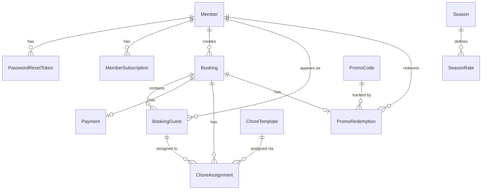

# TACBookings Codebase Audit

---


**Date:** 2026-04-04
**Scope:** Tech stack, folder structure, environment/config, Docker setup, third-party integrations

---

## 1. Tech Stack

| Layer | Technology | Version | Purpose |
|---|---|---|---|
| Framework | Next.js (App Router) | 16.2.2 | Full-stack TypeScript monolith (frontend + API routes) |
| Language | TypeScript | 5.x | Type-safe application code |
| Runtime | Node.js | 20 (alpine) | Server runtime (Docker base image) |
| Database | PostgreSQL | 16 (alpine) | Primary data store |
| ORM | Prisma | 6.19.3 | Type-safe database access, schema management, migrations |
| Auth | NextAuth (Auth.js) v5 | 5.0.0-beta.30 | Credentials provider, JWT sessions, Prisma adapter |
| UI | Tailwind CSS + shadcn/ui | 4.x | Utility-first CSS with Radix UI-based components |
| Payments | Stripe | SDK 22.0.0 | PaymentIntents, SetupIntents, webhooks |
| Accounting | Xero | xero-node 15.0.0 | OAuth2 integration for invoices, contacts, memberships |
| Email | nodemailer | 8.0.4 | Transactional email via AWS SES (SMTP) |
| Scheduling | node-cron | 4.2.1 | Background jobs (booking confirmation, Xero sync, backups) |
| Validation | Zod | 4.3.6 | Input validation on all API routes |
| Charts | Recharts | 3.8.1 | Admin reports dashboard |
| Testing | Vitest | 4.1.2 | Unit and integration tests |
| Reverse Proxy | Caddy | 2 (alpine) | Automatic HTTPS via Let's Encrypt |
| Hosting | AWS Lightsail | - | Docker Compose on single instance |

### Notable Frontend Libraries

- **Radix UI** - Primitives for avatar, dialog, dropdown-menu, label, select, separator, tabs
- **Lucide React** - Icon library
- **next-themes** - Dark mode support
- **sonner** - Toast notifications
- **date-fns** - Date manipulation
- **class-variance-authority / clsx / tailwind-merge** - Component styling utilities

---

## 2. Folder Structure (2 Levels Deep)

```
TACBookings/
├── .claude/                        # Claude Code configuration
│   ├── rules/                      # Path-scoped rules (api.md, database.md, testing.md, stripe.md)
│   └── settings.json               # Permissions and hooks
├── docs/                           # Documentation
│   └── audit/                      # Audit documents
├── prisma/                         # Database layer
│   ├── migrations/                 # Migration history
│   ├── schema.prisma               # Data model (16 models, 9 enums)
│   └── seed.ts                     # Seed script (rooms, policies, chores, admin user)
├── public/                         # Static assets
├── src/                            # Application source
│   ├── app/                        # Next.js App Router
│   │   ├── (admin)/                # Admin pages (role-guarded layout)
│   │   ├── (authenticated)/        # Member pages (auth-guarded layout)
│   │   ├── (public)/               # Public pages (login, register, password reset)
│   │   ├── (website)/              # Marketing/public website pages
│   │   ├── api/                    # API routes (see Section 2a)
│   │   ├── error.tsx               # 500 error boundary
│   │   ├── global-error.tsx        # Global error boundary
│   │   ├── not-found.tsx           # 404 page
│   │   ├── layout.tsx              # Root layout with auth provider
│   │   ├── globals.css             # Global styles
│   │   └── sitemap.ts              # Sitemap generator
│   ├── components/                 # React components
│   │   ├── admin/                  # Admin-specific components
│   │   ├── stripe/                 # Stripe payment components (PaymentForm, SetupForm, StripeProvider)
│   │   ├── ui/                     # shadcn/ui component library
│   │   ├── admin-sidebar.tsx       # Admin navigation sidebar
│   │   ├── booking-calendar.tsx    # Date picker with availability
│   │   ├── booking-payment-section.tsx
│   │   ├── guest-form.tsx          # Guest details form
│   │   ├── nav-bar.tsx             # Main navigation
│   │   ├── promo-code-input.tsx    # Promo code entry component
│   │   └── website-footer.tsx      # Public site footer
│   ├── lib/                        # Core business logic and utilities
│   │   ├── __tests__/              # Test files (14 test files, 292 tests)
│   │   ├── age-tier.ts             # Age tier + season year computation
│   │   ├── audit.ts                # Audit logging helper
│   │   ├── auth.ts                 # NextAuth configuration
│   │   ├── backup.ts               # pg_dump backup + S3 upload
│   │   ├── bumping.ts              # FIFO non-member bumping algorithm
│   │   ├── cancellation.ts         # Cancellation policy + refund calculation
│   │   ├── capacity.ts             # Bed availability calculator (29-bed cap)
│   │   ├── chore-allocator.ts      # Round-robin chore assignment
│   │   ├── cron-confirm-pending.ts # Auto-confirm pending bookings
│   │   ├── email-templates.ts      # Branded HTML email templates (7 templates)
│   │   ├── email.ts                # Email transport (AWS SES via nodemailer)
│   │   ├── pricing.ts              # Rate calculation engine
│   │   ├── prisma.ts               # Prisma singleton client
│   │   ├── promo.ts                # Promo code validation + redemption
│   │   ├── rate-limit.ts           # In-memory rate limiter
│   │   ├── stripe.ts               # Stripe client + helpers
│   │   └── xero.ts                 # Xero client, OAuth, invoices, contacts, memberships
│   ├── types/                      # TypeScript type declarations
│   │   └── next-auth.d.ts          # NextAuth session type augmentation
│   ├── instrumentation.ts          # Next.js instrumentation hook (cron scheduler)
│   └── middleware.ts               # Security headers (CSP, HSTS, X-Frame-Options, etc.)
├── .env.example                    # Environment variable template
├── .gitignore
├── Caddyfile                       # Caddy reverse proxy config
├── CLAUDE.md                       # Project instructions and build history
├── Dockerfile                      # Multi-stage container build
├── docker-compose.yml              # Service orchestration
├── eslint.config.mjs               # ESLint configuration
├── next.config.ts                  # Next.js config (standalone output)
├── package.json                    # Dependencies and scripts
├── postcss.config.mjs              # PostCSS configuration
├── prisma.config.ts                # Prisma config (dotenv loading)
├── tsconfig.json                   # TypeScript configuration
└── vitest.config.ts                # Vitest test runner config
```

### 2a. API Route Structure

```
src/app/api/
├── admin/
│   ├── bookings/                   # Admin booking management
│   ├── cancellation-policy/        # Policy CRUD
│   ├── chores/                     # Chore template CRUD
│   │   └── [id]/
│   ├── members/                    # Member management
│   │   └── [id]/
│   ├── promo-codes/                # Promo code CRUD
│   │   └── [id]/
│   ├── reports/                    # Analytics/reporting
│   ├── roster/                     # Chore roster management
│   │   └── [date]/
│   ├── seasons/                    # Season CRUD
│   │   └── [id]/
│   └── xero/                       # Xero integration (connect, callback, sync, status)
├── auth/
│   ├── [...nextauth]/              # NextAuth handler
│   ├── forgot-password/
│   ├── register/
│   └── reset-password/
├── availability/                   # Bed availability query
├── bookings/                       # Booking CRUD + quote + cancel
│   ├── [id]/
│   │   └── cancel/
│   ├── cancel/
│   └── quote/
├── chores/
│   └── roster/[date]/print/        # Printable roster
├── contact/                        # Contact form
├── cron/                           # Manual cron trigger
│   └── xero/                       # Xero membership refresh cron
├── payments/                       # Stripe payment intents + setup intents
│   └── charge-saved-method/
├── profile/                        # Member profile
├── promo-codes/
│   └── validate/                   # Promo code validation
├── seasons/                        # Public season listing
└── webhooks/
    ├── stripe/                     # Stripe webhook handler
    └── xero/                       # Xero webhook handler
```

---

## 3. Environment and Config Files

### .env.example - Environment Variables

| Group | Variable | Description |
|---|---|---|
| **Database** | `DATABASE_URL` | PostgreSQL connection string |
| | `DB_PASSWORD` | Database password (used in docker-compose) |
| **NextAuth** | `NEXTAUTH_URL` | Application base URL |
| | `NEXTAUTH_SECRET` | JWT signing secret |
| **Stripe** | `STRIPE_SECRET_KEY` | Server-side Stripe API key |
| | `NEXT_PUBLIC_STRIPE_PUBLISHABLE_KEY` | Client-side Stripe key |
| | `STRIPE_WEBHOOK_SECRET` | Webhook signature verification |
| **Xero** | `XERO_CLIENT_ID` | OAuth2 app client ID |
| | `XERO_CLIENT_SECRET` | OAuth2 app client secret |
| | `XERO_REDIRECT_URI` | OAuth2 callback URL |
| | `XERO_ENCRYPTION_KEY` | AES-256-GCM key for token encryption (64-char hex) |
| | `XERO_WEBHOOK_KEY` | Webhook HMAC verification key |
| **Email** | `SMTP_HOST` | SES SMTP endpoint |
| | `SMTP_PORT` | SMTP port (587) |
| | `SMTP_USER` | SES SMTP username |
| | `SMTP_PASS` | SES SMTP password |
| | `EMAIL_FROM` | Sender address |
| | `CONTACT_EMAIL` | Admin contact email |
| **Deployment** | `DOMAIN` | Domain for Caddy HTTPS |
| **Cron** | `CRON_SECRET` | Secures manual cron trigger endpoints |
| **Backups** | `BACKUP_ENABLED` | Enable/disable automated backups |
| | `BACKUP_S3_BUCKET` | S3 bucket name (optional) |
| | `BACKUP_S3_REGION` | AWS region (default: ap-southeast-2) |
| | `BACKUP_S3_ACCESS_KEY_ID` | AWS access key |
| | `BACKUP_S3_SECRET_ACCESS_KEY` | AWS secret key |
| | `BACKUP_RETENTION_DAYS` | Local backup retention (default: 7) |
| | `BACKUP_CRON_SCHEDULE` | Backup timing (default: `0 3 * * *`) |

### tsconfig.json

- Target: ES2017, strict mode enabled
- Path alias: `@/*` maps to `./src/*`
- JSX: `react-jsx`

### next.config.ts

- `output: "standalone"` for Docker-optimized builds

### vitest.config.ts

- Environment: `node` (with JSDOM for component tests)
- Globals enabled
- Path aliases matching tsconfig

---

## 4. Docker Setup

### docker-compose.yml - Three Services

**Service: `postgres`**
- Image: `postgres:16-alpine`
- User/database: `tac` / `tacbookings`
- Password from `${DB_PASSWORD:-password}` env var
- Health check: `pg_isready` every 10s
- Volume: `postgres_data` (persistent)
- No exposed ports (internal Docker network only)

**Service: `app`**
- Built from `Dockerfile` (multi-stage)
- Depends on: `postgres` (healthy)
- Health check: `wget` on port 3000 every 30s
- All env vars passed via `environment:` block
- No exposed ports (accessed through Caddy only)

**Service: `caddy`**
- Image: `caddy:2-alpine`
- Ports: `80:80`, `443:443`
- Depends on: `app` (healthy)
- Volumes: `caddy_data` (certs), `caddy_config`
- Caddyfile mounted from project root

### Dockerfile - Multi-Stage Build

| Stage | Base | Purpose |
|---|---|---|
| `deps` | node:20-alpine | Install npm dependencies, generate Prisma client |
| `builder` | node:20-alpine | Build Next.js application |
| `runner` | node:20-alpine | Production image with standalone output |

- Final image runs as non-root user (`nextjs`)
- Exposes port 3000
- Copies standalone build, static assets, and Prisma client

### Caddyfile

```
{$DOMAIN} {
    reverse_proxy app:3000
}
```

Caddy automatically provisions and renews TLS certificates via Let's Encrypt for the configured domain.

---

## 5. Third-Party Integrations

### Stripe (Payments)

- **SDK:** `stripe` 22.0.0 (server), `@stripe/stripe-js` 9.0.1 + `@stripe/react-stripe-js` 6.1.0 (client)
- **PaymentIntents** for confirmed bookings (immediate charge)
- **SetupIntents** for pending bookings (save card, charge later)
- **Webhooks** at `/api/webhooks/stripe/` with signature verification and idempotency tracking (`ProcessedWebhookEvent` model)
- Server-side price calculation; client cannot manipulate amounts

### Xero (Accounting)

- **SDK:** `xero-node` 15.0.0
- **OAuth2 flow** via admin panel (`/admin/xero`)
- **Token storage:** AES-256-GCM encrypted in database (`XeroToken` model), auto-refresh before 30-min expiry
- **Invoices:** Created on booking confirmation with per-guest line items; credit notes on refunds
- **Contacts:** Bidirectional sync, find-or-create on invoice creation
- **Membership verification:** Checks Xero invoices for subscription payments, updates `MemberSubscription` status
- **Webhooks** at `/api/webhooks/xero/` with HMAC-SHA256 signature verification (timing-safe)
- **Daily cron** refreshes membership status for all active members

### AWS SES (Email)

- **Transport:** nodemailer SMTP to SES endpoint
- **Templates:** 7 branded HTML email templates in `src/lib/email-templates.ts` (welcome, password reset, booking confirmed/pending/bumped/cancelled, chore roster)
- **HTML injection protection:** `escapeHtml()` applied to all user-provided values

### node-cron (Scheduling)

- Registered via Next.js `instrumentation.ts` hook (server-side only)
- **Three scheduled jobs:**
  - Every 3 hours: Auto-confirm pending bookings past hold deadline
  - Daily 2 AM: Xero membership status refresh
  - Configurable (default 3 AM): Database backup (pg_dump + optional S3)
- All jobs have overlap guards to prevent concurrent execution

---

## 6. Database Schema Summary

16 Prisma models, 9 enums. Key models:

| Model | Purpose |
|---|---|
| `Member` | Users (MEMBER/ADMIN roles, age tiers, Xero contact link) |
| `MemberSubscription` | Annual season subscription status from Xero |
| `Season` / `SeasonRate` | Seasonal periods with per-tier pricing |
| `Booking` / `BookingGuest` | Reservations and individual guests |
| `Payment` | Stripe payment records with Xero invoice reference |
| `PromoCode` / `PromoRedemption` | Discount codes and usage tracking |
| `ChoreTemplate` / `ChoreAssignment` | Chore definitions and daily roster |
| `CancellationPolicy` | Configurable refund tiers |
| `XeroToken` | Encrypted OAuth2 tokens |
| `ProcessedWebhookEvent` | Webhook idempotency |
| `AuditLog` | Sensitive action audit trail |
| `PasswordResetToken` | Single-use password reset tokens (1-hour expiry) |

All prices stored as integer cents. Primary keys use `cuid()`. Season year runs April-March.

---


> Reference for the TACBookings Prisma schema.
> Source of truth: `prisma/schema.prisma` (PostgreSQL 16)

---

## Overview

| Metric | Value |
|--------|-------|
| Models | 17 |
| Enums | 9 |
| Primary keys | `String @id @default(cuid())` on every model |
| Monetary fields | Integer cents (`Int`) -- no floats |
| Stay dates | `@db.Date` (date-only, no time component) |
| Timestamps | `createdAt @default(now())`, `updatedAt @updatedAt` on most models |
| Unused models | **None** -- all 17 are referenced in application code |

---

## Entity-Relationship Summary



**Relationship clusters:**

1. **Member hub** -- Member -> PasswordResetToken, MemberSubscription, Booking, BookingGuest, PromoRedemption
2. **Booking hub** -- Booking -> BookingGuest, Payment, ChoreAssignment, PromoRedemption
3. **Season -> SeasonRate** (1:N)
4. **PromoCode -> PromoRedemption** (1:N)
5. **ChoreTemplate -> ChoreAssignment** (1:N)
6. **Standalone** -- CancellationPolicy, XeroToken, ProcessedWebhookEvent, AuditLog (no FK relations)

---

## Enums

| Enum | Values | Used By |
|------|--------|---------|
| `Role` | `MEMBER`, `ADMIN` | `Member.role` |
| `AgeTier` | `ADULT`, `YOUTH`, `CHILD` | `Member.ageTier`, `SeasonRate.ageTier`, `BookingGuest.ageTier` |
| `SubscriptionStatus` | `UNPAID`, `PAID`, `OVERDUE` | `MemberSubscription.status` |
| `SeasonType` | `WINTER`, `SUMMER` | `Season.type` |
| `BookingStatus` | `PENDING`, `CONFIRMED`, `BUMPED`, `CANCELLED`, `COMPLETED` | `Booking.status` |
| `PaymentStatus` | `PENDING`, `PROCESSING`, `SUCCEEDED`, `FAILED`, `REFUNDED`, `PARTIALLY_REFUNDED` | `Payment.status` |
| `PromoCodeType` | `PERCENTAGE`, `FIXED_AMOUNT`, `FREE_NIGHTS` | `PromoCode.type` |
| `ChoreStatus` | `SUGGESTED`, `CONFIRMED`, `COMPLETED` | `ChoreAssignment.status` |
| `AgeRestriction` | `ANY`, `ADULTS_ONLY`, `MIXED_PREFERRED`, `ADULT_SUPERVISED` | `ChoreTemplate.ageRestriction` |

---

## Models

### Group 1 -- Authentication & Members

#### Member

Core user record for club members and admins.

| Field | Type | Null | Default | Constraints | Notes |
|-------|------|------|---------|-------------|-------|
| `id` | String | | `cuid()` | PK | |
| `email` | String | | | unique | Login identifier |
| `passwordHash` | String | | | | bcrypt, cost 13 |
| `forcePasswordChange` | Boolean | | `false` | | Set by admin to require password change on next login |
| `firstName` | String | | | | |
| `lastName` | String | | | | |
| `dateOfBirth` | DateTime | yes | | | Used for age tier computation |
| `phone` | String | yes | | | |
| `role` | Role | | `MEMBER` | | `MEMBER` or `ADMIN` |
| `ageTier` | AgeTier | | `ADULT` | | Computed from `dateOfBirth` |
| `xeroContactId` | String | yes | | unique | Links to Xero CRM contact |
| `active` | Boolean | | `true` | | Soft-delete flag |
| `createdAt` | DateTime | | `now()` | | |
| `updatedAt` | DateTime | | `@updatedAt` | | |

**Relations:**

| Relation | Target | Cardinality | On Delete |
|----------|--------|-------------|-----------|
| `passwordResetTokens` | PasswordResetToken | 1:N | Cascade (child deleted) |
| `subscriptions` | MemberSubscription | 1:N | Cascade (child deleted) |
| `bookings` | Booking | 1:N | Restrict (default) |
| `guestAppearances` | BookingGuest | 1:N | -- (FK nullable) |
| `promoRedemptions` | PromoRedemption | 1:N | -- |

**Indexes:** `email`, `xeroContactId`

---

#### PasswordResetToken

Time-limited, single-use token for password reset flow.

| Field | Type | Null | Default | Constraints | Notes |
|-------|------|------|---------|-------------|-------|
| `id` | String | | `cuid()` | PK | |
| `token` | String | | | unique | Random token sent via email |
| `memberId` | String | | | FK -> Member | |
| `expiresAt` | DateTime | | | | 1-hour expiry window |
| `used` | Boolean | | `false` | | Marked `true` after use (single-use) |
| `createdAt` | DateTime | | `now()` | | |

**Relations:**

| Relation | Target | Cardinality | On Delete |
|----------|--------|-------------|-----------|
| `member` | Member | N:1 | Cascade (deleted with member) |

**Indexes:** `memberId`

---

### Group 2 -- Membership Subscriptions

#### MemberSubscription

Tracks annual season subscription status sourced from Xero invoices.

| Field | Type | Null | Default | Constraints | Notes |
|-------|------|------|---------|-------------|-------|
| `id` | String | | `cuid()` | PK | |
| `memberId` | String | | | FK -> Member | |
| `seasonYear` | Int | | | | e.g. 2025 = Apr 2025 -- Mar 2026 |
| `status` | SubscriptionStatus | | `UNPAID` | | `UNPAID`, `PAID`, `OVERDUE` |
| `xeroInvoiceId` | String | yes | | | Xero invoice reference |
| `paidAt` | DateTime | yes | | | When payment was recorded |
| `createdAt` | DateTime | | `now()` | | |
| `updatedAt` | DateTime | | `@updatedAt` | | |

**Relations:**

| Relation | Target | Cardinality | On Delete |
|----------|--------|-------------|-----------|
| `member` | Member | N:1 | Cascade (deleted with member) |

**Unique constraint:** `[memberId, seasonYear]`

**Indexes:** `memberId`

---

### Group 3 -- Seasons & Pricing

#### Season

Admin-configured time periods (winter/summer) that determine nightly rates.

| Field | Type | Null | Default | Constraints | Notes |
|-------|------|------|---------|-------------|-------|
| `id` | String | | `cuid()` | PK | |
| `name` | String | | | | e.g. "Winter 2025" |
| `type` | SeasonType | | | | `WINTER` or `SUMMER` |
| `startDate` | DateTime | | | `@db.Date` | Date-only |
| `endDate` | DateTime | | | `@db.Date` | Date-only |
| `active` | Boolean | | `true` | | Soft-delete flag |
| `createdAt` | DateTime | | `now()` | | |
| `updatedAt` | DateTime | | `@updatedAt` | | |

**Relations:**

| Relation | Target | Cardinality | On Delete |
|----------|--------|-------------|-----------|
| `rates` | SeasonRate | 1:N | Cascade (child deleted) |

**Indexes:** `[startDate, endDate]` (compound)

---

#### SeasonRate

Per-night price for a specific age tier and membership status within a season. Six rates per season (3 age tiers x 2 membership states).

| Field | Type | Null | Default | Constraints | Notes |
|-------|------|------|---------|-------------|-------|
| `id` | String | | `cuid()` | PK | |
| `seasonId` | String | | | FK -> Season | |
| `ageTier` | AgeTier | | | | `ADULT`, `YOUTH`, `CHILD` |
| `isMember` | Boolean | | | | Member vs non-member rate |
| `pricePerNightCents` | Int | | | | Price in cents |

**Relations:**

| Relation | Target | Cardinality | On Delete |
|----------|--------|-------------|-----------|
| `season` | Season | N:1 | Cascade (deleted with season) |

**Unique constraint:** `[seasonId, ageTier, isMember]`

**Indexes:** `seasonId`

---

### Group 4 -- Bookings & Guests

#### Booking

A stay at the lodge, created by a member, containing one or more guests.

| Field | Type | Null | Default | Constraints | Notes |
|-------|------|------|---------|-------------|-------|
| `id` | String | | `cuid()` | PK | |
| `memberId` | String | | | FK -> Member | Who created the booking |
| `checkIn` | DateTime | | | `@db.Date` | Date-only |
| `checkOut` | DateTime | | | `@db.Date` | Date-only |
| `status` | BookingStatus | | `PENDING` | | See enum for values |
| `totalPriceCents` | Int | | | | Full price before discount |
| `discountCents` | Int | | `0` | | Promo code discount |
| `finalPriceCents` | Int | | | | `totalPriceCents - discountCents` |
| `hasNonMembers` | Boolean | | `false` | | Triggers pending/bumping logic |
| `nonMemberHoldUntil` | DateTime | yes | | | `checkIn - 7 days` for pending bookings |
| `notes` | String | yes | | | Free-text notes |
| `createdAt` | DateTime | | `now()` | | |
| `updatedAt` | DateTime | | `@updatedAt` | | |

**Relations:**

| Relation | Target | Cardinality | On Delete |
|----------|--------|-------------|-----------|
| `member` | Member | N:1 | Restrict (default) |
| `guests` | BookingGuest | 1:N | Cascade (child deleted) |
| `payment` | Payment | 1:0..1 | Cascade (child deleted) |
| `choreAssignments` | ChoreAssignment | 1:N | Cascade (child deleted) |
| `promoRedemption` | PromoRedemption | 1:0..1 | Cascade (child deleted) |

**Indexes:** `memberId`, `[checkIn, checkOut]` (compound), `status`

---

#### BookingGuest

An individual guest within a booking. Each guest has their own price calculated from their age tier and membership status.

| Field | Type | Null | Default | Constraints | Notes |
|-------|------|------|---------|-------------|-------|
| `id` | String | | `cuid()` | PK | |
| `bookingId` | String | | | FK -> Booking | |
| `firstName` | String | | | | |
| `lastName` | String | | | | |
| `ageTier` | AgeTier | | | | Determines nightly rate |
| `isMember` | Boolean | | `false` | | Member vs non-member rate |
| `memberId` | String | yes | | FK -> Member | Linked if guest is a registered member |
| `priceCents` | Int | | | | Total price for this guest for the full stay |
| `createdAt` | DateTime | | `now()` | | |

**Relations:**

| Relation | Target | Cardinality | On Delete |
|----------|--------|-------------|-----------|
| `booking` | Booking | N:1 | Cascade (deleted with booking) |
| `member` | Member | N:0..1 | -- (nullable FK) |
| `choreAssignments` | ChoreAssignment | 1:N | -- |

**Indexes:** `bookingId`, `memberId`

---

### Group 5 -- Payments

#### Payment

Stripe payment record linked 1:1 to a booking. Tracks payment lifecycle and Xero invoice sync.

| Field | Type | Null | Default | Constraints | Notes |
|-------|------|------|---------|-------------|-------|
| `id` | String | | `cuid()` | PK | |
| `bookingId` | String | | | FK -> Booking, unique | One payment per booking |
| `amountCents` | Int | | | | Amount charged |
| `stripePaymentIntentId` | String | yes | | unique | For confirmed bookings (immediate charge) |
| `stripePaymentMethodId` | String | yes | | | Saved card reference |
| `stripeSetupIntentId` | String | yes | | unique | For pending bookings (save card for later) |
| `stripeCustomerId` | String | yes | | | Stripe customer reference |
| `xeroInvoiceId` | String | yes | | unique | Linked Xero invoice |
| `status` | PaymentStatus | | `PENDING` | | See enum for values |
| `refundedAmountCents` | Int | | `0` | | Tracks partial/full refunds |
| `createdAt` | DateTime | | `now()` | | |
| `updatedAt` | DateTime | | `@updatedAt` | | |

**Relations:**

| Relation | Target | Cardinality | On Delete |
|----------|--------|-------------|-----------|
| `booking` | Booking | 1:1 | Cascade (deleted with booking) |

**Indexes:** `bookingId`, `stripePaymentIntentId`

---

### Group 6 -- Promotions

#### PromoCode

Discount codes supporting percentage, fixed amount, or free nights discount types.

| Field | Type | Null | Default | Constraints | Notes |
|-------|------|------|---------|-------------|-------|
| `id` | String | | `cuid()` | PK | |
| `code` | String | | | unique | User-facing code string |
| `description` | String | yes | | | Admin-facing description |
| `type` | PromoCodeType | | | | `PERCENTAGE`, `FIXED_AMOUNT`, `FREE_NIGHTS` |
| `valueCents` | Int | yes | | | Used by `FIXED_AMOUNT` type |
| `percentOff` | Int | yes | | | Used by `PERCENTAGE` type (0-100) |
| `freeNights` | Int | yes | | | Used by `FREE_NIGHTS` type |
| `maxRedemptions` | Int | yes | | | `null` = unlimited |
| `currentRedemptions` | Int | | `0` | | Incremented on use, decremented on cancel/bump |
| `validFrom` | DateTime | yes | | | `null` = no start restriction |
| `validUntil` | DateTime | yes | | | `null` = no expiry; boundary is exclusive (`>=`) |
| `membersOnly` | Boolean | | `false` | | Restrict to members |
| `singleUse` | Boolean | | `false` | | One use per member |
| `active` | Boolean | | `true` | | Soft-delete / toggle flag |
| `createdAt` | DateTime | | `now()` | | |
| `updatedAt` | DateTime | | `@updatedAt` | | |

**Relations:**

| Relation | Target | Cardinality | On Delete |
|----------|--------|-------------|-----------|
| `redemptions` | PromoRedemption | 1:N | -- |

**Indexes:** `code`

---

#### PromoRedemption

Tracks which member used which promo code on which booking. One redemption per booking.

| Field | Type | Null | Default | Constraints | Notes |
|-------|------|------|---------|-------------|-------|
| `id` | String | | `cuid()` | PK | |
| `promoCodeId` | String | | | FK -> PromoCode | |
| `bookingId` | String | | | FK -> Booking, unique | One promo per booking |
| `memberId` | String | | | FK -> Member | Who redeemed it |
| `discountCents` | Int | | | | Discount amount applied |
| `createdAt` | DateTime | | `now()` | | |

**Relations:**

| Relation | Target | Cardinality | On Delete |
|----------|--------|-------------|-----------|
| `promoCode` | PromoCode | N:1 | -- |
| `booking` | Booking | 1:1 | Cascade (deleted with booking) |
| `member` | Member | N:1 | -- |

**Indexes:** `promoCodeId`, `memberId`

---

### Group 7 -- Chore Roster

#### ChoreTemplate

Configurable chore definitions used by the auto-suggest allocation algorithm.

| Field | Type | Null | Default | Constraints | Notes |
|-------|------|------|---------|-------------|-------|
| `id` | String | | `cuid()` | PK | |
| `name` | String | | | | e.g. "Dishes", "Sweep common area" |
| `description` | String | yes | | | |
| `recommendedPeopleMin` | Int | | `1` | | Minimum people for allocation |
| `recommendedPeopleMax` | Int | | `2` | | Maximum people for allocation |
| `isEssential` | Boolean | | `false` | | Must always be assigned |
| `ageRestriction` | AgeRestriction | | `ANY` | | Controls who can be assigned |
| `conditionalNote` | String | yes | | | Shown when conditions apply |
| `minAge` | Int | | `0` | | Minimum age for assignment |
| `sortOrder` | Int | | `0` | | Display ordering |
| `active` | Boolean | | `true` | | Soft-delete flag |
| `createdAt` | DateTime | | `now()` | | |
| `updatedAt` | DateTime | | `@updatedAt` | | |

**Relations:**

| Relation | Target | Cardinality | On Delete |
|----------|--------|-------------|-----------|
| `assignments` | ChoreAssignment | 1:N | -- |

**Indexes:** none

---

#### ChoreAssignment

Assigns a specific guest to a specific chore on a specific date.

| Field | Type | Null | Default | Constraints | Notes |
|-------|------|------|---------|-------------|-------|
| `id` | String | | `cuid()` | PK | |
| `choreTemplateId` | String | | | FK -> ChoreTemplate | |
| `bookingId` | String | | | FK -> Booking | |
| `bookingGuestId` | String | yes | | FK -> BookingGuest | Nullable until assigned to a specific guest |
| `date` | DateTime | | | `@db.Date` | Date-only |
| `status` | ChoreStatus | | `SUGGESTED` | | `SUGGESTED` -> `CONFIRMED` -> `COMPLETED` |
| `createdAt` | DateTime | | `now()` | | |
| `updatedAt` | DateTime | | `@updatedAt` | | |

**Relations:**

| Relation | Target | Cardinality | On Delete |
|----------|--------|-------------|-----------|
| `choreTemplate` | ChoreTemplate | N:1 | -- |
| `booking` | Booking | N:1 | Cascade (deleted with booking) |
| `bookingGuest` | BookingGuest | N:0..1 | -- (nullable FK) |

**Indexes:** `date`, `bookingId`, `choreTemplateId`

---

### Group 8 -- System & Integrations

These models have **no FK relations** to other models. They are standalone system tables.

#### CancellationPolicy

Admin-configurable refund tiers based on days before stay.

| Field | Type | Null | Default | Constraints | Notes |
|-------|------|------|---------|-------------|-------|
| `id` | String | | `cuid()` | PK | |
| `daysBeforeStay` | Int | | | unique | e.g. 14, 7, 0 |
| `refundPercentage` | Int | | | | e.g. 100, 50, 0 |
| `createdAt` | DateTime | | `now()` | | |
| `updatedAt` | DateTime | | `@updatedAt` | | |

**Relations:** none

**Unique constraint:** `daysBeforeStay`

---

#### XeroToken

Stores OAuth2 tokens for the Xero accounting integration. Effectively a single-row table.

| Field | Type | Null | Default | Constraints | Notes |
|-------|------|------|---------|-------------|-------|
| `id` | String | | `cuid()` | PK | |
| `accessToken` | String | | | | AES-256-GCM encrypted at rest |
| `refreshToken` | String | | | | AES-256-GCM encrypted at rest |
| `expiresAt` | DateTime | | | | Auto-refreshed 5 min before 30-min expiry |
| `tenantId` | String | yes | | | Xero organisation identifier |
| `createdAt` | DateTime | | `now()` | | |
| `updatedAt` | DateTime | | `@updatedAt` | | |

**Relations:** none

---

#### ProcessedWebhookEvent

Tracks processed webhook event IDs for idempotency (prevents duplicate processing of Stripe/Xero events).

| Field | Type | Null | Default | Constraints | Notes |
|-------|------|------|---------|-------------|-------|
| `id` | String | | `cuid()` | PK | |
| `eventId` | String | | | unique | Stripe/Xero event ID |
| `source` | String | | | | `"stripe"` or `"xero"` |
| `eventType` | String | | | | e.g. `"payment_intent.succeeded"` |
| `processedAt` | DateTime | | `now()` | | |

**Relations:** none

**Indexes:** `source`

---

#### AuditLog

Records sensitive admin and system actions. Fire-and-forget pattern -- `memberId` is a plain string (not a FK) so logs survive member deletion.

| Field | Type | Null | Default | Constraints | Notes |
|-------|------|------|---------|-------------|-------|
| `id` | String | | `cuid()` | PK | |
| `action` | String | | | | e.g. `"booking.cancel"`, `"season.create"` |
| `memberId` | String | yes | | | Actor ID (plain string, not FK) |
| `targetId` | String | yes | | | Target entity ID |
| `details` | String | yes | | | JSON-encoded extra context |
| `ipAddress` | String | yes | | | Request IP |
| `createdAt` | DateTime | | `now()` | | |

**Relations:** none

**Indexes:** `action`, `memberId`, `createdAt`

---

## Cascade Delete Map

| Parent | Child | On Delete |
|--------|-------|-----------|
| Member | PasswordResetToken | Cascade |
| Member | MemberSubscription | Cascade |
| Season | SeasonRate | Cascade |
| Booking | BookingGuest | Cascade |
| Booking | Payment | Cascade |
| Booking | ChoreAssignment | Cascade |
| Booking | PromoRedemption | Cascade |

**Not cascaded (Restrict/default):**
- Member -> Booking: a member cannot be deleted while they have bookings
- Member -> PromoRedemption: no cascade specified
- PromoCode -> PromoRedemption: no cascade specified
- ChoreTemplate -> ChoreAssignment: no cascade specified

---

## Design Conventions

- **cuid() primary keys** on every model -- URL-safe, collision-resistant, no sequential guessing
- **Integer cents for money** (`totalPriceCents`, `pricePerNightCents`, etc.) -- avoids floating-point rounding
- **`@db.Date` for stay dates** -- `checkIn`, `checkOut`, `ChoreAssignment.date`, `Season.startDate/endDate` store date-only values (no time component)
- **Cascade deletes flow parent -> child only** -- deleting a Booking removes its guests, payment, chore assignments, and promo redemption
- **Soft-delete via `active` flag** on Member, Season, PromoCode, ChoreTemplate -- records are deactivated rather than deleted
- **`AuditLog.memberId` is intentionally not a FK** -- logs must survive member deletion
- **Standalone system tables** (CancellationPolicy, XeroToken, ProcessedWebhookEvent, AuditLog) have no FK relations to other models
- **Season year = April to March** -- if current month >= April, `seasonYear = currentYear`; else `seasonYear = currentYear - 1`
- **Timezone: Pacific/Auckland** -- all dates interpreted in NZ time

---

## Model Usage

All 17 models are actively referenced in application routes, views, or library code. No models are unused.

The `Room` model previously noted in project documentation as unused has already been removed from the schema.

---


**Date:** 2026-04-04
**Scope:** Every route and view in the TACBookings application, with HTTP methods, purpose, and authentication requirements.

---

## Authentication Architecture

| Layer | File | Behaviour |
|-------|------|-----------|
| Middleware | `src/middleware.ts` | Security headers only (CSP, HSTS, X-Frame-Options, etc.). **Does not enforce authentication.** |
| Website layout | `src/app/(website)/layout.tsx` | No auth required. Reads session to toggle header links. |
| Public layout | `src/app/(public)/layout.tsx` | No auth required. |
| Authenticated layout | `src/app/(authenticated)/layout.tsx` | Requires valid session via `auth()`. Redirects to `/login` if unauthenticated. Checks `forcePasswordChange` flag and redirects to `/change-password`. |
| Admin layout | `src/app/(admin)/layout.tsx` | Requires valid session **and** `role === "ADMIN"`. Redirects to `/login` if unauthenticated, `/dashboard` if not admin. Checks `forcePasswordChange`. |

Session strategy: JWT, 8-hour max age, credentials provider only (email + password).

---

## 1. Public Website Pages

No authentication required. Served under the `(website)` route group.

| URL | File | Description |
|-----|------|-------------|
| `/` | `src/app/(website)/page.tsx` | Landing page with club highlights and CTAs |
| `/about` | `src/app/(website)/about/page.tsx` | Club history and information |
| `/committee` | `src/app/(website)/committee/page.tsx` | Committee member listing |
| `/contact` | `src/app/(website)/contact/page.tsx` | Contact form (client component, POSTs to `/api/contact`) |
| `/join` | `src/app/(website)/join/page.tsx` | Membership types and features |
| `/rules` | `src/app/(website)/rules/page.tsx` | Club rules, cancellation policy (reads policy from DB via Prisma) |

---

## 2. Public Auth Pages

No authentication required. Served under the `(public)` route group.

| URL | File | Description |
|-----|------|-------------|
| `/login` | `src/app/(public)/login/page.tsx` | Email + password sign-in form |
| `/register` | `src/app/(public)/register/page.tsx` | Self-registration form (name, email, password, DOB, phone) |
| `/forgot-password` | `src/app/(public)/forgot-password/page.tsx` | Request password reset email |
| `/reset-password` | `src/app/(public)/reset-password/page.tsx` | Set new password using token from email |
| `/change-password` | `src/app/(public)/change-password/page.tsx` | Change password (used for forced password change on first login) |

---

## 3. Member-Facing Pages

Requires authenticated session. Guarded by `(authenticated)/layout.tsx`.

| URL | File | Description |
|-----|------|-------------|
| `/dashboard` | `src/app/(authenticated)/dashboard/page.tsx` | Member welcome page with summary cards and quick-book CTA. **See Stubbed Routes below.** |
| `/book` | `src/app/(authenticated)/book/page.tsx` | Booking wizard: calendar, guest forms, promo code, price quote |
| `/bookings` | `src/app/(authenticated)/bookings/page.tsx` | List of member's bookings (queries DB by `session.user.id`) |
| `/bookings/[id]` | `src/app/(authenticated)/bookings/[id]/page.tsx` | Booking detail with payment section, cancel action |
| `/profile` | `src/app/(authenticated)/profile/page.tsx` | View/edit name, phone, date of birth |

---

## 4. Admin-Facing Pages

Requires authenticated session with `role === "ADMIN"`. Guarded by `(admin)/layout.tsx`.

| URL | File | Description |
|-----|------|-------------|
| `/admin/dashboard` | `src/app/(admin)/admin/dashboard/page.tsx` | Admin summary: total members, active members, total bookings. **See Stubbed Routes below.** |
| `/admin/members` | `src/app/(admin)/admin/members/page.tsx` | Member list with search, create, edit |
| `/admin/bookings` | `src/app/(admin)/admin/bookings/page.tsx` | All bookings with status/date/search filters |
| `/admin/seasons` | `src/app/(admin)/admin/seasons/page.tsx` | Season CRUD with rate tiers (3 age tiers x member/non-member) |
| `/admin/cancellation-policy` | `src/app/(admin)/admin/cancellation-policy/page.tsx` | Cancellation policy rules management |
| `/admin/promo-codes` | `src/app/(admin)/admin/promo-codes/page.tsx` | Promo code CRUD with redemption counts |
| `/admin/chores` | `src/app/(admin)/admin/chores/page.tsx` | Chore template management (age restrictions, people requirements) |
| `/admin/roster` | `src/app/(admin)/admin/roster/page.tsx` | Chore roster review/edit with date picker and reassignment |
| `/admin/roster/[date]/print` | `src/app/(admin)/admin/roster/[date]/print/page.tsx` | Printable A4 roster for a specific date |
| `/admin/xero` | `src/app/(admin)/admin/xero/page.tsx` | Xero connection status, connect/disconnect, contact sync, membership refresh |
| `/admin/reports` | `src/app/(admin)/admin/reports/page.tsx` | Analytics dashboard: occupancy, revenue, booking trends, member breakdown (recharts) |

---

## 5. Error Pages

No authentication. Rendered by Next.js on errors.

| File | Description |
|------|-------------|
| `src/app/not-found.tsx` | 404 page with links to home and booking |
| `src/app/error.tsx` | 500 error boundary with retry and dashboard link |
| `src/app/global-error.tsx` | Root-level error boundary (renders own `<html>` tag) |

---

## 6. API Endpoints

### 6.1 Authentication

| Method | URL | Auth | Rate Limited | Zod | Description |
|--------|-----|------|-------------|-----|-------------|
| GET, POST | `/api/auth/[...nextauth]` | NextAuth internal | Login: 10/15min | N/A | NextAuth handlers (sign-in, sign-out, session, CSRF) |
| POST | `/api/auth/register` | None | 5/hour | Yes | Self-register new member. Bcrypt 13 rounds. Sends welcome email. |
| POST | `/api/auth/forgot-password` | None | 5/hour | Yes | Request password reset. Always returns success (no email enumeration). |
| POST | `/api/auth/reset-password` | None | 10/hour | Yes | Reset password via token. Token is single-use, 1-hour expiry. |
| POST | `/api/auth/change-password` | Session required | No | Yes | Change password for authenticated user. Clears `forcePasswordChange` flag. |

### 6.2 Member Profile

| Method | URL | Auth | Rate Limited | Zod | Description |
|--------|-----|------|-------------|-----|-------------|
| PUT | `/api/profile` | Session required | No | Yes | Update name, phone, DOB. Recomputes age tier. |

### 6.3 Bookings

| Method | URL | Auth | Rate Limited | Zod | Description |
|--------|-----|------|-------------|-----|-------------|
| POST | `/api/bookings` | Session required | 20/hour | Yes | Create booking. Handles promo codes, bumping, pending vs confirmed, advisory lock. |
| POST | `/api/bookings/quote` | Session required | 60/min | Yes | Price quote for dates and guests. |
| POST | `/api/bookings/cancel` | Session required (owner or admin) | No | Yes | Cancel booking by ID in body. Full flow: refund, Xero credit note, promo cleanup, email. |
| POST | `/api/bookings/[id]/cancel` | Session required (owner or admin) | No | No | Cancel booking by URL param. Same full flow as above. **Duplicate of `/api/bookings/cancel`.** |

### 6.4 Availability

| Method | URL | Auth | Rate Limited | Zod | Description |
|--------|-----|------|-------------|-----|-------------|
| GET | `/api/availability` | Session required | 60/min | No | Occupancy by date for a given month (year/month query params). |
| GET | `/api/availability/check` | Session required | No | No | Check capacity for specific check-in/check-out date range. |

### 6.5 Payments

| Method | URL | Auth | Rate Limited | Zod | Description |
|--------|-----|------|-------------|-----|-------------|
| POST | `/api/payments/create-payment-intent` | Session required (owner or admin) | No | Yes | Create Stripe PaymentIntent for confirmed booking. |
| POST | `/api/payments/create-setup-intent` | Session required (owner or admin) | No | Yes | Create Stripe SetupIntent to save card for pending booking. |
| POST | `/api/payments/charge-saved-method` | CRON_SECRET or admin | No | Yes | Charge saved payment method. Used by cron and admin to confirm pending bookings. Timing-safe secret comparison. |

### 6.6 Promo Codes

| Method | URL | Auth | Rate Limited | Zod | Description |
|--------|-----|------|-------------|-----|-------------|
| POST | `/api/promo-codes/validate` | Session required | 60/min | Yes | Validate promo code and return discount preview. |

### 6.7 Seasons

| Method | URL | Auth | Rate Limited | Zod | Description |
|--------|-----|------|-------------|-----|-------------|
| GET | `/api/seasons` | Session required | No | No | List active seasons with rates. |
| POST | `/api/seasons` | Admin only | No | Yes | Create new season with rates. |

### 6.8 Contact

| Method | URL | Auth | Rate Limited | Zod | Description |
|--------|-----|------|-------------|-----|-------------|
| POST | `/api/contact` | None | 5/hour | Yes | Public contact form submission. Sends email to CONTACT_EMAIL. |

### 6.9 Webhooks

| Method | URL | Auth | Rate Limited | Zod | Description |
|--------|-----|------|-------------|-----|-------------|
| POST | `/api/webhooks/stripe` | Stripe signature verification | No | No | Handles payment_intent, setup_intent, charge.refunded events. Idempotency via ProcessedWebhookEvent. |
| POST | `/api/webhooks/xero` | HMAC-SHA256 signature (`x-xero-signature`) | No | No | Handles Xero webhook events. Supports intent-to-receive pattern. Timing-safe comparison. |

### 6.10 Cron Jobs

| Method | URL | Auth | Rate Limited | Zod | Description |
|--------|-----|------|-------------|-----|-------------|
| POST | `/api/cron` | CRON_SECRET (timing-safe) | No | No | Trigger pending booking confirmation (finds PENDING past hold deadline, charges or bumps). |
| POST | `/api/cron/xero` | CRON_SECRET (timing-safe) | No | No | Daily membership status refresh from Xero for all active members. |

### 6.11 Admin - Members

| Method | URL | Auth | Rate Limited | Zod | Description |
|--------|-----|------|-------------|-----|-------------|
| GET | `/api/admin/members` | Admin | No | No | List members with search filter. |
| POST | `/api/admin/members` | Admin | No | Yes | Create member with optional invite email. |
| GET | `/api/admin/members/[id]` | Admin | No | No | Get member detail with subscription history. |
| PUT | `/api/admin/members/[id]` | Admin | No | Yes | Update member info. Syncs to Xero if connected. |

### 6.12 Admin - Seasons

| Method | URL | Auth | Rate Limited | Zod | Description |
|--------|-----|------|-------------|-----|-------------|
| GET | `/api/admin/seasons` | Admin | No | No | List all seasons. |
| POST | `/api/admin/seasons` | Admin | No | Yes | Create season with rates. Audit logged. |
| GET | `/api/admin/seasons/[id]` | Admin | No | No | Get season detail. |
| PUT | `/api/admin/seasons/[id]` | Admin | No | Yes | Update season with rates. Audit logged. |

### 6.13 Admin - Cancellation Policy

| Method | URL | Auth | Rate Limited | Zod | Description |
|--------|-----|------|-------------|-----|-------------|
| GET | `/api/admin/cancellation-policy` | Admin | No | No | Get current cancellation policy rules. |
| PUT | `/api/admin/cancellation-policy` | Admin | No | Yes | Update cancellation policy. Audit logged. |

### 6.14 Admin - Promo Codes

| Method | URL | Auth | Rate Limited | Zod | Description |
|--------|-----|------|-------------|-----|-------------|
| GET | `/api/admin/promo-codes` | Admin | No | No | List all promo codes with redemption counts. |
| POST | `/api/admin/promo-codes` | Admin | No | Yes | Create promo code. Audit logged. |
| GET | `/api/admin/promo-codes/[id]` | Admin | No | No | Get promo code detail. |
| PUT | `/api/admin/promo-codes/[id]` | Admin | No | Yes | Update promo code with type-specific validation. Audit logged. |
| DELETE | `/api/admin/promo-codes/[id]` | Admin | No | No | Delete promo code. Audit logged. |

### 6.15 Admin - Chores

| Method | URL | Auth | Rate Limited | Zod | Description |
|--------|-----|------|-------------|-----|-------------|
| GET | `/api/admin/chores` | Admin | No | No | List all chore templates. |
| POST | `/api/admin/chores` | Admin | No | Yes | Create chore template. |
| PUT | `/api/admin/chores/[id]` | Admin | No | Yes | Update chore template. |
| DELETE | `/api/admin/chores/[id]` | Admin | No | No | Delete chore template. |

### 6.16 Admin - Roster

| Method | URL | Auth | Rate Limited | Zod | Description |
|--------|-----|------|-------------|-----|-------------|
| GET | `/api/admin/roster/[date]` | Admin | No | No | Get roster for date with auto-suggestion if none exists. |
| POST | `/api/admin/roster/[date]` | Admin | No | Yes | Roster actions (reassign, add, remove assignments). |
| PUT | `/api/admin/roster/[date]` | Admin | No | Yes | Confirm or email roster (discriminated union schema). |

### 6.17 Admin - Roster Print

| Method | URL | Auth | Rate Limited | Zod | Description |
|--------|-----|------|-------------|-----|-------------|
| GET | `/api/chores/roster/[date]/print` | Admin | No | No | Get roster data formatted for printable A4 view. |

### 6.18 Admin - Reports

| Method | URL | Auth | Rate Limited | Zod | Description |
|--------|-----|------|-------------|-----|-------------|
| GET | `/api/admin/reports` | Admin | No | Yes | Occupancy, revenue, booking trend data for date range. |

### 6.19 Admin - Xero Integration

| Method | URL | Auth | Rate Limited | Zod | Description |
|--------|-----|------|-------------|-----|-------------|
| GET | `/api/admin/xero/status` | Admin | No | No | Check Xero connection status. |
| GET | `/api/admin/xero/connect` | Admin | No | No | Redirect to Xero OAuth2 consent page. |
| GET | `/api/admin/xero/callback` | Admin | No | No | Handle OAuth2 callback, store encrypted tokens. |
| POST | `/api/admin/xero/disconnect` | Admin | No | No | Revoke Xero tokens and disconnect. |
| POST | `/api/admin/xero/sync-contacts` | Admin | No | No | Bulk import contacts from Xero, match by email. |
| POST | `/api/admin/xero/sync-memberships` | Admin | No | No | Refresh membership statuses from Xero. |
| GET | `/api/admin/xero/contact-groups` | Admin | No | No | List available Xero contact groups for import UI. |
| POST | `/api/admin/xero/import-members` | Admin | No | Yes | Import members from Xero contact groups with age tier mapping. |

---

## 7. Stubbed / Placeholder Routes

| URL | Issue |
|-----|-------|
| `/admin/dashboard` | `totalBookings` is hardcoded to `0` at line 26 of `src/app/(admin)/admin/dashboard/page.tsx` (`getStats()` returns `{ totalBookings: 0 }` without querying the database). |
| `/dashboard` | "Upcoming Bookings" count is hardcoded to `0`. "Recent Bookings" section is a static placeholder with no database query. The page only checks session, it does not fetch any booking data. |

---

## 8. Notes

1. **Duplicate cancel routes:** `/api/bookings/cancel` (accepts booking ID in request body) and `/api/bookings/[id]/cancel` (accepts booking ID in URL) both implement the full cancellation flow. This is documented as a known issue in CLAUDE.md.

2. **Rate limiter configuration** (from `src/lib/rate-limit.ts`):
   - Login: 10 requests / 15 minutes
   - Register: 5 / hour
   - Forgot password: 5 / hour
   - Reset password: 10 / hour
   - Booking create: 20 / hour
   - Booking query: 60 / minute
   - Contact form: 5 / hour
   - General API: 100 / minute

3. **`/api/seasons` GET** is accessible to any authenticated user (not admin-only). This is intentional as the booking wizard needs season/rate data.

4. **`/rules` page** reads the cancellation policy directly from the database via Prisma (server component). It is public-facing with no auth.

5. **Webhook routes** use signature verification instead of session auth (Stripe: `stripe.webhooks.constructEvent`, Xero: HMAC-SHA256 with timing-safe comparison).

6. **Cron routes** use `CRON_SECRET` header with `crypto.timingSafeEqual` instead of session auth.

7. **`/api/payments/charge-saved-method`** accepts either CRON_SECRET or admin session auth, allowing both automated cron and manual admin triggering.

8. **All admin API routes** check `auth()` then verify `session.user.role === "ADMIN"`, returning 401 for unauthenticated and 403 for non-admin.

---


**Date:** 2026-04-04

## Overview

All email templates are defined in `src/lib/email-templates.ts` (HTML generators) with corresponding send functions in `src/lib/email.ts` (transport wrappers). There are **7 branded templates** plus **1 inline email** (contact form).

## Template Summary

| # | Template | Subject | Recipient | Trigger(s) |
|---|----------|---------|-----------|------------|
| 1 | Welcome | "Welcome to TAC Bookings" | New member | Registration |
| 2 | Password Reset | "Reset your TAC Bookings password" | Member | Forgot password, admin invite, Xero import invite |
| 3 | Booking Confirmed | "Booking Confirmed - TAC Lodge" | Booking member | Stripe payment succeeded, cron auto-confirm |
| 4 | Booking Pending | "Booking Pending - TAC Lodge" | Booking member | Booking created with non-members (>7 days out) |
| 5 | Booking Bumped | "Booking Update - TAC Lodge" | Booking member | Member booking bumps PENDING, cron bumps at hold expiry |
| 6 | Booking Cancelled | "Booking Cancelled - TAC Lodge" | Booking member | User or admin cancellation |
| 7 | Chore Roster | "Your chore roster for {date} - TAC Lodge" | Each guest (members only) | Admin sends roster for a date |
| 8 | Contact Form | "Website Contact: {name}" | `CONTACT_EMAIL` env var | Public contact form submission |

---

## Detailed Template Documentation

### 1. Welcome Email

**Template function:** `welcomeTemplate(firstName)` (`email-templates.ts:139`)
**Send function:** `sendWelcomeEmail(email, firstName)` (`email.ts:140`)

**Triggers:**
- `src/app/api/auth/register/route.ts:64` - After successful member registration (fire-and-forget)

**Recipient:** Newly registered member's email

**Content:**
- Heading: "Welcome, {firstName}!"
- Body: Account created confirmation, can book stays / manage bookings / view trips
- CTA: "Log In to Your Account" -> `/login`
- Footer: "If you did not create this account, please ignore this email"

**Variables:**
| Variable | Source | Escaped |
|----------|--------|---------|
| `firstName` | `member.firstName` from DB insert | Yes |

---

### 2. Password Reset Email

**Template function:** `passwordResetTemplate(resetUrl)` (`email-templates.ts:150`)
**Send function:** `sendPasswordResetEmail(email, token)` (`email.ts:47`)

The send function constructs the full URL: `{NEXTAUTH_URL}/reset-password?token={token}`

**Triggers:**
- `src/app/api/auth/forgot-password/route.ts:46` - Member requests password reset (fire-and-forget)
- `src/app/api/admin/members/route.ts:164` - Admin creates member with `sendInvite: true` (fire-and-forget)
- `src/lib/xero.ts:608` - Bulk member import from Xero with invite flag (fire-and-forget)

**Recipient:** Member's email address

**Content:**
- Heading: "Password Reset"
- Body: Explains password reset request, link expires in 1 hour
- CTA: "Reset Password" -> `/reset-password?token={token}`
- Footer: "If you didn't request this, you can safely ignore this email"

**Variables:**
| Variable | Source | Escaped |
|----------|--------|---------|
| `resetUrl` | Constructed from `NEXTAUTH_URL` + token UUID | No (URL, not user-provided text) |

---

### 3. Booking Confirmed Email

**Template function:** `bookingConfirmedTemplate(firstName, checkIn, checkOut, guestCount, totalCents, options?)` (`email-templates.ts:160`)
**Send function:** `sendBookingConfirmedEmail(email, firstName, checkIn, checkOut, guestCount, totalCents, options?)` (`email.ts:61`)

**Triggers:**
- `src/app/api/webhooks/stripe/route.ts:162` - Stripe `payment_intent.succeeded` webhook
- `src/lib/cron-confirm-pending.ts:142` - Cron charges saved card for pending booking at hold expiry

**Recipient:** Booking member's email

**Content:**
- Heading: "Booking Confirmed"
- Greeting: "Hi {firstName}, your lodge booking has been confirmed!"
- Info table: Check-in, Check-out, Guests, Total Paid
- If discount applied: also shows Subtotal, Discount ({promoCode}), then Total Paid
- Success alert: "Payment has been processed successfully."
- CTA: "View Booking" -> `/bookings`

**Variables:**
| Variable | Source | Escaped |
|----------|--------|---------|
| `firstName` | `booking.member.firstName` | Yes |
| `checkIn` | `booking.checkIn` | Formatted via `formatNZDate` |
| `checkOut` | `booking.checkOut` | Formatted via `formatNZDate` |
| `guestCount` | Count of `booking.guests` | No (number) |
| `totalCents` | `booking.finalPriceCents` | Formatted via `formatCents` |
| `options.discountCents` | `booking.discountCents` | Formatted via `formatCents` |
| `options.promoCode` | `promoRedemption.promoCode.code` | Yes |

---

### 4. Booking Pending Email

**Template function:** `bookingPendingTemplate(firstName, checkIn, checkOut, guestCount, holdUntil)` (`email-templates.ts:195`)
**Send function:** `sendBookingPendingEmail(email, firstName, checkIn, checkOut, guestCount, holdUntil)` (`email.ts:77`)

**Triggers:**
- `src/app/api/bookings/route.ts:291` - Booking created with non-member guests and check-in > 7 days away (fire-and-forget)

**Recipient:** Booking member's email

**Content:**
- Heading: "Booking Pending"
- Greeting: "Hi {firstName}, your lodge booking has been received and is currently pending."
- Info table: Check-in, Check-out, Guests, Hold Until
- Warning alert: Explains non-member hold until {holdUntil}, member priority, card not charged yet
- Body: Explains non-member priority rules
- CTA: "View Booking" -> `/bookings`

**Variables:**
| Variable | Source | Escaped |
|----------|--------|---------|
| `firstName` | `member.firstName` | Yes |
| `checkIn` | `booking.checkIn` | Formatted via `formatNZDate` |
| `checkOut` | `booking.checkOut` | Formatted via `formatNZDate` |
| `guestCount` | Guest count | No (number) |
| `holdUntil` | `booking.nonMemberHoldUntil` (checkIn - 7 days) | Formatted via `formatNZDate` |

---

### 5. Booking Bumped Email

**Template function:** `bookingBumpedTemplate(firstName, checkIn, checkOut, guestCount)` (`email-templates.ts:217`)
**Send function:** `sendBookingBumpedEmail(email, firstName, checkIn, checkOut, guestCount)` (`email.ts:92`)

**Triggers:**
- `src/lib/bumping.ts:214` - Called via `sendBumpedNotifications()` after member booking bumps PENDING bookings. Invoked from `src/app/api/bookings/route.ts:282` (fire-and-forget after transaction commits).
- `src/lib/cron-confirm-pending.ts:74` - Cron finds no beds available at hold expiry, bumps booking

**Recipient:** Booking member's email (the bumped booking's member)

**Content:**
- Heading: "Booking Update"
- Body: "Unfortunately your pending lodge booking has been bumped due to member demand."
- Info table: Check-in, Check-out, Guests
- Info alert: "Your card has not been charged."
- Body: Explains non-member priority policy, welcome to rebook
- CTA: "Book Again" -> `/book`
- Footer: "We apologise for the inconvenience."

**Variables:**
| Variable | Source | Escaped |
|----------|--------|---------|
| `firstName` | `booking.member.firstName` | Yes |
| `checkIn` | `booking.checkIn` | Formatted via `formatNZDate` |
| `checkOut` | `booking.checkOut` | Formatted via `formatNZDate` |
| `guestCount` | Count of `booking.guests` | No (number) |

---

### 6. Booking Cancelled Email

**Template function:** `bookingCancelledTemplate(firstName, checkIn, checkOut, refundCents)` (`email-templates.ts:238`)
**Send function:** `sendBookingCancelledEmail(email, firstName, checkIn, checkOut, refundCents)` (`email.ts:106`)

**Triggers (both routes call it on every cancellation path):**
- `src/app/api/bookings/cancel/route.ts:80,120,201,233` - Member self-cancellation (4 code paths: PENDING, CONFIRMED no payment, CONFIRMED with refund, CONFIRMED no refund)
- `src/app/api/bookings/[id]/cancel/route.ts:81,105,179,203` - Admin cancellation (same 4 paths)

**Recipient:** Booking member's email

**Content:**
- Heading: "Booking Cancelled"
- Body: "Hi {firstName}, your lodge booking has been cancelled."
- Info table: Check-in, Check-out
- Dynamic alert:
  - If `refundCents > 0`: Success alert with refund amount, "processed to your original payment method"
  - If `refundCents === 0`: Info alert "No refund was applicable based on the cancellation policy."
- CTA: "Make a New Booking" -> `/book`

**Variables:**
| Variable | Source | Escaped |
|----------|--------|---------|
| `firstName` | `booking.member.firstName` | Yes |
| `checkIn` | `booking.checkIn` | Formatted via `formatNZDate` |
| `checkOut` | `booking.checkOut` | Formatted via `formatNZDate` |
| `refundCents` | Calculated by cancellation policy engine, or 0 | Formatted via `formatCents` |

---

### 7. Chore Roster Email

**Template function:** `choreRosterTemplate(guestName, date, chores)` (`email-templates.ts:262`)
**Send function:** `sendChoreRosterEmail(email, guestName, date, chores)` (`email.ts:120`)

**Triggers:**
- `src/app/api/admin/roster/[date]/route.ts:330` - Admin PUT with `action: "email"`, sends to all member guests staying on that date

**Recipient:** Each booking guest's member email (non-member guests without email addresses are skipped)

**Content:**
- Heading: "Chore Roster"
- Greeting: "Hi {guestName},"
- Body: "Here are your assigned chores for {formattedDate} at the lodge:"
- Info table: Rows of chore name + description
- Warning alert: "Last person to bed: Check heaters and fire are safe and doors are secure."
- Footer: "Thanks for helping keep the lodge running smoothly!"

**Variables:**
| Variable | Source | Escaped |
|----------|--------|---------|
| `guestName` | `guest.firstName + " " + guest.lastName` | Yes |
| `date` | YYYY-MM-DD string, formatted to long NZ locale (e.g. "Saturday, 15 March 2026") | Yes (the formatted string) |
| `chores[].name` | `choreTemplate.name` | Yes |
| `chores[].description` | `choreTemplate.description` | Yes (if non-null) |

---

### 8. Contact Form Email (Inline)

**File:** `src/app/api/contact/route.ts:34-56`
**No template function** - uses inline HTML directly with `sendEmail()`

**Triggers:**
- `POST /api/contact` - Public contact form submission (rate limited: 5/hour)

**Recipient:** `CONTACT_EMAIL` env var (default: `bookings@tacbookings.co.nz`)

**Subject:** "Website Contact: {name}"

**Content:**
- Heading: "New Contact Form Submission"
- Table: Name, Email (mailto link), Message (pre-wrapped)

**Variables:**
| Variable | Source | Escaped |
|----------|--------|---------|
| `name` | Request body (Zod validated, max 200 chars) | Yes |
| `email` | Request body (Zod validated) | Yes |
| `message` | Request body (Zod validated, max 5000 chars) | Yes |

---

## Shared Infrastructure

### Transport (`email.ts:12-22`)
- **Provider:** AWS SES via nodemailer SMTP
- **Host:** `SMTP_HOST` env var (default: `email-smtp.ap-southeast-2.amazonaws.com`)
- **Port:** `SMTP_PORT` env var (default: 587, STARTTLS)
- **From address:** `EMAIL_FROM` env var (default: `bookings@tacbookings.co.nz`), displayed as "TAC Bookings"
- **Dev mode:** When `NODE_ENV=development`, emails are logged to console instead of sent

### HTML Layout (`email-templates.ts:26-72`)
All 7 branded templates share a common layout wrapper:
- 600px max-width table layout for email client compatibility
- Blue-800 branded header with mountain icon and "Tokoroa Alpine Club / Lodge Booking System"
- White content area with gray borders
- Footer with "Tokoroa Alpine Club" and link to `NEXTAUTH_URL`
- All CSS is inline (no stylesheet references)

### Helper Components
- `button(text, url)` - Blue branded CTA button
- `infoTable(rows)` - Bordered key-value table
- `alertBox(text, type)` - Colored alert box (info=blue, warning=yellow, success=green)
- `heading(text)` - Section heading
- `paragraph(text)` - Body paragraph
- `muted(text)` - Gray smaller text

### Security: HTML Escaping (`email-templates.ts:9-16`)
`escapeHtml()` replaces `& < > " '` with HTML entities. Applied to all user-provided values:
- `firstName` in all member-facing templates
- `promoCode` in booking confirmed
- `guestName`, chore `name`, chore `description` in chore roster
- `name`, `email`, `message` in contact form

### Sending Pattern
All transactional emails use **fire-and-forget** - the API response is not blocked by email delivery:
```ts
sendWelcomeEmail(email, firstName).catch(err => console.error("...", err));
```
Exceptions: `sendChoreRosterEmail` and the contact form email are `await`ed (failure returns 500).

---

## Missing Emails

The following emails are listed in CLAUDE.md's email notification table but have **no implementation** in the codebase:

| Expected Email | Recipient | Status |
|---------------|-----------|--------|
| Admin: new booking notification | Admin | **Not implemented** - No email sent to admins when a booking is created |
| Admin: capacity warning | Admin | **Not implemented** - No email sent when lodge is nearly full for upcoming dates |
| Admin: pending approaching deadline | Admin | **Not implemented** - No email sent when non-member bookings are about to auto-confirm |

Additionally:
- **Pending -> Confirmed transition** reuses the generic "Booking Confirmed" template. There is no distinct template acknowledging that a previously-pending booking has now been confirmed and the saved card charged. The member receives the same email as an immediate-payment booking.
- **Booking reminder** (e.g. "Your stay is in 3 days") - not listed in CLAUDE.md and not implemented.

---


Generated: 2026-04-04

---

## Table of Contents

1. [Layouts & Error Boundaries](#1-layouts--error-boundaries)
2. [Public Website Pages](#2-public-website-pages)
3. [Auth Pages (No Login Required)](#3-auth-pages-no-login-required)
4. [Authenticated Member Pages](#4-authenticated-member-pages)
5. [Admin Pages](#5-admin-pages)
6. [Custom Components](#6-custom-components)
7. [Stripe Components](#7-stripe-components)
8. [shadcn/ui Base Components](#8-shadcnui-base-components)

---

## 1. Layouts & Error Boundaries

### Root Layout — `src/app/layout.tsx`
- **Type:** Server component
- **Wraps:** Entire app in NextAuth `SessionProvider` + Sonner `Toaster`
- **Sets:** HTML metadata (title: "Tokoroa Alpine Club")
- **Status:** Fully functional

### Website Layout — `src/app/(website)/layout.tsx`
- **Type:** Server component
- **Wraps:** All public website pages (`/`, `/about`, `/join`, `/rules`, `/committee`, `/contact`)
- **Renders:** `WebsiteHeader` (passes `isAuthenticated` from session) + `WebsiteFooter`
- **Auth:** Checks session to toggle header CTA (Dashboard vs Login)
- **Status:** Fully functional

### Public Layout — `src/app/(public)/layout.tsx`
- **Type:** Server component
- **Wraps:** Auth pages (`/login`, `/register`, `/forgot-password`, `/reset-password`, `/change-password`)
- **Renders:** Centered container, no nav/header
- **Auth:** None
- **Status:** Fully functional

### Authenticated Layout — `src/app/(authenticated)/layout.tsx`
- **Type:** Server component
- **Wraps:** Member pages (`/dashboard`, `/book`, `/bookings`, `/profile`)
- **Renders:** `NavBar` with user name/email/role
- **Auth:** Redirects to `/login` if unauthenticated; redirects to `/change-password` if `forcePasswordChange` flag set in DB
- **Status:** Fully functional

### Admin Layout — `src/app/(admin)/layout.tsx`
- **Type:** Server component
- **Wraps:** All `/admin/*` pages
- **Renders:** `AdminSidebar` + main content area
- **Auth:** Redirects to `/login` if unauthenticated; redirects to `/dashboard` if role !== ADMIN; redirects to `/change-password` if `forcePasswordChange` flag set
- **Status:** Fully functional

### 404 Page — `src/app/not-found.tsx`
- **Type:** Server component
- **Displays:** "Page not found" with links to home (`/`) and booking (`/book`)
- **Status:** Fully functional, static content

### Error Boundary — `src/app/error.tsx`
- **Type:** Client component
- **Displays:** "Something went wrong" with error digest, "Try Again" reset button, link to `/dashboard`
- **Status:** Fully functional

### Global Error Boundary — `src/app/global-error.tsx`
- **Type:** Client component
- **Displays:** Critical error page at HTML root level (uses inline styles, no Tailwind)
- **Status:** Fully functional

### Middleware — `src/middleware.ts`
- **Applies to:** All routes except Next.js internals and static files
- **Sets headers:** X-Content-Type-Options, X-Frame-Options, X-XSS-Protection, Referrer-Policy, Permissions-Policy, HSTS, CSP
- **CSP allows:** Stripe.js scripts/frames, unsafe-inline styles, self for defaults
- **Status:** Fully functional

---

## 2. Public Website Pages

### Home — `src/app/(website)/page.tsx`
- **Route:** `/`
- **Type:** Server component
- **Displays:** Hero section, highlights cards, activity icons, CTAs to `/login` and `/join`
- **Functional:** Navigation links
- **Hardcoded:** All content text, highlights array, activities array, stats

### About — `src/app/(website)/about/page.tsx`
- **Route:** `/about`
- **Type:** Server component
- **Displays:** Club history (est. 1969), mission statement, "At a Glance" stats, objectives list
- **Functional:** Navigation links
- **Hardcoded:** All content — ~410 members, 29-bed lodge, history text, objectives

### Join — `src/app/(website)/join/page.tsx`
- **Route:** `/join`
- **Type:** Server component
- **Displays:** Membership types (Adult/Youth/Child/Family), rate tables per season, how-to-join steps
- **Functional:** Fetches active seasons + rates from database; rate tables are dynamic
- **Hardcoded:** Membership type descriptions, Family membership highlight, join instructions

### Rules — `src/app/(website)/rules/page.tsx`
- **Route:** `/rules`
- **Type:** Server component
- **Displays:** Membership classes, tramping rules, lodge/booking rules, cancellation policy table, hut leader instructions
- **Functional:** Fetches cancellation policy tiers from database; policy table is dynamic
- **Hardcoded:** All rules text, membership class descriptions, hut leader instructions

### Committee — `src/app/(website)/committee/page.tsx`
- **Route:** `/committee`
- **Type:** Server component
- **Displays:** Committee member grid with name, role, optional bio
- **Functional:** Navigation links
- **Hardcoded/Placeholder:** Only 2 of ~10 roles have real names (Chris Duyvestyn, Wayne Peterson); rest show "TBC". Contains TODO comment to update full committee list

### Contact — `src/app/(website)/contact/page.tsx`
- **Route:** `/contact`
- **Type:** Client component
- **Displays:** Contact form (name, email, message) + sidebar with key contacts and Facebook link
- **Functional:** Form submits to `/api/contact`; success/error states; form validation
- **Hardcoded:** Contact names (Chris Duyvestyn, Wayne Peterson), Facebook URL, club email from env var

---

## 3. Auth Pages (No Login Required)

### Login — `src/app/(public)/login/page.tsx`
- **Route:** `/login`
- **Type:** Client component
- **Displays:** Email + password form, links to `/register` and `/forgot-password`
- **Functional:** Calls NextAuth `signIn("credentials", ...)`; redirects to `/dashboard` on success; error display
- **Hardcoded:** Nothing — fully dynamic

### Register — `src/app/(public)/register/page.tsx`
- **Route:** `/register`
- **Type:** Client component
- **Displays:** Registration form (firstName, lastName, email, password x2, dateOfBirth, phone)
- **Functional:** POSTs to `/api/auth/register`; client-side validation (12+ char password); auto-signs in on success; handles 409 duplicate email
- **Hardcoded:** Nothing — fully dynamic

### Forgot Password — `src/app/(public)/forgot-password/page.tsx`
- **Route:** `/forgot-password`
- **Type:** Client component
- **Displays:** Email input form; success confirmation mentioning 1-hour link validity
- **Functional:** POSTs to `/api/auth/forgot-password`; always shows "if account exists" message
- **Hardcoded:** Nothing — fully dynamic

### Reset Password — `src/app/(public)/reset-password/page.tsx`
- **Route:** `/reset-password`
- **Type:** Client component (wrapped in Suspense)
- **Displays:** New password + confirm form; reads `token` from URL params
- **Functional:** POSTs to `/api/auth/reset-password`; validates 12+ char passwords match; shows success with link to `/login`
- **Hardcoded:** Nothing — fully dynamic

### Change Password — `src/app/(public)/change-password/page.tsx`
- **Route:** `/change-password`
- **Type:** Client component
- **Displays:** Current password + new password + confirm form
- **Functional:** POSTs to `/api/auth/change-password`; validates new != current and 12+ chars; signs out and redirects to `/login?changed=1`
- **Hardcoded:** Nothing — fully dynamic

---

## 4. Authenticated Member Pages

### Dashboard — `src/app/(authenticated)/dashboard/page.tsx`
- **Route:** `/dashboard`
- **Type:** Server component
- **Displays:** Welcome message, summary cards (upcoming stays, total bookings), quick-book CTA, recent bookings
- **Functional:** Fetches session for first name display
- **Hardcoded/Placeholder:** All booking counts show "0"; "No upcoming stays" is static text; "Recent Bookings" section always shows empty state. Booking data is NOT fetched from the database

### Profile — `src/app/(authenticated)/profile/page.tsx`
- **Route:** `/profile`
- **Type:** Server component
- **Displays:** Account info (email, age tier, member since, role, active status), editable personal details via `ProfileForm`
- **Functional:** Fetches authenticated member from database; displays real data; imports `ProfileForm` client component for editing
- **Hardcoded:** Nothing — fully dynamic

### Book — `src/app/(authenticated)/book/page.tsx`
- **Route:** `/book`
- **Type:** Client component
- **Displays:** 3-step booking wizard (Dates → Guests → Review & Pay)
- **Functional:** Step 1 uses `BookingCalendar` with `/api/availability/check`; Step 2 uses `GuestForm` with `/api/bookings/quote`; Step 3 shows review with `PromoCodeInput` and submits to `/api/bookings`; redirects to `/bookings/{id}`
- **Hardcoded:** Nothing — fully dynamic

### My Bookings — `src/app/(authenticated)/bookings/page.tsx`
- **Route:** `/bookings`
- **Type:** Server component
- **Displays:** List of user's bookings with dates, guest count, price, status badge, link to detail
- **Functional:** Fetches all bookings for authenticated member from database; shows empty state with CTA to `/book`
- **Hardcoded:** Nothing — fully dynamic

### Booking Detail — `src/app/(authenticated)/bookings/[id]/page.tsx`
- **Route:** `/bookings/[id]`
- **Type:** Server component
- **Displays:** Stay details, status badge, non-member hold info, guest list with per-guest pricing, payment section (subtotal/discount/total), cancel button
- **Functional:** Fetches booking with guests/payment/promo data; renders `BookingPaymentSection` for unpaid bookings; renders `CancelBookingButton` for cancellable bookings
- **Hardcoded:** Nothing — fully dynamic

---

## 5. Admin Pages

### Admin Dashboard — `src/app/(admin)/admin/dashboard/page.tsx`
- **Route:** `/admin/dashboard`
- **Type:** Server component
- **Displays:** Summary cards (Total Members, Active Members, Total Bookings), quick-action links
- **Functional:** Fetches member counts (total, active) from database
- **Hardcoded/Placeholder:** `totalBookings` is hardcoded to `0` — not fetched from database. Quick-action cards are static links

### Members — `src/app/(admin)/admin/members/page.tsx`
- **Route:** `/admin/members`
- **Type:** Client component
- **Displays:** Searchable member table with CRUD dialogs
- **Functional:** Fetches from `/api/admin/members` with debounced search; create/edit dialog (firstName, lastName, email, phone, DOB, role, ageTier, active); reset password; deactivate/reactivate
- **Hardcoded:** Nothing — fully dynamic

### Seasons — `src/app/(admin)/admin/seasons/page.tsx`
- **Route:** `/admin/seasons`
- **Type:** Client component
- **Displays:** Season list with rate tables, create/edit forms
- **Functional:** Full CRUD via `/api/admin/seasons`; 6 rate inputs per season (3 age tiers x member/non-member); dollar-to-cents conversion; activate/deactivate toggle
- **Hardcoded:** Nothing — fully dynamic

### Bookings — `src/app/(admin)/admin/bookings/page.tsx`
- **Route:** `/admin/bookings`
- **Type:** Server component
- **Displays:** All bookings table with `BookingFilters` component (status, date range, member search)
- **Functional:** Fetches bookings with query filters; links to individual booking detail; limited to 100 results
- **Hardcoded:** Nothing — fully dynamic

### Promo Codes — `src/app/(admin)/admin/promo-codes/page.tsx`
- **Route:** `/admin/promo-codes`
- **Type:** Client component
- **Displays:** Promo code list with create/edit forms
- **Functional:** Full CRUD via `/api/admin/promo-codes`; supports PERCENTAGE/FIXED_AMOUNT/FREE_NIGHTS types; dynamic field display per type; redemption count display; date range and restriction badges
- **Hardcoded:** Nothing — fully dynamic

### Chores — `src/app/(admin)/admin/chores/page.tsx`
- **Route:** `/admin/chores`
- **Type:** Client component
- **Displays:** Chore template table with create/edit forms
- **Functional:** Full CRUD via `/api/admin/chores`; fields: name, description, min/max people, age restriction enum, conditional note, min age, sort order, essential flag, active flag
- **Hardcoded:** Nothing — fully dynamic

### Roster — `src/app/(admin)/admin/roster/page.tsx`
- **Route:** `/admin/roster`
- **Type:** Client component
- **Displays:** Daily chore roster with date picker, guest assignments, history
- **Functional:** Fetches from `/api/admin/roster/{date}`; reassign guests via dropdown; add/remove assignments; regenerate (auto-suggest); confirm roster; email roster to guests; link to print view; 4-day assignment history
- **Hardcoded:** Nothing — fully dynamic

### Roster Print — `src/app/(admin)/admin/roster/[date]/print/page.tsx`
- **Route:** `/admin/roster/[date]/print`
- **Type:** Client component
- **Displays:** Printable A4 chore roster table
- **Functional:** Fetches roster from `/api/admin/roster/{date}`; groups by chore template; `@media print` CSS hides non-print elements
- **Hardcoded:** Footer safety note ("Please check all heaters/doors...")

### Cancellation Policy — `src/app/(admin)/admin/cancellation-policy/page.tsx`
- **Route:** `/admin/cancellation-policy`
- **Type:** Client component
- **Displays:** Editable policy tiers table with preview
- **Functional:** Fetches from `/api/admin/cancellation-policy`; add/remove tiers; editable daysBeforeStay and refundPercentage; saves all rules via PUT; policy preview text
- **Hardcoded:** Nothing — fully dynamic

### Xero — `src/app/(admin)/admin/xero/page.tsx`
- **Route:** `/admin/xero`
- **Type:** Client component
- **Displays:** Xero connection status, OAuth connect/disconnect, contact sync, membership refresh, member import
- **Functional:** Fetches status from `/api/admin/xero/status`; connect redirects to Xero OAuth; import members with age-tier mapping per contact group; sync contacts by email; refresh membership status; result counts display
- **Hardcoded:** "How it works" documentation section is static text

### Reports — `src/app/(admin)/admin/reports/page.tsx`
- **Route:** `/admin/reports`
- **Type:** Client component
- **Displays:** Analytics dashboard — summary cards, occupancy chart, revenue chart, booking trends, member/non-member pie, status pie
- **Functional:** Date range picker (defaults last 3 months); fetches from `/api/admin/reports`; 5 Recharts visualizations; downsamples occupancy data if >60 points
- **Hardcoded:** Nothing — fully dynamic

---

## 6. Custom Components

### NavBar — `src/components/nav-bar.tsx`
- **Type:** Client component
- **Props:** `{ user: { name, email, role } }`
- **Displays:** Logo, nav links (Dashboard, Book, My Bookings, Admin if admin), user dropdown with Profile/Log Out
- **Functional:** Active link highlighting; role-based admin link; responsive mobile sheet menu; `signOut()` from next-auth
- **Hardcoded:** Nothing

### WebsiteHeader — `src/components/website-header.tsx`
- **Type:** Client component
- **Props:** `{ isAuthenticated: boolean }`
- **Displays:** Sticky header with logo, nav links (Home, About, Join, Rules, Committee, Contact), auth-aware CTAs
- **Functional:** Shows Dashboard+Book if authenticated, Login+Book if not; active link highlighting; mobile menu
- **Hardcoded:** Navigation link labels and paths

### WebsiteFooter — `src/components/website-footer.tsx`
- **Type:** Server component
- **Props:** None
- **Displays:** 3-column footer — club info, quick links, affiliations (FMC, RMCA)
- **Functional:** Internal links via Next.js `Link`; external links to FMC/RMCA
- **Hardcoded:** All content — club description, affiliation URLs, copyright text

### AdminSidebar — `src/components/admin-sidebar.tsx`
- **Type:** Client component
- **Props:** None
- **Displays:** 10-item sidebar nav (Dashboard, Members, Seasons, Bookings, Promo Codes, Chores, Roster, Cancellation Policy, Xero, Reports)
- **Functional:** Active link highlighting; responsive mobile sheet menu with hamburger
- **Hardcoded:** Menu items and routes

### BookingCalendar — `src/components/booking-calendar.tsx`
- **Type:** Client component
- **Props:** `{ onDateSelect, selectedCheckIn?, selectedCheckOut? }`
- **Displays:** Month grid with availability color-coding (green=available, yellow=limited <=5, red=full), legend
- **Functional:** Fetches from `/api/availability?year=&month=`; two-step date selection (check-in then check-out); disables past/full dates; month navigation
- **Hardcoded:** `LODGE_CAPACITY` imported from `src/lib/capacity`

### GuestForm — `src/components/guest-form.tsx`
- **Type:** Client component
- **Props:** `{ guests: GuestData[], onGuestsChange, maxGuests }`
- **Displays:** Guest cards with name inputs, age tier dropdown, membership dropdown, add/remove buttons
- **Functional:** Add/remove/update guests; enforces maxGuests limit
- **Hardcoded:** Age tier labels ("Adult 18+", "Youth 10-17", "Child under 10")

### PromoCodeInput — `src/components/promo-code-input.tsx`
- **Type:** Client component
- **Props:** `{ checkIn, checkOut, guests, onPromoApplied, appliedPromo }`
- **Exports:** `PromoResult` interface
- **Displays:** Code input + Apply button; green success box with discount when applied; Remove button
- **Functional:** POSTs to `/api/promo-codes/validate`; uppercase conversion; discount amount display
- **Hardcoded:** Nothing

### BookingPaymentSection — `src/components/booking-payment-section.tsx`
- **Type:** Client component
- **Props:** `{ bookingId, amountCents, hasNonMembers, checkInDaysAway, returnUrl }`
- **Displays:** Delegates to `BookingPaymentWrapper`
- **Functional:** Lightweight wrapper adding `router.refresh()` callback on payment completion
- **Hardcoded:** Nothing

### CancelBookingButton — `src/components/cancel-booking-button.tsx`
- **Type:** Client component
- **Props:** `{ bookingId }`
- **Displays:** Red "Cancel Booking" button; confirmation box with Yes/No on click
- **Functional:** POSTs to `/api/bookings/{bookingId}/cancel`; refreshes page on success
- **Hardcoded:** Nothing

### SignOutButton — `src/components/sign-out-button.tsx`
- **Type:** Client component
- **Props:** None
- **Displays:** Ghost button "Sign out"
- **Functional:** Calls `signOut({ callbackUrl: "/login" })`
- **Hardcoded:** Nothing

### BookingFilters — `src/components/admin/booking-filters.tsx`
- **Type:** Client component
- **Props:** None (reads URL search params)
- **Displays:** Filter row — status dropdown, from/to date inputs, member search input, Filter/Clear buttons
- **Functional:** Reads/writes URL query params via `useRouter` and `useSearchParams`
- **Hardcoded:** Status options (ALL, PENDING, CONFIRMED, CANCELLED, BUMPED, COMPLETED)

### SeasonForm — `src/components/admin/season-form.tsx`
- **Type:** Client component
- **Props:** None
- **Displays:** Expandable "Create Season" form with name, type, dates, 6 rate inputs
- **Functional:** POSTs to `/api/seasons`; dollar-to-cents conversion; form reset on success; page refresh
- **Hardcoded:** Season types (Winter/Summer); rate grid labels

---

## 7. Stripe Components

### StripeProvider — `src/components/stripe/StripeProvider.tsx`
- **Type:** Client component
- **Props:** `{ children, clientSecret }`
- **Displays:** Stripe `Elements` wrapper; error message if publishable key missing
- **Functional:** Initializes Stripe with `NEXT_PUBLIC_STRIPE_PUBLISHABLE_KEY`; configures appearance theme
- **Hardcoded:** Stripe appearance theme (blue primary, 8px radius)

### BookingPaymentWrapper — `src/components/stripe/BookingPaymentWrapper.tsx`
- **Type:** Client component
- **Props:** `{ bookingId, amountCents, hasNonMembers, checkInDaysAway, returnUrl, onPaymentComplete }`
- **Displays:** Loading spinner during init; then either `PaymentForm` or `SetupForm` inside `StripeProvider`
- **Functional:** Determines flow: if `hasNonMembers && checkInDaysAway > 7` → SetupIntent (save card); else → PaymentIntent (charge now). Fetches clientSecret from `/api/payments/create-payment-intent` or `/api/payments/create-setup-intent`
- **Hardcoded:** Nothing

### PaymentForm — `src/components/stripe/PaymentForm.tsx`
- **Type:** Client component
- **Props:** `{ bookingId, amountCents, onSuccess, onError, returnUrl }`
- **Displays:** Stripe `PaymentElement`, formatted amount, "Pay Now" button
- **Functional:** Calls `stripe.confirmPayment()`; handles 3D Secure redirects; loading/error states
- **Hardcoded:** Nothing

### SetupForm — `src/components/stripe/SetupForm.tsx`
- **Type:** Client component
- **Props:** `{ bookingId, onSuccess, onError, returnUrl }`
- **Displays:** Amber warning ("card won't be charged now"), Stripe `PaymentElement`, "Save Card & Confirm Booking" button
- **Functional:** Calls `stripe.confirmSetup()`; handles 3D Secure redirects; loading/error states
- **Hardcoded:** Warning text about deferred charging

### CancelBookingButton (Stripe) — `src/components/stripe/CancelBookingButton.tsx`
- **Type:** Client component
- **Props:** `{ bookingId, onCancelled }`
- **Displays:** Red "Cancel Booking" button; confirmation box with refund policy warning
- **Functional:** POSTs to `/api/bookings/cancel`; returns refund amount/percentage/message via callback
- **Hardcoded:** Nothing

---

## 8. shadcn/ui Base Components

Located in `src/components/ui/` — standard library components, unmodified:

`avatar.tsx`, `badge.tsx`, `button.tsx`, `card.tsx`, `dialog.tsx`, `dropdown-menu.tsx`, `input.tsx`, `label.tsx`, `select.tsx`, `separator.tsx`, `sheet.tsx`, `sonner.tsx`, `table.tsx`, `tabs.tsx`, `textarea.tsx`

---

## Summary

| Category | Count | Fully Functional | Placeholder/Partial |
|---|---|---|---|
| Layouts | 5 | 5 | 0 |
| Error boundaries | 3 | 3 | 0 |
| Public website pages | 6 | 4 | 2 (Committee: TBC names; About: hardcoded stats) |
| Auth pages | 5 | 5 | 0 |
| Authenticated pages | 5 | 4 | 1 (Dashboard: hardcoded zero counts) |
| Admin pages | 11 | 10 | 1 (Admin Dashboard: hardcoded zero booking count) |
| Custom components | 12 | 12 | 0 |
| Stripe components | 5 | 5 | 0 |
| shadcn/ui components | 15 | 15 | 0 |
| **Total** | **67** | **63** | **4** |

### Known Placeholder/Hardcoded Items

1. **`/dashboard`** — Summary cards show hardcoded `0` for booking counts; "No upcoming stays" is always displayed; booking data not fetched from DB
2. **`/admin/dashboard`** — `totalBookings` hardcoded to `0` instead of queried
3. **`/committee`** — 8 of 10 committee roles show "TBC"; only 2 real names populated; has TODO comment
4. **`/about`** — Stats ("~410 members", "29-bed lodge") are hardcoded, not fetched from DB

