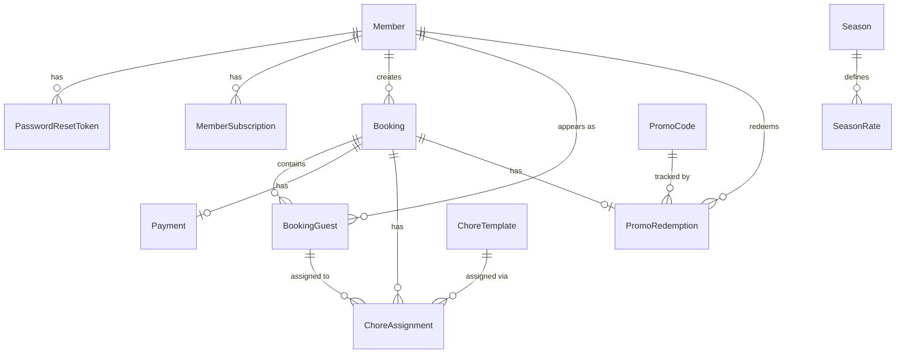

# 02 - Data Model

> Reference for the TACBookings Prisma schema.
> Source of truth: `prisma/schema.prisma` (PostgreSQL 16)

---

## Overview

| Metric | Value |
|--------|-------|
| Models | 17 |
| Enums | 9 |
| Primary keys | `String @id @default(cuid())` on every model |
| Monetary fields | Integer cents (`Int`) -- no floats |
| Stay dates | `@db.Date` (date-only, no time component) |
| Timestamps | `createdAt @default(now())`, `updatedAt @updatedAt` on most models |
| Unused models | **None** -- all 17 are referenced in application code |

---

## Entity-Relationship Summary

**Relationship clusters:**

1. **Member hub** -- Member -> PasswordResetToken, MemberSubscription, Booking, BookingGuest, PromoRedemption
2. **Booking hub** -- Booking -> BookingGuest, Payment, ChoreAssignment, PromoRedemption
3. **Season -> SeasonRate** (1:N)
4. **PromoCode -> PromoRedemption** (1:N)
5. **ChoreTemplate -> ChoreAssignment** (1:N)
6. **Standalone** -- CancellationPolicy, XeroToken, ProcessedWebhookEvent, AuditLog (no FK relations)

---

## Enums

| Enum | Values | Used By |
|------|--------|---------|
| `Role` | `MEMBER`, `ADMIN` | `Member.role` |
| `AgeTier` | `ADULT`, `YOUTH`, `CHILD` | `Member.ageTier`, `SeasonRate.ageTier`, `BookingGuest.ageTier` |
| `SubscriptionStatus` | `UNPAID`, `PAID`, `OVERDUE` | `MemberSubscription.status` |
| `SeasonType` | `WINTER`, `SUMMER` | `Season.type` |
| `BookingStatus` | `PENDING`, `CONFIRMED`, `BUMPED`, `CANCELLED`, `COMPLETED` | `Booking.status` |
| `PaymentStatus` | `PENDING`, `PROCESSING`, `SUCCEEDED`, `FAILED`, `REFUNDED`, `PARTIALLY_REFUNDED` | `Payment.status` |
| `PromoCodeType` | `PERCENTAGE`, `FIXED_AMOUNT`, `FREE_NIGHTS` | `PromoCode.type` |
| `ChoreStatus` | `SUGGESTED`, `CONFIRMED`, `COMPLETED` | `ChoreAssignment.status` |
| `AgeRestriction` | `ANY`, `ADULTS_ONLY`, `MIXED_PREFERRED`, `ADULT_SUPERVISED` | `ChoreTemplate.ageRestriction` |

---

## Models

### Group 1 -- Authentication & Members

#### Member

Core user record for club members and admins.

| Field | Type | Null | Default | Constraints | Notes |
|-------|------|------|---------|-------------|-------|
| `id` | String | | `cuid()` | PK | |
| `email` | String | | | unique | Login identifier |
| `passwordHash` | String | | | | bcrypt, cost 13 |
| `forcePasswordChange` | Boolean | | `false` | | Set by admin to require password change on next login |
| `firstName` | String | | | | |
| `lastName` | String | | | | |
| `dateOfBirth` | DateTime | yes | | | Used for age tier computation |
| `phone` | String | yes | | | |
| `role` | Role | | `MEMBER` | | `MEMBER` or `ADMIN` |
| `ageTier` | AgeTier | | `ADULT` | | Computed from `dateOfBirth` |
| `xeroContactId` | String | yes | | unique | Links to Xero CRM contact |
| `active` | Boolean | | `true` | | Soft-delete flag |
| `createdAt` | DateTime | | `now()` | | |
| `updatedAt` | DateTime | | `@updatedAt` | | |

**Relations:**

| Relation | Target | Cardinality | On Delete |
|----------|--------|-------------|-----------|
| `passwordResetTokens` | PasswordResetToken | 1:N | Cascade (child deleted) |
| `subscriptions` | MemberSubscription | 1:N | Cascade (child deleted) |
| `bookings` | Booking | 1:N | Restrict (default) |
| `guestAppearances` | BookingGuest | 1:N | -- (FK nullable) |
| `promoRedemptions` | PromoRedemption | 1:N | -- |

**Indexes:** `email`, `xeroContactId`

---

#### PasswordResetToken

Time-limited, single-use token for password reset flow.

| Field | Type | Null | Default | Constraints | Notes |
|-------|------|------|---------|-------------|-------|
| `id` | String | | `cuid()` | PK | |
| `token` | String | | | unique | Random token sent via email |
| `memberId` | String | | | FK -> Member | |
| `expiresAt` | DateTime | | | | 1-hour expiry window |
| `used` | Boolean | | `false` | | Marked `true` after use (single-use) |
| `createdAt` | DateTime | | `now()` | | |

**Relations:**

| Relation | Target | Cardinality | On Delete |
|----------|--------|-------------|-----------|
| `member` | Member | N:1 | Cascade (deleted with member) |

**Indexes:** `memberId`

---

### Group 2 -- Membership Subscriptions

#### MemberSubscription

Tracks annual season subscription status sourced from Xero invoices.

| Field | Type | Null | Default | Constraints | Notes |
|-------|------|------|---------|-------------|-------|
| `id` | String | | `cuid()` | PK | |
| `memberId` | String | | | FK -> Member | |
| `seasonYear` | Int | | | | e.g. 2025 = Apr 2025 -- Mar 2026 |
| `status` | SubscriptionStatus | | `UNPAID` | | `UNPAID`, `PAID`, `OVERDUE` |
| `xeroInvoiceId` | String | yes | | | Xero invoice reference |
| `paidAt` | DateTime | yes | | | When payment was recorded |
| `createdAt` | DateTime | | `now()` | | |
| `updatedAt` | DateTime | | `@updatedAt` | | |

**Relations:**

| Relation | Target | Cardinality | On Delete |
|----------|--------|-------------|-----------|
| `member` | Member | N:1 | Cascade (deleted with member) |

**Unique constraint:** `[memberId, seasonYear]`

**Indexes:** `memberId`

---

### Group 3 -- Seasons & Pricing

#### Season

Admin-configured time periods (winter/summer) that determine nightly rates.

| Field | Type | Null | Default | Constraints | Notes |
|-------|------|------|---------|-------------|-------|
| `id` | String | | `cuid()` | PK | |
| `name` | String | | | | e.g. "Winter 2025" |
| `type` | SeasonType | | | | `WINTER` or `SUMMER` |
| `startDate` | DateTime | | | `@db.Date` | Date-only |
| `endDate` | DateTime | | | `@db.Date` | Date-only |
| `active` | Boolean | | `true` | | Soft-delete flag |
| `createdAt` | DateTime | | `now()` | | |
| `updatedAt` | DateTime | | `@updatedAt` | | |

**Relations:**

| Relation | Target | Cardinality | On Delete |
|----------|--------|-------------|-----------|
| `rates` | SeasonRate | 1:N | Cascade (child deleted) |

**Indexes:** `[startDate, endDate]` (compound)

---

#### SeasonRate

Per-night price for a specific age tier and membership status within a season. Six rates per season (3 age tiers x 2 membership states).

| Field | Type | Null | Default | Constraints | Notes |
|-------|------|------|---------|-------------|-------|
| `id` | String | | `cuid()` | PK | |
| `seasonId` | String | | | FK -> Season | |
| `ageTier` | AgeTier | | | | `ADULT`, `YOUTH`, `CHILD` |
| `isMember` | Boolean | | | | Member vs non-member rate |
| `pricePerNightCents` | Int | | | | Price in cents |

**Relations:**

| Relation | Target | Cardinality | On Delete |
|----------|--------|-------------|-----------|
| `season` | Season | N:1 | Cascade (deleted with season) |

**Unique constraint:** `[seasonId, ageTier, isMember]`

**Indexes:** `seasonId`

---

### Group 4 -- Bookings & Guests

#### Booking

A stay at the lodge, created by a member, containing one or more guests.

| Field | Type | Null | Default | Constraints | Notes |
|-------|------|------|---------|-------------|-------|
| `id` | String | | `cuid()` | PK | |
| `memberId` | String | | | FK -> Member | Who created the booking |
| `checkIn` | DateTime | | | `@db.Date` | Date-only |
| `checkOut` | DateTime | | | `@db.Date` | Date-only |
| `status` | BookingStatus | | `PENDING` | | See enum for values |
| `totalPriceCents` | Int | | | | Full price before discount |
| `discountCents` | Int | | `0` | | Promo code discount |
| `finalPriceCents` | Int | | | | `totalPriceCents - discountCents` |
| `hasNonMembers` | Boolean | | `false` | | Triggers pending/bumping logic |
| `nonMemberHoldUntil` | DateTime | yes | | | `checkIn - 7 days` for pending bookings |
| `notes` | String | yes | | | Free-text notes |
| `createdAt` | DateTime | | `now()` | | |
| `updatedAt` | DateTime | | `@updatedAt` | | |

**Relations:**

| Relation | Target | Cardinality | On Delete |
|----------|--------|-------------|-----------|
| `member` | Member | N:1 | Restrict (default) |
| `guests` | BookingGuest | 1:N | Cascade (child deleted) |
| `payment` | Payment | 1:0..1 | Cascade (child deleted) |
| `choreAssignments` | ChoreAssignment | 1:N | Cascade (child deleted) |
| `promoRedemption` | PromoRedemption | 1:0..1 | Cascade (child deleted) |

**Indexes:** `memberId`, `[checkIn, checkOut]` (compound), `status`

---

#### BookingGuest

An individual guest within a booking. Each guest has their own price calculated from their age tier and membership status.

| Field | Type | Null | Default | Constraints | Notes |
|-------|------|------|---------|-------------|-------|
| `id` | String | | `cuid()` | PK | |
| `bookingId` | String | | | FK -> Booking | |
| `firstName` | String | | | | |
| `lastName` | String | | | | |
| `ageTier` | AgeTier | | | | Determines nightly rate |
| `isMember` | Boolean | | `false` | | Member vs non-member rate |
| `memberId` | String | yes | | FK -> Member | Linked if guest is a registered member |
| `priceCents` | Int | | | | Total price for this guest for the full stay |
| `createdAt` | DateTime | | `now()` | | |

**Relations:**

| Relation | Target | Cardinality | On Delete |
|----------|--------|-------------|-----------|
| `booking` | Booking | N:1 | Cascade (deleted with booking) |
| `member` | Member | N:0..1 | -- (nullable FK) |
| `choreAssignments` | ChoreAssignment | 1:N | -- |

**Indexes:** `bookingId`, `memberId`

---

### Group 5 -- Payments

#### Payment

Stripe payment record linked 1:1 to a booking. Tracks payment lifecycle and Xero invoice sync.

| Field | Type | Null | Default | Constraints | Notes |
|-------|------|------|---------|-------------|-------|
| `id` | String | | `cuid()` | PK | |
| `bookingId` | String | | | FK -> Booking, unique | One payment per booking |
| `amountCents` | Int | | | | Amount charged |
| `stripePaymentIntentId` | String | yes | | unique | For confirmed bookings (immediate charge) |
| `stripePaymentMethodId` | String | yes | | | Saved card reference |
| `stripeSetupIntentId` | String | yes | | unique | For pending bookings (save card for later) |
| `stripeCustomerId` | String | yes | | | Stripe customer reference |
| `xeroInvoiceId` | String | yes | | unique | Linked Xero invoice |
| `status` | PaymentStatus | | `PENDING` | | See enum for values |
| `refundedAmountCents` | Int | | `0` | | Tracks partial/full refunds |
| `createdAt` | DateTime | | `now()` | | |
| `updatedAt` | DateTime | | `@updatedAt` | | |

**Relations:**

| Relation | Target | Cardinality | On Delete |
|----------|--------|-------------|-----------|
| `booking` | Booking | 1:1 | Cascade (deleted with booking) |

**Indexes:** `bookingId`, `stripePaymentIntentId`

---

### Group 6 -- Promotions

#### PromoCode

Discount codes supporting percentage, fixed amount, or free nights discount types.

| Field | Type | Null | Default | Constraints | Notes |
|-------|------|------|---------|-------------|-------|
| `id` | String | | `cuid()` | PK | |
| `code` | String | | | unique | User-facing code string |
| `description` | String | yes | | | Admin-facing description |
| `type` | PromoCodeType | | | | `PERCENTAGE`, `FIXED_AMOUNT`, `FREE_NIGHTS` |
| `valueCents` | Int | yes | | | Used by `FIXED_AMOUNT` type |
| `percentOff` | Int | yes | | | Used by `PERCENTAGE` type (0-100) |
| `freeNights` | Int | yes | | | Used by `FREE_NIGHTS` type |
| `maxRedemptions` | Int | yes | | | `null` = unlimited |
| `currentRedemptions` | Int | | `0` | | Incremented on use, decremented on cancel/bump |
| `validFrom` | DateTime | yes | | | `null` = no start restriction |
| `validUntil` | DateTime | yes | | | `null` = no expiry; boundary is exclusive (`>=`) |
| `membersOnly` | Boolean | | `false` | | Restrict to members |
| `singleUse` | Boolean | | `false` | | One use per member |
| `active` | Boolean | | `true` | | Soft-delete / toggle flag |
| `createdAt` | DateTime | | `now()` | | |
| `updatedAt` | DateTime | | `@updatedAt` | | |

**Relations:**

| Relation | Target | Cardinality | On Delete |
|----------|--------|-------------|-----------|
| `redemptions` | PromoRedemption | 1:N | -- |

**Indexes:** `code`

---

#### PromoRedemption

Tracks which member used which promo code on which booking. One redemption per booking.

| Field | Type | Null | Default | Constraints | Notes |
|-------|------|------|---------|-------------|-------|
| `id` | String | | `cuid()` | PK | |
| `promoCodeId` | String | | | FK -> PromoCode | |
| `bookingId` | String | | | FK -> Booking, unique | One promo per booking |
| `memberId` | String | | | FK -> Member | Who redeemed it |
| `discountCents` | Int | | | | Discount amount applied |
| `createdAt` | DateTime | | `now()` | | |

**Relations:**

| Relation | Target | Cardinality | On Delete |
|----------|--------|-------------|-----------|
| `promoCode` | PromoCode | N:1 | -- |
| `booking` | Booking | 1:1 | Cascade (deleted with booking) |
| `member` | Member | N:1 | -- |

**Indexes:** `promoCodeId`, `memberId`

---

### Group 7 -- Chore Roster

#### ChoreTemplate

Configurable chore definitions used by the auto-suggest allocation algorithm.

| Field | Type | Null | Default | Constraints | Notes |
|-------|------|------|---------|-------------|-------|
| `id` | String | | `cuid()` | PK | |
| `name` | String | | | | e.g. "Dishes", "Sweep common area" |
| `description` | String | yes | | | |
| `recommendedPeopleMin` | Int | | `1` | | Minimum people for allocation |
| `recommendedPeopleMax` | Int | | `2` | | Maximum people for allocation |
| `isEssential` | Boolean | | `false` | | Must always be assigned |
| `ageRestriction` | AgeRestriction | | `ANY` | | Controls who can be assigned |
| `conditionalNote` | String | yes | | | Shown when conditions apply |
| `minAge` | Int | | `0` | | Minimum age for assignment |
| `sortOrder` | Int | | `0` | | Display ordering |
| `active` | Boolean | | `true` | | Soft-delete flag |
| `createdAt` | DateTime | | `now()` | | |
| `updatedAt` | DateTime | | `@updatedAt` | | |

**Relations:**

| Relation | Target | Cardinality | On Delete |
|----------|--------|-------------|-----------|
| `assignments` | ChoreAssignment | 1:N | -- |

**Indexes:** none

---

#### ChoreAssignment

Assigns a specific guest to a specific chore on a specific date.

| Field | Type | Null | Default | Constraints | Notes |
|-------|------|------|---------|-------------|-------|
| `id` | String | | `cuid()` | PK | |
| `choreTemplateId` | String | | | FK -> ChoreTemplate | |
| `bookingId` | String | | | FK -> Booking | |
| `bookingGuestId` | String | yes | | FK -> BookingGuest | Nullable until assigned to a specific guest |
| `date` | DateTime | | | `@db.Date` | Date-only |
| `status` | ChoreStatus | | `SUGGESTED` | | `SUGGESTED` -> `CONFIRMED` -> `COMPLETED` |
| `createdAt` | DateTime | | `now()` | | |
| `updatedAt` | DateTime | | `@updatedAt` | | |

**Relations:**

| Relation | Target | Cardinality | On Delete |
|----------|--------|-------------|-----------|
| `choreTemplate` | ChoreTemplate | N:1 | -- |
| `booking` | Booking | N:1 | Cascade (deleted with booking) |
| `bookingGuest` | BookingGuest | N:0..1 | -- (nullable FK) |

**Indexes:** `date`, `bookingId`, `choreTemplateId`

---

### Group 8 -- System & Integrations

These models have **no FK relations** to other models. They are standalone system tables.

#### CancellationPolicy

Admin-configurable refund tiers based on days before stay.

| Field | Type | Null | Default | Constraints | Notes |
|-------|------|------|---------|-------------|-------|
| `id` | String | | `cuid()` | PK | |
| `daysBeforeStay` | Int | | | unique | e.g. 14, 7, 0 |
| `refundPercentage` | Int | | | | e.g. 100, 50, 0 |
| `createdAt` | DateTime | | `now()` | | |
| `updatedAt` | DateTime | | `@updatedAt` | | |

**Relations:** none

**Unique constraint:** `daysBeforeStay`

---

#### XeroToken

Stores OAuth2 tokens for the Xero accounting integration. Effectively a single-row table.

| Field | Type | Null | Default | Constraints | Notes |
|-------|------|------|---------|-------------|-------|
| `id` | String | | `cuid()` | PK | |
| `accessToken` | String | | | | AES-256-GCM encrypted at rest |
| `refreshToken` | String | | | | AES-256-GCM encrypted at rest |
| `expiresAt` | DateTime | | | | Auto-refreshed 5 min before 30-min expiry |
| `tenantId` | String | yes | | | Xero organisation identifier |
| `createdAt` | DateTime | | `now()` | | |
| `updatedAt` | DateTime | | `@updatedAt` | | |

**Relations:** none

---

#### ProcessedWebhookEvent

Tracks processed webhook event IDs for idempotency (prevents duplicate processing of Stripe/Xero events).

| Field | Type | Null | Default | Constraints | Notes |
|-------|------|------|---------|-------------|-------|
| `id` | String | | `cuid()` | PK | |
| `eventId` | String | | | unique | Stripe/Xero event ID |
| `source` | String | | | | `"stripe"` or `"xero"` |
| `eventType` | String | | | | e.g. `"payment_intent.succeeded"` |
| `processedAt` | DateTime | | `now()` | | |

**Relations:** none

**Indexes:** `source`

---

#### AuditLog

Records sensitive admin and system actions. Fire-and-forget pattern -- `memberId` is a plain string (not a FK) so logs survive member deletion.

| Field | Type | Null | Default | Constraints | Notes |
|-------|------|------|---------|-------------|-------|
| `id` | String | | `cuid()` | PK | |
| `action` | String | | | | e.g. `"booking.cancel"`, `"season.create"` |
| `memberId` | String | yes | | | Actor ID (plain string, not FK) |
| `targetId` | String | yes | | | Target entity ID |
| `details` | String | yes | | | JSON-encoded extra context |
| `ipAddress` | String | yes | | | Request IP |
| `createdAt` | DateTime | | `now()` | | |

**Relations:** none

**Indexes:** `action`, `memberId`, `createdAt`

---

## Cascade Delete Map

| Parent | Child | On Delete |
|--------|-------|-----------|
| Member | PasswordResetToken | Cascade |
| Member | MemberSubscription | Cascade |
| Season | SeasonRate | Cascade |
| Booking | BookingGuest | Cascade |
| Booking | Payment | Cascade |
| Booking | ChoreAssignment | Cascade |
| Booking | PromoRedemption | Cascade |

**Not cascaded (Restrict/default):**
- Member -> Booking: a member cannot be deleted while they have bookings
- Member -> PromoRedemption: no cascade specified
- PromoCode -> PromoRedemption: no cascade specified
- ChoreTemplate -> ChoreAssignment: no cascade specified

---

## Design Conventions

- **cuid() primary keys** on every model -- URL-safe, collision-resistant, no sequential guessing
- **Integer cents for money** (`totalPriceCents`, `pricePerNightCents`, etc.) -- avoids floating-point rounding
- **`@db.Date` for stay dates** -- `checkIn`, `checkOut`, `ChoreAssignment.date`, `Season.startDate/endDate` store date-only values (no time component)
- **Cascade deletes flow parent -> child only** -- deleting a Booking removes its guests, payment, chore assignments, and promo redemption
- **Soft-delete via `active` flag** on Member, Season, PromoCode, ChoreTemplate -- records are deactivated rather than deleted
- **`AuditLog.memberId` is intentionally not a FK** -- logs must survive member deletion
- **Standalone system tables** (CancellationPolicy, XeroToken, ProcessedWebhookEvent, AuditLog) have no FK relations to other models
- **Season year = April to March** -- if current month >= April, `seasonYear = currentYear`; else `seasonYear = currentYear - 1`
- **Timezone: Pacific/Auckland** -- all dates interpreted in NZ time

---

## Model Usage

All 17 models are actively referenced in application routes, views, or library code. No models are unused.

The `Room` model previously noted in project documentation as unused has already been removed from the schema.
