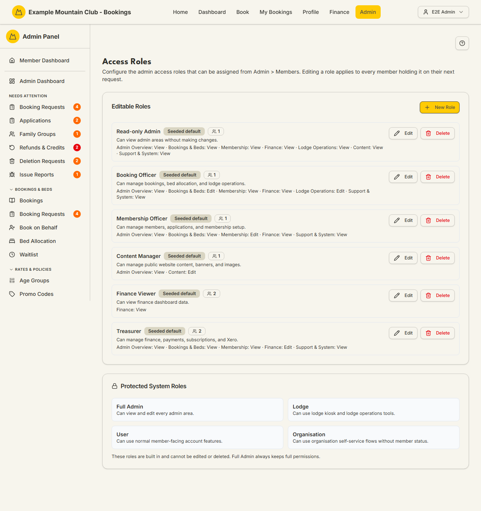

# Access Roles

Audience: Operator

## What it is

Where you define the **custom admin roles** your club can hand out — each role a
named bundle of permissions across the admin areas. Assigning a role to a member
(from **Admin → Members**) is what gives them their admin access; this page
decides what each role can see and do. Find it at **Admin → Setup &
Configuration → Access Roles** (`/admin/access-roles`).

Only **Full Admins** see this sidebar entry and can reach the page. Editing a
role takes effect for every member holding it on their next request. See
[`ARCHITECTURE.md`](../ARCHITECTURE.md) (access roles / definitions) for the
underlying model.

## When you'd use it

- You want a committee member to manage bookings but never touch finance or
  member data — create a role with **Edit** on Bookings & Beds and **None**
  elsewhere.
- You're onboarding a treasurer and want a finance-only role.
- A role's remit changed and you need to widen or narrow what it can do.

## Step-by-step

### Create or edit a role

1. Go to **Admin → Setup & Configuration → Access Roles**. Each custom role
   shows its name, description, permission summary, and how many members hold it.

   

2. Click **New role** (or the pencil to edit one). Give it a **name** and
   **description**, then set each admin area to **None**, **View**, or **Edit**
   in the permission grid.
3. Save. To remove a role, use the delete action — a role still assigned to
   members can't be removed until those members are moved off it.
4. Assign the role to people on **Admin → Members**; this page only defines it.

## Settings reference

Each custom role carries a name, a description, and a permission level per admin
area:

| Permission area | Covers |
| --- | --- |
| Admin Overview | The dashboard and cross-area overview |
| Bookings & Beds | Bookings, requests, beds, waitlist, seasons, promos |
| Membership | Members, applications, family links, memberships, inductions, communications |
| Finance | Fees, payments, subscriptions, refunds, Xero, reports |
| Lodge Operations | Hut leaders, rosters, chores, work parties, lodge settings, rooms/beds |
| Content | Page content, site chrome, banners, public images, site style |
| Support & System | Setup, modules, security, audit, health, notifications |

| Level | Meaning |
| --- | --- |
| None | No access to that area |
| View | Read-only |
| Edit | Full read/write |

**Protected system roles** — Full Admin (`ADMIN`), Lodge (`LODGE`), User
(`USER`), and Organisation (`ORG`) — are code-defined, shown for reference, and
can never be edited or deleted here.

## Troubleshooting

| Symptom | Likely cause | Fix |
| --- | --- | --- |
| No Access Roles entry in the sidebar | You are not a Full Admin | Only Full Admins can manage roles; ask one |
| A role won't delete | Members still hold it | Reassign those members first, then delete |
| A member still can't reach an area | Their role's level for it is None/View, or the change hasn't taken effect | Adjust the role; changes apply on the member's next request |
| A system role can't be edited | It is a protected built-in role | Create a custom role instead |

## Related links

- Back to the [documentation hub](../README.md).
- Sibling guides: [Members](members.md) (where roles are assigned),
  [Committee](committee.md), [Login & Security](security.md).
- Reference: access roles / definitions in [`ARCHITECTURE.md`](../ARCHITECTURE.md).
