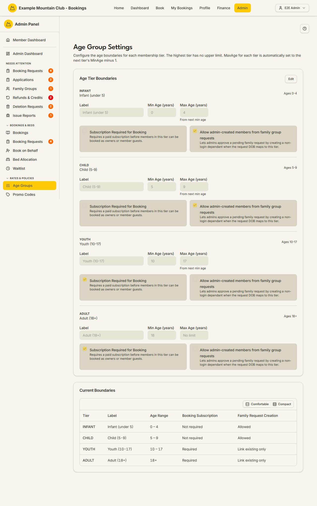

# Age Groups

Audience: Operator

## What it is

The page that defines each membership **age tier** — its label, its age
boundaries, and two per-tier rules: whether a paid subscription is required to
book, and whether admins may create a non-login dependant from a family
request. Tiers tile the whole age range from 0 upward, and each tier's maximum
age is set automatically to the next tier's minimum age minus one; the top tier
has no upper limit. Find it at **Admin → Rates & Policies → Age Groups**
(`/admin/age-tier-settings`).

Editing needs **bookings edit** access; a view-only bookings role can read the
tiers but not change them.

## When you'd use it

- Your club's age bands differ from the defaults and you need to change the
  boundaries or labels.
- You want a tier (for example Youth) to require a paid subscription before they
  can be booked.
- You want to allow, or stop, admins creating dependants in a tier from family
  group requests.
- You are running a subset of the built-in tiers and need to add or remove one.

## Step-by-step

### Review the current tiers

1. Go to **Admin → Rates & Policies → Age Groups**. The **Current Boundaries**
   table at the bottom summarises every tier: its age range, whether a booking
   subscription is required, and its family-request-creation rule.

   

### Edit the boundaries

1. In the **Age Tier Boundaries** card, click **Edit**.
2. For each tier, adjust the **Label** and **Min Age (years)**. The **Max Age**
   is read-only — it is derived from the next tier's minimum age.
3. Tick or clear **Subscription Required for Booking** (whether members in this
   tier need a paid subscription to be booked as owners or member guests) and
   **Allow admin-created members from family group requests**.
4. Click **Save Changes**.

### Add or remove a tier

1. In edit mode, non-Adult tiers show a **Remove** button. Adult is the
   unbounded top tier and can never be removed. When you save, the youngest
   remaining tier is coerced to start at age 0.
2. If you have removed tiers and want to start over, click **Restore default
   tiers** to reload the four built-in tiers (nothing is saved until you press
   **Save Changes**).

## Settings reference

| Field | What it controls | Default | Notes / constraints |
| --- | --- | --- | --- |
| Label | The tier's display name | e.g. "Youth (10-17)" | Free text |
| Min Age (years) | The lowest age in the tier | see defaults below | Whole years, 0+ |
| Max Age (years) | The highest age in the tier | derived | Read-only; = next tier's min age − 1; "No limit" for the top tier |
| Subscription Required for Booking | Require a paid subscription before booking members in this tier | on (defaults if absent) | — |
| Allow admin-created members from family group requests | Let admins create a non-login dependant in this tier from a family request | off (defaults if absent) | — |

**Built-in default tiers:**

| Tier | Label | Ages | Subscription required | Family create allowed |
| --- | --- | --- | --- | --- |
| INFANT | Infant (under 5) | 0–4 | no | yes |
| CHILD | Child (5-9) | 5–9 | no | yes |
| YOUTH | Youth (10-17) | 10–17 | yes | no |
| ADULT | Adult (18+) | 18+ (no limit) | yes | no |

## Troubleshooting

| Symptom | Likely cause | Fix |
| --- | --- | --- |
| The Edit button is missing | Your admin role is view-only for bookings | Ask a full admin for bookings edit access |
| Save is rejected (403) | Your role cannot change these settings | Ask a full admin to make the change |
| Remove is blocked or save fails | A live member or upcoming guest still maps to that tier | Reassign or wait until no one maps to the tier, then remove it |
| Max Age won't change | It is derived automatically | Change the next tier's Min Age instead |
| "Restore default tiers" is not offered | You still have all four (or more) tiers | It only appears when fewer than four tiers remain |

## Related links

- Back to the [documentation hub](../README.md).
- Sibling guides: [Booking Policies](booking-policies.md),
  [Seasons](seasons.md), [Promo Codes](promo-codes.md).
- Reference: age-tier invariants in
  [`DOMAIN_INVARIANTS.md`](../DOMAIN_INVARIANTS.md#membership-lifecycle),
  membership type settings in
  [`CONFIGURATION.md`](../../CONFIGURATION.md#membership-type-settings), and the
  [seasonal membership type policy](../STATE_MACHINES.md#seasonal-membership-type-policy).
