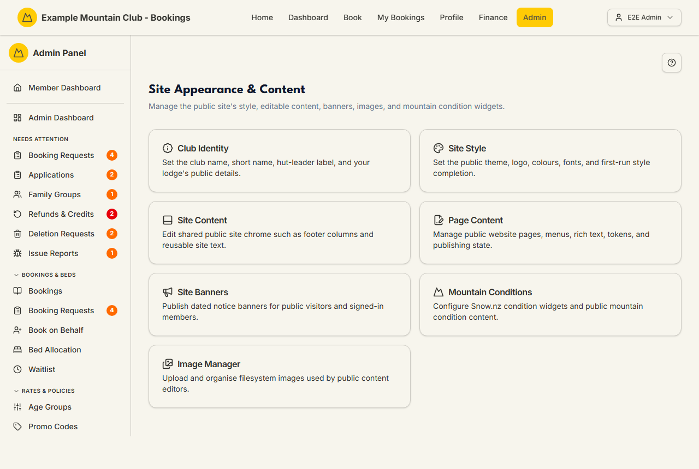
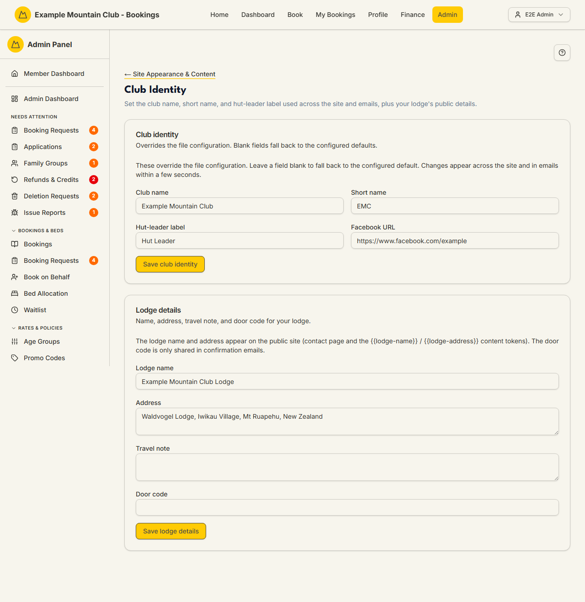

# Site Appearance & Content

Audience: Operator

## What it is

The hub for everything a visitor sees on your public website: your club's
identity, the site theme and logo, editable page and footer content, notice
banners, mountain-condition widgets, and the shared image library. Find it at
**Admin → Setup & Configuration → Site Appearance & Content**
(`/admin/appearance`). Each card opens a dedicated tool; this page is only the
launcher.

The cards are:

| Card | Opens | What it does |
| --- | --- | --- |
| **Club Identity** | `/admin/appearance/identity` | Club name, short name, hut-leader label, and your lodge's public details (covered below). |
| **Site Style** | `/admin/site-style` | The public theme, brand colours, fonts, logo, and first-run style completion. See [Site Style](site-style.md). |
| **Site Content** | `/admin/site-content` | Shared site chrome such as the footer columns. See [Site Content](site-content.md). |
| **Page Content** | `/admin/page-content` | The database-backed public pages, menus, tokens, and publishing state. See [Page Content](page-content.md). |
| **Site Banners** | `/admin/site-banners` | Dated notice banners for public visitors and members. See [Site Banners](site-banners.md). |
| **Mountain Conditions** | `/admin/mountain-conditions` | The Whakapapa Snow.nz condition widget content. See [Mountain Conditions](mountain-conditions.md). |
| **Image Manager** | `/admin/image-manager` | Upload and organise images used by the content editors. See [Image Manager](image-manager.md). |

Everything here is edited under the **content** permission area: you need
content **edit** access to save, and a view-only content role can read but not
change these pages.

## When you'd use it

- You've forked the platform for your own club and need to set your club name,
  colours, logo, and footer before going live.
- Your club details, affiliations, or public wording changed and the site needs
  to match.
- You want to post a temporary notice (e.g. a road closure) or refresh the
  mountain-condition widget.

## Step-by-step

### Find the right tool

1. Open **Admin → Site Appearance & Content**. Pick the card for what you want
   to change.

   

### Set the club identity

1. Open the **Club Identity** card (`/admin/appearance/identity`).
2. Under **Club identity**, edit the **Club name**, **Short name**,
   **Hut-leader label**, and **Facebook URL**. These override the file
   configuration — leave a field blank to fall back to the configured default.
   Changes appear across the site and in emails within a few seconds. Click
   **Save club identity**.

   

3. Under **Lodge details**, edit the **Lodge name**, **Address**, **Travel
   note**, and **Door code**, then click **Save lodge details**. The lodge name
   and address appear on the public site (contact page and the `{{lodge-name}}`
   / `{{lodge-address}}` content tokens). The **door code is only shared in
   confirmation emails**, never on the public site. For a single-lodge club
   these are the lodge name, travel note, and door code that automated emails
   use — the same values the [Email Messages](email-messages.md) templates
   reference; a multi-lodge club sets them per lodge under **Setup → Lodges**
   ([Lodges](../multi-lodge/README.md)) instead.

## Settings reference

**Club identity**

| Setting | What it controls | Default | Notes / constraints |
| --- | --- | --- | --- |
| Club name | The full club name shown across the site and in emails | Configured default | Blank falls back to the file config |
| Short name | The abbreviated club name (e.g. "EMC") | Configured default | Blank falls back to the file config |
| Hut-leader label | What the role is called throughout the app (e.g. "Hut Leader") | Configured default | Renames the sidebar entry and member-facing wording |
| Facebook URL | The club's Facebook link used in the footer/contact | Configured default | Full URL |

**Lodge details**

| Setting | What it controls | Default | Notes / constraints |
| --- | --- | --- | --- |
| Lodge name | Public lodge name (`{{lodge-name}}` token) | Configured default | Appears on the public site |
| Address | Public lodge address (`{{lodge-address}}` token) | Configured default | Appears on the contact page |
| Travel note | Extra travel/access note for visitors | Blank | Optional |
| Door code | The lodge door/access code | Blank | Shared **only** in confirmation emails, never public |

## Troubleshooting

| Symptom | Likely cause | Fix |
| --- | --- | --- |
| A card is missing from the hub | The feature is gated off (e.g. Mountain Conditions needs the `skifieldConditions` module) | Enable the module at **Admin → Modules** |
| Everything is read-only | Your admin role can view but not edit under the content area | Ask a full admin for content edit access |
| A changed name still shows the old value | The DB-first identity cache updates within a few seconds; a stale tab may hold the old value | Reload the page |
| A field went back to the old default | You cleared it — blank falls back to the file configuration | Re-enter the value and save |

## Related links

- Back to the [documentation hub](../README.md).
- Sub-pages: [Site Style](site-style.md), [Site Content](site-content.md),
  [Page Content](page-content.md), [Site Banners](site-banners.md),
  [Mountain Conditions](mountain-conditions.md),
  [Image Manager](image-manager.md).
- Reference: the [`CONFIGURATION.md`](../../CONFIGURATION.md) file config that
  club identity overrides, and the public content tokens in
  [`PUBLIC_PAGE_CONTENT_TOKENS.md`](../PUBLIC_PAGE_CONTENT_TOKENS.md).
