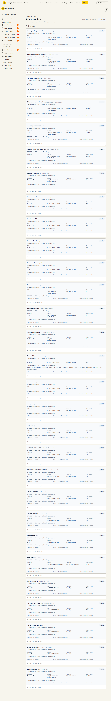

# Background Jobs

Audience: Operator

## What it is

The health view for the scheduled **cron jobs** that keep the club running in
the background — subscription billing, hut-leader auto-assignment, Xero sync,
email retries, school-attendee confirmations, and the rest. It shows each job's
schedule, when it last ran, and its recent run history and failures. Find it at
**Admin → Monitoring & Support → Background Jobs** (`/admin/background-jobs`).

The page is read-only (it also carries a back-link to [System Health](health.md),
which it shares data with) and refreshes on demand. Every cron job is designed to
be **idempotent** — a re-run does not double-charge, double-send, or double-book
— so a failed run can safely retry. See [`ARCHITECTURE.md`](../ARCHITECTURE.md)
(Cron Jobs) for the full job catalogue.

## When you'd use it

- A nightly job (billing, hut-leader assignment, Xero sync) didn't seem to
  happen and you want to confirm whether it ran and succeeded.
- You're investigating why an automated email or reconciliation is late.
- You want to see the last run time, duration, and any error for a specific job.

## Step-by-step

### Check a job's runs

1. Go to **Admin → Background Jobs**.

   

2. Find the job by its **label** (its machine `jobName` is shown in mono next to
   it). The header shows its **Schedule**, **Expected** local time, **Timezone**,
   **Stale threshold**, and the latest run / success / failure timestamps.
3. Read the run rows below for each run's status, duration, error, and result
   summary. Click **Refresh** to re-poll (the last refresh time is shown).

## Settings reference

The page has no settings. Per job it reports:

| Field | Meaning |
| --- | --- |
| Label / jobName | Friendly name and the machine job identifier |
| Status | Health verdict for the job (healthy / stale / failing) |
| Schedule | The cron expression |
| Expected | The expected local run time |
| Timezone | The timezone the schedule is evaluated in |
| Stale threshold | How long without a run before the job is considered stale |
| Latest run / success / failure | Timestamps of the most recent run and outcomes |
| Run history | Each run's status, start time, duration, error, and result summary |

Some jobs don't record per-run history (shown as "CronJobRun history is not
recorded for this scheduled job") — that is expected, not a fault.

## Troubleshooting

| Symptom | Likely cause | Fix |
| --- | --- | --- |
| A job is marked stale | It hasn't run within its stale threshold | Check the scheduler/host is up; a re-run is safe (jobs are idempotent) |
| Latest failure is recent | The last run errored | Read the run's error; fix the cause and let it retry on schedule |
| "No cron job runs recorded yet" | The job hasn't run since the last reset/seed | Expected on a fresh environment; wait for its schedule |
| A disabled-reason or note is shown | The job is intentionally off or conditional | Read the note; enable the related module/config if needed |

## Related links

- Back to the [documentation hub](../README.md).
- Sibling monitoring guides: [System Health](health.md),
  [Stuck States](stuck-states.md), [Email Deliverability](email-deliverability.md),
  [Audit Log](audit-log.md).
- Reference: the cron job catalogue in [`ARCHITECTURE.md`](../ARCHITECTURE.md).
