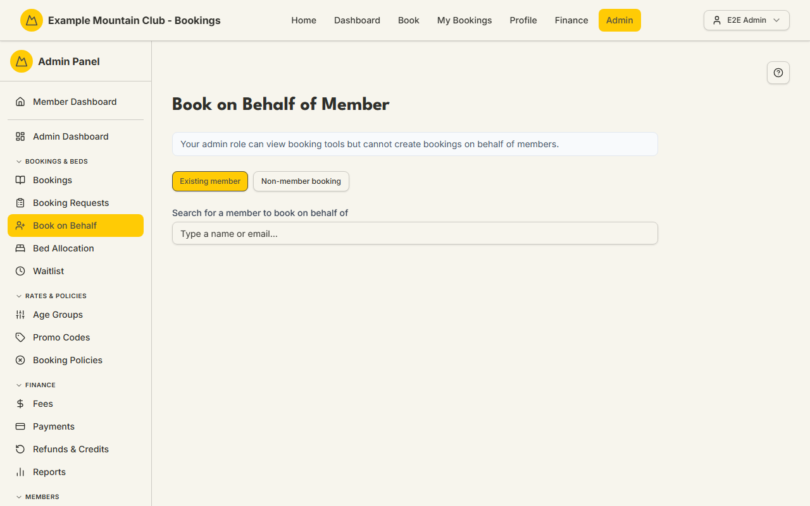

# Book on Behalf

Audience: Operator

## What it is

A guided wizard that lets an admin create a booking *for* someone — an existing
member, or a non-member walk-in/phone guest entered inline — without the member
having to log in and book themselves. It walks you through choosing the owner,
picking dates, adding guests, and confirming, and it can email the member (or
not) at the end. Find it at **Admin → Bookings & Beds → Book on Behalf**
(`/admin/book`), or via **+ Create Booking** on the [Bookings](bookings.md) list.

Admin bookings created here bypass the member-facing minimum-stay rules and can
exceed live availability up to the lodge's hard capacity (you confirm any
over-capacity override at the final step). Money is integer cents; dates are NZ
date-only lodge nights. The behaviour and its guardrails are documented in
[`CONFIGURATION.md`](../../CONFIGURATION.md#book-on-behalf).

## When you'd use it

- A member phones or emails to ask you to make a booking for them.
- A non-member walk-in or phone guest wants a bed and has no login.
- You need to record a stay that already happened (a retroactive booking, up to
  365 days back).
- You want to apply account credit or a promo code to a booking as you create
  it.

## Step-by-step

### Choose who the booking is for

1. Go to **Admin → Bookings & Beds → Book on Behalf**. If your admin role is
   view-only for bookings you will see a notice that you cannot create
   bookings; the action buttons are disabled.
2. Choose the owner type with the two buttons: **Existing member** or
   **Non-member booking**.

   

3. **Existing member:** type at least two characters of a name or email into
   **Search for a member to book on behalf of**, then pick the member from the
   dropdown. A confirmation card shows "Booking on behalf of: {name}" with a
   **Change** button.
4. **Non-member booking:** fill in **First name**, **Last name**, **Email**
   (or tick **No email address** for a phone/walk-in guest), and optional
   **Phone**. The form suggests existing contacts so you can reuse one instead
   of creating a duplicate. These guests are billed at non-member rates and are
   never sent login emails.

### Step 1 — Select Dates

1. If the club runs more than one lodge, pick the lodge first (switching resets
   the dates and pricing).
2. To record a past stay, tick **Record a past stay (retroactive booking)**
   (allowed up to 365 days back).
3. Choose the check-in and check-out nights on the calendar. As an admin you are
   not blocked by member minimum-stay rules.

### Step 2 — Add Guests

1. Use the **Quick add {name}'s family members** chips to add the member and any
   family in one click, or add guests manually in the guest form.
2. If the booking exceeds the beds available for those dates, an orange banner
   warns you — you can still continue and confirm the over-capacity override at
   the end.
3. Click **Continue** to price the booking.

### Step 3 — Review & Confirm

1. Check the **Booking Summary** (dates, nights, guests, and per-guest prices).
   If the member has account credit, tick **Apply credit to this booking** to
   use it. Add a promo code with the promo field if you have one.
2. Add optional **Notes** and an **Expected Arrival Time** if relevant. If the
   booking has minors without an adult, an admin reason box appears — because
   you are an admin the booking is auto-approved, and the reason is stored in
   the audit trail.
3. If Internet Banking is enabled and there is money to pay, choose the
   **Payment method** (Card or Internet Banking).
4. Click **Confirm Booking** (or **Save as Draft** to hold it without
   confirming). Over-capacity bookings must be confirmed with the explicit
   over-capacity button and cannot be saved as drafts.
5. In the **Email the member about this booking?** dialog, choose **Create and
   email member** or **Create without emailing**. Your choice is recorded in the
   audit log. (An Internet Banking Xero invoice email still sends regardless.)

## Settings reference

This is a wizard, not a settings page. The inputs it collects:

| Field | What it controls | Default | Notes / constraints |
| --- | --- | --- | --- |
| Owner type | Existing member vs inline non-member | Existing member | Non-members are billed at non-member rates |
| No email address | Suppress all owner emails (walk-in/phone) | off | Creates a placeholder-email owner; nothing shared with Xero |
| Record a past stay | Create a retroactive booking | off | Up to 365 days back; drafts disabled for these |
| Lodge | Which lodge the booking is at | first/only lodge | Only shown with more than one active lodge |
| Guests | Who is staying | — | Capped at the lodge's resolved capacity, not live availability |
| Apply credit to this booking | Spend the member's account credit | off | Money in integer cents |
| Notes / Expected Arrival Time | Free-text booking notes | empty | Notes ≤ 1000 characters |
| Payment method | Card or Internet Banking | Card | Internet Banking option only when the module is on and a balance is due |
| Email choice | Whether the member is emailed | asked at confirm | Recorded in the audit log |

## Troubleshooting

| Symptom | Likely cause | Fix |
| --- | --- | --- |
| The whole page shows a view-only notice | Your admin role can view booking tools but not create bookings | Ask a full admin for bookings edit access |
| Only the lodge kiosk matched the member search | You searched a term that only matches the shared kiosk login | Search by the member's own name or email — the kiosk cannot own bookings |
| "Some nights are over lodge capacity" panel | The booking exceeds available beds | Review the per-night list and press **Confirm over-capacity and create**, or reduce guests/dates |
| Confirm fails with a XERO_PERIOD_LOCKED error | The Xero accounting period for that date is locked | Choose a date outside the locked period, or unlock the period in Xero |
| Cannot Save as Draft | The booking is retroactive or over-capacity | Confirm it instead — drafts are not allowed for those |

## Related links

- Back to the [documentation hub](../README.md).
- Sibling guides: [Bookings](bookings.md), [Booking Requests](booking-requests.md),
  [Promo Codes](promo-codes.md), [Bed Allocation](bed-allocation.md).
- Reference: [`CONFIGURATION.md`](../../CONFIGURATION.md#book-on-behalf) for the
  book-on-behalf rules, the
  [booking/payment flow](../ARCHITECTURE.md#booking-and-payment-flow), and
  [capacity resolution](../CAPACITY_MODEL.md#which-bookings-consume-capacity-the-holding-population).
