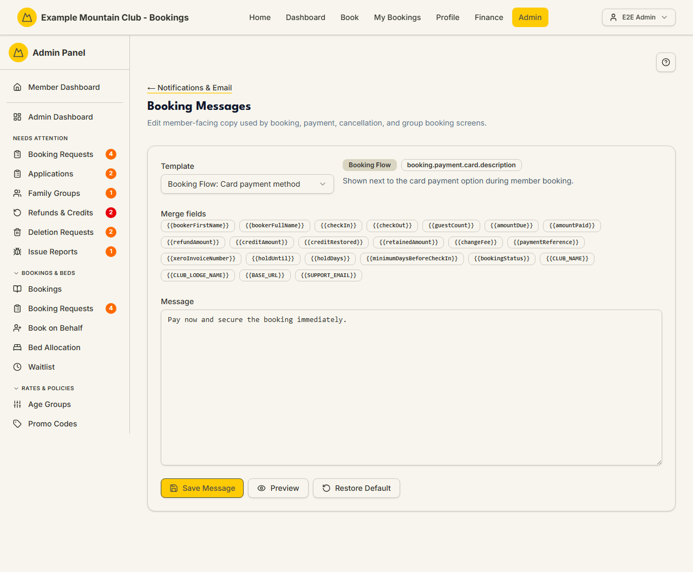

# Booking Messages

Audience: Operator

## What it is

An editor for the member-facing copy shown on booking, payment, cancellation,
and group-booking screens. Each message has a built-in default, a set of
merge-field tokens you can drop into the text, a live preview, and a
per-message restore. Find it at **Admin → Setup & Configuration → Notifications
& Email → Booking Messages** (`/admin/booking-messages`). It has no direct
sidebar entry — open it from the **Booking Messages** card on the Notifications
& Email hub, or from **Setup & Configuration → Bookings Setup** (see
[Bookings Setup](bookings-setup.md)).

Booking messages are edited under the **support** ("Support & System")
permission area, not bookings: you need support **edit** access to change them,
and a view-only support role can read but not save.

## When you'd use it

- You want to reword the text members see next to the card or Internet Banking
  payment options.
- Your club's tone, reference instructions, or Internet Banking wording need to
  change.
- A message drifted from your current policy and you want to restore the default
  or preview a change before saving.

## Step-by-step

### Pick and edit a message

1. Open **Booking Messages**. Choose a message from the **Template** dropdown
   (grouped by section — Booking Flow, Booking Detail, Payment Link,
   Cancellation & Refund Appeal, Group Booking). The badges show its section,
   key, and whether a custom override exists.

   

2. Edit the text in the **Message** box. Insert any of the **Merge fields**
   tokens (for example `{{paymentReference}}` or `{{CLUB_NAME}}`) where you want
   the live value substituted.
3. Click **Preview** to see the rendered result, then **Save Message**. Use
   **Restore Default** to discard your override and return to the built-in text.

## Settings reference

Each row of the Template dropdown is one editable message. The main ones:

| Section | Message (label) | Where members see it |
| --- | --- | --- |
| Booking Flow | Card payment method | Next to the card payment option during booking |
| Booking Flow | Internet Banking payment method | Next to the Internet Banking option during booking |
| Booking Flow | Internet Banking unavailable | When Internet Banking is on but not available for the dates |
| Booking Detail | Payment required | On a booking that still needs payment |
| Booking Detail | Internet Banking pending | On a pending Internet Banking booking awaiting reconciliation |
| Booking Detail | Switch to Internet Banking | Beside the button that switches an unpaid card booking to Internet Banking |
| Payment Link | Internet Banking payment link | On public payment links when Internet Banking is available |
| Cancellation & Refund Appeal | Refund appeal | Near member cancellation / refund-appeal controls |
| Group Booking | Group settlement / Group Internet Banking / Group invoice sent | On the organiser's group-settlement screens |

Constraints on the message body:

| Rule | Detail |
| --- | --- |
| Required | The body cannot be empty |
| Length | Up to 4000 characters |
| Plain text only | HTML tags are rejected |
| Known tokens only | Only the listed merge fields are allowed; unknown `{{tokens}}` are rejected |

Available merge fields include `{{bookerFirstName}}`, `{{bookerFullName}}`,
`{{checkIn}}`, `{{checkOut}}`, `{{guestCount}}`, `{{amountDue}}`,
`{{amountPaid}}`, `{{refundAmount}}`, `{{creditAmount}}`, `{{changeFee}}`,
`{{paymentReference}}`, `{{xeroInvoiceNumber}}`, `{{holdUntil}}`,
`{{holdDays}}`, `{{bookingStatus}}`, `{{CLUB_NAME}}`, `{{CLUB_LODGE_NAME}}`,
`{{BASE_URL}}`, and `{{SUPPORT_EMAIL}}`.

## Troubleshooting

| Symptom | Likely cause | Fix |
| --- | --- | --- |
| Everything is read-only | Your admin role can view but not edit under Support & System | Ask a full admin for support edit access |
| Save is rejected | The body is empty, too long, contains HTML, or uses an unknown token | Fix the flagged problem; keep it plain text and use only listed tokens |
| A token shows literally to members | The token name is misspelled | Use the exact token from the **Merge fields** chips |
| I want the original wording back | An override is in place | Click **Restore Default** for that message |

## Related links

- Back to the [documentation hub](../README.md).
- Sibling guides: [Bookings Setup](bookings-setup.md),
  [Booking Policies](booking-policies.md), [Booking Requests](booking-requests.md).
- Reference: email delivery configuration in
  [`CONFIGURATION.md`](../../CONFIGURATION.md#email-delivery), and the
  [booking/payment flow](../ARCHITECTURE.md#booking-and-payment-flow) the copy
  describes.
