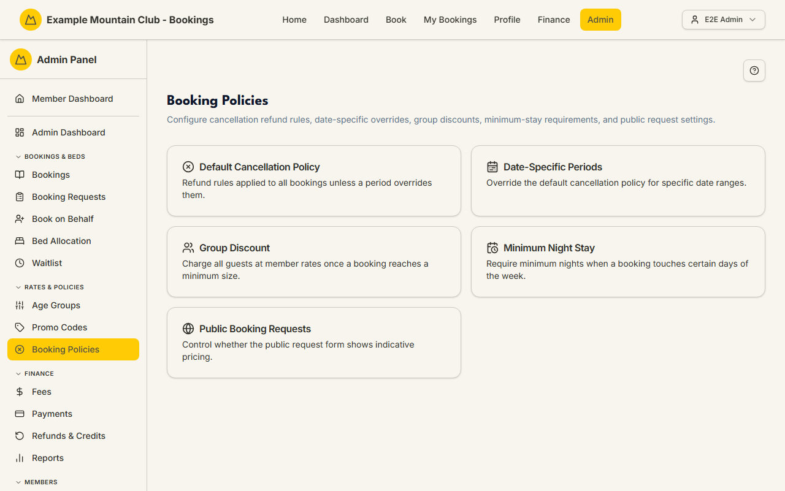
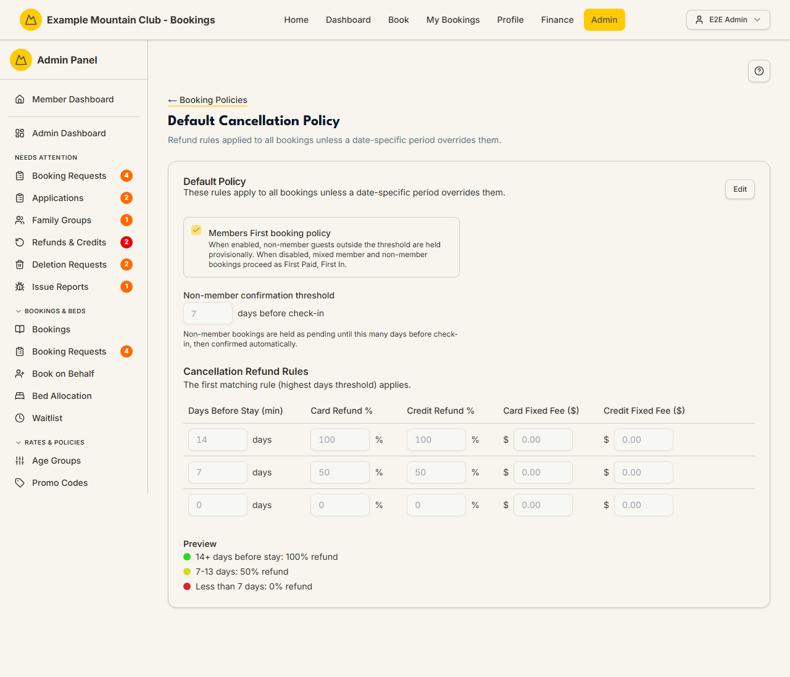
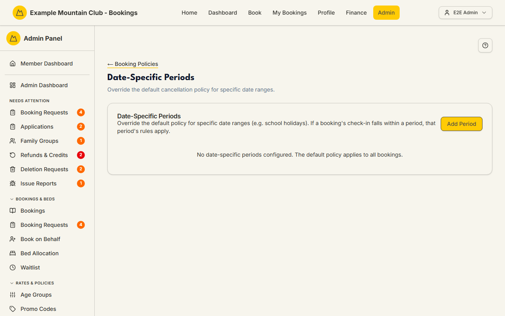
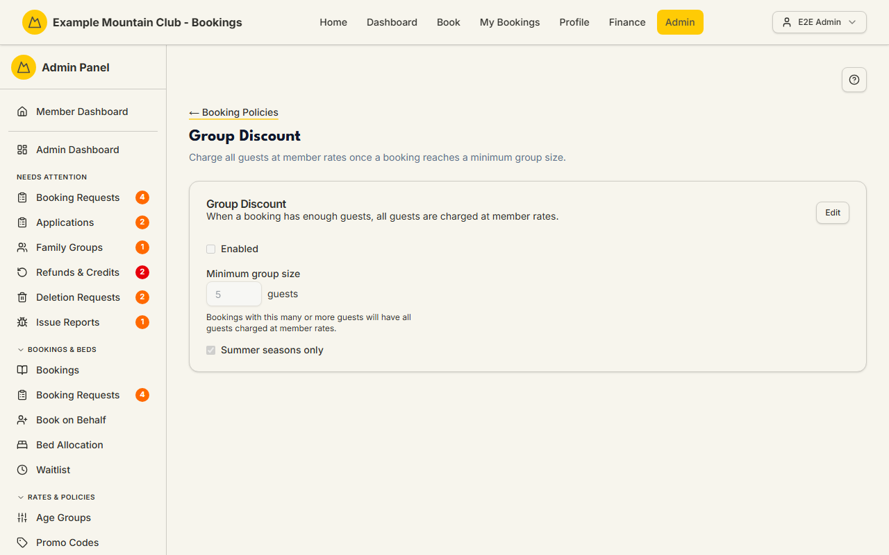
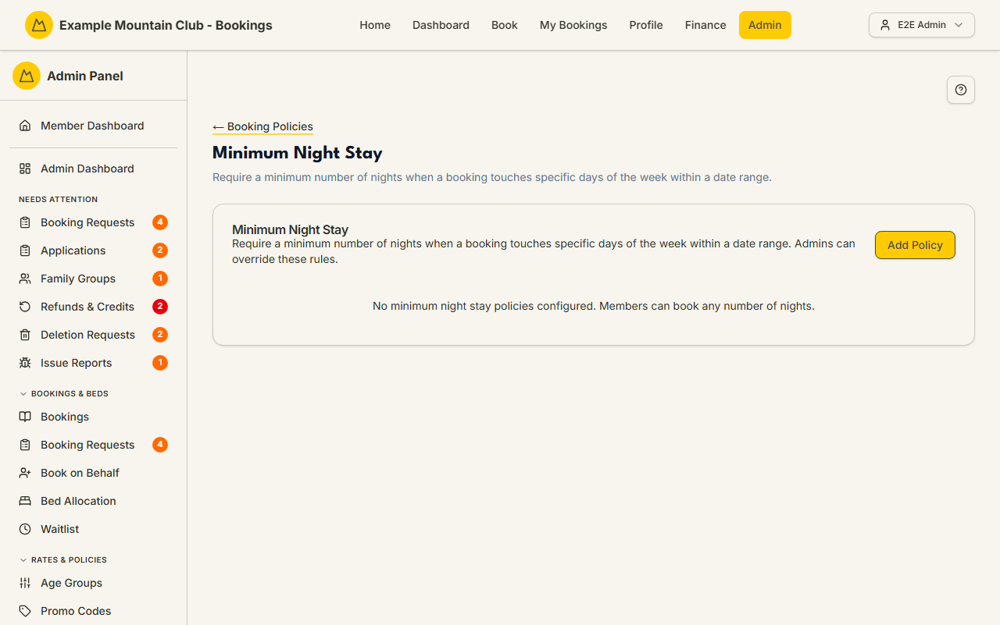
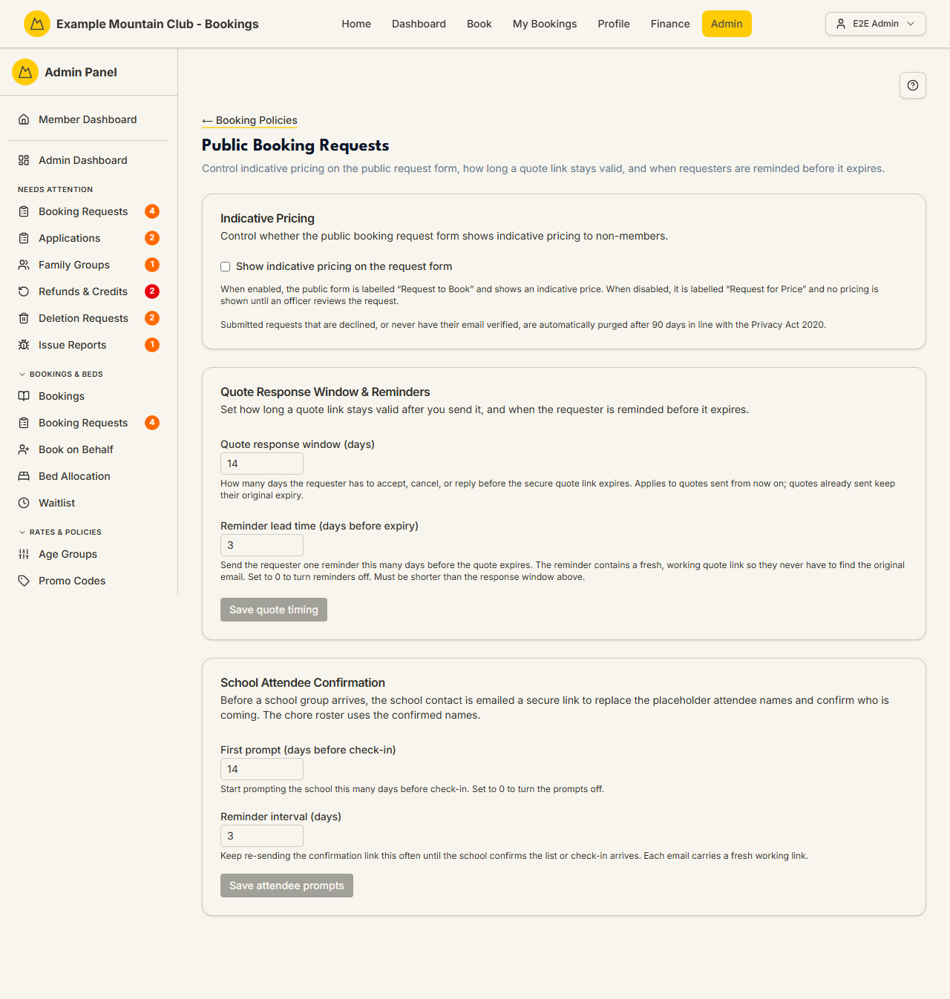

# Booking Policies

Audience: Operator

## What it is

The hub for the rules that shape how bookings are priced, held, and refunded.
Five sub-pages sit under it:

- **Default Cancellation Policy** — the club-wide refund schedule and the
  "Members First" non-member hold.
- **Date-Specific Periods** — override the cancellation policy for named date
  ranges (for example school holidays).
- **Group Discount** — charge everyone at member rates once a booking is big
  enough.
- **Minimum Night Stay** — require a minimum number of nights when a booking
  touches certain days.
- **Public Booking Requests** — control indicative pricing and quote timing on
  the public request form.

Find it at **Admin → Rates & Policies → Booking Policies**
(`/admin/booking-policies`). Every setting here needs **bookings edit** access;
a view-only role can read the policies but not change them.

All money is integer cents (entered as dollars); all dates are NZ date-only
lodge nights. When the club runs more than one lodge, a **Rules for** selector
lets you set per-lodge overrides that *replace* (never merge with) the club-wide
rules — see
[`CONFIGURATION.md`](../../CONFIGURATION.md#adding-a-second-lodge).

## When you'd use it

- You need to change how much of a booking is refunded when a member cancels.
- A busy period (school holidays, a race weekend) needs stricter refund rules or
  a minimum stay.
- You want large bookings to be charged entirely at member rates.
- You want to turn indicative pricing on or off for the public request form, or
  change how long a quote stays valid.

## Step-by-step

### Open the hub

1. Go to **Admin → Rates & Policies → Booking Policies**. Pick one of the five
   cards.

   

### Default Cancellation Policy

1. Open **Default Cancellation Policy** and click **Edit**.

   

2. Set the **Members First booking policy** toggle. When on, non-member guests
   outside the threshold are held provisionally; when off, mixed bookings run as
   "First Paid, First In".
3. Set the **Non-member confirmation threshold** (days before check-in) that
   controls how long non-member bookings stay pending.
4. Edit the **Cancellation Refund Rules** table — one row per "days before
   stay" threshold, each with a card refund %, credit refund %, and optional
   fixed fees. The **Preview** restates the rules in plain English (for example
   "14+ days before stay: 100% refund"). Click **Save Default Policy**.

### Date-Specific Periods

1. Open **Date-Specific Periods** and click **Add Period**.

   

2. Give the period a name, start and end dates, its own hold setting, and its
   own refund rules, then click **Create Period**. Any booking whose check-in
   falls inside the period uses these rules instead of the default.

### Group Discount

1. Open **Group Discount** and click **Edit**.

   

2. Tick **Enabled**, set the **Minimum group size** (the number of guests at
   which the whole booking is charged at member rates), and optionally
   **Summer seasons only**. Click **Save Group Discount**.

### Minimum Night Stay

1. Open **Minimum Night Stay** and click **Add Policy**.

   

2. Name the policy, set the minimum nights, the date range, and which
   **Trigger Days** (Sun–Sat) activate it, then click **Create Policy**. The
   minimum stay applies whenever a booking includes any trigger day in the
   range. (Admins can still override it when booking on behalf.)

### Public Booking Requests

1. Open **Public Booking Requests**.

   

2. Toggle **Show indicative pricing on the request form** (this autosaves).
   With it on, the public form is "Request to Book" and shows a price; with it
   off, it is "Request for Price" and shows none until an officer reviews it.
3. Set the **Quote response window** and **Reminder lead time**, then **Save
   quote timing**. Set the **School Attendee Confirmation** prompts and **Save
   attendee prompts**.

## Settings reference

| Setting | Page | What it controls | Default | Notes / constraints |
| --- | --- | --- | --- | --- |
| Members First booking policy | Cancellation | Hold non-member guests provisionally vs "First Paid, First In" | on | Club-wide only |
| Non-member confirmation threshold | Cancellation | Days before check-in that non-member bookings stay pending | 7 | 1–365 days |
| Cancellation refund rows | Cancellation | Refund % (card and credit) and fixed fees per days-before-stay threshold | 14→100%, 7→50%, 0→0% | Fees entered in dollars, stored as cents; the highest matching threshold wins |
| Cross-lodge waitlist queue order | Cancellation | How cross-lodge waitlists are ranked | Own lodge first | Multi-lodge only |
| Period name / dates / rules | Periods | A named date-range override of the cancellation policy | none | NZ date-only; replaces the default for matching check-ins |
| Group discount enabled | Group Discount | Charge all guests at member rates for big bookings | off | — |
| Minimum group size | Group Discount | Guest count that triggers the discount | 5 | 2 up to lodge capacity |
| Summer seasons only | Group Discount | Restrict the group discount to summer | on | — |
| Minimum nights | Minimum Stay | Nights required when a trigger day is included | 2 | Minimum 2 |
| Trigger days | Minimum Stay | Which weekdays activate the rule | Sat | At least one day |
| Show indicative pricing | Public Requests | Price shown on the public request form | off | Autosaves |
| Quote response window | Public Requests | Days a quote link stays valid | 14 | 1–60 days |
| Reminder lead time | Public Requests | Days before expiry to remind the requester | 3 | 0–30, must be shorter than the window |
| Attendee first prompt / reminder | Public Requests | School attendee-confirmation timing | 14 / 3 days | Prompt 0–90 (0 = off); reminder 1–30 |

## Troubleshooting

| Symptom | Likely cause | Fix |
| --- | --- | --- |
| Every field is read-only | Your admin role is view-only for bookings | Ask a full admin for bookings edit access |
| A "Public copy may be out of date" banner | Your Terms/FAQ still describe the old non-member hold | Click **Edit public pages** and update the copy to match the current policy |
| A period's rules are not applying | The booking's check-in is outside the period, or the period is inactive | Check the dates and the Active toggle on the period card |
| Group discount never triggers | It is disabled, the group is under the minimum, or it is summer-only and the stay is in winter | Enable it, lower the minimum group size, or untick Summer seasons only |
| Reminder lead time won't save | It is not shorter than the quote response window | Set a lead time shorter than the window |

## Related links

- Back to the [documentation hub](../README.md).
- Sibling guides: [Booking Requests](booking-requests.md),
  [Seasons](seasons.md), [Promo Codes](promo-codes.md),
  [Payments](payments.md).
- Reference: the cancellation refund policy and GST treatment in
  [`CANCELLATIONS.md`](../CANCELLATIONS.md#refund-policy), the
  [refund and credit lifecycle](../STATE_MACHINES.md#refund-and-credit-lifecycle),
  per-lodge overrides in
  [`CONFIGURATION.md`](../../CONFIGURATION.md#adding-a-second-lodge), and the
  [public booking request quote lifecycle](../STATE_MACHINES.md#public-booking-request-quote-lifecycle).
