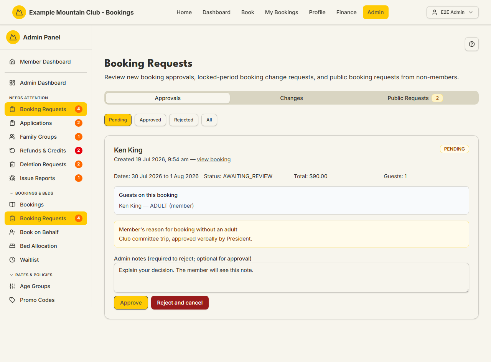
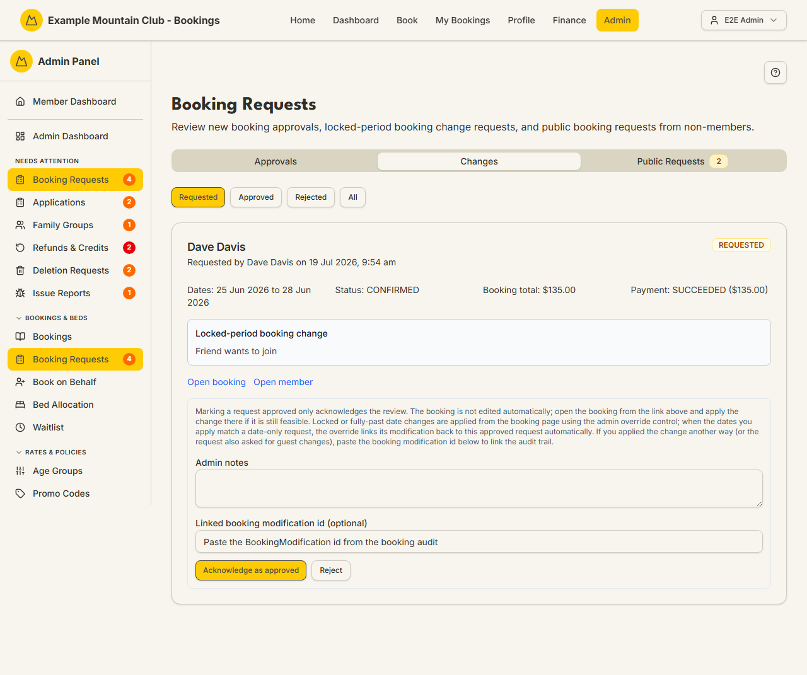
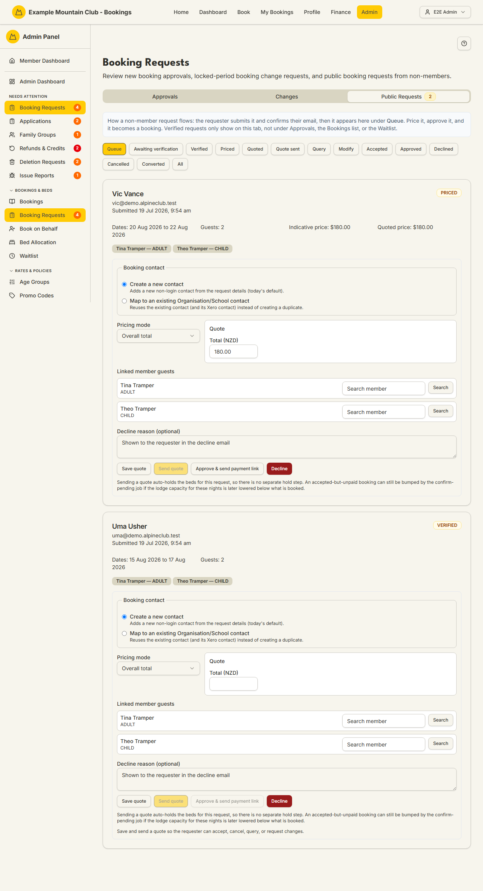

# Booking Requests

Audience: Operator

## What it is

A three-tab console for the requests that need an officer's decision before they
become (or change) a booking:

- **Approvals** — new bookings flagged for review (for example minors booked
  without an adult).
- **Changes** — change requests on bookings whose dates are locked (same-day or
  past nights).
- **Public Requests** — booking enquiries from non-members and school groups,
  which you price, quote, and approve.

Find it at **Admin → Bookings & Beds → Booking Requests**
(`/admin/booking-requests`). When any of these queues has pending items it also
appears under **Admin → Needs Attention → Booking Requests**.

> The two older routes **`/admin/booking-approvals`** and
> **`/admin/booking-change-requests`** are redirects: they open this page on the
> **Approvals** and **Changes** tabs respectively. They have no separate screen,
> so they are documented here.

Money is integer cents (shown as dollars); dates are NZ date-only lodge nights.
Every approve/reject/decline flow asks whether to email the member, and records
your choice in the audit log.

## When you'd use it

- A booking is held for review and a member is waiting to hear if it is
  approved.
- A member asks to change a booking whose dates are already locked.
- A non-member or school submits a request through the public form and you need
  to price it, send a quote, and turn it into a booking.

## Step-by-step

### Approvals — decide a flagged booking

1. Open **Booking Requests**; the **Approvals** tab is selected by default.
   Filter by **Pending**, **Approved**, **Rejected**, or **All**.

   

2. Each card shows the member, the dates, status, total, and guests, plus the
   member's reason for booking (for example "Club committee trip, approved
   verbally by President"). Use **view booking** to open the full booking.
3. In **Admin notes**, explain your decision (required to reject, optional to
   approve).
4. Click **Approve** or **Reject and cancel**. Choose whether to email the
   member in the dialog. A rejection always sends the member the standard
   cancellation notice.

### Changes — acknowledge a locked-period change request

1. Switch to the **Changes** tab. Filter by **Requested**, **Approved**,
   **Rejected**, or **All**.

   

2. Read the request summary and reason, then use **Open booking** to make the
   actual edit on the booking page — approving here only *acknowledges* the
   review; it does not change the booking automatically.
3. Optionally paste the **Linked booking modification id** from the booking's
   audit trail so the request and the change are linked, then click
   **Acknowledge as approved** or **Reject**.

### Public Requests — price, quote, and approve a non-member request

1. Switch to the **Public Requests** tab. A badge shows how many verified
   requests are waiting in the **Queue**. Filter by any request status (Queue,
   Awaiting verification, Verified, Priced, Quoted, Quote sent, and so on).

   

2. Open a **Verified** request. Set the **Pricing mode** (Overall total or Per
   guest-night) and enter the price, then **Save quote** and **Send quote** to
   email the requester a quote link.
3. When the requester accepts (or for a priced general request), click
   **Approve & send payment link** (general) or **Approve & invoice school**
   (school groups) to convert it into a booking. Use **Decline** with an
   optional reason to turn it down.

## Settings reference

This is a work queue. The controls per tab:

| Tab | Filters | Key actions |
| --- | --- | --- |
| Approvals | Pending (default), Approved, Rejected, All | Approve; Reject and cancel (Admin notes required to reject) |
| Changes | Requested (default), Approved, Rejected, All | Acknowledge as approved; Reject; optional linked modification id |
| Public Requests | Queue (default), Awaiting verification, Verified, Priced, Quoted, Quote sent, Query, Modify, Accepted, Approved, Declined, Cancelled, Converted, All | Save quote; Send quote; Approve & send payment link / Approve & invoice school; Decline; Hold slots (school) |

Notes and constraints:

- Prices are entered in dollars and stored as integer cents; dates are NZ
  date-only nights.
- School group requests add per-tier guest counts and a soft group-size cap
  that warns you to confirm a club member is staying with the group.
- Verified public requests only appear on this tab — never under Approvals, the
  Bookings list, or the Waitlist.
- If your admin role is view-only for bookings, a notice explains you can view
  but not approve, reject, price, hold, or convert requests.

## Troubleshooting

| Symptom | Likely cause | Fix |
| --- | --- | --- |
| Reject is blocked | You left **Admin notes** empty | Add a note explaining the decision, then reject |
| A change I "approved" did not change the booking | Approving here only acknowledges the review | Open the booking and apply the change on the booking page |
| A new public request is not on the Approvals tab | Public requests live only on the Public Requests tab | Switch to **Public Requests** and check the **Queue** filter |
| Approve fails with a capacity message | The lodge is full for one or more nights | The dialog lists the full dates; free capacity or adjust the request |
| Cannot price/approve anything | Your role is view-only for bookings | Ask a full admin for bookings edit access |

## Related links

- Back to the [documentation hub](../README.md).
- Sibling guides: [Bookings](bookings.md), [Book on Behalf](book.md),
  [Booking Policies](booking-policies.md), [Payments](payments.md).
- Reference: the
  [booking lifecycle](../STATE_MACHINES.md#booking-lifecycle), the
  [booking modification lifecycle](../STATE_MACHINES.md#booking-modification-lifecycle),
  and the
  [public booking request quote lifecycle](../STATE_MACHINES.md#public-booking-request-quote-lifecycle).
