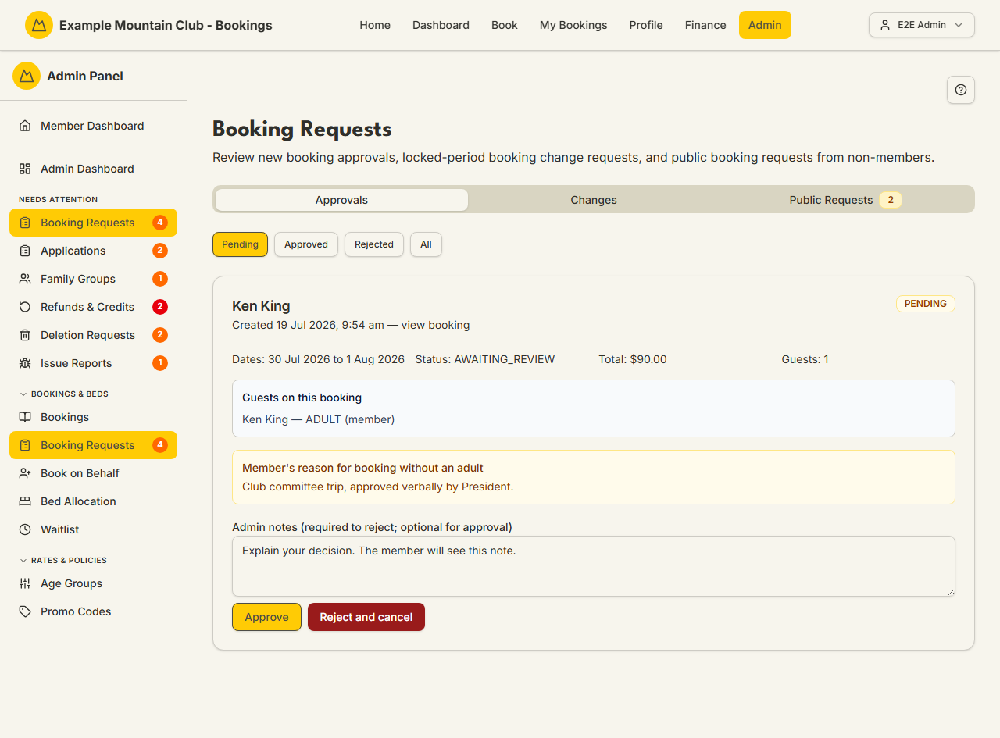
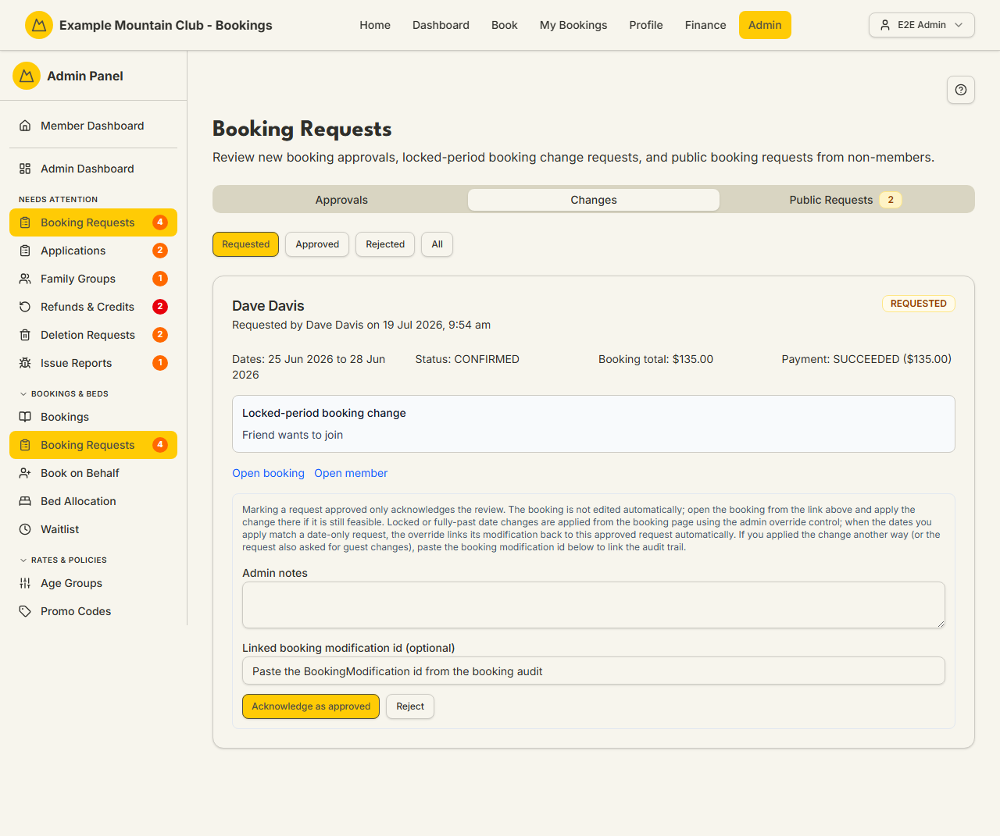
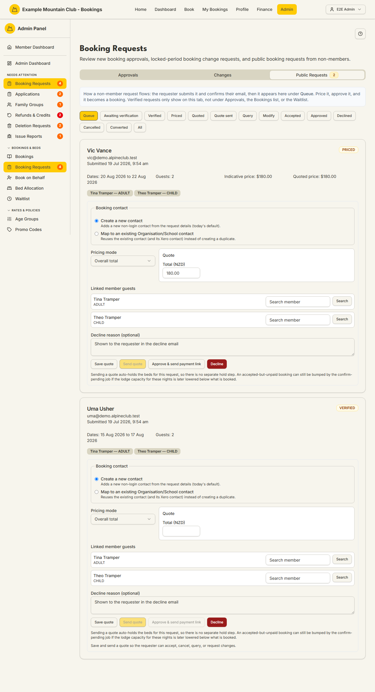

# Booking Requests

Audience: Operator

## What it is

A four-tab console for the requests that need an officer's decision before they
become (or change) a booking:

- **Approvals** — new bookings flagged for review (for example minors booked
  without an adult).
- **Changes** — change requests on bookings whose dates are locked (same-day or
  past nights).
- **Policy Exceptions** — members asking to be let past a booking rule (a
  minimum stay, or the requirement that an adult member hosts non-member
  guests). Unlike **Changes**, approving here *does the thing*: it creates the
  booking, or applies the change, in one step.
- **Public Requests** — booking enquiries from non-members and school groups,
  which you price, quote, and approve.

Find it at **Admin → Bookings & Beds → Booking Requests**
(`/admin/booking-requests`). When any of these queues has pending items it also
appears under **Admin → Needs Attention → Booking Requests**, and the badge
counts waiting policy exceptions alongside the other queues.

> The two older routes **`/admin/booking-approvals`** and
> **`/admin/booking-change-requests`** are redirects: they open this page on the
> **Approvals** and **Changes** tabs respectively. They have no separate screen,
> so they are documented here.

Money is integer cents (shown as dollars); dates are NZ date-only lodge nights.
Every approve/reject/decline flow asks whether to email the member, and records
your choice in the audit log — except on a booking that has **No emails**
switched on ([Bookings](bookings.md#turn-off-all-emails-for-one-booking)), where
nothing can be sent either way, so the dialog says so instead of asking. On a
silenced booking a **reject** emails the member nothing at all: the cancellation
notice that normally always goes out is withheld too, and the withheld messages
are listed on the booking for you to relay.

## When you'd use it

- A booking is held for review and a member is waiting to hear if it is
  approved.
- A member asks to change a booking whose dates are already locked.
- A non-member or school submits a request through the public form and you need
  to price it, send a quote, and turn it into a booking.

## Step-by-step

### Approvals — decide a flagged booking

1. Open **Booking Requests**; the **Approvals** tab is selected by default.
   Filter by **Pending**, **Approved**, **Rejected**, or **All**.

   

2. Each card shows the member, the dates, status, total, and guests, plus the
   member's reason for booking (for example "Club committee trip, approved
   verbally by President"). Use **view booking** to open the full booking.
3. In **Admin notes**, explain your decision (required to reject, optional to
   approve).
4. Click **Approve** or **Reject and cancel**. Choose whether to email the
   member in the dialog. A rejection always sends the member the standard
   cancellation notice.

### Changes — acknowledge a locked-period change request

1. Switch to the **Changes** tab. Filter by **Requested**, **Approved**,
   **Rejected**, or **All**.

   

2. Read the request summary and reason, then use **Open booking** to make the
   actual edit on the booking page — approving here only *acknowledges* the
   review; it does not change the booking automatically.
3. Write **Explanation for the member**. The member reads this verbatim on their
   own booking page, the field says so above the box, and neither decision can be
   sent until it is filled in — so write it for them rather than for the file.
   Anything you would not want them to read goes in **Internal note**, which is
   optional and never leaves the admin screens (#2562). Each card keeps its own
   draft: a note you start on one request is never submitted with another.
4. Optionally paste the **Linked booking modification id** from the booking's
   audit trail so the request and the change are linked, then click
   **Acknowledge as approved** or **Reject**.

### Public Requests — price, quote, and approve a non-member request

1. Switch to the **Public Requests** tab. A badge shows how many verified
   requests are waiting in the **Queue**. Filter by any request status (Queue,
   Awaiting verification, Verified, Priced, Quoted, Quote sent, and so on).

   

   (The screenshot predates the **Guest request form link** field described
   next, so that field is not in it; recapture is tracked in #2429.)

   At the top of the tab is **Guest request form link** with a **Copy** button.
   That is the URL of the guest request form (`/booking-requests`).

   **The form is unlisted until you decide otherwise.** Its page ships with an
   empty menu title, so out of the box nothing on your public site links to it
   and search engines are told to ignore it (`robots.txt` deliberately does
   *not* disallow it, so a crawler fetches the page and sees that instruction
   rather than merely listing the bare URL). On that default this field is how a
   guest gets to the form; the only other path in is the **Book these dates
   again** button on a tokenised payment link the club itself emailed a past
   requester, so it reaches nobody the club has not already dealt with. Send the
   link to a guest the club has agreed to host, and to nobody else. The field is
   available to view-only admins too, since sharing the link is not a booking
   write.

   **To advertise it instead**, open **Site Appearance & Content → Page
   Content**, edit the **Booking Requests** page, and give it a menu title. It
   then appears in your site menu and becomes indexable by search engines —
   those two follow the same field, so the menu and the search-engine
   instruction can never disagree. Clearing the menu title reverses both.

   Whether the club hosts non-members at all is the club's own policy either
   way; the public website never states or implies that a non-member can simply
   book (#2421), and the built-in help copy never names the form, because it is
   the same text for every club and cannot know which choice yours made.

2. Open a **Verified** request. Set the **Pricing mode** (Overall total or Per
   guest-night) and enter the price, then **Save quote** and **Send quote** to
   email the requester a quote link. In **Per guest-night** mode each age-group
   rate field is **pre-filled from your [Fees](fees.md)** for the season covering
   the check-in; edit any field before saving. The panel also shows **"Member of
   another Lodge :"** with the lodge the requester chose on the public form (or
   **No**). When they named another lodge, the fields pre-fill at your club's
   **Full-member** rate for each age group instead of the non-member rate (a
   reciprocal-membership courtesy), with the non-member rate shown underneath for
   reference. The pre-fill uses the check-in night's rate, so adjust it if a stay
   crosses a season boundary with different rates.
3. When the requester accepts (or for a priced general request), click
   **Approve & send payment link** (general) or **Approve & invoice school**
   (school groups) to convert it into a booking. Use **Decline** with an
   optional reason to turn it down.

#### Member whole-lodge requests

A signed-in member can ask to book the **whole lodge** for their party. These
requests appear in the same **Public Requests** queue with a **Member** and a
**Whole lodge requested** badge. Approving one holds the whole lodge for the
group. Before you approve you set:

- **Headcount to book and price** — confirm the real number with the member; the
  member's figure is only an estimate.
- **Total price override (optional)** — a manual total. It is required when no
  season covers the dates (there is no separate quote step on this path), and it
  always wins over every other pricing method.

If the covering season has a **flat whole-lodge night rate** set (see
[Fees](fees.md)), you also get a **How to price this whole-lodge booking**
choice on that one approval:

- **Price per guest** (the default) — each guest at the season rate, as usual.
- **Price as whole lodge** — the season's flat rate per night for the whole
  building, regardless of headcount. The panel shows the total; a stay that
  crosses a season boundary is charged each night at that night's season rate.

The choice is yours per approval — it is never automatic. A total price override
still overrides whichever method you pick. Then click **Approve & hold the whole
lodge**.

**If you link a guest row to a real member account** (#2309). A request's guest
list is free-text names, but you can attach a place to an actual member so it
prices at member rates. With the **Add another member as a guest** module on,
that link is now recorded and the member is told:

- Holding beds for the quote, and approving the request, both put a note against
  the guest row naming **you** as the officer who placed them, and email the
  member to say they are on a lodge booking created from a booking request. You
  cannot turn that email off; the booking's **No emails** switch is the only
  thing that withholds it, and a withheld send is listed on the booking's
  withheld-emails banner.
- **Nobody is asked first on this path**, whatever the club's ask-first setting
  says. A booking request is the club placing somebody, not a member asking a
  favour, so no bed is held pending an answer.
- **If you change who is on a place between the quote and the approval**, both
  people are told — the new person that they are on it, the person you replaced
  that they are not. That matters because the guest row keeps its identity so
  pre-assigned beds survive, which means a swap looks like an ordinary edit and
  would otherwise be silent.
- **These members cannot take themselves off.** A booking priced by hand refuses
  guest changes from a member's account, so the email tells them to contact the
  club and names the real remedies — you cancel the booking, or re-quote the
  request without them. Expect the call.

With the module off, none of this happens and a linked guest row behaves exactly
as it did before.

**After you approve: the party is still "Guest 1..N".** A member whole-lodge
request only asks for an approximate headcount, so the converted booking starts
with placeholder guests named `Guest 1`, `Guest 2` and so on — exactly as a
school booking starts with `School Child 1..N`. Left alone, those are the names
the chore list and arrival roster print at the lodge.

The club chases this automatically. Starting **Attendee first prompt** days
before check-in (the same **School Attendee Confirmation** timing on
[Booking Policies](booking-policies.md) that drives the school prompt), the
member is emailed a reminder asking them to name their party, repeated every
**reminder** days and escalating to once a day from two days out, with a last
reminder on the morning they travel. It stops the moment every guest is named. School bookings keep their
existing tokenized confirmation email and cadence, unchanged.

Any booking still carrying placeholders inside that window — school or
whole-lodge — is counted on [Stuck States](stuck-states.md) as **Bookings with
unnamed guests**, so you can see them coming. You or a Booking Officer can also
edit the names yourself from the booking; a rename keeps the same guest row, so
chore and bed assignments follow it, and it never changes anybody's age group or
the price.

**None of this blocks anything.** An unnamed party is chased and made visible,
never held up: the booking confirms, the roster generates, and the group checks
in exactly as normal whether or not the names ever arrive. A last-minute
substitution must never be stranded at the lodge over a name.

**The approved party goes on the bed board like any other booking.** Holding
beds for a quote and approving a request both put every guest onto
[Bed Allocation](bed-allocation.md) for each night of the stay, so the group is
listed as awaiting a bed and the auto-allocator will place them. Until
August 2026 they were not: a party that arrived through a booking request was
invisible on the board and uncounted on the dashboard's Bed Allocation card,
which an officer discovered when the bus turned up. Existing bookings were
repaired in the same release, so a request you approved months ago is on the
board now too. Nobody's total changed — the total the requester agreed is the
total they still owe, and where you set the price yourself the invoice is
unchanged to the cent. Each night now also records the rate it was charged at,
so a stay that crosses a rate change reads as what it really was.

One thing that follows from that is worth knowing before you use it. On a member
whole-lodge booking, linking a placeholder to a real member re-prices that person
at the member rate — and it used to re-price **everyone else on the booking** at
today's rates at the same time, quietly replacing the price you negotiated. It no
longer does: the rest of the party keeps their negotiated price, and only the
person you linked is re-rated.

### Policy Exceptions — allow a booking rule to be broken, once

A member who is stopped by a minimum-stay rule, or by the requirement that an
adult member hosts their non-member guests, can ask an officer instead of simply
being refused. Those asks land here.

1. Open **Booking Requests → Policy Exceptions**. The tab shows a count of
   everything waiting. Filter by **Requested** (default), **Approved**,
   **Rejected**, **Cancelled**, **Superseded**, or **All**.
2. Each card tells you: who asked and **how long ago**, what they proposed
   (dates, how many guests, and for a change, what they want changed), which
   rules it breaks — named, with the policy and version that was reviewed —
   which nights are affected, and what the member said in their own words.
3. The card also says whether the request is **holding beds** while it waits. A
   holding request has already reserved the beds it needs, so approving it
   cannot be beaten to them. A non-holding request has not, so the lodge can
   fill underneath it. **A request for a booking the member has not made yet
   never holds beds**, whatever the policy's capacity mode says — there is no
   booking for the reservation to hang off yet — so those cards always read *No
   beds held*.
4. Open **Show the guests** before you decide. Approving puts that exact party
   on the booking, and the card's guest count cannot tell you that one of them
   is a member from outside the requester's family (they still have to be asked,
   or the add is refused), or that the party is minors with no adult (which still
   goes to a child-safety review, and still blocks check-in until somebody
   clears it). If the list will not load, do not approve — try again.
5. Click **Decide this request**. There are **two note fields**, and each one says
   plainly who reads it before you submit anything:
   - **Explanation for the member.** The member sees this — on their own request
     list, and in the email an approval sends. Write it for them.
   - **Internal note (optional).** Only admins see this. It is never shown to the
     member, never emailed to them, and never sent to any member-facing screen, so
     it is where a judgement about the member or a note for the next officer
     belongs. The audit log records *that* you left one, never its text.

   Then tick the confirmation and click **Approve and apply** or **Refuse**.
   - An **Explanation for the member** is **required** to refuse and to approve an
     adult-member hosting exception (that one is recorded on the booking with your
     name on it). An internal note is never a substitute: refusing without a
     member-facing explanation is rejected, because a refusal the member cannot
     read is a refusal they cannot act on.
   - After a decision, both notes stay on the card, separately labelled, so an
     officer reading a colleague's decision can see which half the member has
     already read.
   - For a change, the form also asks where a **refund** goes — card or account
     credit — if the change reduces the price of a booking that has already been
     paid. Leave it on *Not needed* when the price does not drop; if a choice
     turns out to be needed, the approval says so and you pick one and approve
     again.
   - Approving applies the exact proposal on the card. It overrides only the
     rules listed there — capacity, payment, membership and privacy rules all
     still apply.
6. If the lodge has filled since the member asked, the approval does not go
   through and you are told the request **stays pending**. Nothing was created.
   The queue refreshes itself, so you can approve it again as soon as space frees
   up, or refuse it with a reason.

Two things worth knowing:

- **Approving is not a rubber stamp.** Unlike the **Changes** tab, there is no
  second step: the booking is created, or the change applied, as part of
  approving. If it could not be done, the request stays exactly as it was.
- **Check-in is still gated by any pending review.** Approving a policy
  exception does not clear an unrelated admin review, and a booking with one
  still cannot check in until that review is cleared. This includes a review your
  own approval opens: if the approved party is minors with no adult, that
  child-safety review is left for a human to decide — approving a minimum-stay
  exception is not a decision about supervision, and you were never asked to make
  one.
- **An approved new booking emails the member** what was approved and what is
  left to pay, because they are not standing in the payment screen the way an
  ordinary booker is. An approved change is announced by the usual "your booking
  was changed" email.
- **A refusal emails the member too**, carrying your member-facing explanation
  verbatim, the nights it was about, and the fact that nothing was booked and any
  beds the request held have been released. That is the whole reason the
  explanation is mandatory, so write it for the member rather than for the file. A
  refusal about an existing booking is withheld by that booking's "No emails"
  switch like every other message about it. A kept-pending capacity conflict sends
  nothing: the request is still open, the member cannot act on it, and their own
  request list already says the lodge was full.
- **The member raises and manages these themselves** (#2562). They ask from the
  booking wizard or the edit screen, and they track, withdraw and replace their
  requests under **My booking-rule requests** on their own My Bookings page — so a
  proposal that looks wrong is theirs to correct, and you do not have to raise or
  amend one on the phone. When a member uses **Replace**, the old request closes as
  *Superseded* and a new one starts, which is why a card can vanish from
  **Requested** and reappear under **Superseded**.
- **One member can have several open requests, and the queue is not duplicating
  them.** The enforced cap is one open request per *identical* proposal for new
  bookings (`nbpe:<member>:<proposalHash>`) and one per *booking* for changes
  (`pe:<booking>:<member>`) — so a member who asks about two different weekends,
  without using **Replace**, holds two live requests you can approve
  independently. Approving both creates both. Read the proposal on each card
  before you decide, and if the two look like the same intent expressed twice, ask
  the member which one they want before approving either. What they
  see is documented in
  [Booking a stay](../user-guide/booking-a-stay.md#asking-to-be-let-past-a-booking-rule).

## Settings reference

This is a work queue. The controls per tab:

Each tab keeps **Reset** visible beside its status choices. Reset restores that
tab's default queue, while preserving the tab itself, any focused booking or
request id, and unrelated URL context. A focused Approvals or Changes record
therefore keeps its **All** context rather than disappearing from view.

| Tab | Filters | Key actions |
| --- | --- | --- |
| Approvals | Pending (default), Approved, Rejected, All | Approve; Reject and cancel (Admin notes required to reject) |
| Changes | Requested (default), Approved, Rejected, All | Acknowledge as approved; Reject (both need the member-facing explanation); optional internal note the member never sees; optional linked modification id |
| Policy Exceptions | Requested (default), Approved, Rejected, Cancelled, Superseded, All | Approve and apply (confirmation required; member-facing explanation required for an adult-member hosting override); Refuse (member-facing explanation required). Both actions also take an optional internal note the member never sees |
| Public Requests | Queue (default), Awaiting verification, Verified, Priced, Quoted, Quote sent, Query, Modify, Accepted, Approved, Declined, Cancelled, Converted, All | Save quote; Send quote; Approve & send payment link / Approve & invoice school; Decline; Hold slots (school) |

Notes and constraints:

- Prices are entered in dollars and stored as integer cents; dates are NZ
  date-only nights.
- School group requests add per-tier guest counts and a soft group-size cap
  that warns you to confirm a club member is staying with the group.
- Verified public requests only appear on this tab — never under Approvals, the
  Bookings list, or the Waitlist.
- If any of a request's saved details cannot be read back (an old or imported
  row with a missing surname, say), the request still appears in the list —
  including under **All** — under a **Saved details need attention** note. One
  unreadable row never hides the rest of the queue. The note names only what
  actually failed: the guest list (names and age groups are then shown as they
  were saved, so treat them as a rough record), the member links (none are
  shown), or the saved quote (its options and totals are not shown). On a
  request that is still open, Save quote, Send quote, Hold slots and Approve
  are turned off, and the server refuses all four plus pricing even if
  something calls them directly, so it cannot become a booking. There is no
  screen for repairing the saved data: check what the group wants with the
  requester, then **Decline** the request so they can submit again, or ask
  support to repair the stored row. On an already-converted or finalised
  request nothing is blocked — the note is there so you know the details it
  shows are not confirmed (#2342).
- If your admin role is view-only for bookings, a notice explains you can view
  but not approve, reject, price, hold, or convert requests.

## Troubleshooting

| Symptom | Likely cause | Fix |
| --- | --- | --- |
| Reject is blocked | You left **Admin notes** empty (Approvals), or **Explanation for the member** empty (Changes, where it blocks both decisions) | Add the explanation for the member, then decide |
| A change I "approved" did not change the booking | Approving here only acknowledges the review | Open the booking and apply the change on the booking page |
| A new public request is not on the Approvals tab | Public requests live only on the Public Requests tab | Switch to **Public Requests** and check the **Queue** filter |
| Approve fails with a capacity message | The lodge is full for one or more nights | The dialog lists the full dates; free capacity or adjust the request |
| Approving a policy exception says the request "stays pending" | The lodge filled up between the member asking and you deciding | Nothing was created. The queue has already refreshed, so approve it again once beds free up, or refuse it with a reason |
| Approving a policy exception asks you where a refund should go | The change reduces the price of a booking that is already paid, so the money has to go somewhere | Pick **Refund to the card** or **Account credit** on the decision form, then approve again |
| Approving a policy exception says it was approved "but some follow-up work failed" | The booking really was created or changed — a later step (an email, an accounting hand-off, an audit write) did not finish | The request is APPROVED and the booking is real. Do NOT approve again. Check the booking, and tell the member yourself if they did not get the email |
| Approving a policy exception says the request changed while you were reviewing it | Someone else decided it, or the member withdrew or replaced it, since your screen loaded | Reload the queue and look at it again |
| Approving a policy exception says it can no longer be applied as it was reviewed | What would be applied is not what the officer reviewed. Usually the live booking was edited after the member asked — but a corrected date reading can also replay the same request differently, and the system cannot tell those apart, so it no longer guesses | Nothing was changed. Ask the member to submit the request again against the booking as it is now, then review that |
| Approving a policy exception says the request predates the current approval format | An old request stored before this workflow shipped, so there is nothing to replay — nothing about the booking has changed | Ask the member to submit the request again; it will then approve normally |
| Approving a policy exception refuses a guest | The party names a member from outside the requester's family, or one who cannot be booked yet | Nothing was created. Tell the requester to drop that guest or to add them from their own booking so consent can be asked |
| Approving a policy exception says the exceptions it needs are not the ones reviewed | What you would be overriding is not what was reviewed. Usually a rule was edited after the member asked, but the nights a rule trips on can also be re-derived, so the message no longer names a cause it cannot prove | Nothing was changed. Ask the member to submit again; you will then see the current situation |
| Approve is greyed out on a policy exception | You have not ticked the confirmation, or an adult-member hosting override needs a written reason | Write the reason and tick the confirmation |
| Cannot price/approve anything | Your role is view-only for bookings | Ask a full admin for bookings edit access |
| A request says **Saved details need attention** and its buttons are greyed out | Some of its saved data could not be read back, so it cannot be quoted, priced, held, or approved | Confirm what the group wants with the requester, then **Decline** so they can submit again — or ask support to repair the stored row. There is no guest-edit screen |

## Related links

- Back to the [documentation hub](../README.md).
- Sibling guides: [Bookings](bookings.md), [Book on Behalf](book.md),
  [Booking Policies](booking-policies.md), [Payments](payments.md).
- Reference: the
  [booking lifecycle](../STATE_MACHINES.md#booking-lifecycle), the
  [booking modification lifecycle](../STATE_MACHINES.md#booking-modification-lifecycle),
  and the
  [public booking request quote lifecycle](../STATE_MACHINES.md#public-booking-request-quote-lifecycle).
