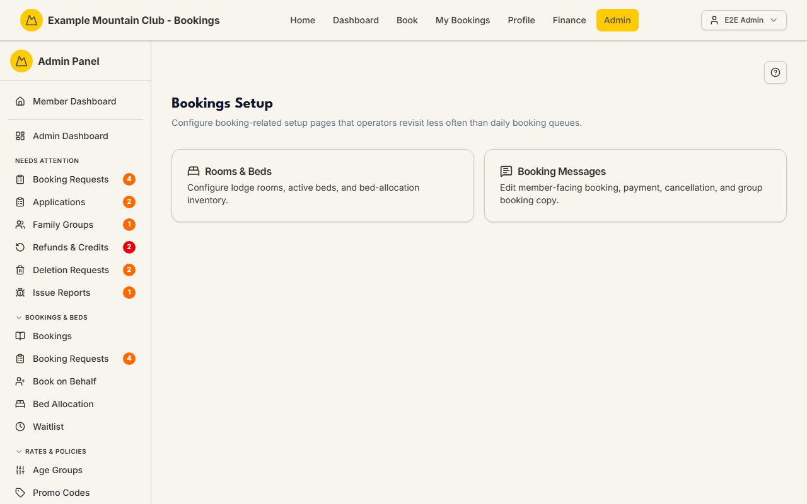

# Bookings Setup

Audience: Operator

## What it is

A small hub that gathers the booking-related setup pages you revisit less often
than the daily booking queues. It links to two places: **Rooms & Beds** (the bed
inventory) and **Booking Messages** (member-facing booking copy). Find it at
**Admin → Setup & Configuration → Bookings Setup** (`/admin/bookings-setup`).

Which cards you see depends on your permissions and the active modules — the
Rooms & Beds card follows the `bedAllocation` module.

## When you'd use it

- You are setting up (or adjusting) the lodge's rooms and beds.
- You want to edit the wording members see during booking and payment.
- You are looking for the less-frequent booking configuration pages in one
  place.

## Step-by-step

### Open the hub and pick a card

1. Go to **Admin → Setup & Configuration → Bookings Setup**.

   

2. Choose a card:
   - **Rooms & Beds** (`/admin/rooms-beds`) — configure lodge rooms, active
     beds, and the bed-allocation inventory. (When the `bedAllocation` module is
     on, a lodge's capacity is its active bed count.)
   - **Booking Messages** (`/admin/booking-messages`) — edit the member-facing
     booking, payment, cancellation, and group-booking copy. See the
     [Booking Messages](booking-messages.md) guide.

## Settings reference

This page is a launcher, not a settings screen.

| Card | Goes to | What it configures | Gating |
| --- | --- | --- | --- |
| Rooms & Beds | `/admin/rooms-beds` | Lodge rooms, active beds, bed-allocation inventory | Follows the `bedAllocation` module |
| Booking Messages | `/admin/booking-messages` | Member-facing booking/payment/cancellation/group copy | Support permission area |

If no cards are available, the page shows "No setup pages are available for your
current permissions."

## Troubleshooting

| Symptom | Likely cause | Fix |
| --- | --- | --- |
| "No setup pages are available for your current permissions" | Your role lacks access to both linked pages | Ask a full admin for the relevant access |
| The Rooms & Beds card is missing | The `bedAllocation` module is off | Enable it under **Admin → Setup → Modules** — see [`CONFIGURATION.md`](../../CONFIGURATION.md#module-controls-and-admin-modules) |

## Related links

- Back to the [documentation hub](../README.md).
- Sibling guides: [Booking Messages](booking-messages.md),
  [Bed Allocation](bed-allocation.md), [Bookings](bookings.md).
- Reference: [lodge settings](../../CONFIGURATION.md#lodge-settings) and the
  [capacity model](../CAPACITY_MODEL.md#two-distinct-quantities).
