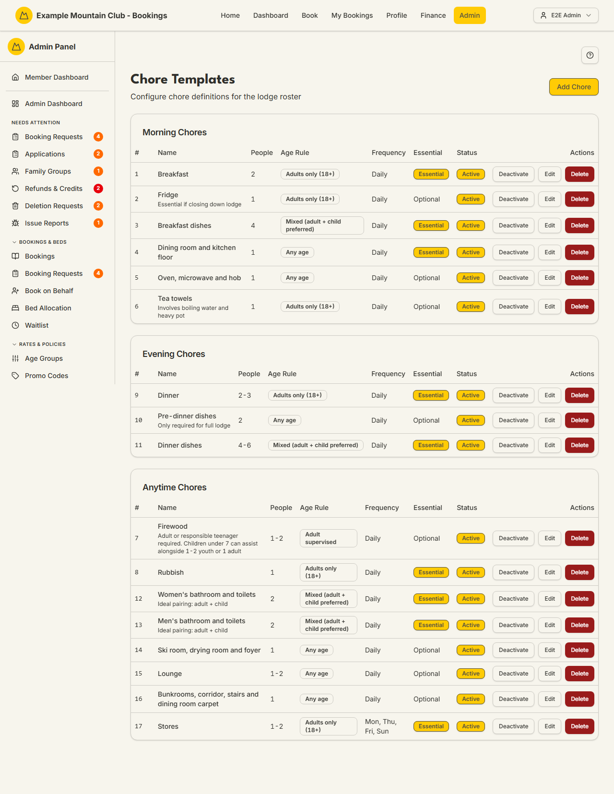

# Chore Templates

Audience: Operator

## What it is

The library of chore definitions a lodge rosters from: breakfast dishes, firewood,
bathrooms, and the like, each with how many people it needs, an age rule, when in
the day it happens, and how often. These templates are what the daily
[Chore Roster](roster.md) auto-suggests assignments from. Find it at
**Admin → Setup & Configuration → Lodges →** a lodge **→ Chores**
(`/admin/chores`). It has **no direct sidebar entry** — chores are lodge-scoped
(ADR-005), so you open it from the **lodge configuration hub**'s **Chores** card,
which opens it already filtered to that lodge.

Chore templates are a **lodge** permission area: lodge view to read, lodge
**edit** to add, change, or delete. The page appears only when the `chores`
module is on.

## When you'd use it

- You are setting up a lodge's chore list for the first time.
- A chore changed — it now needs two people, is adults-only, or only runs on
  certain days.
- You want to retire a chore for the season without deleting its history.

## Step-by-step

### Review the chore library

1. Open the page (from the lodge hub's **Chores** card, or `/admin/chores`).
   Chores are grouped by time of day — **Morning**, **Evening**, and **Anytime**
   — with each chore's people count, age rule, frequency, whether it is essential,
   and its active status.

   

2. If the club runs more than one lodge, use the lodge selector to switch which
   lodge's chores you see.

### Add or edit a chore

1. Click **Add Chore** (or **Edit** on a row) to open the form.
2. Set the **Chore Name** and **Sort Order**, an optional **Description**, the
   **Min/Max People** and **Minimum Age**, the **Age Restriction**, an optional
   **Conditional Note** (e.g. "Only required for full lodge"), the **Time of Day**,
   and the **Frequency**.
3. For **Every X days** frequency, set the interval; for **Specific days of week**,
   tick the days. Tick **Essential (always rostered)** for chores that must appear
   every day, and **Active** to keep it in the library.
4. Click **Create Chore** / **Update Chore**.

### Deactivate or delete

1. Use **Deactivate**/**Activate** on a row to toggle whether a chore is rostered,
   or **Delete** to remove it (you will be asked to confirm).

## Settings reference

| Field | What it controls | Default | Notes / constraints |
| --- | --- | --- | --- |
| Chore Name | The chore's display name | — | Required |
| Sort Order | Order within its time-of-day group | next in list | Integer |
| Description | What the chore involves | — | Optional; shown on the roster |
| Min People / Max People | Recommended people for the chore | 1 / 2 | Integers ≥ 1; shown as a range on the roster |
| Minimum Age | Youngest guest who may be assigned | 0 | Integer years |
| Age Restriction | Any age · Adults only (18+) · Mixed (adult + child preferred) · Adult supervised | Any age | Drives who the roster auto-suggests |
| Conditional Note | A note about when the chore applies | — | Optional; free text |
| Time of Day | Morning · Evening · Anytime | Anytime | Groups the chore on this page and the roster |
| Frequency | Daily · Every X days · Specific days of week | Daily | "Every X days" needs an interval; "Specific days" needs the ticked days |
| Essential | Whether the chore is always rostered | off | Essential chores appear every day regardless of occupancy |
| Active | Whether the chore is in the library | on | Inactive chores are dimmed and not rostered |
| Lodge selector | Which lodge's chores are shown | first/only lodge | Only shown with more than one active lodge; a chore's lodge is fixed at creation |

## Troubleshooting

| Symptom | Likely cause | Fix |
| --- | --- | --- |
| I can't find Chores in the sidebar | It has no direct sidebar entry (lodge-scoped) | Open **Lodges → [a lodge] → Chores**, or go to `/admin/chores` |
| Everything is read-only ("… can view chore templates but cannot change them") | Your admin role has lodge view but not edit | Ask a full admin for **lodge edit** access |
| The page 404s / Chores card is missing | The `chores` module is off | Enable it under **Admin → Setup → Modules** — see [`CONFIGURATION.md`](../../CONFIGURATION.md#module-controls-and-admin-modules) |
| "No chore templates configured yet" | This lodge has no chores | Click **Add Chore** to create the first one |
| A chore never appears on the roster | It is inactive, or its age/day rules exclude the staying guests | Check **Active**, the age restriction, and the frequency days against who is staying |

## Related links

- Back to the [documentation hub](../README.md).
- Sibling guides: [Chore Roster](roster.md), [Hut Leaders](hut-leaders.md),
  [Rooms & Beds](rooms-beds.md), [Lodges](lodges.md).
- Reference: the roster/chores model in
  [Admin and Lodge](../ARCHITECTURE.md#admin-and-lodge).
