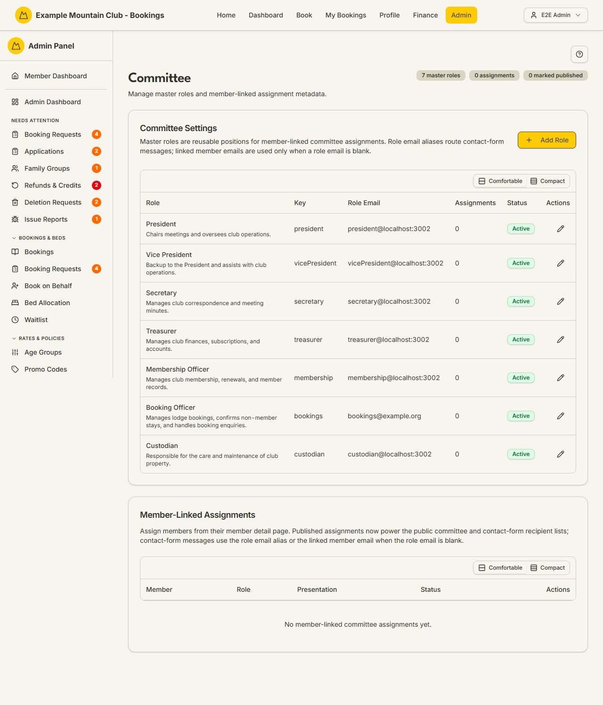

# Committee

Audience: Operator

## What it is

Where you manage the club's **committee master roles** (reusable positions such as
President, Secretary, or Booking Officer, each with an optional role email alias)
and the presentation of the **member-linked assignments** that power the public
committee page and contact-form routing. Find it at **Admin → Setup &
Configuration → Committee** (`/admin/committee`).

Committee assignment is **public/contact metadata only** — it never grants admin,
lodge, booking, finance, or subscription privileges. It is a **membership**
permission area: membership view to read, membership **edit** to change. You
create the member↔role links on each member's detail page; this page manages the
roles themselves and each assignment's presentation.

## When you'd use it

- You are setting up the committee positions your club uses.
- A role's contact email alias needs adding or changing.
- You want to publish (or hide) a committee assignment on the public site, or
  control whether it is contactable or shows a phone number.

## Step-by-step

### Manage master roles

1. Go to **Admin → Setup & Configuration → Committee**. The **Committee Settings**
   table lists each master role with its key, role email, assignment count, and
   status.

   

2. Click **Add Role** (or the edit pencil on a row) and set the **Role Name**,
   **Sort Order**, **Role Email** (the alias committee contact-form messages are
   delivered to), **Description**, and **Active**. Click **Save Role**.

### Manage assignment presentation

1. In **Member-Linked Assignments**, click the edit pencil on an assignment to set
   its **Blurb**, **Sort Order**, and the **Published**, **Show phone**,
   **Contactable**, and **Active** flags, then **Save Assignment**.
2. Only **published, active** assignments whose master role is also active appear
   on the public committee page and are eligible for contact routing. Member email
   addresses are never exposed to the browser — contact messages are delivered
   server-side to the assignment's chosen **Contact email**: the committee role's
   email alias (the default), the member's own email, or a custom address. The
   choice is made per assignment on the member's detail page (Committee card)
   when the assignment is contactable; if the chosen address is blank or
   missing, delivery falls back to the role alias and then the member's email,
   so contact mail is never lost.

> Assignments are **created** from a member's detail page (Committee card), not
> here. This page edits the roles and the presentation of existing assignments.

## Settings reference

| Field | What it controls | Default | Notes / constraints |
| --- | --- | --- | --- |
| Role Name | The master role's display name | — | Required |
| Sort Order | Order of roles / assignments | next available | Integer, `min 0` |
| Role Email | The alias committee contact messages are delivered to | — | Optional; falls back to the linked member's email when blank |
| Description (role) | Internal role description | — | Max 1000 chars |
| Active (role) | Whether the role is live | on | Archived roles hide their assignments publicly |
| Blurb (assignment) | The public blurb for this assignment | — | Max 1000 chars |
| Published | Whether the assignment shows publicly | off | Public list needs published + active + active role |
| Show phone | Whether the linked member's phone shows | off | Phone comes from the member profile |
| Contactable | Whether the assignment can receive contact messages | off | Routes to the assignment's **Contact email** choice (role alias by default) |
| Contact email (member detail page) | Where a contactable assignment's messages deliver | Committee role email | Role email alias, the member's own email, or a custom address; a missing address falls back to the role alias, then the member's email |
| Active (assignment) | Whether the assignment is live | off | — |

## Troubleshooting

| Symptom | Likely cause | Fix |
| --- | --- | --- |
| Everything is read-only ("… can view committee roles and assignments but cannot change them") | Your admin role has membership view but not edit | Ask a full admin for membership edit access |
| I can't add an assignment here | Assignments are created on the member's detail page | Open the member in [Members](members.md) and use the Committee card |
| A committee member isn't on the public page | The assignment or its role is not published/active | Set the assignment **Published** and **Active**, and make sure the master role is **Active** |
| Contact-form messages go to the wrong address | The role email alias is blank or wrong, or the assignment's **Contact email** choice points elsewhere | Check the assignment's **Contact email** on the member's detail page and set the role's **Role Email**; a missing address falls back to the role alias, then the member's email |

## Related links

- Back to the [documentation hub](../README.md).
- Sibling guides: [Members](members.md), [Family Groups](family-groups.md).
- Reference: the
  [committee assignment lifecycle](../STATE_MACHINES.md#committee-assignment-lifecycle),
  the [Committee Settings](../../CONFIGURATION.md#committee-settings) reference,
  and the [Admin and Lodge](../ARCHITECTURE.md#admin-and-lodge) architecture.
