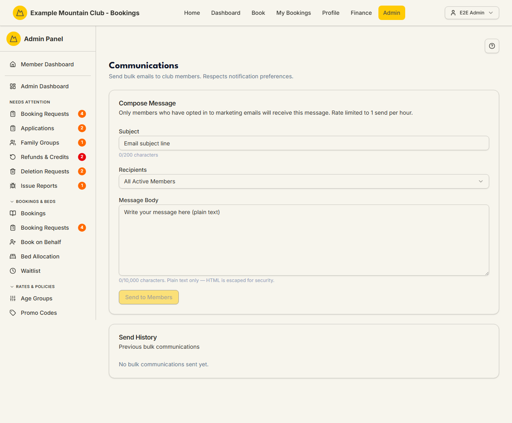

# Communications

Audience: Operator

## What it is

A one-off bulk email tool: write a plain-text message, pick a recipient group,
and send it to members — with a send history of what went out before. It
respects members' notification preferences, so only those who opted in to
marketing email actually receive it. Find it at **Admin → Members → Communications**
(`/admin/communications`).

Communications is gated by the **Communications** module (Admin → Modules),
which is on by default — if the sidebar entry is missing, that module is off.
Sending is a **membership**-area edit action: a view-only membership admin sees
the page but the **Send to Members** button is disabled.

## When you'd use it

- You want to email active members about an event, closure, or club notice.
- You need to reach admins only (or members only) with a quick announcement.
- You want to confirm what bulk emails have already been sent, and to how many
  recipients.

## Step-by-step

### Compose and send a bulk email

1. Open **Communications**. Fill in the **Compose Message** card.

   

2. Enter a **Subject** (up to 200 characters) and choose **Recipients** — *All
   Active Members*, *Members Only*, or *Admins Only*.
3. Write the **Message Body** (plain text, up to 10,000 characters — any HTML is
   escaped for security).
4. Click **Send to Members**. Only members who opted in to marketing email
   receive it; the confirmation reports how many were sent and how many were
   filtered out by preference. Sending is **rate limited** (by default one send
   per hour).

## Settings reference

| Field | What it controls | Default | Notes / constraints |
| --- | --- | --- | --- |
| Subject | The email subject line | empty | Required; max 200 characters |
| Recipients | The audience group | All Active Members | *All Active Members*, *Members Only*, or *Admins Only* |
| Message Body | The plain-text body | empty | Required; max 10,000 characters; HTML is escaped |
| Send to Members | Sends the message | — | Requires membership **edit**; only marketing-opted-in members receive it; rate limited (default 1/hour) |

The **Send History** table lists each past send: date, subject, recipient
filter, total recipients matched, and how many were actually sent (eligible
after preference filtering).

## Troubleshooting

| Symptom | Likely cause | Fix |
| --- | --- | --- |
| No **Communications** entry in the sidebar | The Communications module is off | Turn it on in [Modules](modules.md) |
| **Send to Members** is disabled | Your role has membership view, not edit (or subject/body is empty) | Fill both fields; ask a full admin for membership edit access |
| Far fewer recipients than expected | Only members who opted in to marketing email receive it | Expected — the count shows how many were filtered by preference |
| Send rejected as rate limited | You already sent within the hour window | Wait for the window to clear (default one send per hour) |
| A member says the formatting was lost | The body is plain text; HTML is escaped | Send plain text; use [Email Messages](email-messages.md) for templated system email |

## Related links

- Back to the [documentation hub](../README.md).
- Sibling comms guides: [Notifications & Email](notifications.md),
  [Email Messages](email-messages.md),
  [Email Deliverability](email-deliverability.md).
- Reference: member records and marketing opt-in in [Members](members.md); the
  module toggle in [Modules](modules.md).
