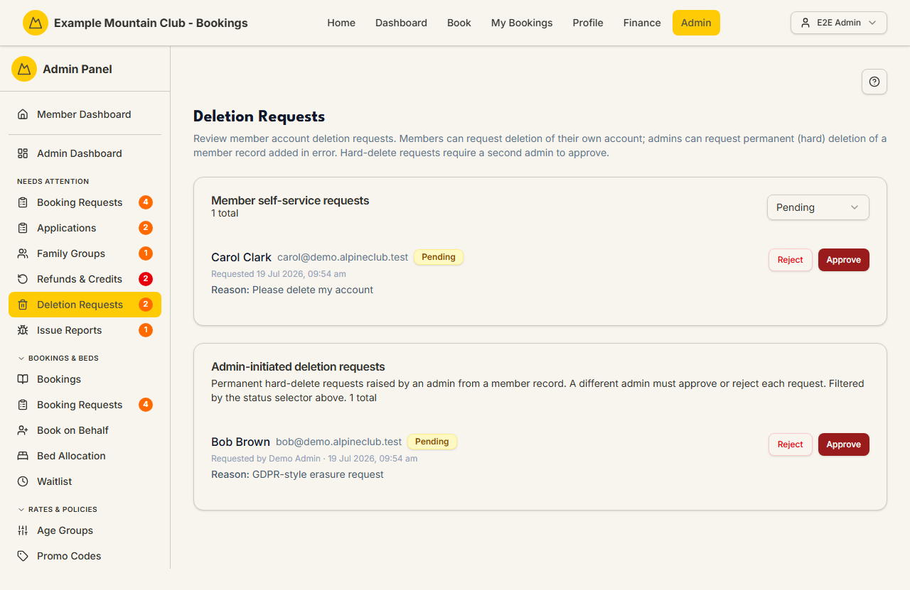

# Deletion Requests

Audience: Operator

## What it is

One review page for two kinds of member deletion. **Member self-service
requests** are members asking for their own account to be deleted (approving
anonymises the account, cancels their future bookings, and deactivates their
login). **Admin-initiated deletion requests** are an admin asking to permanently
hard-delete a member record that was added in error — these enforce a
two-admin rule, so a *different* admin must approve or reject. Find it at **Admin
→ Monitoring & Support → Deletion Requests** (`/admin/deletion-requests`). It
also appears under **Needs Attention** while requests are pending.

Deletion requests are a **membership** permission area: you need membership view
to read the queues and membership **edit** to approve or reject.

## When you'd use it

- A member has asked (through their profile) to delete their account and you need
  to review it.
- A member record was created in error (a typo duplicate with no meaningful
  history) and an admin has raised a permanent hard-delete for a second admin to
  approve.
- You are auditing what has been approved or rejected.

## Step-by-step

### Review the two queues

1. Go to **Admin → Monitoring & Support → Deletion Requests**. The page shows
   **Member self-service requests** and **Admin-initiated deletion requests**,
   sharing one status selector (**Pending**, **Approved**, **Rejected**, **All**).

   

### Approve or reject a self-service request

1. On a **Pending** self-service request, click **Approve** or **Reject**.
2. **Approve** opens a dialog warning that the account will be permanently
   anonymised, future bookings cancelled, and login deactivated. Add an optional
   internal note and click **Approve & Delete Account**. An approval receipt is
   emailed to the member.
3. **Reject** lets you choose **Reject without emailing** or **Reject and email
   member** (with an optional reason sent to the member). If the member has no
   email on file, it is a single **Reject Request** with no notification.

### Approve or reject an admin-initiated hard-delete

1. On a **Pending** admin-initiated request, click **Approve** or **Reject**. If
   *you* raised the request, both buttons are disabled with "A different admin
   must review this request" — this is the two-admin rule, enforced on the server
   as well (a self-review is refused with a 403).
2. **Approve & Delete Record** permanently deletes the member record (eligibility
   is re-checked at approval). **Reject Request** leaves the record unchanged. You
   can add an internal review note either way.

## Settings reference

This is a review-only page — there are no persistent settings, only per-review
inputs.

| Control | What it does | Notes / constraints |
| --- | --- | --- |
| Status selector | Pending / Approved / Rejected / All | Applies to both queues; resets to page 1 |
| Note / reason | Internal note or member-facing rejection reason | Optional |
| Notify choice (self-service reject) | Whether the member is emailed the rejection | Recorded either way; hidden when no email on file |
| Approve & Delete Account | Anonymises the member, cancels future bookings, deactivates login | Cannot be undone; blocked if future **paid** bookings exist |
| Approve & Delete Record | Permanently hard-deletes an in-error member record | Two-admin rule; a different admin must approve |

## Troubleshooting

| Symptom | Likely cause | Fix |
| --- | --- | --- |
| Everything is read-only ("… can view … but cannot approve or reject them") | Your admin role has membership view but not edit | Ask a full admin for membership edit access |
| Approve/Reject disabled on an admin-initiated request | You raised it — the two-admin rule needs a different reviewer | Ask another admin to review it |
| "Account deletion cannot be approved while this member has future paid bookings" | The member has future paid stays | Cancel or refund the paid bookings first, then approve |
| "This request has already been reviewed." | Another admin actioned it first | Refresh; the status selector shows the outcome |
| A privileged member can't be deleted by me | Deleting a member with a privileged access role needs a full admin | Ask a full admin to review it |

## Related links

- Back to the [documentation hub](../README.md).
- Sibling guides: [Members](members.md),
  [Cancellation Requests](membership-cancellations.md).
- Reference: the
  [membership cancellation, archive, and delete lifecycle](../STATE_MACHINES.md#membership-cancellation-archive-and-delete-lifecycle),
  the [Member Deletion Requests page](../../CONFIGURATION.md#member-deletion-requests-page)
  in `CONFIGURATION.md`, and the
  [membership lifecycle](../DOMAIN_INVARIANTS.md#membership-lifecycle) and
  [analytics and privacy](../DOMAIN_INVARIANTS.md#analytics-and-privacy)
  invariants.
