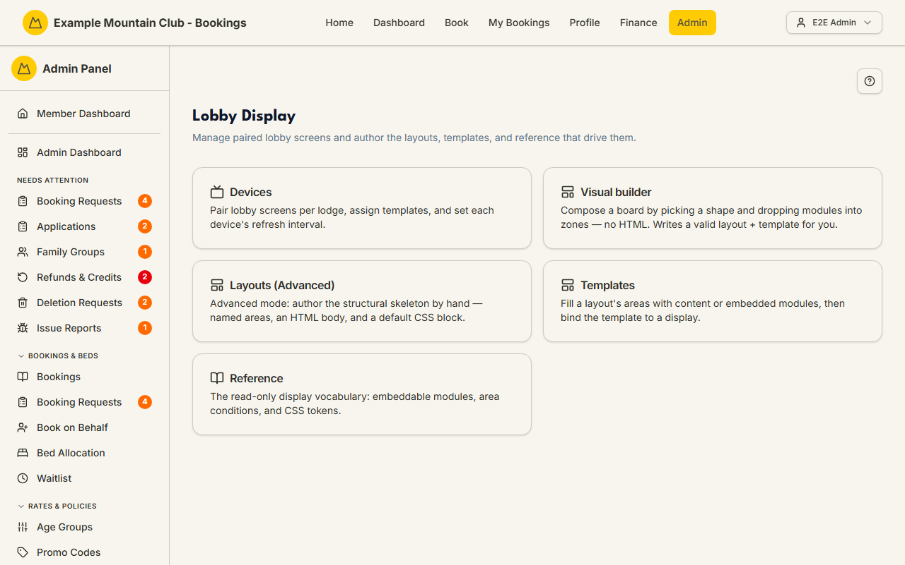
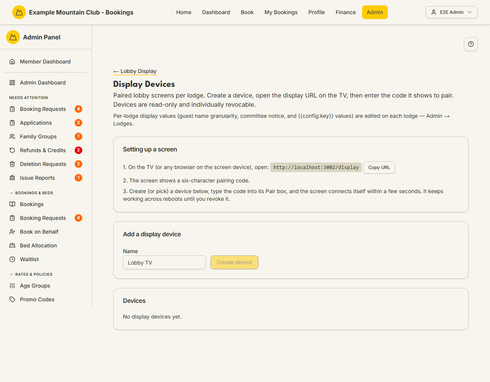
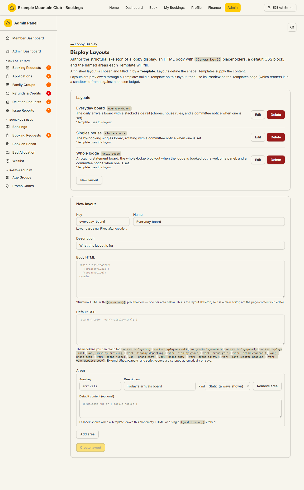
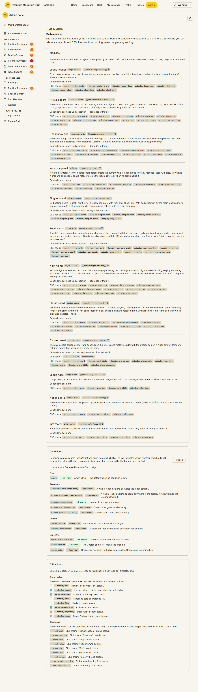
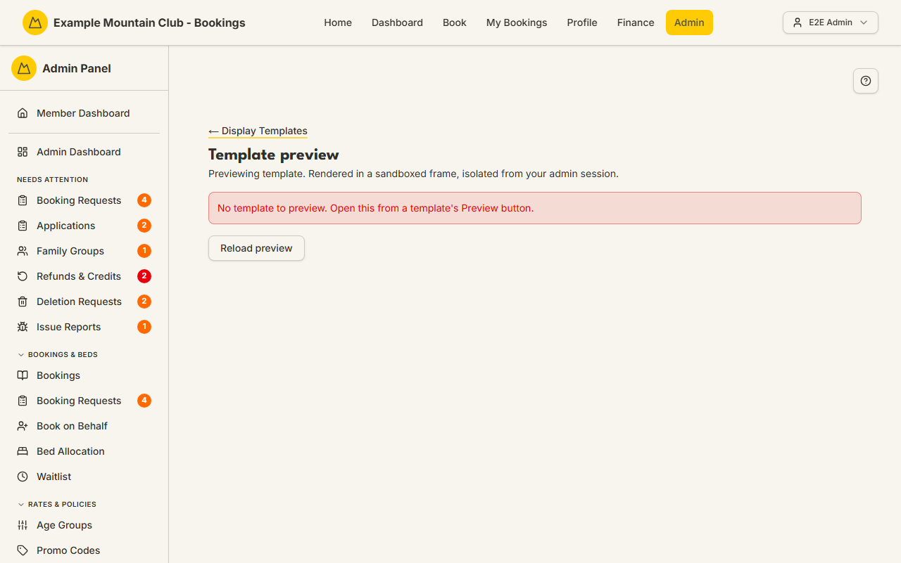

# Lobby Display

Audience: Operator

## What it is

The admin area behind the club's **lobby TV display** — a live, self-updating
noticeboard you hang on the lodge wall that shows arrivals, departures, who's in
which room, today's chores, and arrival information, all driven by data the system
already holds. This hub is where you pair screens, author what they show, and look
up the display vocabulary. Find it at **Admin → Lobby Display** (`/admin/display`).

The whole area is gated by the **`lobbyDisplay`** module, which is **off by
default**. The **Lobby Display** sidebar entry and every page below it appear only
once the module is enabled (**Admin → Setup → Modules**); until then the routes
return 404. This guide documents what ships on `main`: the hub and its five cards
— **Devices**, **Visual builder**, **Layouts (Advanced)**, **Templates**, and
**Reference** — plus the template **preview**. The lobby
display complements the interactive [Lodge Kiosk](lodge.md): the kiosk is a tablet
someone taps; the lobby display is a read-only screen the whole room reads at a
glance. For the deeper design and operating detail, see the
[Lobby Display feature hub](../lobby-display/README.md) and its
[operating guide](../lobby-display/operating.md) rather than duplicating them here.

## When you'd use it

- You are hanging a new TV in the lodge lobby and need to pair it.
- You want to change what a screen shows — its board layout, content, or footer.
- A screen is showing the wrong lodge, a stale board, or the pairing screen, and
  you need to fix or revoke it.

## Step-by-step

### 1. Turn on the module and open the hub

1. Enable **Lobby TV display** under **Admin → Setup → Modules** (it is off by
   default). The **Lobby Display** entry then appears in the sidebar.
2. Open **Admin → Lobby Display**. The hub cards through to **Devices**, the
   **Visual builder**, **Layouts (Advanced)**, **Templates**, and **Reference**.
   Most operators want the **Visual builder** — it composes a board without HTML
   (see below); the Layouts/Templates cards are the advanced, hand-authored path.

   

### 2. Pair a screen (Devices)

1. Open the **Devices** card. It pairs lobby screens per lodge, assigns each a
   template, and sets each device's refresh interval; devices are read-only and
   individually revocable.

   

2. On the TV (or any browser on the screen device), open the club's `…/display`
   URL. The screen shows a **six-character pairing code**.
3. Create (or pick) a device below, type the code into its **Pair** box, and the
   screen connects itself within a few seconds. It keeps working across reboots
   until you **revoke** it. Per-lodge display values (guest-name granularity, the
   committee notice, and `{{config:key}}` values) are edited on each lodge under
   **Admin → Lodges → [a lodge] → display**, not here.

### 3. Compose a board without HTML (Visual builder)

1. Open the **Visual builder** card — the guided, no-HTML way to build a board and
   the path most operators should use. You pick a board **shape**, drop the
   **modules** you want (arrivals, room occupancy, chores, notices, and the rest)
   into its zones, and watch a **live preview** update as you go. When you save, the
   builder writes a valid **Layout** and **Template** for you, so you never touch
   `{{area:key}}` placeholders or CSS by hand. Bind the result to a screen on the
   **Devices** page exactly like any other template. For the full builder walk-through
   and the deeper authoring model, see the
   [Lobby Display feature hub](../lobby-display/README.md) — this guide keeps to the
   hub-level orientation rather than duplicating it.

### 4. Author the structure by hand (Layouts — advanced)

1. Open the **Layouts** card. A **Layout** is the structural skeleton of a
   display: an HTML **body** with `{{area:key}}` placeholders, a **default CSS**
   block, and the named **areas** each Template will fill. Layouts define the
   shape; Templates supply the content.

   

2. Most clubs never need to build a layout from scratch — the built-in layouts
   cover the common boards. Editing layouts is the advanced surface; see the
   [feature hub](../lobby-display/README.md) for the authoring model.

### 5. Fill a board by hand (Templates — advanced)

1. Open the **Templates** card. A **Template** fills a Layout's areas with content
   or embedded modules, layers CSS overrides on the layout default, and carries the
   footer. The gallery lists the **built-in templates** that ship ready to use;
   each has **Preview**, **Builder**, **Edit (Advanced)**, and **Delete**. This raw **Key / Layout / CSS**
   authoring flow is the **advanced** path — most operators should compose a board
   with the **Visual builder** (§3) instead, which produces the layout and template
   for them; reach for Templates directly only when you need hand control.

   

2. To use a built-in as a starting point, open it and **duplicate it to
   customise** — editing a built-in in place warns you, because built-ins are
   re-seeded on upgrade and an in-place edit would be overwritten. A custom copy is
   yours to keep.
3. To build one, set a lower-case **Key** (fixed after creation) and **Name**,
   choose the **Layout** it fills (locked once created), add optional **CSS
   overrides**, and a **Footer HTML**. Content and footers use `{{config:key}}`
   tokens (per-lodge values) and `{{module:name}}` embeds; external URLs,
   `@import`, and scripts are stripped on save.
4. Bind the finished template to a screen on the **Devices** page — a template
   renders against whichever lodge its display is bound to.

### 6. Look up the vocabulary (Reference)

1. Open the **Reference** card — a read-only page (nothing here changes a setting)
   listing the embeddable **modules** (`{{module:…}}`) and their CSS hooks, the
   **conditions** that gate areas (with a live true/false status for the selected
   lodge), and the **CSS tokens** (`var(--display-…)` and club brand tokens) you
   can use in authored CSS.

   

### 7. Preview a template

1. From a template's **Preview** button, the template renders in a sandboxed frame,
   isolated from your admin session, against a chosen lodge. Opening the preview
   route on its own (with no template chosen) shows a prompt to open it from a
   template.

   

## Settings reference

| Page / card | What it controls | Notes / constraints |
| --- | --- | --- |
| Devices | Pairs and revokes lobby screens per lodge, assigns a template, sets refresh interval | Read-only screens; individually revocable; pairing uses a six-character code |
| Visual builder | Composes a board with no HTML: pick a shape, drop modules into zones, live preview; saves a valid layout + template | The recommended authoring path for most operators; deeper walk-through in the [feature hub](../lobby-display/README.md) |
| Layouts (Advanced) | The structural skeleton: body HTML with `{{area:key}}`, default CSS, named areas | Advanced hand-authoring; built-in layouts cover the common boards |
| Templates | Fills a layout's areas with content/modules, CSS overrides, and footer | Advanced hand-authoring; Key fixed after creation; layout locked after creation; external URLs/`@import`/scripts stripped on save |
| Reference | Read-only vocabulary: modules, area conditions (live status), CSS tokens | Changes nothing; for authoring reference only |
| Preview | Renders a template in a sandboxed frame against a chosen lodge | Isolated from the admin session; opened from a template's Preview |
| Per-lodge display values | Guest-name granularity, committee notice, `{{config:key}}` values | Edited on each lodge (**Admin → Lodges → [a lodge] → display**), not on this hub |

> Built-in layouts and templates are **code-managed** and re-seeded on upgrade.
> Customise by duplicating a built-in, not by editing it in place. The full
> catalogue of built-in boards and embeddable modules is documented in the
> [Lobby Display feature hub](../lobby-display/README.md).

## Troubleshooting

| Symptom | Likely cause | Fix |
| --- | --- | --- |
| Lobby Display is missing from the sidebar / every display page 404s | The `lobbyDisplay` module is off (the default) | Enable **Lobby TV display** under **Admin → Setup → Modules** — see [Modules](modules.md) and [`CONFIGURATION.md`](../../CONFIGURATION.md#module-controls-and-admin-modules) |
| The TV keeps showing the pairing code | The device wasn't bound, or its token was revoked | Enter the code into a device's **Pair** box; a revoked device returns to the pairing screen and must be re-paired |
| A screen shows another lodge's board | The device is bound to the wrong lodge | Re-pair/assign the device to the correct lodge on **Devices** |
| An area on the board is blank | Its template leaves the slot empty, or its condition is false | Check the template's areas and the **Reference** page's live condition status |
| My CSS or a link didn't take effect on save | External URLs, `@import`, and scripts are stripped for safety | Use the provided `var(--display-…)`/brand tokens and inline content only |
| Editing a built-in warns me | Built-ins are re-seeded on upgrade | Duplicate the built-in to a custom template and edit the copy |

## Related links

- Back to the [documentation hub](../README.md).
- Feature hub: [Lobby Display](../lobby-display/README.md) (with the
  [operating guide](../lobby-display/operating.md) and
  [design](../lobby-display/design.md)).
- Sibling guides: [Lodge Kiosk](lodge.md), [Lodge Instructions](lodge-instructions.md),
  [Lodges](lodges.md), [Modules](modules.md).
- Reference: the lodge kiosk/operations and lobby-display context in
  [Admin and Lodge](../ARCHITECTURE.md#admin-and-lodge).
