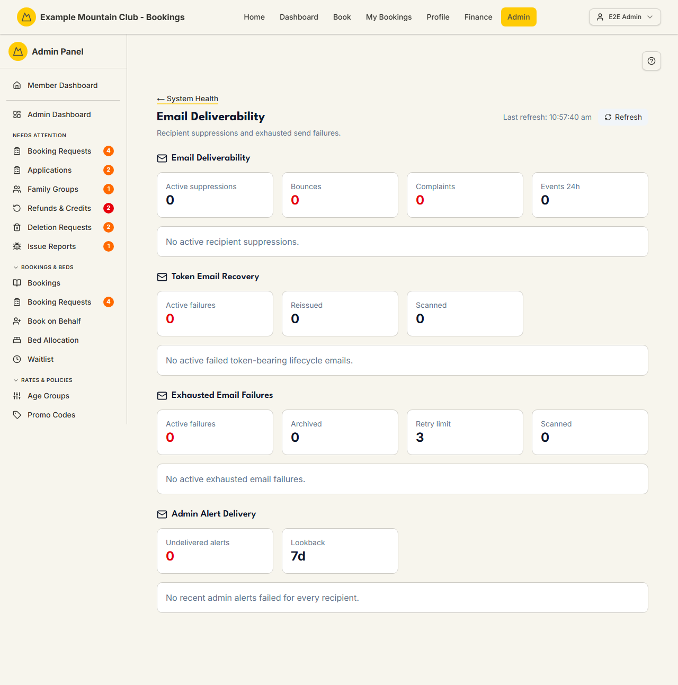

# Email Deliverability

Audience: Operator

## What it is

A monitoring page for what actually reached members: which recipients are
**suppressed** (bounced or complained), which sends **exhausted their retries**
and never landed, whether tokenised emails (sign-in, pay links) needed
recovery, and whether admin alerts had to escalate. It answers "did the email
get through?" where [Delivery Rules](notification-rules.md) answer "should it
have been sent?". Find it at **Admin → Monitoring & Support → Email Deliverability**
(`/admin/email-deliverability`).

It reads from the same data as [System Health](health.md) (it is the email
slice of that page) and refreshes on demand. The remediation actions on it —
clearing a suppression, reissuing a token email — are **support**-area edit
actions; a view-only support role sees the figures but cannot act.

## When you'd use it

- A member says they never received a booking, payment, or password email.
- You want to check whether a bounced or complained address is being suppressed.
- After a provider outage, you want to see what failed and reissue the important
  tokenised emails.

## Step-by-step

### Investigate a delivery problem

1. Open **Email Deliverability**. Use **Refresh** (top right) to pull the latest
   figures; the last-refresh time is shown beside it.

   

2. Read the four sections top to bottom:
   - **Email Deliverability** — active recipient **suppressions** (addresses the
     provider bounced or that complained). Clear a suppression once the address
     is known good.
   - **Token Email Recovery** — tokenised emails (sign-in / pay links) that
     failed and were scanned for reissue; reissue the ones a member still needs.
   - **Exhausted Email Failures** — sends that used every retry attempt and never
     delivered; mark reviewed once handled.
   - **Admin Alert Delivery** — admin alerts that had to escalate within the
     lookback window.

## Settings reference

This is a monitoring page — it has no configuration. The figures it shows:

| Section | Key figures | Action available |
| --- | --- | --- |
| Email Deliverability | Active suppressions (bounced/complained recipients) | Clear a suppression (support edit) |
| Token Email Recovery | Active / reissued / scanned counts, per-failure list | Reissue a token email (support edit) |
| Exhausted Email Failures | Active / reviewed / max attempts / scanned counts | Mark a failure reviewed (support edit) |
| Admin Alert Delivery | Recent escalations, lookback window (days) | — (informational) |

## Troubleshooting

| Symptom | Likely cause | Fix |
| --- | --- | --- |
| A member never got any email | Their address is suppressed after a bounce/complaint | Confirm the address, then clear the suppression here |
| A pay or sign-in link never arrived | The tokenised email failed | Reissue it from **Token Email Recovery** |
| The action buttons are greyed out | Your role has support view, not edit | Ask a full admin for Support & System edit access |
| Lots of exhausted failures at once | A provider outage or misconfiguration | Check email delivery config in [`../../CONFIGURATION.md`](../../CONFIGURATION.md#email-delivery); review then clear once resolved |
| Figures look stale | The page snapshots on load | Click **Refresh** |

## Related links

- Back to the [documentation hub](../README.md).
- Sibling monitoring guides: [System Health](health.md),
  [Background Jobs](background-jobs.md), [Audit Log](audit-log.md).
- Comms hub: [Notifications & Email](notifications.md).
- Reference: email delivery configuration in
  [`../../CONFIGURATION.md`](../../CONFIGURATION.md#email-delivery) and the email
  section of [`ARCHITECTURE.md`](../ARCHITECTURE.md).
