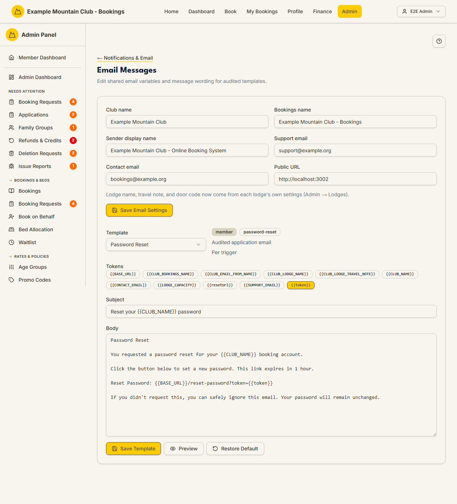

# Email Messages

Audience: Operator

## What it is

Two things in one page: the **shared email variables** every automated email
uses (your club name, sender display name, support and contact addresses, public
URL), and an editor for the **wording of each audited email template** — its
subject and body, with token chips, a live preview, and a per-template restore.
Find it at **Admin → Setup & Configuration → Notifications & Email → Email Messages**
(`/admin/email-messages`). It has no direct sidebar entry — open it from the
**Email Messages** card on the Notifications & Email hub.

This is the *system* email editor. The member-facing booking, payment, and
cancellation copy lives on the separate [Booking Messages](booking-messages.md)
page. Email Messages are edited under the **support** ("Support & System")
permission area; a view-only support role can read but not save.

## When you'd use it

- Your club name, sender display name, support address, or public URL changed and
  every email needs to reflect it.
- The wording of a specific system email (password reset, application approved,
  a booking notice) needs to change from the built-in default.
- You want to preview exactly what a template renders — with real sample values
  substituted for its tokens — before it goes to members.

## Step-by-step

### Update the shared email variables

1. Open **Email Messages**. The top card holds the shared settings.

   

2. Edit any of **Club name**, **Bookings name**, **Sender display name**,
   **Support email**, **Contact email**, or **Public URL**, then click
   **Save Email Settings**. These feed the `{{CLUB_NAME}}`, `{{SUPPORT_EMAIL}}`,
   `{{BASE_URL}}` and related tokens in every template. (Lodge name, travel note,
   and door code are no longer set here — a single-lodge club edits them on
   **Club Identity** under [Site Appearance & Content](appearance.md); a
   multi-lodge club sets them per lodge under **Setup → Lodges** (see
   [Lodges](../multi-lodge/README.md)).)

### Edit a template's wording

1. Choose a template from the **Template** dropdown. The badges show its
   audience (member/admin), key, a one-line trigger summary, and how often it
   sends.
2. Insert any of the **Tokens** chips into the **Subject** or **Body**. A
   highlighted token is **required** — the save is rejected if you remove it
   (for example the sign-in `{{token}}` in a magic-link email).
3. Click **Preview** to render the subject and body with sample values, then
   **Save Template**. Use **Restore Default** to drop your override and return to
   the built-in wording.

## Settings reference

Shared email variables (top card):

| Field | What it controls | Token it feeds |
| --- | --- | --- |
| Club name | The club's display name | `{{CLUB_NAME}}` |
| Bookings name | The booking-system name | `{{CLUB_BOOKINGS_NAME}}` |
| Sender display name | The "from" name on outbound email | `{{CLUB_EMAIL_FROM_NAME}}` |
| Support email | The support address shown to members | `{{SUPPORT_EMAIL}}` |
| Contact email | The general contact address | `{{CONTACT_EMAIL}}` |
| Public URL | The site's base URL for links | `{{BASE_URL}}` |

Per-template editor:

| Rule | Detail |
| --- | --- |
| Allowed tokens only | Only the chips shown for that template are accepted; unknown `{{tokens}}` are rejected |
| Required tokens | The highlighted chip(s) must stay in the body — removing an essential bearer token (e.g. a `/pay/<token>` or sign-in link) is refused |
| Subject safety | Sensitive token values (e.g. raw tokens) are never allowed in a subject line |
| Override vs default | Saving stores an override; **Restore Default** deletes it and reverts to the built-in text |
| Stale overrides | A count is shown if any stored overrides reference templates that no longer exist (a data-cleanup task) |
| Audit | Template edits are audited (who changed what, when) |

## Troubleshooting

| Symptom | Likely cause | Fix |
| --- | --- | --- |
| Everything is read-only | Your role has support view, not edit | Ask a full admin for Support & System edit access |
| Save is rejected | You removed a required token, used an unknown token, or put a sensitive token in the subject | Re-add the highlighted token; use only the listed chips; keep tokens out of the subject |
| A token shows literally to members | It is misspelled or not allowed for that template | Use the exact chip from the **Tokens** list |
| I want the original wording back | An override is in place | Click **Restore Default** for that template |
| The change didn't reach a lodge-specific value | Lodge name/travel note/door code are per-lodge now | Set them in [Lodges](../multi-lodge/README.md), not here |

## Related links

- Back to the [documentation hub](../README.md).
- Hub: [Notifications & Email](notifications.md).
- Sibling guides: [Delivery Rules](notification-rules.md),
  [Recipients](notification-recipients.md),
  [Booking Messages](booking-messages.md) (member-facing booking copy),
  [Email Deliverability](email-deliverability.md).
- Reference: the authoritative template catalogue, approved tokens, and
  subject/body safety rules in
  [`../../src/lib/email-message-registry.ts`](../../src/lib/email-message-registry.ts).
