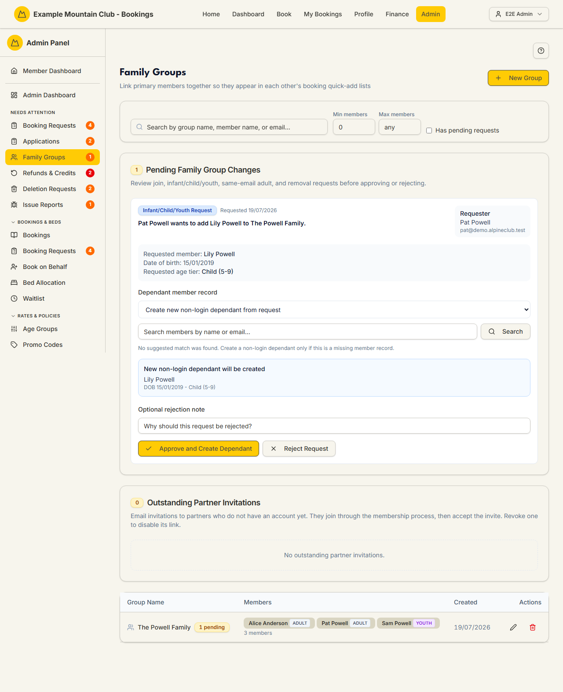

# Family Groups

Audience: Operator

## What it is

Where you link members of a household into a **family group** so they appear in
each other's booking quick-add lists, review the queue of pending family-link
requests (join, child, same-email adult, and removal requests), and manage
outstanding partner email invitations. Find it at **Admin → Members → Family
Groups** (`/admin/family-groups`). It also appears under **Needs Attention** while
family requests are pending.

Family groups are a **membership** permission area: membership view to read,
membership **edit** to approve requests or edit groups. How families are *billed*
is a separate, club-level choice set on the [Subscriptions](subscriptions.md)
page — see [Family billing](#family-billing) below.

## When you'd use it

- A couple or family should see each other when adding guests to a booking.
- A member has requested to join a family, add a child, or be removed, and you
  need to approve or reject it.
- You invited an unregistered partner by email and want to check or revoke that
  invitation.

## Step-by-step

### Review pending changes and invitations

1. Go to **Admin → Members → Family Groups**. **Pending Family Group Changes** and
   **Outstanding Partner Invitations** sit above the groups list.

   

2. In the request queue, **Approve** or **Reject** each request. Child-request and
   group-create approvals ask whether to email the member; other request types
   apply directly. To approve a child or adult request you must link an existing
   member record or create a non-login one.
3. Under **Outstanding Partner Invitations**, click **Revoke** to disable an
   invitation link that has not yet been claimed.

### Create or edit a group

1. Click **New Group**, set a **Group Name**, and add at least one member with the
   member search (primary, active members). Click **Create Group**.
2. Use the edit icon on a group row to open the full editor, or the trash icon to
   **Delete** it (members are unlinked, not deleted).

### Family billing

Whether families are billed together is not set here — it is the club-level
**family billing mode** on the [Subscriptions](subscriptions.md) page:

- **Bill families via a billing member** (the default) invoices each family once
  through its **nominated billing member**. That billing member is chosen
  explicitly (on the member's detail Family card, or the Fees family-billing
  panel) — it is **never inferred** from group role, login holder, or email. A
  family with no active billing member is omitted from invoice generation and
  flagged as an exception.
- **Bill members individually** invoices every member directly and hides the
  family-billing surface.

## Settings reference

| Control | What it does | Notes / constraints |
| --- | --- | --- |
| Search / Min members / Max members / Has pending requests | Filter the groups list | Clear resets them |
| Group Name | The family group's name | Required |
| Members | The members in the group | At least one required; primary active members |
| Approve / Reject (request queue) | Action a pending family-link request | Child/group-create approvals offer a member-email choice |
| Revoke (partner invite) | Disable an unclaimed partner invitation link | Fails gracefully if just claimed |
| Delete (group) | Remove the group and unlink its members | Members are not deleted |

## Troubleshooting

| Symptom | Likely cause | Fix |
| --- | --- | --- |
| The request queue is read-only ("… can view family group requests but cannot approve or reject them") | Your admin role has membership view but not edit | Ask a full admin for membership edit access |
| I can't approve a child/adult request | No member record is linked | Choose the member record to link, or create a new non-login member |
| A revoke fails | The invitation was just claimed or already revoked | Refresh; it may have been accepted |
| A family isn't being invoiced | It has no active billing member (in billing-member mode) | Set its billing member on the member's detail Family card or the [Fees](fees.md) family-billing panel |

## Related links

- Back to the [documentation hub](../README.md).
- Sibling guides: [Family Suggestions](family-suggestions.md),
  [Members](members.md), [Subscriptions](subscriptions.md), [Fees](fees.md).
- Reference: the
  [family and dependent lifecycle](../STATE_MACHINES.md#family-and-dependent-lifecycle),
  the [family billing mode](../AUTHORITATIVE_FEES.md#family-billing-mode) and
  [per-member billing family](../AUTHORITATIVE_FEES.md#per-member-billing-family-e6-1932)
  in `AUTHORITATIVE_FEES.md`, and the
  [membership subscription billing](../../CONFIGURATION.md#membership-subscription-billing)
  reference.
