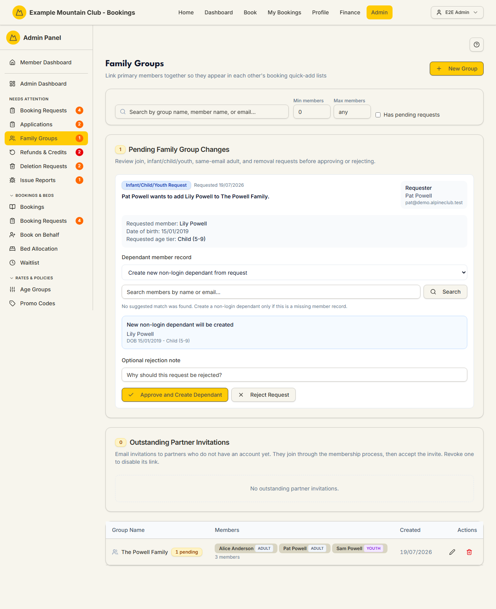

# Family Groups

Audience: Operator

## What it is

Where you link members of a household into a **family group** so they appear in
each other's booking quick-add lists, review the queue of pending family-link
requests (join, child, same-email adult, and removal requests), and manage
outstanding partner email invitations. Find it at **Admin → Members → Family
Groups** (`/admin/family-groups`). It also appears under **Needs Attention** while
family requests are pending.

Family groups are a **membership** permission area: membership view to read,
membership **edit** to approve requests or edit groups. How families are *billed*
is a separate, club-level choice set on the [Subscriptions](subscriptions.md)
page — see [Family billing](#family-billing) below.

## When you'd use it

- A couple or family should see each other when adding guests to a booking.
- A member has requested to join a family, add a child, or be removed, and you
  need to approve or reject it.
- You invited an unregistered partner by email and want to check or revoke that
  invitation.
- You want to see how a whole family connects: each member's detail page draws a
  read-only **family tree** from the recorded parent and partner links — see
  [Members](members.md#the-member-detail-page).
- Two members share a name, or a group has adults of very different generations,
  and you need to be sure which record you are about to link, approve, create or
  remove — see [Ages shown while you confirm a member](#ages-shown-while-you-confirm-a-member).

## Step-by-step

### Review pending changes and invitations

1. Go to **Admin → Members → Family Groups**. **Pending Family Group Changes** and
   **Outstanding Partner Invitations** sit above the groups list.

   

2. In the request queue, **Approve** or **Reject** each request. Child-request and
   group-create approvals ask whether to email the member; other request types
   apply directly. To approve a child or adult request you must link an existing
   member record or create a non-login one.
3. Under **Outstanding Partner Invitations**, click **Revoke** to disable an
   invitation link that has not yet been claimed.

### Create or edit a group

1. Click **New Group**, set a **Group Name**, and add at least one member with the
   member search (primary, active members). Click **Create Group**. The form
   appears below the search bar and the two queue cards (pending changes and
   outstanding partner invitations) rather than next to the button, so the page
   scrolls down to it for you.
2. Use the edit icon on a group row to open the full editor, or the trash icon to
   **Delete** it (members are unlinked, not deleted). The editor opens in that
   same place — above the group list — so the page scrolls to it, and the row
   you are editing is highlighted and badged **Editing** until you close or
   save. When you opened the editor from this page, closing or saving puts the
   keyboard cursor back on the button you started from.

### Ages shown while you confirm a member

Wherever you are acting on **one specific member record**, that member's
calculated age is shown next to their name. It is there for one reason: so a
19-year-old and a 47-year-old who share a surname, an email address and the
**ADULT** age tier cannot be mistaken for each other.

Where the age appears:

- the suggested matches and the member search on a pending request
- the picker of member records, and the **Selected member record** panel you
  confirm before approving
- the requester panel, and the person a request asks you to add
- the **New non-login adult / dependant will be created** panels, so a
  create-versus-link decision is made with the age in front of you
- the removal confirmation for the member being taken out of a group
- the partner a **New Family Group** approval would invite
- the member pills and the member search inside a group's editor
- the **Shared email & login** picker, which decides which of two adults sharing
  a surname *and* an email address keeps the login
- the members of a suggestion on the
  [Family Suggestions](family-suggestions.md) page

Where it deliberately does **not** appear: the ordinary groups table on this
page, and any member-facing or public screen. Those are routine views with no
action attached to an individual member, so they stay as they are.

How the age reads:

| Situation | Shown as |
| --- | --- |
| Aged 5 or over | `19 years`, `47 years` |
| Under 5 | `3 years 8 months` (completed years and months) |
| No usable date of birth recorded | `Age unavailable` |

Points worth knowing:

- The age is **calculated fresh every time you load the screen**, on the New
  Zealand calendar date. Nothing stores it, because it would be wrong the next
  day. A birthday today counts today, not tomorrow.
- It is worked out on the **server**. Your browser is sent the age, not the date
  of birth, so a family group screen never carries a member's birth date.
- Only an admin with **membership view** (or **membership edit**) sees it. An
  admin whose role covers an unrelated area does not receive it at all.
- The age is always **plain visible text**, never something you have to hover to
  see, so it works on a phone and with a keyboard.
- The existing **age tier** badge stays where it was. The age sits beside it —
  the tier tells you the pricing/eligibility class, the age tells you which
  person this is.
- The two are worked out **as at different dates**, so they can look like they
  disagree and still both be right. The age is as at today. An age tier is fixed
  at the **season start** — the month after the club's financial year-end, so
  1 April by default — and stays put until the next season rollover, so a member
  whose birthday has passed since then can show an age above their
  tier's range — `5 years` beside **Infant (0-4)**, or `18 years` beside
  **YOUTH**. Where a tier label with a numeric range is shown next to an age, the
  screen says "as at season start" so the pair reads as two facts rather than as
  a broken record. Nothing needs correcting.
- One remaining place still shows the full date of birth: the **date of birth the
  requester typed** on a child or adult request, which is what you check the
  candidate record against. That is the request's own declared value, not a
  stored member record.

### Family billing

Whether families are billed together is not set here — it is the club-level
**family billing mode** on the [Subscriptions](subscriptions.md) page:

- **Bill families via a billing member** (the default) invoices each family once
  through its **nominated billing member**. That billing member is chosen
  explicitly (on the member's detail Family card, or the Fees family-billing
  panel) — it is **never inferred** from group role, login holder, or email. A
  family with no active billing member is omitted from invoice generation and
  flagged as an exception.
- **Bill members individually** invoices every member directly and hides the
  family-billing surface.

## Settings reference

| Control | What it does | Notes / constraints |
| --- | --- | --- |
| Search / Min members / Max members / Has pending requests | Filter the groups list | **Reset** restores them; it remains visible and is disabled at defaults |
| Group Name | The family group's name | Required |
| Members | The members in the group | At least one required; primary active members. Each shows its calculated age (#2568) |
| Approve / Reject (request queue) | Action a pending family-link request | Child/group-create approvals offer a member-email choice |
| Revoke (partner invite) | Disable an unclaimed partner invitation link | Fails gracefully if just claimed |
| Delete (group) | Remove the group and unlink its members | Members are not deleted |

## Troubleshooting

| Symptom | Likely cause | Fix |
| --- | --- | --- |
| The request queue is read-only ("… can view family group requests but cannot approve or reject them") | Your admin role has membership view but not edit | Ask a full admin for membership edit access |
| I can't approve a child/adult request | No member record is linked | Choose the member record to link, or create a new non-login member |
| A member shows **Age unavailable** | No date of birth is recorded for them, or the recorded value is unusable | Record the date of birth on the member's detail page; the age appears on the next load |
| Two candidates show the same age | They really are the same age — age alone cannot separate them | Use the email address, the age tier, and the **has login / no login** note on the same row |
| "Family links are limited to 4 generations…" | Approving would make the family chain longer than great-grandparent → grandparent → parent → child | Link the member under a nearer relative, or unlink a generation that no longer needs recording |
| "Cannot link a parent or ancestor as a dependant" | The chosen member is already further up this family, so the link would loop back on itself | Check who is already recorded as whose parent on the member detail pages |
| "This parent has no email address the club can send to, so there is nothing for the dependant to inherit" | Since #2716 inheritance is **direct-parent only**, so this is about that one parent — not about anybody further up the family. They are a young parent, hold a placeholder address, have left the club, or are themselves inheriting | Record an email address for **that parent**, or choose **Use child's own email** to approve without inheriting. Looking further up the family will not help: the address no longer travels past them |
| "A member with this email already exists" when saving a login holder | Someone else already signs in with that address, and only one member per address can. Usually that is a member outside this family group — but it can also be a second member *inside* it who has **Can Login** on while storing a different address of their own | Search the address on Members and change or de-login one of them, or merge the duplicate. If nobody outside the family turns up, check this family's own members for a second one with **Can Login** ticked |
| A revoke fails | The invitation was just claimed or already revoked | Refresh; it may have been accepted |
| A family isn't being invoiced | It has no active billing member (in billing-member mode) | Set its billing member on the member's detail Family card or the [Fees](fees.md) family-billing panel |

## Related links

- Back to the [documentation hub](../README.md).
- Sibling guides: [Family Suggestions](family-suggestions.md),
  [Members](members.md), [Subscriptions](subscriptions.md), [Fees](fees.md).
- Reference: the
  [family and dependent lifecycle](../STATE_MACHINES.md#family-and-dependent-lifecycle),
  the [family billing mode](../AUTHORITATIVE_FEES.md#family-billing-mode) and
  [per-member billing family](../AUTHORITATIVE_FEES.md#per-member-billing-family-e6-1932)
  in `AUTHORITATIVE_FEES.md`, and the
  [membership subscription billing](../../CONFIGURATION.md#membership-subscription-billing)
  reference.
