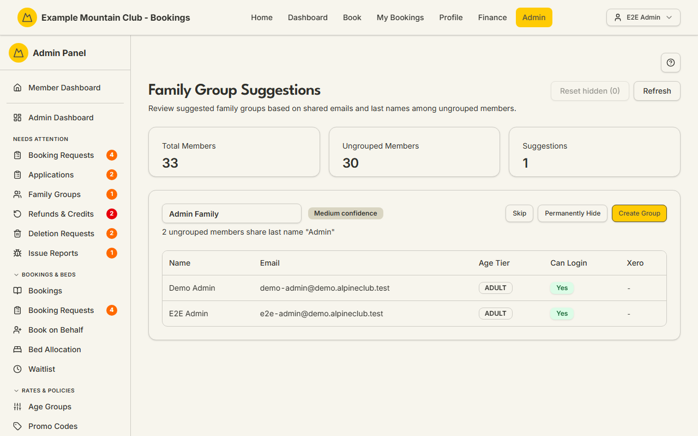

# Family Suggestions

Audience: Operator

## What it is

A helper that auto-detects likely family groups among members who are **not yet in
a family group**, by looking for shared email addresses and shared last names, and
lets you confirm a suggestion into a real group, skip it for now, or hide it
permanently. Find it at **Admin → Members → Family Suggestions**
(`/admin/family-suggestions`).

Family suggestions are a **membership** permission area: membership view to
browse, membership **edit** to create, hide, or reset suggestions.

## When you'd use it

- You are tidying up membership data and want to group households that were
  imported or created separately.
- You want to quickly create a family group from members who share an email or
  surname, without building it by hand.

## Step-by-step

### Review and act on suggestions

1. Go to **Admin → Members → Family Suggestions**. Stat cards show Total Members,
   Ungrouped Members, and the number of Suggestions; each suggestion lists its
   candidate members and a confidence badge.

   

2. Suggestions are scored: sharing an **email address** is high confidence (likely
   a parent plus dependents); sharing a **last name** among ungrouped members is
   medium confidence. Only groups of two or more members are suggested, and
   members already in a family group are excluded.
3. For a suggestion you can:
   - Adjust the pre-filled **name** (defaults to "{Last name} Family").
   - **Create Group** to confirm it into a real family group.
   - **Skip** to dismiss it for this session only (no change saved).
   - **Permanently Hide** to stop it being suggested again for every admin.
4. Use **Reset hidden** to restore every permanently hidden suggestion, or
   **Refresh** to re-scan.

## Settings reference

This is a workflow helper, not a settings page.

| Control | What it does | Notes / constraints |
| --- | --- | --- |
| Suggestion name | The name the confirmed group is created with | Defaults to "{Last name} Family"; 1–100 chars |
| Create Group | Confirms the suggestion into a family group | Needs at least 2 members |
| Skip | Dismisses the suggestion for this session | No change saved |
| Permanently Hide | Hides the suggestion for all admins | Reversible with **Reset hidden** |
| Reset hidden | Restores every permanently hidden suggestion | Affects all admins |

When a group is created, the lead member (first adult who can log in, else first
who can log in, else the first member) is set as the group's admin and the rest as
members.

## Troubleshooting

| Symptom | Likely cause | Fix |
| --- | --- | --- |
| Everything is read-only ("… can view family group suggestions but cannot create, hide, or reset them") | Your admin role has membership view but not edit | Ask a full admin for membership edit access |
| "No suggestions found" | Everyone is already grouped, or there are no shared-email/surname patterns | Nothing to do — or check for members you expected to be ungrouped |
| A suggestion I hid keeps mattering | Hide is global but reversible | Use **Reset hidden** to bring hidden suggestions back |
| A group won't create | A member became inactive or the set dropped below 2 | Refresh; ensure at least 2 active members remain |

## Related links

- Back to the [documentation hub](../README.md).
- Sibling guides: [Family Groups](family-groups.md), [Members](members.md).
- Reference: the
  [family and dependent lifecycle](../STATE_MACHINES.md#family-and-dependent-lifecycle)
  and the [Admin and Lodge](../ARCHITECTURE.md#admin-and-lodge) architecture.
