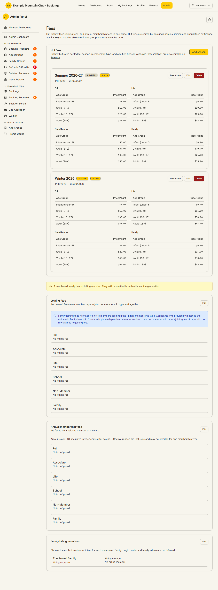

# Fees

Audience: Operator

## What it is

The consolidated fee console: **hut nightly fees**, **joining fees**, and **annual
membership fees** in one place, plus the **family billing members** panel. Hut
fees are edited by bookings admins; joining and annual fees by finance admins —
you may be able to edit one group and only view the other. Find it at **Admin →
Finance → Fees** (`/admin/fees`). The old `/admin/fee-configuration` route
redirects here.

Fees is unusual: you can open it with **either** bookings **or** finance view
access, and each section self-gates its own editing. All amounts are stored as
**integer cents** (entered in dollars); effective dates and season windows are NZ
date-only.

## When you'd use it

- You are setting nightly hut rates for a season, per membership type and age
  tier.
- You are configuring the one-off joining fee or the annual membership fee for a
  membership type.
- You need to name the invoice recipient (billing member) for each family.

## Step-by-step

### Set hut nightly fees

1. Go to **Admin → Finance → Fees**. The **Hut fees** section lists each season
   with its per-type, per-age-tier nightly rates.

   

2. Click **Add season** (or **Edit** on a season) to set the **Season Name**,
   **Type** (Winter/Summer), **Start/End Date**, and the **Nightly Rates** for each
   membership type and age tier, then **Create Season** / **Update Season**. Season
   *windows* can also be adjusted on the [Seasons](seasons.md) page.

### Set joining fees

1. In **Joining fees**, click **Edit**, then add a row per membership type and age
   tier: **Membership type**, **Age tier** (or "Flat (all ages)"), **Amount
   (NZD)**, and an **Effective from** (and optional **Effective to**). A type with
   no rows raises no joining fee.

### Set annual membership fees

1. In **Annual membership fees**, click **Edit**, then per membership type set the
   **Annual amount (NZD)**, **Billing basis** (Per member, Per family, or No
   invoice), **Proration** (Full annual fee, or Remaining months incl. decision
   month), and the effective dates.
2. Each fee is split into **invoice-line components** — each becomes its own
   GST-inclusive Xero invoice line, optionally coded to its own account/item and
   with its own proration flag. The components must sum exactly to the fee amount.
   - **Account** and **Item** are dropdowns backed by the live Xero chart of
     accounts and item list: Account lists only active income (revenue) accounts,
     Item lists only sales-invoice items. Leave a field empty to use the resolved
     default — the picker shows it (e.g. "Default: 203 — Subscriptions Income",
     or "Default: no item" for items). If Xero is disconnected the editor shows an
     amber notice and lets you type account/item codes by hand, so a save is never
     blocked.
   - The per-component **Prorate** opt-in only appears when the fee's **Proration**
     is set to *Remaining months*. A *Full annual fee* charges every component in
     full, so saved fees display the fee-level rule and never label a component
     "prorated" when the rule is *Full annual fee*.

### Set family billing members

1. If the club bills families via a billing member, the **Family billing members**
   panel lists each family. Click **Edit** and choose the explicit **Billing
   member** (invoice recipient) for each family — the login holder and family admin
   are **never inferred**. A family with no billing member is omitted from invoice
   generation and flagged.

## Settings reference

| Section | Key fields | Notes / constraints |
| --- | --- | --- |
| Hut fees | Season Name, Type, Start/End Date, per-type/per-tier nightly rate, Active | Bookings edit; rates entered in dollars, stored as cents; NZ date-only |
| Joining fees | Membership type, Age tier (or Flat), Amount, Effective from/to | Finance edit; per membership type + age tier |
| Annual membership fees | Annual amount, Billing basis, Proration, Effective from/to, invoice-line components | Finance edit; GST-inclusive integer cents; components must sum to the total; effective ranges may not overlap for one type |
| Family billing members | Billing member per family | Finance edit; only in "bill families via a billing member" mode; recipient never inferred |

## Troubleshooting

| Symptom | Likely cause | Fix |
| --- | --- | --- |
| "You don't have permission to view this section" on Hut fees | You have finance access but not bookings | Ask a bookings admin — hut fees are managed by bookings admins |
| "You don't have permission to view this section" on joining/annual fees | You have bookings access but not finance | Ask a finance admin — those are managed by finance admins |
| A section is read-only | You have view but not edit for that area | Ask an admin with edit access for that area (bookings for hut fees, finance for the rest) |
| An annual-fee save is rejected | The invoice-line components do not sum to the fee total, or effective ranges overlap | Reconcile the components to the total; make effective ranges non-overlapping |
| The component Account/Item dropdowns are empty and show an amber notice | Xero is not connected, so the live account/item lists cannot be loaded | Type the account/item codes manually for now; reconnect Xero (see [Xero](xero.md)) to pick from the live lists |
| A per-family fee can't be invoiced | The club bills members individually, but a schedule still uses the per-family basis | Change that schedule to per-member or no-invoice (see [Subscriptions](subscriptions.md)) |
| A family has no billing member | No invoice recipient is set | Set the family's billing member (here or on the member's detail Family card) |

## Related links

- Back to the [documentation hub](../README.md).
- Feature hub: [Finance dashboard](../finance-dashboard/README.md).
- Sibling guides: [Subscriptions](subscriptions.md), [Seasons](seasons.md),
  [Membership Types](membership-types.md), [Family Groups](family-groups.md),
  [Age Groups](age-tier-settings.md).
- Reference: the
  [fee configuration lifecycle](../STATE_MACHINES.md#fee-configuration-lifecycle),
  the fee [operator workflow](../AUTHORITATIVE_FEES.md#operator-workflow),
  [annual fee components](../AUTHORITATIVE_FEES.md#annual-fee-components-multi-line-invoices-e6-1932),
  and [family billing mode](../AUTHORITATIVE_FEES.md#family-billing-mode) in
  `AUTHORITATIVE_FEES.md`, and the
  [Membership and joining fee authority](../../CONFIGURATION.md#membership-and-joining-fee-authority)
  reference.
