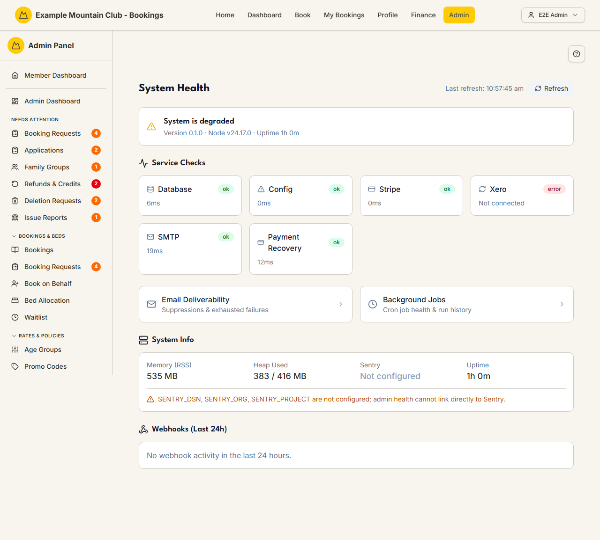

# System Health

Audience: Operator

## What it is

A live status board for the running application: an overall health verdict,
per-service checks (database, config, Stripe, Xero, SMTP, payment recovery),
system info (version, Node, memory, uptime, Sentry), and a 24-hour webhook
summary. Find it at **Admin → Monitoring & Support → System Health**
(`/admin/health`).

The page is read-only and refreshes on demand. It is the top of the monitoring
trio — from here you can jump to [Email Deliverability](email-deliverability.md)
and [Background Jobs](background-jobs.md), which drill into their own detail.

## When you'd use it

- Something looks broken (payments not taking, emails not arriving, Xero not
  syncing) and you want to see which service is failing before escalating.
- You're doing a post-deploy check and want the running version, uptime, and
  memory at a glance.
- You want to confirm webhooks (Stripe, Xero) have been arriving in the last day.

## Step-by-step

### Read the status board

1. Go to **Admin → System Health**.

   

2. Check the **overall status** banner and the **Service Checks** grid — each
   service shows OK with its latency, or an error message.
3. Use **System Info** for the running version, memory, and Sentry state, and
   **Webhooks (Last 24h)** for delivery counts. Click **Refresh** to re-poll;
   the last refresh time is shown next to the button.

## Settings reference

The page has no settings. What it reports:

| Section | Shows |
| --- | --- |
| Overall status | `healthy` / `degraded` etc., plus version, Node version, and uptime |
| Service Checks | Database, config, Stripe, Xero, SMTP, payment recovery — each OK (with latency) or an error |
| System Info | Memory (RSS, heap used/total), Sentry connected/not configured, uptime, Sentry dashboard link |
| Webhooks (Last 24h) | Per-source success / failure / total counts, and a recent-events list |

## Troubleshooting

| Symptom | Likely cause | Fix |
| --- | --- | --- |
| A service check is red | That dependency is failing (DB, Stripe, Xero, SMTP) | Read the error; check the provider's credentials/config in [`CONFIGURATION.md`](../../CONFIGURATION.md) |
| "Failed to load health data" | The health API couldn't be reached | Click **Refresh**; if it persists the app instance may be down |
| Sentry shows "Not configured" | No Sentry DSN is set | Optional — set it in the environment if you want error monitoring |
| No webhook activity in 24h | No Stripe/Xero events arrived (or webhooks aren't configured) | Confirm the provider webhook endpoints; see [System Health → Background Jobs](background-jobs.md) for cron-side failures |

## Related links

- Back to the [documentation hub](../README.md).
- Sibling monitoring guides: [Background Jobs](background-jobs.md),
  [Email Deliverability](email-deliverability.md), [Stuck States](stuck-states.md),
  [Audit Log](audit-log.md).
- Reference: cron jobs and integrations in [`ARCHITECTURE.md`](../ARCHITECTURE.md).
