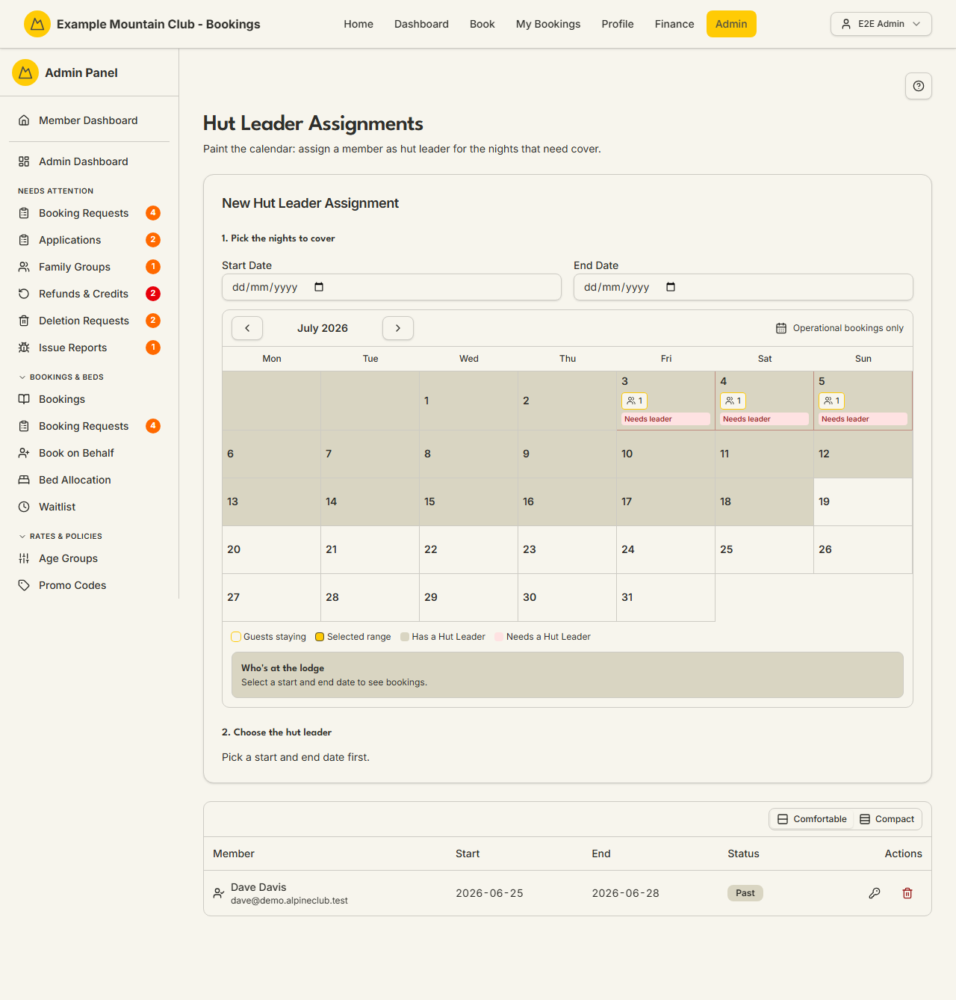

# Hut Leaders

Audience: Operator

## What it is

The calendar for assigning a member to be the **hut leader** (the on-site lead) for
the nights that need cover. You paint a date range, pick a member, and confirm;
the page shows which upcoming nights still need a leader and gives each assigned
leader a kiosk PIN for the lodge device. Find it at
**Admin → Lodge Operations → Hut Leaders** (`/admin/hut-leaders`). A daily
`hut-leader-auto-assign` cron also suggests leaders in the background
(`ARCHITECTURE.md`).

"Hut leader" is the default label — a club can rename it (for example to
"Custodian" or "Warden") in its club identity settings, and this page follows that
label. Hut-leader assignments are a **lodge** permission area: lodge view to read,
lodge **edit** to assign, delete, or reset a PIN. The feature is on by default
(the `hutLeaders` module).

## When you'd use it

- Upcoming booked nights have no one in charge and you need to assign a leader.
- A leader dropped out and you need to reassign their nights.
- A hut leader needs a fresh kiosk PIN for the lodge device.

## Step-by-step

### See what needs cover and assign a leader

1. Go to **Admin → Lodge Operations → Hut Leaders**. The amber **Upcoming Dates
   Without …** card lists booked nights with no leader; the calendar paints
   **Needs a Hut Leader** (red) and **Has a Hut Leader** (violet) nights.

   

2. **Pick the nights to cover** — set the **Start Date** and **End Date**, or click
   **Assign** on an upcoming-date card to pre-fill a single night.
3. **Choose the hut leader** — the page lists members eligible for that range
   (adopting their conflict-free suggested range), or you can pick any member.
4. Review the summary — nights covered, red nights it fills, and any conflicts —
   then click to confirm. An assignment overlapping an existing one by more than a
   day is blocked.

### Manage assignments and kiosk PINs

1. In the assignments table, each row shows the member, the date range, and a
   status (**Active**, **Upcoming**, or **Past**).
2. Use the **key** icon to generate a new **kiosk PIN** — it is shown once and, if
   email is working, sent to the leader (their old PIN stops working). The PIN
   signs the leader in on the [Lodge Kiosk](lodge.md) device. Use the **trash**
   icon to delete an assignment.

## Settings reference

| Control | What it does | Notes / constraints |
| --- | --- | --- |
| Start Date / End Date | The nights the leader covers | NZ date-only; an >1-day overlap with an existing assignment is blocked |
| Eligible members list | Members whose bookings make them a natural fit | Adopts each member's conflict-free suggested range |
| Pick any member | Assign a member with no booking (e.g. a visiting custodian) | Keeps the range you picked |
| Reset kiosk PIN (key icon) | Issues a new kiosk PIN for that leader | Shown once; emailed if delivery works; old PIN is revoked |
| Delete (trash icon) | Removes the assignment | Frees those nights (they may go red again) |
| Lodge selector | Which lodge new assignments apply to | Only shown with more than one active lodge |

## Troubleshooting

| Symptom | Likely cause | Fix |
| --- | --- | --- |
| Hut Leaders is missing from the sidebar / 404s | The `hutLeaders` module is off | Enable it under **Admin → Setup → Modules** — see [`CONFIGURATION.md`](../../CONFIGURATION.md#module-controls-and-admin-modules) |
| Everything is read-only ("… can view … but cannot change them") | Your admin role has lodge view but not edit | Ask a full admin for **lodge edit** access |
| "This member overlaps an existing assignment" | The range overlaps another leader's by more than a day | Shorten the range or delete the conflicting assignment |
| The label says "Custodian"/"Warden", not "Hut Leader" | The club renamed the hut-leader label in its identity settings | Expected — the page follows the club's label |
| A leader's PIN doesn't work on the kiosk | Their PIN was reset (old one revoked), or their kiosk account is ambiguous | Reset the PIN again; check the [Lodge Kiosk](lodge.md) account binding |

## Related links

- Back to the [documentation hub](../README.md).
- Sibling guides: [Lodge Kiosk](lodge.md), [Chore Roster](roster.md),
  [Chore Templates](chores.md), [Lodges](lodges.md).
- Reference: [Admin and Lodge](../ARCHITECTURE.md#admin-and-lodge) and the
  `hut-leader-auto-assign` job in [Cron Jobs](../ARCHITECTURE.md#cron-jobs).
