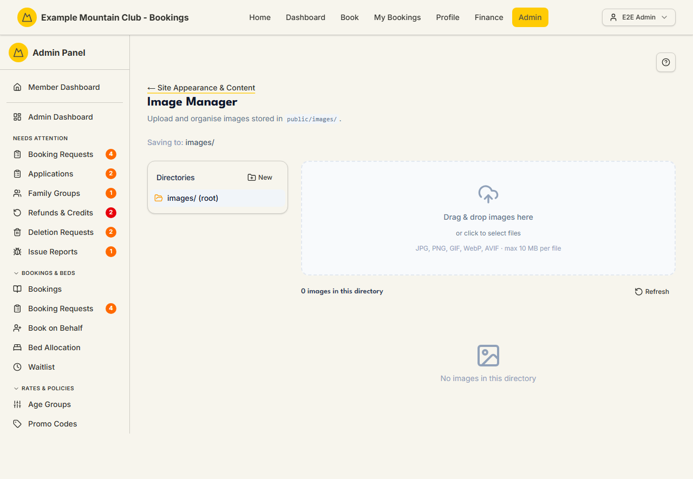

# Image Manager

Audience: Operator

## What it is

An uploader and organiser for the images stored in `public/images/` that the
public content editors reference. Find it at **Admin → Setup & Configuration →
Site Appearance & Content → Image Manager** (`/admin/image-manager`). It has no
direct sidebar entry — open it from the **Image Manager** card on the Site
Appearance & Content hub.

Image Manager is edited under the **content** permission area.

## When you'd use it

- You want to upload a photo or logo to use in a public page, footer, or lodge
  content block.
- You want to organise images into folders (e.g. one per page) before linking
  them.
- You need to check which images already exist before re-uploading.

## Step-by-step

### Upload and organise images

1. Open **Image Manager**. The **Directories** panel on the left lists your
   folders (starting at `images/ (root)`); the **Saving to:** line shows where
   new uploads land.

   

2. To upload, **drag & drop images** onto the upload area or **click to select
   files**. Accepted formats are **JPG, PNG, GIF, WebP, and AVIF**, up to
   **10 MB per file**.
3. Use **New** in the Directories panel to create a folder, select a folder to
   change where uploads save, and **Refresh** to reload the current directory's
   listing. Uploaded images can then be inserted from the content editors' Image
   button.

## Settings reference

| Control | What it does | Notes / constraints |
| --- | --- | --- |
| Directories panel | Browse and select the folder under `public/images/` | Root is `images/ (root)` |
| New (directory) | Create a new folder to save into | — |
| Drag & drop / click to select | Upload one or more image files | JPG, PNG, GIF, WebP, AVIF; **max 10 MB per file** |
| Saving to | The folder new uploads are written to | Follows the selected directory |
| Refresh | Reloads the current directory's image list | — |

## Troubleshooting

| Symptom | Likely cause | Fix |
| --- | --- | --- |
| An upload is rejected | The file isn't an accepted format or exceeds 10 MB | Convert to JPG/PNG/GIF/WebP/AVIF and keep it under 10 MB |
| An uploaded image doesn't show in the content editor | It's saved in a different folder, or the listing is stale | Check the folder and click **Refresh** |
| I can't find an image I uploaded | It went to the folder shown in **Saving to** at upload time | Select that directory to view it |
| Everything is read-only | Your admin role can view but not edit under the content area | Ask a full admin for content edit access |

## Related links

- Back to the [documentation hub](../README.md).
- Parent hub: [Site Appearance & Content](appearance.md).
- Sibling guides: [Page Content](page-content.md),
  [Site Content](site-content.md).
