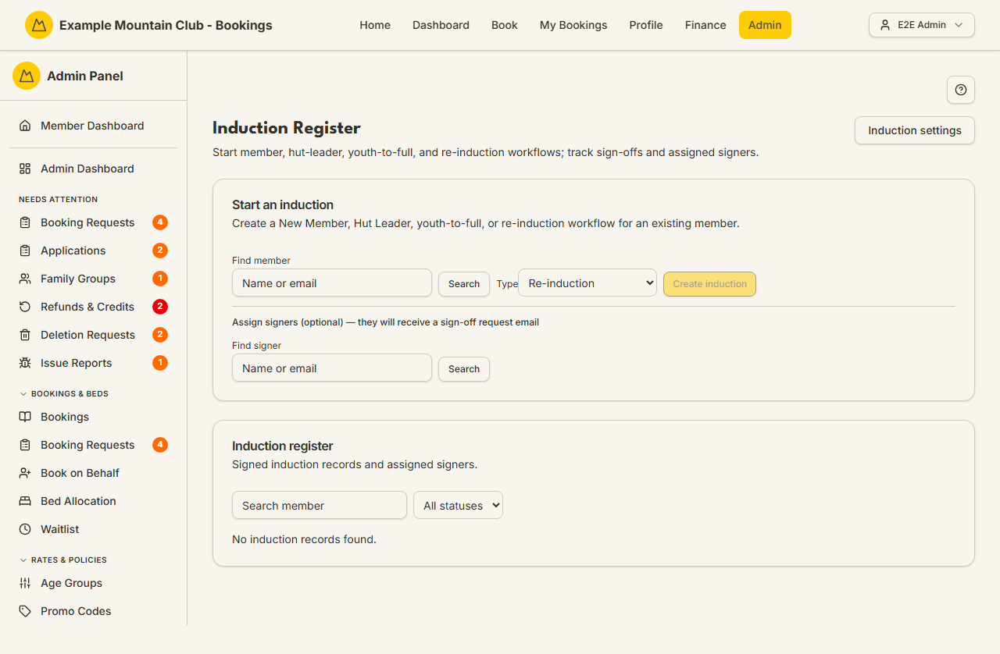
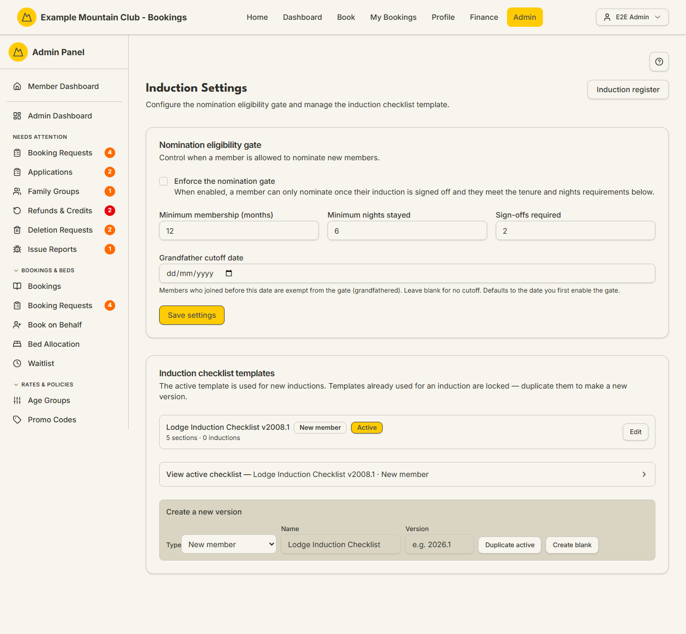

# Induction

Audience: Operator

## What it is

The **Induction Register**: where you start and track lodge-induction workflows
for members — new-member, hut-leader, youth-to-full, and re-induction — against
a versioned checklist template, assign the people who sign them off, and record
each sign-off. A separate **Induction Settings** page controls the nomination
eligibility gate and the checklist templates. Find the register at **Admin →
Members → Induction** (`/admin/induction`); open settings from the **Induction
settings** button (`/admin/induction/settings`).

Induction is a **membership** permission area: you need membership view to read
the register and membership **edit** to create, complete, void, reassign, or
change settings and templates.

## When you'd use it

- A new member (or a member becoming a hut leader, or a youth turning into a full
  member) needs to be inducted and signed off.
- You want to resend or reassign the sign-off request to a different signer.
- An induction was raised in error and needs voiding, or is complete in real life
  and needs an override.
- You are tightening (or relaxing) who is allowed to nominate new members, or
  updating the induction checklist itself.

## Step-by-step

### Start an induction

1. Go to **Admin → Members → Induction**. The **Start an induction** card sits
   above the **Induction register** table.

   

2. In **Find member**, type a name or email and click **Search**, then pick the
   member. Choose a **Type** (New member, Hut Leader Induction, Youth → full
   member, or Re-induction).
3. Optionally assign signers under **Assign signers (optional)** — they receive a
   sign-off request email. Click **Create induction**. You will see how many
   sign-off emails were sent.

### Track and act on a record

1. In the register, filter with **Search member** and the status select (All
   statuses, In progress, Completed, Draft, Voided). Each row shows the
   **Sign-offs** count (e.g. `1/2`) and the assigned **Signers**.
2. Row actions: **View** opens the printable sign-off sheet; **Signers** opens an
   inline editor to reassign; **Complete** marks a record complete (override);
   **Void** cancels it (you must give a reason).

### Configure the gate and templates

1. Click **Induction settings**.

   

2. Under **Nomination eligibility gate**, tick **Enforce the nomination gate** and
   set **Minimum membership (months)**, **Minimum nights stayed**, **Sign-offs
   required**, and an optional **Grandfather cutoff date**, then **Save settings**.
3. Under **Induction checklist templates**, **Activate** the template used for new
   inductions, or build a new version: pick a **Type**, enter a **Name** and
   **Version**, then **Duplicate active** or **Create blank** and edit its
   sections and items. Templates already used by an induction are locked —
   duplicate them to make a new version.

## Settings reference

### Nomination eligibility gate

| Setting | What it controls | Default | Notes / constraints |
| --- | --- | --- | --- |
| Enforce the nomination gate | Whether nominating is gated on induction + tenure + nights | from server | When off, any member can nominate |
| Minimum membership (months) | Tenure required before nominating | from server | Integer, `min 0` |
| Minimum nights stayed | Lodge nights required before nominating | from server | Integer, `min 0` |
| Sign-offs required | How many sign-offs complete an induction | from server | Integer, `min 1` |
| Grandfather cutoff date | Members who joined before this date are exempt | date first enabled | NZ date-only; blank = no cutoff |

### Induction checklist template

| Field | What it controls | Notes / constraints |
| --- | --- | --- |
| Type | Which induction kind the template is for | New member / Hut Leader / Youth → full / Re-induction |
| Name | Template display name | Defaults to "Lodge Induction Checklist" |
| Version | Version label | Required (e.g. `2026.1`) |
| Section title / Priority | A checklist section and its priority | Priority: Emergency, Security, Startup, Shutdown, General |
| Item label / Competency prompt | A checklist item and its optional prompt | Blank-label items are dropped on save |
| Mandatory / Requires demonstration | Item flags | Checkboxes |

## Troubleshooting

| Symptom | Likely cause | Fix |
| --- | --- | --- |
| Everything is read-only ("… can view … but cannot change them") | Your admin role has membership view but not edit | Ask a full admin for membership edit access |
| **Create induction** is disabled | No member is selected | Search and select a member first |
| A template can't be edited or deleted | It has already been used by an induction (locked) | Use **Duplicate active** to make a new version, then activate it |
| "Enter a version label for the new template" | You tried to create a template without a version | Fill in **Version** (e.g. `2026.1`) |
| A signer didn't get their email | An individual send failed (sends do not block the create) | Use **Signers** to reassign/resend, or **Refresh** the register |

## Related links

- Back to the [documentation hub](../README.md).
- Sibling guides: [Members](members.md),
  [Member Applications](member-applications.md), [Committee](committee.md).
- Reference: the
  [lodge induction lifecycle](../STATE_MACHINES.md#lodge-induction-lifecycle)
  and [nomination lifecycle](../STATE_MACHINES.md#nomination-lifecycle), and the
  [membership lifecycle invariants](../DOMAIN_INVARIANTS.md#membership-lifecycle).
