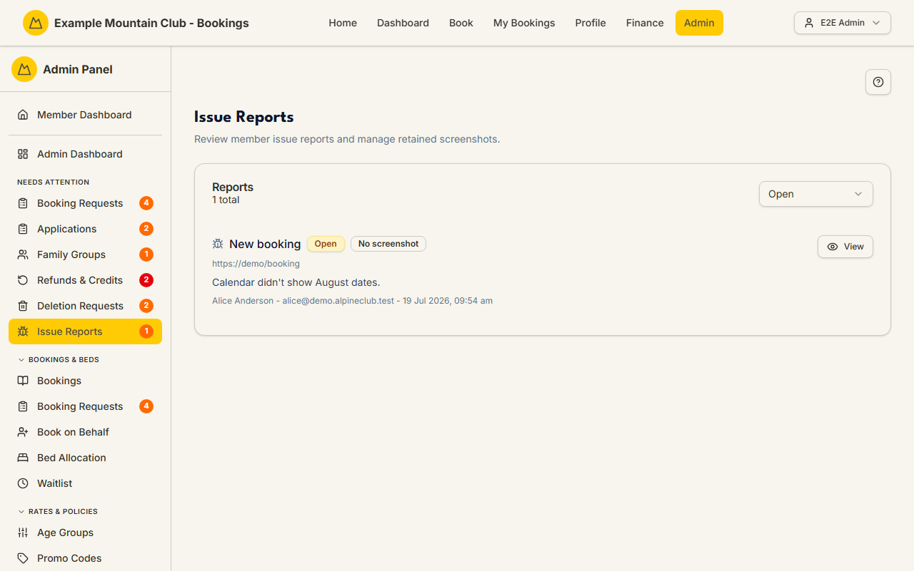

# Issue Reports

Audience: Operator

## What it is

The triage queue for problems members report from the site's floating
"Report issue" widget. Each report captures the page, the member's description,
and (with consent) a screenshot and browser info; you review it, resolve or
reopen it, and delete a retained screenshot once you're done. Find it at
**Admin → Monitoring & Support → Issue Reports** (`/admin/issue-reports`) — it also surfaces in the
sidebar's **Needs Attention** section while reports are open.

Issue reports are handled under the **support** ("Support & System") permission
area: a support-**edit** admin can resolve, reopen, and delete screenshots; a
support-**view** admin can browse but not act. See [`ARCHITECTURE.md`](../ARCHITECTURE.md)
(issue reports / stuck states) for the model.

## When you'd use it

- A member hit a bug and reported it, and you want to see what they saw
  (including their screenshot).
- You're clearing the open-reports queue and marking fixed issues resolved with
  a note.
- A retained screenshot has served its purpose and should be deleted for privacy.

## Step-by-step

### Review and resolve a report

1. Go to **Admin → Issue Reports**. Filter by **Open**, **Resolved**, or
   **All**. Each row shows the page title, status, whether a screenshot is
   retained, the description, and who reported it when.

   

2. Click **View** to open the report: the member, submission time, page link,
   full description, the screenshot (if retained), and browser info.
3. Add a **Resolution note** (up to 1000 characters) and click **Resolve** — or
   **Reopen** a resolved one. Use **Delete** on a retained screenshot to remove
   it once it's no longer needed.

## Settings reference

The page has no configurable settings. What each report carries:

| Field | Meaning |
| --- | --- |
| Status | Open or Resolved |
| Page | The page title and URL the report was filed from |
| Description | The member's free-text description |
| Screenshot | Retained, deleted, or none — retained ones have an expiry and can be deleted manually |
| Browser info | Retained browser details (or "not retained") |
| Member | Who submitted it, and when |
| Resolution note | Your note on how it was resolved (max 1000 characters) |

Screenshots and browser info are retained only with consent and **expire
automatically**; you can also delete a retained screenshot during triage.

## Troubleshooting

| Symptom | Likely cause | Fix |
| --- | --- | --- |
| Resolve/Reopen/Delete buttons are inert | Your role has support **view**, not **edit** | Ask a full admin for support edit access |
| A report has no screenshot | The member didn't consent, it wasn't retained, or it expired | Work from the description and page URL |
| "No issue reports found" | The status filter excludes them | Switch the filter to **All** |
| An old screenshot vanished | It reached its retention expiry | Expected — retained media expires automatically |

## Related links

- Back to the [documentation hub](../README.md).
- Sibling monitoring guides: [Stuck States](stuck-states.md),
  [System Health](health.md), [Audit Log](audit-log.md).
- Reference: issue reports / stuck states in [`ARCHITECTURE.md`](../ARCHITECTURE.md).
