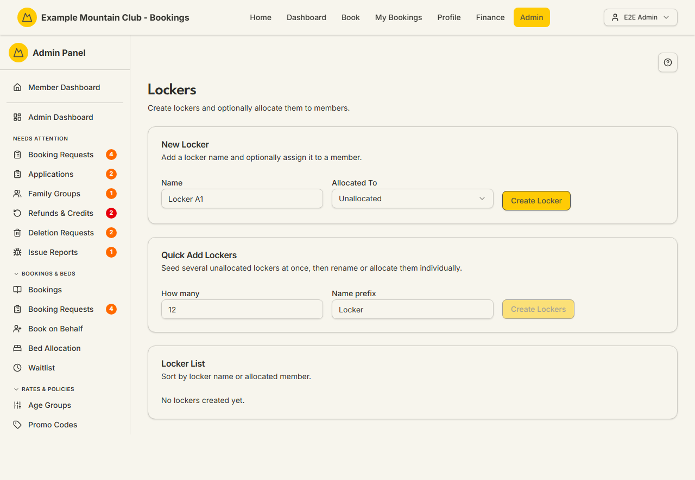

# Lockers

Audience: Operator

## What it is

The locker inventory for a lodge: create lockers individually or in bulk, and
optionally allocate each to a member. Find it at `/admin/lockers`. It has **no
direct sidebar entry** — lockers are lodge-scoped (ADR-005), so you reach this
page from the **lodge configuration hub**'s **Lockers** card (**Admin → Setup &
Configuration → Lodges →** a lodge **→ Lockers**), which opens it already filtered
to that lodge.

Lockers are a **membership** permission area (despite being lodge-scoped):
membership view to read, membership **edit** to create, allocate, or delete. Each
locker belongs to exactly one lodge, fixed when it is created.

## When you'd use it

- You are setting up a lodge's lockers for the first time.
- A member should be given (or released from) a locker.
- You want to seed a batch of unallocated lockers and name/allocate them later.

## Step-by-step

### Open lockers for a lodge

1. From the lodge configuration hub, open a lodge and click its **Lockers** card
   (or go to `/admin/lockers`). If the club runs more than one lodge, the lodge
   selector controls which lodge's lockers you see.

   

### Create a locker

1. In **New Locker**, enter a **Name** (e.g. "Locker A1") and, optionally, choose a
   member in **Allocated To** (search by name; leave as **Unallocated** for none).
2. Click **Create Locker**.

### Seed several lockers at once

1. In **Quick Add Lockers**, set **How many** (1–100) and a **Name prefix**, then
   click **Create Lockers**. They are created unallocated; rename or allocate them
   individually afterwards.

### Manage the list

1. In **Locker List**, sort by locker name or allocated member. Use the edit icon
   to rename or re-allocate a locker (its lodge cannot be changed), or the trash
   icon to delete it (you will be asked to confirm).

## Settings reference

| Field | What it controls | Default | Notes / constraints |
| --- | --- | --- | --- |
| Name | The locker's name | — | Required; unique per lodge |
| Allocated To | The member the locker is assigned to | Unallocated | Optional; searchable member list |
| How many (Quick Add) | How many lockers to seed | — | Integer 1–100 |
| Name prefix (Quick Add) | Prefix for the seeded locker names | "Locker" | — |
| Lodge selector | Which lodge's lockers are shown | the deep-linked lodge | Only shown with more than one active lodge; lodge is fixed at creation |

## Troubleshooting

| Symptom | Likely cause | Fix |
| --- | --- | --- |
| I can't find Lockers in the sidebar | It has no direct sidebar entry (lodge-scoped) | Open **Lodges → [a lodge] → Lockers**, or go to `/admin/lockers` |
| Everything is read-only ("… can view lockers but cannot change them") | Your admin role has membership view but not edit | Ask a full admin for membership edit access |
| The Lockers card is missing from the lodge hub | The `lockers` module is off | Enable it under **Admin → Setup → Modules** — see [`CONFIGURATION.md`](../../CONFIGURATION.md#module-controls-and-admin-modules) |
| "No lockers created yet" | This lodge has no lockers | Add one, or use **Quick Add Lockers** to seed a batch |

## Related links

- Back to the [documentation hub](../README.md).
- Feature hub: [Multi-lodge support](../multi-lodge/README.md).
- Sibling guides: [Members](members.md), [Family Groups](family-groups.md).
- Reference: the lodge-scoping model in
  [`CONFIGURATION.md`](../../CONFIGURATION.md#adding-a-second-lodge) and the
  [Admin and Lodge](../ARCHITECTURE.md#admin-and-lodge) architecture.
