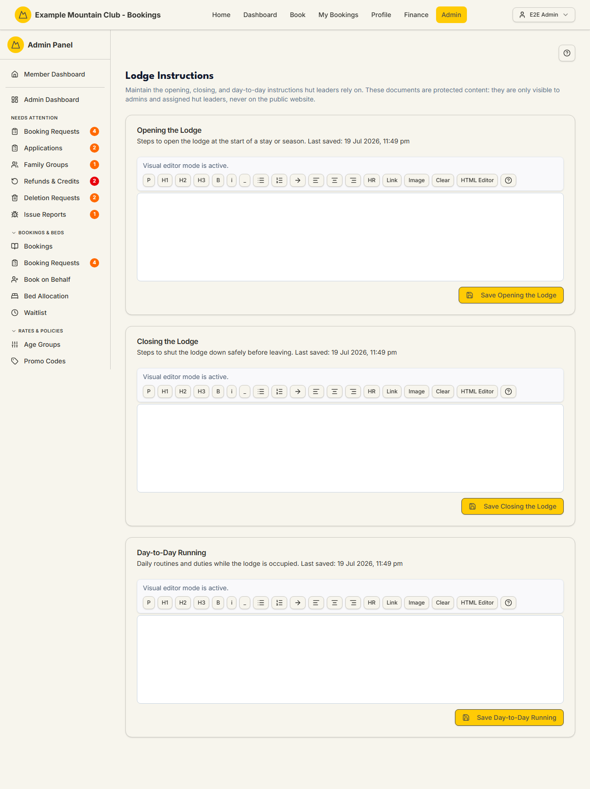

# Lodge Instructions

Audience: Operator

## What it is

The three protected documents that tell hut leaders how to run the lodge:
**Opening the Lodge**, **Closing the Lodge**, and **Day-to-Day Running**. They are
rich-text documents visible only to admins and assigned hut leaders — never on the
public website — and they feed the "Lodge rules / arrival information" card on the
[Lobby Display](display.md) and the kiosk's lodge information. Find it at
**Admin → Lodge Operations → Lodge Instructions** (`/admin/lodge-instructions`).

Lodge instructions are a **lodge** area document set: edited by admins with the
right access and read by assigned hut leaders on the kiosk. Because the content is
operational (door codes, shutdown steps), it is deliberately kept out of the
public site.

## When you'd use it

- You are writing the opening/closing routine for the season.
- A day-to-day procedure changed (rubbish day, generator, water) and hut leaders
  need the update.
- You want the lobby display and kiosk to show current arrival information.

## Step-by-step

### Edit an instruction document

1. Go to **Admin → Lodge Operations → Lodge Instructions**. Each document —
   **Opening the Lodge**, **Closing the Lodge**, **Day-to-Day Running** — has its
   own rich-text editor and shows when it was last saved.

   

2. Write in the visual editor (headings, lists, links, images), or switch to
   **HTML Editor** for raw HTML. Click **Save** on that document (e.g. **Save
   Opening the Lodge**) — each document saves independently.

## Settings reference

| Document | What it covers | Notes / constraints |
| --- | --- | --- |
| Opening the Lodge | Steps to open the lodge at the start of a stay or season | Rich text; shown to admins and assigned hut leaders only |
| Closing the Lodge | Steps to shut the lodge down safely before leaving | Rich text; protected content |
| Day-to-Day Running | Daily routines and duties while the lodge is occupied | Rich text; protected content |
| Visual editor / HTML Editor | Edit as formatted text or as raw HTML | The content is sanitised before it renders on the display/kiosk |

> These documents are **protected** — they never appear on the public website.
> The lobby display renders a sanitised version in its "Lodge rules" card, and
> only documents with content earn a card. See
> [`PUBLIC_PAGE_CONTENT_TOKENS.md`](../PUBLIC_PAGE_CONTENT_TOKENS.md) for how
> public vs. protected content is separated.

## Troubleshooting

| Symptom | Likely cause | Fix |
| --- | --- | --- |
| I can't edit the documents | Your admin role lacks the required access | Ask a full admin for the appropriate lodge/content edit access |
| The lobby display shows no "Lodge rules" card | The relevant document is empty | Add content and save — an empty document renders no card |
| My formatting looks different on the display | The display sanitises the HTML | Keep to standard formatting; raw scripts/styles are stripped |
| Guests can see the instructions | They shouldn't — this content is protected | Confirm you edited **Lodge Instructions**, not a public [Page Content](page-content.md) page |

## Related links

- Back to the [documentation hub](../README.md).
- Sibling guides: [Lodge Kiosk](lodge.md), [Lobby Display](display.md),
  [Hut Leaders](hut-leaders.md), [Page Content](page-content.md).
- Reference: [`PUBLIC_PAGE_CONTENT_TOKENS.md`](../PUBLIC_PAGE_CONTENT_TOKENS.md)
  and [Admin and Lodge](../ARCHITECTURE.md#admin-and-lodge).
