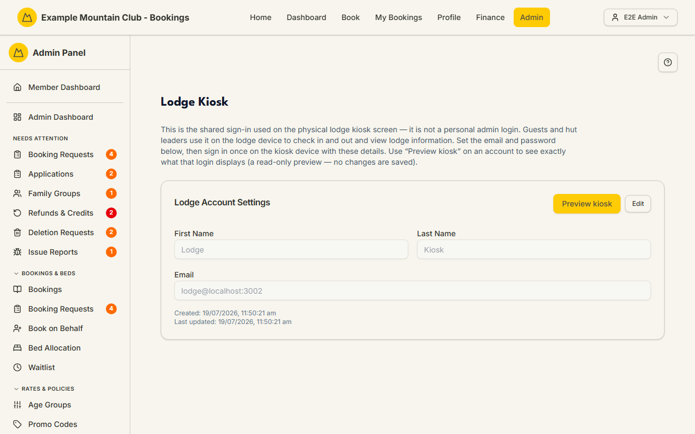

# Lodge Kiosk

Audience: Operator

## What it is

The shared sign-in for the physical lodge **kiosk** — the tablet at the lodge that
guests and hut leaders use to check in and out, see who's staying (including a
week-at-a-glance of nightly guest counts), and view lodge information. This
page sets the kiosk account's email and password (and, for a
multi-lodge club, which lodge each kiosk device serves); it is **not** a personal
admin login. Find it at **Admin → Lodge Operations → Lodge Kiosk**
(`/admin/lodge`).

The kiosk account is a **lodge** permission area: lodge view to read, lodge
**edit** to change the account or add one. The page appears only when the `kiosk`
module is on.

## When you'd use it

- You are setting up the lodge tablet for the first time and need its sign-in.
- You want to rotate the kiosk password.
- (Multi-lodge) You are adding a kiosk for a second lodge and binding it to that
  property.

## Step-by-step

### Set the kiosk account

1. Go to **Admin → Lodge Operations → Lodge Kiosk**. The **Lodge Account Settings**
   card holds the kiosk's first/last name and email.

   

2. Click **Edit**, set the **email** and a **New Password** (leave the password
   blank to keep the current one; minimum 6 characters), then **Save Changes**.
   Sign in once on the kiosk device with these details.

### Preview what the kiosk shows

1. Click **Preview kiosk** to open the kiosk exactly as this login would see it — a
   **read-only** preview, so nothing is saved.

### Multi-lodge: bind and add kiosk accounts

1. With more than one lodge, each account gains an **Operates lodge** selector.
   Bind a kiosk to the lodge its device lives at; an unbound account falls back to
   the club's **default lodge** (a warning flags this).
2. Use **Add a kiosk account** to create one per lodge. An account with staff
   access at more than one lodge is flagged **Ambiguous** and blocked from the
   kiosk until you set it to a single lodge.

## Settings reference

| Field | What it controls | Default | Notes / constraints |
| --- | --- | --- | --- |
| First Name / Last Name | The kiosk account's name | seeded "Lodge Kiosk" | Editable |
| Email | The kiosk sign-in email | seeded lodge email | Editable; this is a shared device login, not a personal one |
| New Password | Sets a new kiosk password | — | Minimum 6 characters; leave blank to keep current |
| Operates lodge | Which lodge this kiosk serves | Default lodge | Multi-lodge only; an unbound account uses the club default lodge |
| Preview kiosk | Opens the kiosk read-only as this account | — | No changes are saved |

## Troubleshooting

| Symptom | Likely cause | Fix |
| --- | --- | --- |
| Lodge Kiosk is missing from the sidebar / 404s | The `kiosk` module is off | Enable it under **Admin → Setup → Modules** — see [`CONFIGURATION.md`](../../CONFIGURATION.md#module-controls-and-admin-modules) |
| Everything is read-only ("… can view the lodge kiosk accounts but cannot change them") | Your admin role has lodge view but not edit | Ask a full admin for **lodge edit** access |
| "Lodge account not found. Run the database seed to create it." | The kiosk account row is missing | Seed the database, or create the account (multi-lodge) |
| A kiosk account is flagged **Ambiguous** | It has staff access at more than one lodge | Set **Operates lodge** to a single lodge and save |
| A kiosk falls back to the wrong lodge | The account is not bound to a lodge | Bind it to its lodge under **Operates lodge** (multi-lodge) |

## Related links

- Back to the [documentation hub](../README.md).
- Feature hub: [Multi-lodge support](../multi-lodge/README.md).
- Sibling guides: [Hut Leaders](hut-leaders.md) (kiosk PINs),
  [Chore Roster](roster.md), [Lodge Instructions](lodge-instructions.md),
  [Lobby Display](display.md).
- Reference: the lodge kiosk/operations model in
  [Admin and Lodge](../ARCHITECTURE.md#admin-and-lodge).
