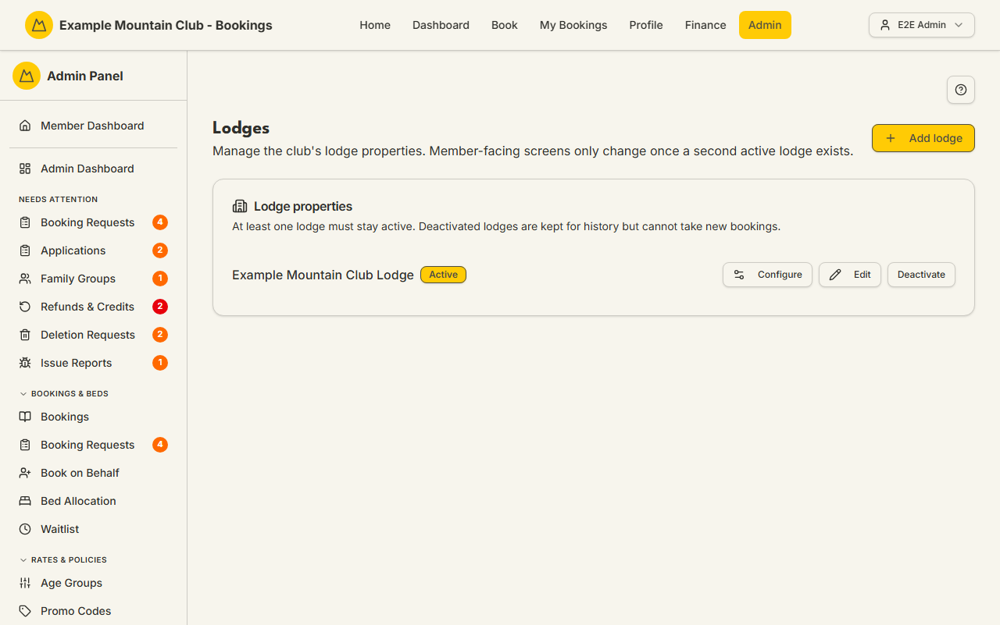

# Lodges

Audience: Operator

## What it is

The list of the club's lodge **properties**: their names, whether each is active,
and the address/door-code/travel-note that feed booking emails and the public
site. From here you add a lodge, edit its identity, deactivate it, or open its
**configuration hub** (rooms/beds, lockers, seasons & rates, and chores as cards,
plus per-lodge display settings as a section when the `lobbyDisplay` module is on).
Find it at **Admin → Setup & Configuration → Lodges** (`/admin/lodges`).

Lodges are a **lodge** permission area: lodge view to read, lodge **edit** to add,
edit, or deactivate. Member-facing screens only change once a **second active
lodge** exists — a single-lodge club sees no lodge pickers.

## When you'd use it

- You are bringing a second lodge online and need to create and configure it.
- A lodge's address, door code, or travel note changed.
- A property is closing for the season and you want to stop new bookings against
  it.

## Step-by-step

### Review the lodge properties

1. Go to **Admin → Setup & Configuration → Lodges**. Each lodge shows its name, an
   **Active/Inactive** badge, and its travel note, with **Configure**, **Edit**,
   and **Deactivate/Activate** actions.

   

### Add a lodge

1. Click **Add lodge**, enter a name, and save. A new lodge lands straight in a
   guided **setup wizard** (`/admin/lodges/[id]/setup`) with identity pre-filled;
   every remaining step can be skipped and completed later.

### Edit a lodge's identity

1. Click **Edit** on a lodge and set its **Name**, **Address**, **Door code**, and
   **Travel note**, then **Save**. The address feeds the public
   `{{lodge-address}}` content token; the door code and travel note appear in that
   lodge's booking and pre-arrival emails.

### Configure a lodge

1. Click **Configure** to open the lodge's hub (`/admin/lodges/[id]`), which cards
   through to [Rooms & Beds](rooms-beds.md), [Lockers](lockers.md), Seasons &
   Rates (in [Fees](fees.md)), and [Chores](chores.md). The **per-lodge display
   settings** are **not** a hub card — they appear as a separate section on this
   page only when the `lobbyDisplay` module is on (it is **off by default**; enable
   it under **Admin → Setup → Modules**). See [Lobby Display](display.md).

### Deactivate a lodge

1. Click **Deactivate**. If the lodge still has future bookings, waitlist entries,
   hut-leader assignments, or bound kiosk accounts, a pre-flight lists them and
   asks you to confirm — deactivating stops new bookings but leaves those in place.
   At least one lodge must stay active.

## Settings reference

| Field | What it controls | Default | Notes / constraints |
| --- | --- | --- | --- |
| Name | The lodge's display name | — | Required; up to 120 characters |
| Address | The property address | — | Optional; feeds the public `{{lodge-address}}` token (up to 300 chars) |
| Door code | The lodge access code | — | Optional; appears in that lodge's booking/pre-arrival emails (up to 80 chars) |
| Travel note | Directions / arrival notes | — | Optional; appears in booking/pre-arrival emails (up to 2000 chars) |
| Active | Whether the lodge takes new bookings | on | At least one lodge must stay active; inactive lodges are kept for history |
| Configure | Opens the per-lodge configuration hub | — | Hub cards: rooms/beds, lockers, seasons & rates, chores. Per-lodge display is a separate section, shown only when the `lobbyDisplay` module is on (off by default) |

## Troubleshooting

| Symptom | Likely cause | Fix |
| --- | --- | --- |
| Everything is read-only ("… can view the lodge properties but cannot change them") | Your admin role has lodge view but not edit | Ask a full admin for **lodge edit** access |
| Deactivate warns about dependencies | The lodge still has future bookings, waitlist, hut-leader, or kiosk ties | Review the list; confirm to deactivate anyway (they stay in place) or resolve them first |
| "At least one lodge must stay active" | You tried to deactivate the only active lodge | Keep one active, or activate another first |
| Member screens don't show a lodge picker | The club has only one active lodge | Expected — pickers appear once a second active lodge exists |
| Door code/travel note isn't in an email | The lodge's field is blank, or the email template omits the token | Fill the field here; check the [Booking Messages](booking-messages.md)/email template |

## Related links

- Back to the [documentation hub](../README.md).
- Feature hub: [Multi-lodge support](../multi-lodge/README.md)
  ([feature overview](../multi-lodge/feature-overview.md)).
- Sibling guides: [Rooms & Beds](rooms-beds.md), [Lockers](lockers.md),
  [Chores](chores.md), [Lodge Kiosk](lodge.md).
- Reference: [Adding a Second Lodge](../../CONFIGURATION.md#adding-a-second-lodge)
  and [Admin and Lodge](../ARCHITECTURE.md#admin-and-lodge).
