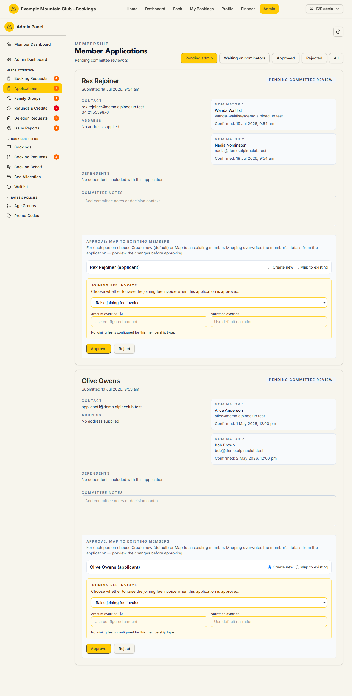

# Member Applications

Audience: Operator

## What it is

The review queue for people applying to join the club. Each application carries
the applicant's contact and address details, up to two nominators who must
confirm the nomination, and any dependents on a family application. From here you
chase or replace nominators, then approve or reject the application — and on
approval you can map the applicant and dependents onto existing member records
and raise their joining-fee invoice. Find it at **Admin → Members →
Applications** (`/admin/member-applications`). It also appears under **Needs
Attention** while applications are waiting for committee review.

Applications are a **membership** permission area: you need membership view to
read the queue and membership **edit** to approve, reject, refresh nominations,
or replace a nominator. Money is in integer cents (shown as dollars).

## When you'd use it

- A new membership application has come in and needs committee review.
- An application is stuck waiting on its nominators and you want to resend the
  nomination links or swap out an unconfirmed nominator.
- You are approving a returning member and want to link them to their existing
  record rather than create a duplicate.
- You are rejecting an application and need to decide whether the applicant is
  emailed.

## Step-by-step

### Open the queue and filter it

1. Go to **Admin → Members → Applications**. The heading shows **Member
   Applications** with a **Pending committee review** count, and each
   application is a card.

   

2. Use the filter buttons to switch the list: **Pending admin** (the default),
   **Waiting on nominators**, **Approved**, **Rejected**, or **All**. Each card
   shows a status chip — *Pending committee review*, *Waiting on nominators*,
   *Approved*, or *Rejected*.

### Chase or replace a nominator

1. On a **Waiting on nominators** application, each **Nominator 1 / Nominator 2**
   card shows whether it is confirmed, when the link expires, when it was last
   sent, and how many automatic reminders have gone out.
2. Click **Refresh nomination workflow** to send fresh links to the pending
   nominators and reset the reminder cycle. You will see *Nomination workflow
   refreshed.*
3. To swap an unconfirmed nominator, type at least two characters in **Search
   members**, then click **Use** on the right person. (Replacement is only
   offered for a nominator that has not yet confirmed.)

### Approve an application

1. Open a **Pending admin** application (both nominators have confirmed). The
   **Approve: map to existing members** panel appears.
2. For each person — the applicant and any dependents — choose **Create new**
   (the default) or **Map to existing**. When mapping, pick the target with the
   candidate chips or the **Search name or email** box + **Search**, then
   **Use**. A green box confirms *Mapped to …*; **Change** re-picks.
3. If you mapped anyone, click **Preview mapping** and review the **Field /
   Current / Application** diff — mapping **overwrites** the member's details
   from the application. Approval is blocked until the preview is fresh and free
   of blocking issues.
4. In the amber **joining fee** block choose **Raise joining fee invoice** (with
   an optional **Amount override ($)** and **Narration override**) or **Do not
   raise invoice** (with a required reason). A mapped applicant defaults to
   *skip*.
5. Click **Approve**. Because the applicant's email is on file, a dialog asks
   **Approve without emailing** or **Approve and email applicant** — the
   application is approved either way and your choice is recorded in the audit
   log.

### Reject an application

1. Click **Reject** (available on a pending application). Choose **Reject without
   emailing** or **Reject and email applicant** in the dialog; you can add a
   reason that is sent to the applicant.

## Settings reference

This is a review queue, not a settings page. The per-review inputs:

| Control | What it does | Notes / constraints |
| --- | --- | --- |
| Status filter buttons | Pending admin / Waiting on nominators / Approved / Rejected / All | Default is Pending admin |
| Committee notes | Free-text decision context stored on the application | Up to 4000 characters |
| Create new / Map to existing (per person) | Whether approval creates a member or overwrites an existing one | Mapping overwrites name, DOB, phone, and both addresses; the applicant also overwrites email + age tier |
| Preview mapping | Shows the field-by-field diff and validates the mapping | Required before approving anything mapped; a stale preview must be re-run |
| Raise joining fee invoice / Do not raise | Whether approval invoices the joining fee | Amount override is integer cents (blank = configured amount); a skip reason is 3–500 chars |
| Notify choice (approve/reject) | Whether the applicant is emailed | Recorded in the audit log either way |

The approval mapping is bound to a signed preview token and re-validated under a
per-member lock, so two admins mapping the same member cannot both win — the
second is refused (409) and must re-preview.

## Troubleshooting

| Symptom | Likely cause | Fix |
| --- | --- | --- |
| Everything is read-only ("… can view … but cannot approve, decline, or otherwise act on them") | Your admin role has membership view but not edit | Ask a full admin for membership edit access |
| An application can't be approved | It is still **Waiting on nominators** — both must confirm first | Use **Refresh nomination workflow**, or replace an unconfirmed nominator |
| **Approve** stays disabled | A mapped person has no target, or the mapping preview is stale/has errors | Choose a target for every mapped person and click **Preview mapping** again |
| "Enter a reason for not raising the joining fee invoice." | You chose **Do not raise invoice** without a reason | Enter a reason (3–500 characters) |
| Approval fails with a conflict | Another admin edited the target member or a recomputed value (e.g. age tier) drifted | Re-open the panel and **Preview mapping** again, then approve |

## Related links

- Back to the [documentation hub](../README.md).
- Sibling guides: [Members](members.md), [Induction](induction.md),
  [Subscriptions](subscriptions.md), [Family Groups](family-groups.md).
- Reference: the
  [membership application lifecycle](../STATE_MACHINES.md#membership-application-lifecycle)
  and [nomination lifecycle](../STATE_MACHINES.md#nomination-lifecycle), the
  application-approval mapping in
  [`CONFIGURATION.md`](../../CONFIGURATION.md#application-approval-mapping), and
  the [membership lifecycle invariants](../DOMAIN_INVARIANTS.md#membership-lifecycle).
