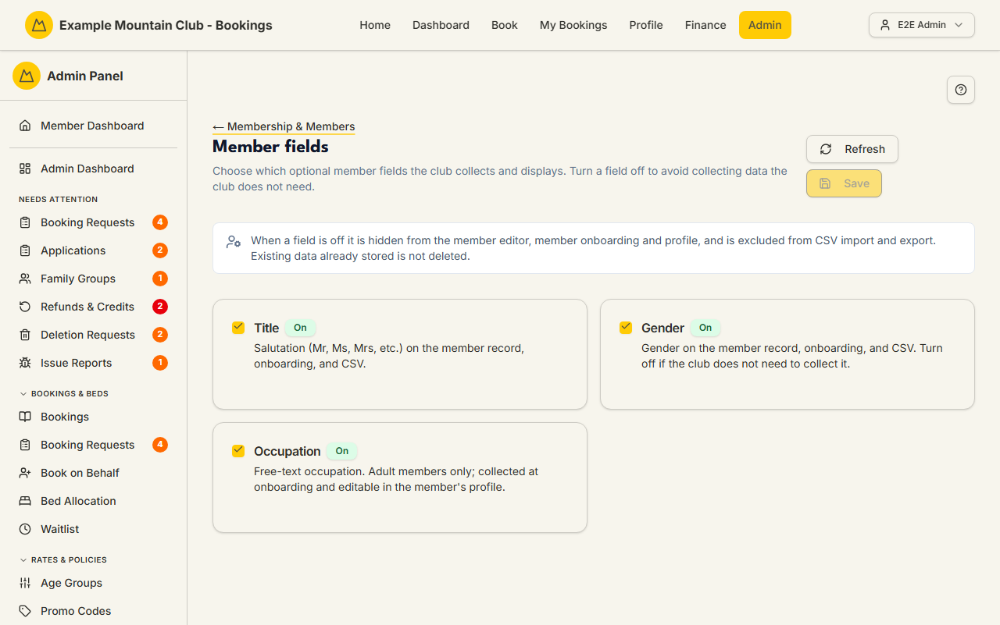

# Member Fields

Audience: Operator

## What it is

A short settings page that chooses which **optional member profile fields** — a
**Title** (salutation), **Gender**, and **Occupation** — the club collects and
displays. Turning a field off hides it from the member editor, onboarding and
profile, and CSV import/export; data already stored is not deleted. Find it at
**Admin → Setup & Configuration → Membership & Members → Member Fields**
(`/admin/member-fields`); it has no direct sidebar entry — reach it through the
[Membership & Members setup hub](membership-setup.md).

Member fields are a **membership** permission area: membership view to read,
membership **edit** to save.

## When you'd use it

- Your club does not collect a member's gender or occupation and you want to stop
  asking for it.
- You want to add a salutation/title to member records and onboarding.

## Step-by-step

### Toggle a field

1. Go to **Member Fields** (via **Membership & Members**). Each field is a card
   with an **On**/**Off** badge.

   

2. Tick or untick **Title**, **Gender**, and **Occupation** as needed, then click
   **Save**. Use **Refresh** to reload the current settings.

## Settings reference

| Field | What it controls | Default | Notes / constraints |
| --- | --- | --- | --- |
| Title | Salutation (Mr, Ms, Mrs, …) on the record, onboarding, and CSV | On | — |
| Gender | Gender on the record, onboarding, and CSV | On | Turn off if the club does not collect it |
| Occupation | Free-text occupation | On | Adult members only; onboarding + profile |

When a field is off it is hidden everywhere it would otherwise appear (the member
editor, dependent dialog, onboarding, profile, and CSV import/export). **Existing
stored data is not deleted** — turning the field back on shows it again.

## Troubleshooting

| Symptom | Likely cause | Fix |
| --- | --- | --- |
| Everything is read-only ("… can view member fields but cannot change them") | Your admin role has membership view but not edit | Ask a full admin for membership edit access |
| **Save** is disabled | You have not changed anything yet | Toggle a field; Save enables once the form is dirty |
| A field I turned off still shows old data somewhere | Turning a field off hides the input but does not erase stored values | This is expected; the data reappears if you turn the field back on |

## Related links

- Back to the [documentation hub](../README.md).
- Sibling guides: [Membership & Members setup](membership-setup.md),
  [Membership Types](membership-types.md), [Members](members.md).
- Reference: CSV field behaviour in
  [`CONFIGURATION.md`](../../CONFIGURATION.md#member-import-and-addresses).
