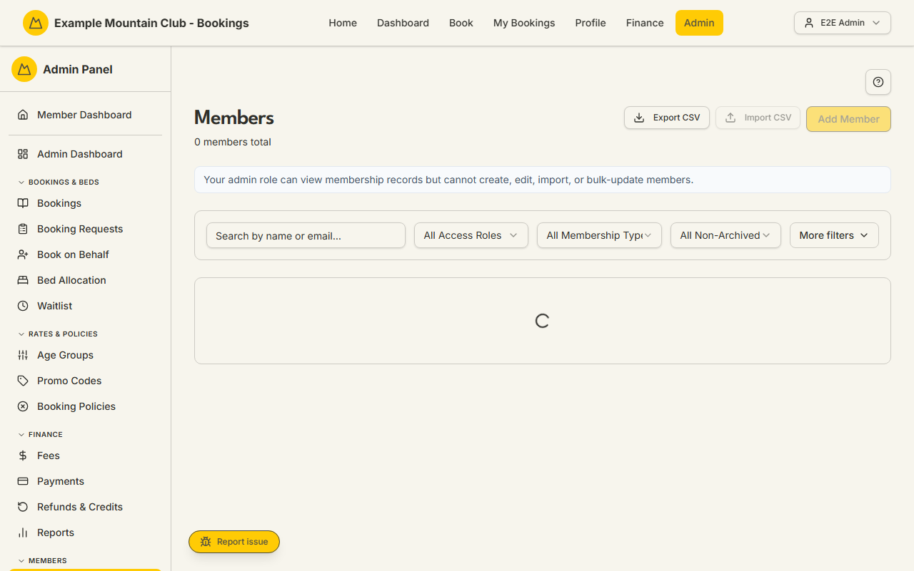

# Members

Audience: Operator

## What it is

The roster of every member record — search, filter, and sort it; create, edit,
import, and export members; run bulk activate/deactivate/role changes; send login
invites and password resets; and open any member for the full detail page (roles,
seasonal membership, family, finance, committee, lifecycle, and merge). Find it at
**Admin → Members → Members** (`/admin/members`).

Members is a **membership** permission area: membership view to read and export,
membership **edit** to create, edit, import, or bulk-update. Some actions cross
into other areas — the member's **credit** and **Xero link** controls need
**finance** edit, and merging a duplicate or changing a privileged member's login
email is **Full Admin only**. Money is entered in dollars and stored as integer
cents; dates are NZ date-only.

## When you'd use it

- A member calls and you need to find their record by name, email, or member ID.
- You are onboarding new members — one at a time, or in bulk from a CSV.
- You need to invite members to log in, reset a password, or change access roles.
- You are cleaning up duplicates, managing a family, or handling a member's
  cancellation, archive, or deletion.

## Step-by-step

### Find and filter members

1. Go to **Admin → Members → Members**. Search by name, email, or member-ID prefix,
   and use the filters (Access Role, Membership Type, Status) — open **More
   filters** for age tier, family group, login access, Xero link, subscription
   status, and Xero contact group.

   

2. Sort any sortable column (Name, Email, Access, Type–Tier, Status, Joined). Click
   a member's row to open their detail page.

### Add or edit a member

1. Click **Add Member** (or **Edit** on a row). Fill in the identity, contact, and
   address fields; tick **Can Login** for adults who sign in and book (leave it off
   for children/youth managed in a family group). Set the access role and age tier
   (the tier is calculated from date of birth).
2. On create, if Xero is connected you can link an existing Xero contact or create
   one (creating in Xero requires the full name, email, phone, dates, and both
   addresses). Optionally tick **Send account setup invite** (a 7-day link).
3. Click **Create Member** / **Save Changes**.

### Import members from CSV

1. Click **Import CSV** and follow the wizard: **Upload** a `.csv`, check the
   **Parse Preview**, confirm the column **Mapping** (First Name, Last Name, and
   Email are required; date fields get a date-format picker), review **Validation**
   (rows with issues are blocked), then **Import**. Imports are capped at 500 rows.
2. Optionally tick **Send account setup invites**. Rows with a cancelled date are
   created inactive and never invited; rows matching an existing member are skipped
   unchanged.

### Send login invites and password resets

1. Use a row's login button (**Invite**, **Resend Invite**, or **Reset Password**),
   or select rows and use the bulk bar. Setup invites are 7-day links; password
   resets let you pick a **Reset link expiry** (1 hour, 1 day, or 3 days). If some
   sends fail, the dialog keeps the failures with a **Retry**.

### Bulk actions

1. Select members (editors only) and use the bulk bar to **Deactivate**,
   **Reactivate**, **Change Access** (pick a new access role), or send login
   emails to the selection. Confirm the dialog to apply.
2. **Set Membership Type** applies one seasonal membership type to the whole
   selection — handy at season start. Pick the type and season year, then
   **Preview**: the dialog aggregates how many members will change, how many
   future bookings/drafts/waitlist records are affected, any age-tier changes,
   and any members blocked because making them age-exempt (N/A) would strand a
   linked-guest booking. Existing bookings are **not** repriced — the change only
   affects future pricing and eligibility. Enter a reason (recorded on each
   member's audit trail) and confirm. Every member is previewed and saved
   individually, so a stale preview or a linked-guest block skips just that
   member and reports it back with a **Preview again** option; the rest still
   apply. Archived members are excluded and reported. A run is capped at 100
   members at a time. Membership edit only.

   Because members are saved one after another and each change commits before the
   next, the request can take a little while for a large selection; the dialog
   stays open until the run finishes. After the saves, a single best-effort Xero
   contact-group reconcile runs in the same request (not in the background) — the
   membership changes are already committed by then, so re-running is safe and a
   timeout mid-reconcile can never lose a committed change. If the day's Xero API
   budget or a timeout cuts the reconcile short, the results panel says how many
   groups synced and the nightly reconcile finishes the rest automatically.

### Export

1. Click **Export CSV** to download the current filtered list (view access can
   export).

### The member detail page

Opening a member (`/admin/members/[id]`) gives collapsible sections that cover the
rest of a member's lifecycle. Because it is a per-member page, it is documented in
prose here rather than with a screenshot:

- **Contact & Personal** — name, email, phone, DOB, occupation, addresses,
  comments (a privileged member's login email is Full-Admin-only to change).
- **Account & Access** — user type, login, access roles, status, induction, and
  lodge access.
- **Family** — family groups, the billing family selector (finance edit), parent
  links, partner, and dependents.
- **Membership** — life-member status, the seasonal membership-type change
  (preview + admin reason required before saving), and subscription history.
- **Finance** — account credit (request an adjustment for a second admin to
  approve), promo codes, and the Xero contact link.
- **Committee** — this member's committee assignments.
- **History & Activity** — bookings, Xero activity, and the audit log.
- **Lifecycle & Deletion** — cancellation, archive (two-admin), hard-delete
  request (two-admin), and, for Full Admins, **Merge a duplicate** into this
  record.

### Merge a duplicate

1. From a member's **Lifecycle & Deletion** section, Full Admins can open
   **Merge**. The master record survives and keeps its login, security, and Xero
   identity; the duplicate's history moves onto the master and the duplicate is
   deleted. You **Preview merge**, then type the exact server-issued confirmation
   phrase to execute — it cannot be undone.

## Settings reference

The list is a working roster; its controls:

| Control | What it does | Notes / constraints |
| --- | --- | --- |
| Search | Match name, email, or member-ID prefix | 300 ms debounce |
| Access Role / Membership Type / Status | Primary filters | Status defaults to All Non-Archived |
| More filters | Age tier, family group, login access, Xero, subscription, Xero group | Xero-group filter needs Xero connected + the feature flag |
| Add Member / Edit | Create or edit a member | Membership edit; Admin user-type and privileged roles are Full-Admin only |
| Import CSV | Bulk-create from a CSV | Membership edit; 500-row cap; duplicate-email rows skipped |
| Export CSV | Download the filtered list | View access can export |
| Invite / Resend / Reset Password | Send login/setup emails | Setup invites are 7-day links; reset expiry 1 hour / 1 day / 3 days |
| Bulk bar | Deactivate / Reactivate / Change Access / Set Membership Type / send emails | Membership edit |
| Refresh Xero Groups | Refresh cached contact-group memberships | Membership edit; only when Xero is connected |
| Credit adjustment (detail) | Request a credit change | Finance edit; a **different** admin must approve; dollars stored as cents |
| Merge (detail) | Combine a duplicate into this member | Full Admin only; typed confirmation phrase |

## Troubleshooting

| Symptom | Likely cause | Fix |
| --- | --- | --- |
| The page is read-only ("… can view membership records but cannot create, edit, import, or bulk-update members") | Your admin role has membership view but not edit | Ask a full admin for membership edit access |
| "A member with this email already exists" | A login-enabled member already uses that email | Non-login members can share a parent's email; otherwise use a different email or merge the duplicate |
| A CSV import created nothing | One or more rows were blocked in validation | Fix the flagged rows (First/Last/Email required, valid dates) and re-import |
| A Xero contact wasn't created on save | Xero needs the full name, email, phone, DOB, joined date, and both addresses | Complete the listed fields, then create in Xero |
| I can't merge, or change a privileged member's login email | Those actions are Full Admin only | Ask a full admin |
| Credit/Xero controls are disabled on a member | They need **finance** edit, not membership | Ask a finance-edit admin |
| Subscription still shows "Not Invoiced" | The member has no Xero contact link (refresh skips unlinked members) | Link or create a Xero contact, then run a membership refresh from [Subscriptions](subscriptions.md) |

## Related links

- Back to the [documentation hub](../README.md).
- Sibling guides: [Member Applications](member-applications.md),
  [Member Fields](member-fields.md), [Membership Types](membership-types.md),
  [Family Groups](family-groups.md), [Subscriptions](subscriptions.md),
  [Cancellation Requests](membership-cancellations.md),
  [Deletion Requests](deletion-requests.md), [Committee](committee.md).
- Reference: the
  [seasonal membership assignment lifecycle](../STATE_MACHINES.md#seasonal-membership-assignment-lifecycle),
  [member subscription status transitions](../STATE_MACHINES.md#member-subscription-status-transitions),
  and
  [membership cancellation, archive, and delete lifecycle](../STATE_MACHINES.md#membership-cancellation-archive-and-delete-lifecycle);
  [Member Import And Addresses](../../CONFIGURATION.md#member-import-and-addresses)
  and [Merging Duplicate Members](../../CONFIGURATION.md#merging-duplicate-members)
  in `CONFIGURATION.md`; and the
  [membership lifecycle](../DOMAIN_INVARIANTS.md#membership-lifecycle) and
  [member profile merge](../DOMAIN_INVARIANTS.md#member-profile-merge-e11-1937)
  invariants.
