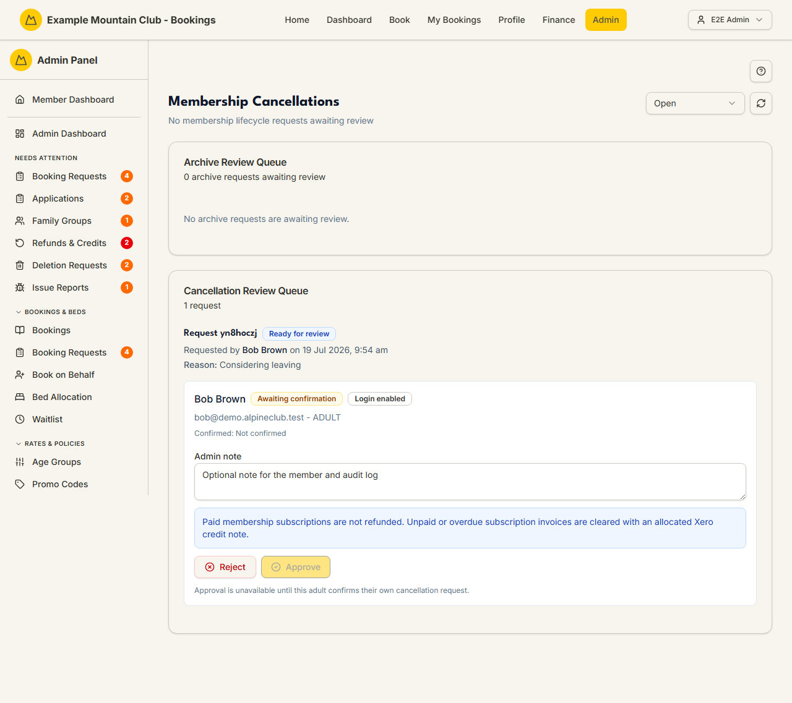
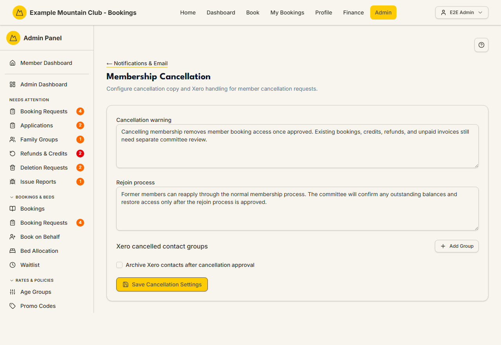

# Cancellation Requests

Audience: Operator

## What it is

The review queue for members leaving the club: **membership cancellation
requests** (approve or reject per person, with a member-email choice) and
**member archive requests** (approve or reject, with a two-admin rule). Find it at
**Admin → Members → Cancellation Requests** (`/admin/membership-cancellations`).
It also appears under **Needs Attention** while requests are pending.

The member-facing wording and the Xero contact-group handling behind these
requests are edited on a separate **Membership Cancellation** settings page —
covered in [its own section below](#cancellation-copy-and-xero-settings).

Cancellations are a **membership** permission area: membership view to read the
queues, membership **edit** to approve or reject. Paid subscriptions are never
refunded here; unpaid or overdue subscription invoices are cleared with an
allocated Xero credit note.

## When you'd use it

- A member has requested to cancel their membership and you need to review it.
- An admin has requested to archive a member and a *different* admin must approve.
- You are auditing completed, rejected, or withdrawn lifecycle requests.

## Step-by-step

### Review the queues

1. Go to **Admin → Members → Cancellation Requests**. The page shows an **Archive
   Review Queue** and a **Cancellation Review Queue**, with a status filter (Open,
   Completed, Rejected, Withdrawn, All) and a **Refresh** button.

   

### Approve or reject a cancellation

1. In the **Cancellation Review Queue**, open a request and its participants. A
   participant can be approved once its status is *Ready for review* and the
   member has confirmed; if bookings are outstanding, a notice lists them —
   resolve those first.
2. Add an optional **Admin note** (sent to the member and the audit log). The blue
   notice reminds you: paid subscriptions are not refunded; unpaid/overdue
   subscription invoices are cleared with an allocated Xero credit note.
3. Click **Approve** or **Reject**. A dialog asks whether to email the member —
   the request is processed either way and your choice is recorded in the audit
   log.

### Approve or reject an archive

1. In the **Archive Review Queue**, add an optional **Review note**, then click
   **Approve Archive** or **Reject**. If *you* raised the archive request, you
   cannot review it — a different admin must (this is enforced on the server too).

### Cancellation copy and Xero settings

The member-facing cancellation wording and Xero handling live on a separate
settings page — **Membership Cancellation** — reached from **Admin →
Notifications & Email** (`/admin/membership-cancellation`). It has no direct
sidebar entry and writes **membership** settings even though it sits under
Notifications.

There you can edit:

- **Cancellation warning** — the text shown to a member starting a cancellation.
- **Rejoin process** — the text explaining how a cancelled member can rejoin.
- **Xero cancelled contact groups** — the Xero contact groups that represent
  cancelled members (each a Group ID + optional Group name; **Add Group** /
  remove).
- **Archive Xero contacts after cancellation approval** — whether approving a
  cancellation also archives the member's Xero contact.

Click **Save Cancellation Settings**. These settings are audited and do not call
Xero on save.

## Settings reference

The review queue itself has no persistent settings — only per-review inputs.

| Control | What it does | Notes / constraints |
| --- | --- | --- |
| Status filter | Open / Completed / Rejected / Withdrawn / All | Default is Open |
| Admin note / Review note | Note sent to the member and the audit log | Up to 1000 characters |
| Notify choice (approve/reject) | Whether the member is emailed | Processed either way; recorded in the audit log |
| Approve Archive | Archives the member | Two-admin rule: the requester cannot approve |

Settings on the **Membership Cancellation** page: Cancellation warning (text),
Rejoin process (text), Xero cancelled contact groups (Group ID + name rows;
empty-ID rows are dropped on save), and Archive Xero contacts after cancellation
approval (checkbox).

## Troubleshooting

| Symptom | Likely cause | Fix |
| --- | --- | --- |
| Everything is read-only ("… can view membership cancellations but cannot approve or reject them") | Your admin role has membership view but not edit | Ask a full admin for membership edit access |
| A participant can't be approved | Bookings are outstanding, or the member has not confirmed | Resolve the listed bookings; wait for the member to confirm their request |
| Approve/Reject is disabled on an archive | You raised it — the two-admin rule needs a different reviewer | Ask another admin to review it |
| A refund didn't happen on cancellation | Paid subscriptions are not refunded; unpaid/overdue invoices are cleared with a credit note | This is by policy — see [`CANCELLATIONS.md`](../CANCELLATIONS.md#refund-policy) |

## Related links

- Back to the [documentation hub](../README.md).
- Sibling guides: [Members](members.md), [Subscriptions](subscriptions.md),
  [Refunds & Credits](refund-requests.md), [Deletion Requests](deletion-requests.md).
- Reference: the
  [membership cancellation, archive, and delete lifecycle](../STATE_MACHINES.md#membership-cancellation-archive-and-delete-lifecycle)
  and [refund and credit lifecycle](../STATE_MACHINES.md#refund-and-credit-lifecycle),
  the [refund policy](../CANCELLATIONS.md#refund-policy) and
  [GST treatment](../CANCELLATIONS.md#gst-treatment) in `CANCELLATIONS.md`, and
  the [Membership Cancellation Settings](../../CONFIGURATION.md#membership-cancellation-settings)
  reference.
