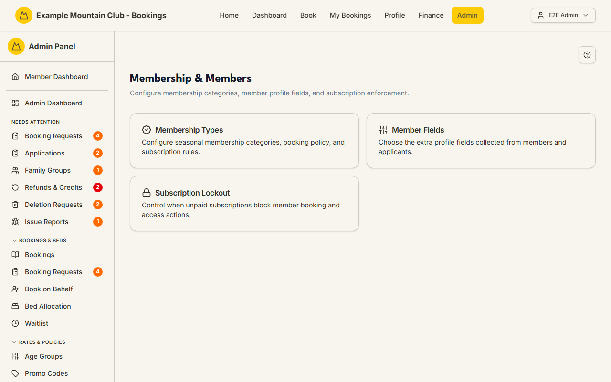

# Membership & Members setup

Audience: Operator

## What it is

A small hub that gathers the membership-configuration pages you set up once and
revisit occasionally. It links to three places: **Membership Types**, **Member
Fields**, and **Subscription Lockout**. Find it at **Admin → Setup &
Configuration → Membership & Members** (`/admin/membership-setup`).

Which cards you see depends on the active modules; membership configuration is a
**membership** permission area.

## When you'd use it

- You are configuring the club's seasonal membership categories.
- You want to change which optional profile fields are collected from members.
- You are turning the unpaid-subscription booking lockout on or off.

## Step-by-step

### Open the hub and pick a card

1. Go to **Admin → Setup & Configuration → Membership & Members**.

   

2. Choose a card:
   - **Membership Types** (`/admin/membership-types`) — seasonal membership
     categories, booking policy, and subscription rules. See
     [Membership Types](membership-types.md).
   - **Member Fields** (`/admin/member-fields`) — the extra profile fields
     collected from members and applicants. See [Member Fields](member-fields.md).
   - **Subscription Lockout** (`/admin/subscription-lockout`) — when unpaid
     subscriptions block booking and access. See
     [Subscription Lockout](subscription-lockout.md).

## Settings reference

This page is a launcher, not a settings screen.

| Card | Goes to | What it configures |
| --- | --- | --- |
| Membership Types | `/admin/membership-types` | Seasonal membership categories, booking/subscription policy |
| Member Fields | `/admin/member-fields` | Which optional profile fields the club collects |
| Subscription Lockout | `/admin/subscription-lockout` | The unpaid-subscription booking lockout and financial year |

If none of the cards is available, the page shows "No setup pages are available
for your current permissions."

## Troubleshooting

| Symptom | Likely cause | Fix |
| --- | --- | --- |
| "No setup pages are available for your current permissions" | A module hides all three destinations | Enable the relevant modules under **Admin → Setup → Modules** — see [`CONFIGURATION.md`](../../CONFIGURATION.md#module-controls-and-admin-modules) |
| A card opens read-only | Your admin role has membership view but not edit | Ask a full admin for membership edit access |
| The Subscription Lockout card bounces you back | Opening that page needs **support**-area view access (the card shows regardless) | Ask for support view access — see [Subscription lockout](subscription-lockout.md) |

## Related links

- Back to the [documentation hub](../README.md).
- Sibling guides: [Membership Types](membership-types.md),
  [Member Fields](member-fields.md), [Subscription Lockout](subscription-lockout.md),
  [Members](members.md).
- Reference: [Membership Type Settings](../../CONFIGURATION.md#membership-type-settings)
  in `CONFIGURATION.md`.
