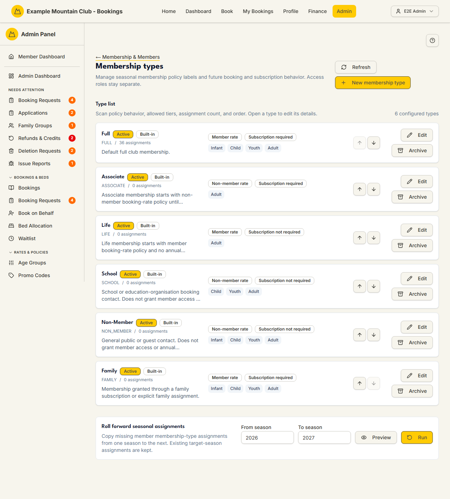

# Membership Types

Audience: Operator

## What it is

The editor for your club's **seasonal membership types** — the policy labels
(Full, Associate, Life, School, Non-Member, Family, or club-created categories)
that decide, per season, how a member is priced when booking and whether they owe
an annual subscription. It manages each type's identity, booking and subscription
behaviour, and allowed age tiers, plus a roll-forward tool to copy seasonal
assignments into the next season. Find it at **Admin → Setup & Configuration →
Membership & Members → Membership Types** (`/admin/membership-types`); it has no
direct sidebar entry — reach it through the [Membership & Members setup
hub](membership-setup.md).

Membership types are **policy records, not access roles** — changing a type never
grants or removes admin/login permissions (those are Access Roles). This is a
**membership** permission area: membership view to read, membership **edit** to
change.

## When you'd use it

- You are setting up membership categories for a new club, or adjusting how one
  category prices bookings or requires a subscription.
- You want to rename a renameable type (for example Associate → Reserve) or hide
  it from public listing.
- A season has rolled over and you want to carry members' membership-type
  assignments forward.
- A custom type is no longer used and you want to archive or delete it.

## Step-by-step

### Review the type list

1. Go to **Membership Types** (via **Membership & Members**). Each type is a card
   showing its name, **Active**/**Archived** and **Built-in**/**Custom** badges,
   its assignment count, the booking-behaviour and subscription-behaviour labels,
   and its allowed age-tier chips.

   

2. Use the up/down arrows on a card to reorder types (the order is saved
   immediately). Click **Refresh** to reload.

### Create or edit a type

1. Click **New membership type**, or **Edit** on a card. The editor opens with
   three sections — Identity, Booking and subscription behavior, and Allowed age
   tiers.
2. Set the **Name** and (optionally) **Description**; tick **Active and
   assignable** to make it selectable. To show it on the public site, tick **List
   this membership type publicly** and add a **Public description** (types stay
   hidden until you enable this).
3. Choose the **Booking behavior** (Member rate, Non-member rate, or Block
   booking) and **Subscription behavior** (Subscription required, Subscription
   not required, or Subscription required based on age tier). Tick every **allowed
   age tier**.
4. Click **Save changes** (or **Create type**). On a successful edit-save the
   editor closes automatically. If you close with the header **✕** or Escape
   while you have unsaved edits, a **Discard unsaved changes?**
   prompt appears — choose **Discard changes** or **Keep editing**. While a save
   is in flight the close controls are disabled so nothing races the auto-close.

### Delete or archive a type

1. **Archive** hides a type from new assignments without deleting it;
   **Reactivate** brings it back.
2. **Delete** is only offered for **Custom** (non-built-in) types. If the type has
   no assignments you confirm and it is gone. If it still has assignments, a
   **Delete … / Move assignments to** dialog opens: pick an active target type,
   then **Merge and delete** moves every assignment across before deleting.

### Roll assignments forward

1. In **Roll forward seasonal assignments**, set **From season** and **To
   season**, click **Preview** to see what would copy, then **Run**. Existing
   target-season assignments are kept; only missing ones are copied, and any
   exceptions (missing prior assignment or inactive type) are listed.

## Settings reference

| Field | What it controls | Default | Notes / constraints |
| --- | --- | --- | --- |
| Name | The type's display name | — | Required; max 120 chars; must be unique (case-insensitive) |
| Active and assignable | Whether the type can be assigned | on (new) | Archived types are hidden from new assignments |
| Description | Internal description | — | Max 1000 chars |
| List this membership type publicly | Show the type on the public site | off | Types stay hidden until enabled |
| Public description | Public-facing blurb | — | Max 4000 chars |
| Booking behavior | How members of this type are priced | Member rate | Member rate / Non-member rate / Block booking |
| Subscription behavior | Whether an annual subscription is required | Subscription required | Required / Not required / Based on age tier |
| Allowed age tiers | Which age tiers this type can be assigned to | — | At least one required |
| Order (up/down) | Display order of the type list | — | Saved immediately |
| From season / To season | Roll-forward source and target seasons | current / current+1 | Integer year; must differ |

There are **no price fields here** — nightly rates live in
[Fees → Hut Fees](fees.md), and joining/annual fees in the Joining and Annual
sections of [Fees](fees.md). Xero contact-group rules are not edited here either;
they live on the **Xero member grouping** surface.

## Troubleshooting

| Symptom | Likely cause | Fix |
| --- | --- | --- |
| Everything is read-only ("… can view membership types but cannot change them") | Your admin role has membership view but not edit | Ask a full admin for membership edit access |
| No **Delete** button on a type | It is a **Built-in** type (cannot be deleted) | Archive it instead if you want to retire it |
| A type won't delete directly | It still has member assignments | Use the merge dialog to move assignments to another active type first |
| The merge dialog says no target is available | There is no other active type to merge into | Reactivate or create an active type first |
| Save rejected as a duplicate name | Another type already uses that name (case-insensitive) | Choose a different name |
| Roll-forward **Preview** is disabled | From season and To season are the same | Set different years |

## Related links

- Back to the [documentation hub](../README.md).
- Sibling guides: [Membership & Members setup](membership-setup.md),
  [Member Fields](member-fields.md), [Subscription Lockout](subscription-lockout.md),
  [Subscriptions](subscriptions.md), [Fees](fees.md), [Members](members.md).
- Reference: the
  [seasonal membership type policy](../STATE_MACHINES.md#seasonal-membership-type-policy)
  and
  [seasonal membership assignment lifecycle](../STATE_MACHINES.md#seasonal-membership-assignment-lifecycle),
  the [Membership Type Settings](../../CONFIGURATION.md#membership-type-settings)
  reference, and the [Admin and Lodge](../ARCHITECTURE.md#admin-and-lodge)
  architecture.
