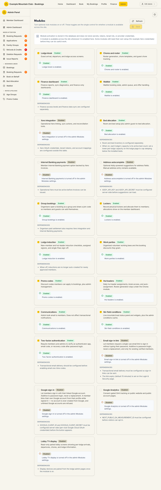

# Modules

Audience: Operator

## What it is

The single on/off panel for every optional part of the platform. A module's
toggle here is the **only** control for whether that feature is available across
the whole site — turning it off hides its admin pages, sidebar entries, public
widgets, and routes. Find it at **Admin → Setup & Configuration → Modules**
(`/admin/modules`).

Module activation lives under the **support** ("Support & System") permission
area: a support-**edit** admin can change toggles; a support-**view** admin sees
them read-only. The toggles are stored in the database and hold **no secrets** —
some modules still need their own setup (for example Xero credentials) before
they can do useful work. See [`CONFIGURATION.md`](../../CONFIGURATION.md) for the
environment side.

## When you'd use it

- You're setting up a fork and want to switch off features your club doesn't use.
- A guide says a page "404s unless the `<module>` module is on" and you need to
  enable it.
- You're enabling a capability (Xero, kiosk, bed allocation, two-factor) as part
  of rolling it out.

## Step-by-step

### Turn a module on or off

1. Go to **Admin → Setup & Configuration → Modules**. Each module is a card with
   a checkbox, an Enabled/Disabled badge, a description, and a readiness note.

   

2. Tick or untick the modules you want to change. A module that needs extra
   setup shows **Needs setup** with its dependencies listed (e.g. Xero
   credentials, an API key).
3. Click **Save**. Changes take effect across the site immediately. **Refresh**
   reloads the saved state.

## Settings reference

Modules and their out-of-the-box default (capability modules that need
deploy-time setup default **off**; general-purpose modules default **on**):

| Module | Enables | Default |
| --- | --- | --- |
| Lodge kiosk (`kiosk`) | Guest arrival/departure and lodge access screens | Off |
| Chores and roster (`chores`) | Roster generation, chore templates, guest chore tracking | Off |
| Finance dashboard (`financeDashboard`) | Finance reports, sync diagnostics, finance-only dashboards | Off |
| Waitlist (`waitlist`) | Waitlist state, admin queue, offer handling | Off |
| Xero integration (`xeroIntegration`) | Xero linking, sync, reconciliation, and the Integrations page | Off |
| Bed allocation (`bedAllocation`) | Room/bed setup and guest-to-bed allocation | Off |
| Internet Banking payments (`internetBankingPayments`) | Member bank-transfer option backed by Xero invoices | Off |
| Address autocomplete (`addressAutocomplete`) | Addy-powered address suggestions | Off |
| Group bookings (`groupBookings`) | Organiser-run group bookings with a join code | On |
| Lockers (`lockers`) | Physical locker records and member allocation | On |
| Lodge induction (`induction`) | Induction checklists, signers, and sign-off | On |
| Work parties (`workParties`) | Volunteer working bees and their booking discounts | On |
| Promo codes (`promoCodes`) | Discount codes on bookings | On |
| Hut leaders (`hutLeaders`) | Daily hut-leader assignment and auto-assignment | On |
| Communications (`communications`) | Admin bulk email to members | On |
| Ski-field conditions (`skifieldConditions`) | Mountain/road status panel and the Mountain Conditions page | On |
| Two-factor authentication (`twoFactor`) | Second-factor after password login | Off |
| Email sign-in link (`magicLink`) | Single-use email sign-in links | Off |
| Google sign-in (`googleLogin`) | Sign in with a linked Google account | Off |
| Google Analytics (`analytics`) | Consent-gated GA4 on public pages | Off |
| Lobby TV display (`lobbyDisplay`) | Read-only paired lobby screens | Off |

Each card's **readiness** badge reads Enabled, Disabled, or **Needs setup** (the
module is on but a dependency — credentials, an API key, inventory — is missing).

## Troubleshooting

| Symptom | Likely cause | Fix |
| --- | --- | --- |
| The toggles are read-only | Your role has support **view**, not **edit** | Ask a full admin for support edit access |
| A module shows "Needs setup" | It's on but a dependency isn't configured | Add the named credential/API key/inventory; see [`CONFIGURATION.md`](../../CONFIGURATION.md) |
| A page still 404s after enabling | You didn't **Save**, or you're looking at a cached tab | Save, then reload the target page |
| Enabling Internet Banking payments does nothing | It depends on Xero integration | Enable Xero integration first |

## Related links

- Back to the [documentation hub](../README.md).
- Sibling guides: [Setup](setup.md), [Login & Security](security.md),
  [Integrations](integrations.md), [Access Roles](access-roles.md).
- Reference: module flags in [`CONFIGURATION.md`](../../CONFIGURATION.md).
