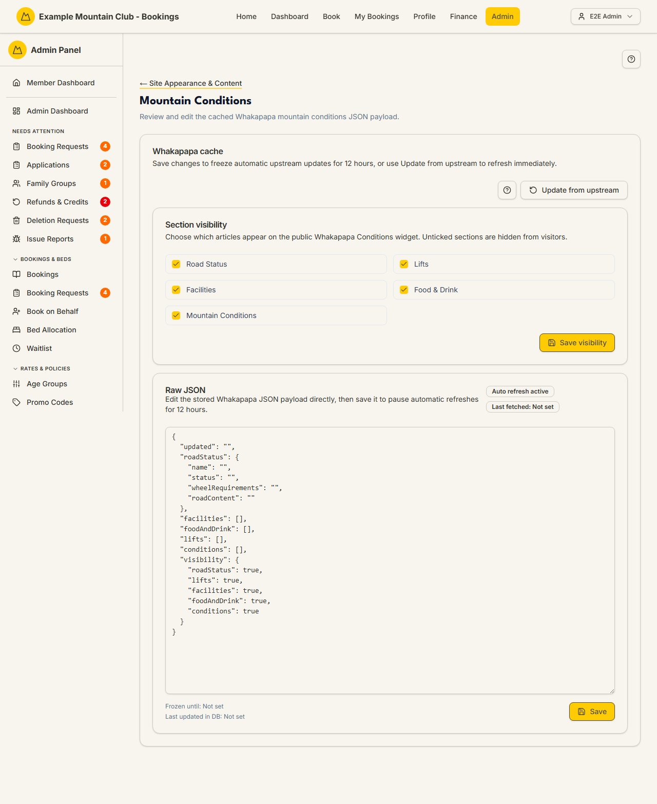

# Mountain Conditions

Audience: Operator

## What it is

The editor for the cached Whakapapa mountain-conditions payload that drives the
public Snow.nz conditions widget — road status, lifts, facilities, food & drink,
and general conditions. Find it at **Admin → Setup & Configuration → Site
Appearance & Content → Mountain Conditions** (`/admin/mountain-conditions`). It
has no direct sidebar entry — open it from the **Mountain Conditions** card on
the Site Appearance & Content hub.

The page is gated by the **`skifieldConditions`** module (Admin → Modules),
which is on by default. Turning that module off hides both this page and the
public conditions widget. Mountain Conditions is edited under the **content**
permission area.

## When you'd use it

- The upstream Snow.nz feed is wrong or stale and you want to correct what
  visitors see.
- You want to hide a section (e.g. Lifts) from the public widget.
- You need to force a fresh pull from the upstream source.

## Step-by-step

### Refresh, curate, or edit the payload

1. Open **Mountain Conditions**. The **Whakapapa cache** panel shows the current
   state (**Auto refresh active**, **Last fetched**, **Frozen until**, **Last
   updated in DB**). Click **Update from upstream** to pull the latest feed
   immediately.

   

2. Under **Section visibility**, tick the articles that should appear on the
   public widget — **Road Status**, **Lifts**, **Facilities**, **Food & Drink**,
   **Mountain Conditions**. Unticked sections are hidden from visitors. Click
   **Save visibility**.
3. To edit the content directly, use the **Raw JSON** editor to change the stored
   payload (`roadStatus`, `lifts`, `facilities`, `foodAndDrink`, `conditions`,
   and the `visibility` map), then click **Save**. **Saving freezes automatic
   upstream updates for 12 hours** so your edits are not overwritten.

## Settings reference

| Setting | What it controls | Default | Notes / constraints |
| --- | --- | --- | --- |
| Update from upstream | Pulls the latest Snow.nz feed now | — | Refreshes immediately; does not freeze |
| Section visibility (Road Status / Lifts / Facilities / Food & Drink / Mountain Conditions) | Which articles show on the public widget | All on | Unticked sections are hidden from visitors |
| Raw JSON payload | The stored conditions content | Upstream feed | Must be valid JSON; saving freezes auto-refresh for 12 hours |
| `skifieldConditions` module | Whether this page and the public widget exist at all | On | Toggled at **Admin → Modules**; off hides both |

## Troubleshooting

| Symptom | Likely cause | Fix |
| --- | --- | --- |
| The page 404s or the card is missing | The `skifieldConditions` module is off | Enable it at **Admin → Modules** |
| My edits were overwritten | Auto-refresh replaced them | Save via the Raw JSON editor — that freezes upstream updates for 12 hours |
| A section still shows publicly after unticking | Visibility wasn't saved | Click **Save visibility** after changing the checkboxes |
| Save is rejected | The Raw JSON is malformed | Fix the JSON syntax and save again |
| Everything is read-only | Your admin role can view but not edit under the content area | Ask a full admin for content edit access |

## Related links

- Back to the [documentation hub](../README.md).
- Parent hub: [Site Appearance & Content](appearance.md).
- Sibling guides: [Site Banners](site-banners.md),
  [Page Content](page-content.md).
- Reference: the module switchboard in [Modules](modules.md).
