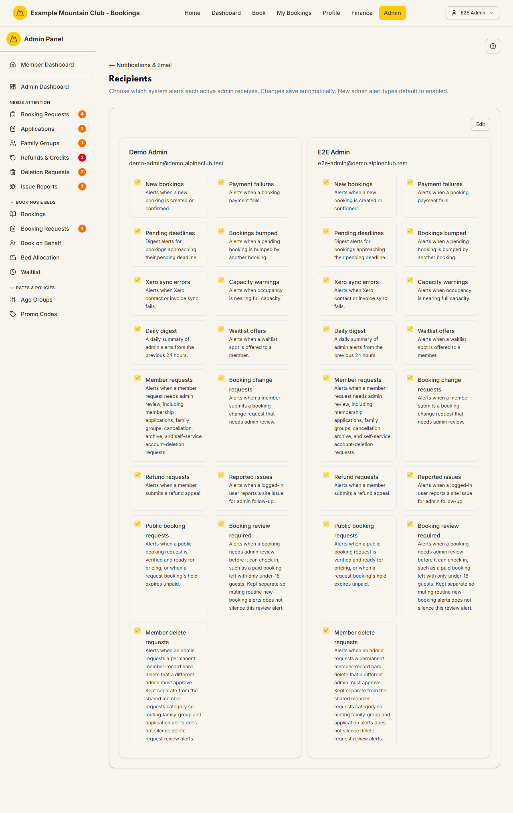

# Recipients

Audience: Operator

## What it is

A grid of your active admins, each with a set of checkboxes for the system
alerts they personally receive — new bookings, payment failures, refund
requests, Xero sync errors, the daily digest, and so on. It controls *who on the
team* is emailed when an alert fires, per admin. Find it at
**Admin → Setup & Configuration → Notifications & Email → Recipients**
(`/admin/notification-recipients`). It has no direct sidebar entry — open it from
the **Recipients** card on the Notifications & Email hub.

Recipients are edited under the **support** ("Support & System") permission
area: support **edit** can change them; a view-only support role sees the grid
but cannot edit. New admin alert types default to **enabled**, so a new admin
receives everything until someone trims their list.

## When you'd use it

- A committee member is being flooded with alerts they don't handle and wants
  some switched off.
- A new treasurer should start receiving payment-failure and Xero sync alerts.
- You want one person (not the whole team) to own the daily digest.

## Step-by-step

### Adjust who receives which alert

1. Open **Recipients**. Each active admin is a card of alert checkboxes.

   

2. Click **Edit** to make the checkboxes editable. Tick or untick each alert for
   each admin.
3. Click **Save Changes** (or **Cancel** to discard). Only the admins you
   actually changed are written.

## Settings reference

Each admin card has one checkbox per alert type:

| Alert | Sent when |
| --- | --- |
| New bookings | A new booking is created or confirmed |
| Payment failures | A booking payment fails |
| Pending deadlines | Bookings approach their pending deadline (digest) |
| Bookings bumped | A pending booking is bumped by another booking |
| Xero sync errors | Xero contact or invoice sync fails |
| Capacity warnings | Occupancy is nearing full capacity |
| Daily digest | A daily summary of the previous 24 hours' admin alerts |
| Waitlist offers | A waitlist spot is offered to a member |
| Member requests | A member submits a family-group / linking request |
| Booking change requests | A member requests a change to a locked booking |
| Refund requests | A member submits a refund appeal |
| Reported issues | A logged-in user reports a site issue |
| Public booking requests | A non-member submits a public booking request |
| Booking review required | A booking needs admin review before confirmation |
| Member delete requests | A hard-delete of a member is requested (two-admin rule) |

| Rule | Detail |
| --- | --- |
| Default | New alert types default to **enabled** for every admin |
| Scope | Only **active** admins (role `ADMIN`) appear; deactivating an admin removes them from the grid |
| Save granularity | Only changed admins are PUT; unchanged cards are left untouched |

## Troubleshooting

| Symptom | Likely cause | Fix |
| --- | --- | --- |
| The checkboxes won't tick | You haven't clicked **Edit**, or your role is support view-only | Click **Edit**; if still locked, request Support & System edit access |
| An admin isn't listed | They are inactive or not an admin | Grant them the admin role and reactivate them in [Members](members.md) |
| A committee member gets nothing | Every alert is unticked for them | Tick the alerts they should own and Save |
| Save failed with a permission error | The write route rejected a support-view session | Ask a full admin to make the change |

## Related links

- Back to the [documentation hub](../README.md).
- Hub: [Notifications & Email](notifications.md).
- Sibling guides: [Delivery Rules](notification-rules.md),
  [Email Messages](email-messages.md),
  [Email Deliverability](email-deliverability.md).
- Reference: admin roles and the admin team in [Members](members.md).
