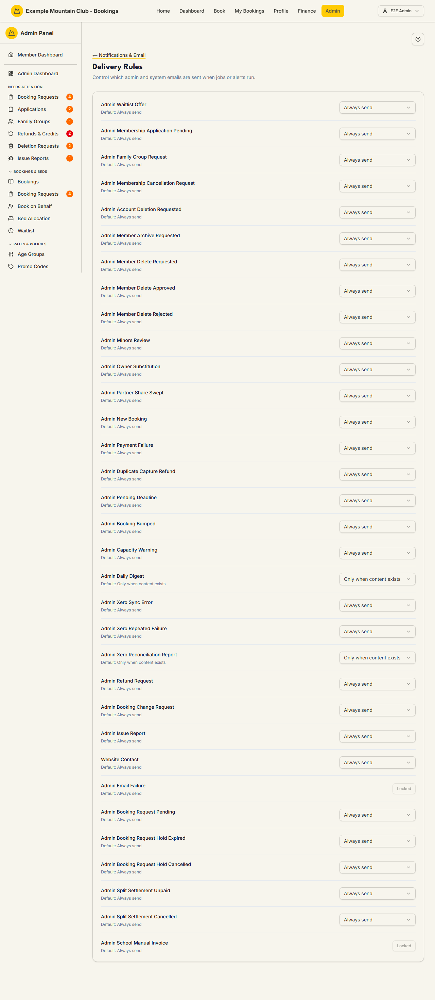

# Delivery Rules

Audience: Operator

## What it is

A per-template switch that decides whether each automated admin or system email
is actually sent when a job or alert fires. Every template has a built-in
default; you can leave it, quieten it to send only when there is real content,
or turn it off entirely. Find it at
**Admin → Setup & Configuration → Notifications & Email → Delivery Rules**
(`/admin/notification-rules`). It has no direct sidebar entry — open it from the
**Delivery Rules** card on the Notifications & Email hub.

Delivery rules are edited under the **support** ("Support & System") permission
area: a support **edit** role can change a rule; a view-only support role sees
the list but the selector is disabled.

## When you'd use it

- A recurring digest or alert is too noisy and you want it sent only when it has
  something to report.
- You are switching a provider off temporarily and want to stop a class of email
  at the source.
- You want to re-enable an alert that was previously turned off.

## Step-by-step

### Change a template's delivery mode

1. Open **Delivery Rules**. Each row is one template, with its **Default** shown
   beneath the name.

   

2. Use the selector on the right to pick a mode. The change **saves
   automatically** — there is no separate Save button.
3. A template shown as **Locked** cannot be changed here — its delivery is
   essential (for example a security or bearer-token email) and is fixed by the
   system.

## Settings reference

| Mode | What it does |
| --- | --- |
| **Always send** | The email is sent every time its trigger fires |
| **Only when content exists** | The email is sent only when it has something to report (e.g. a digest with at least one item); otherwise it is skipped |
| **Do not email** | The template is suppressed — the trigger runs but no email goes out |
| **Locked** (not a choice) | The template's delivery is essential and cannot be changed |

| Element | Detail |
| --- | --- |
| Default | Each row shows its built-in default mode; the constraint on a new rule is that unknown templates default to that value |
| Autosave | Selecting a mode PUTs immediately; a failed save reverts the row and shows an error toast |
| Stale-rule notice | A banner appears if any delivery rules point at templates that no longer exist ("N stale delivery rules need database cleanup") |

## Troubleshooting

| Symptom | Likely cause | Fix |
| --- | --- | --- |
| The selector is disabled | Your role has support **view** but not **edit** | Ask a full admin for Support & System edit access |
| A template shows **Locked** | Its delivery is essential and fixed | Nothing to change — it is intentionally not editable |
| "N stale delivery rules need database cleanup" | A stored rule references a removed template | Raise it with a developer; it is a data-cleanup task, not an operator setting |
| An email still arrives after I set *Do not email* | A different template covers that event, or the change did not save | Confirm the row saved, and check the exact template name against [Email Messages](email-messages.md) |

## Related links

- Back to the [documentation hub](../README.md).
- Hub: [Notifications & Email](notifications.md).
- Sibling guides: [Recipients](notification-recipients.md),
  [Email Messages](email-messages.md),
  [Email Deliverability](email-deliverability.md).
- Reference: the template catalogue in
  [`../../src/lib/email-message-registry.ts`](../../src/lib/email-message-registry.ts).
