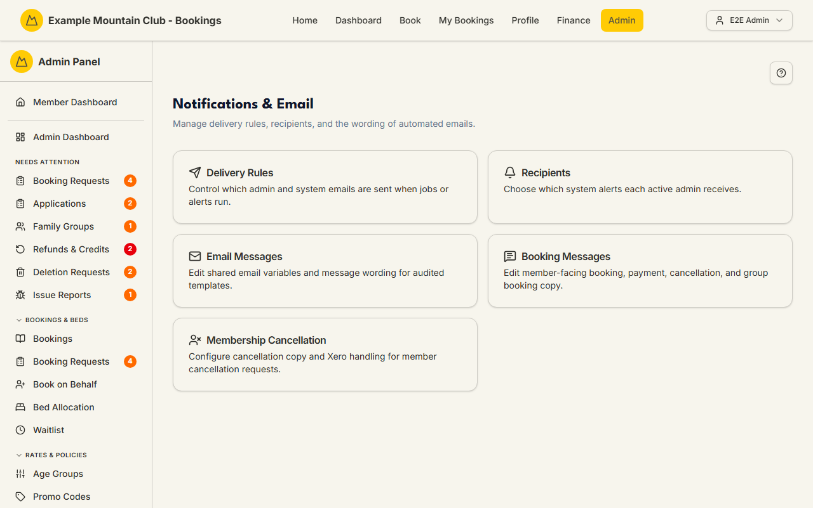

# Notifications & Email

Audience: Operator

## What it is

The hub for every automated email the system sends and the wording members and
admins see. From one page you reach the rules that decide *when* an email goes
out, *who* on the admin team receives each system alert, and the *wording* of
both system emails and member-facing booking copy. Find it at
**Admin → Setup & Configuration → Notifications & Email** (`/admin/notifications`).

The hub itself edits nothing — it is a set of cards, each opening the tool that
owns that job. Most of those tools are edited under the **support**
("Support & System") permission area, so a view-only support role can read them
but not save.

## When you'd use it

- You want to stop, throttle, or re-enable a class of automated email.
- A committee member should (or should not) receive a particular system alert.
- The wording of a system email or a member-facing booking message needs to
  change.

## Step-by-step

### Choose the right tool

1. Open **Notifications & Email**. Pick the card for what you want to change.

   

2. The five cards are:

   - **Delivery Rules** — control which admin and system emails are sent when
     jobs or alerts run. See [Delivery Rules](notification-rules.md).
   - **Recipients** — choose which system alerts each active admin receives. See
     [Recipients](notification-recipients.md).
   - **Email Messages** — edit shared email variables and the wording of audited
     email templates. See [Email Messages](email-messages.md).
   - **Booking Messages** — edit the member-facing booking, payment,
     cancellation, and group-booking copy. See
     [Booking Messages](booking-messages.md).
   - **Membership Cancellation** — configure the cancellation copy and Xero
     handling for member cancellation requests. See
     [Cancellation Requests](membership-cancellations.md).

## Settings reference

The hub has no settings of its own. Each card links to a tool that does:

| Card | Route | What it controls | Guide |
| --- | --- | --- | --- |
| Delivery Rules | `/admin/notification-rules` | Per-template send policy (always / only-when-content / off) | [Delivery Rules](notification-rules.md) |
| Recipients | `/admin/notification-recipients` | Per-admin toggles for each system alert | [Recipients](notification-recipients.md) |
| Email Messages | `/admin/email-messages` | Shared email variables + audited template subject/body | [Email Messages](email-messages.md) |
| Booking Messages | `/admin/booking-messages` | Member-facing booking/payment/cancellation copy | [Booking Messages](booking-messages.md) |
| Membership Cancellation | `/admin/membership-cancellation` | Cancellation copy + Xero handling | [Cancellation Requests](membership-cancellations.md) |

## Troubleshooting

| Symptom | Likely cause | Fix |
| --- | --- | --- |
| A card opens read-only | Your admin role can view but not edit under Support & System | Ask a full admin for support edit access |
| An expected email never arrives | Its delivery rule is set to *Do not email* or *Only when content exists* | Check [Delivery Rules](notification-rules.md) for that template |
| Delivery failures instead of missing rules | The recipient is suppressed or the send exhausted its retries | See [Email Deliverability](email-deliverability.md) |

## Related links

- Back to the [documentation hub](../README.md).
- Sibling guides: [Delivery Rules](notification-rules.md),
  [Recipients](notification-recipients.md), [Email Messages](email-messages.md),
  [Booking Messages](booking-messages.md),
  [Cancellation Requests](membership-cancellations.md).
- Sibling: [Email Deliverability](email-deliverability.md) for what actually
  reached members.
- Reference: the email template catalogue in
  [`../../src/lib/email-message-registry.ts`](../../src/lib/email-message-registry.ts)
  and the email section of [`ARCHITECTURE.md`](../ARCHITECTURE.md).
