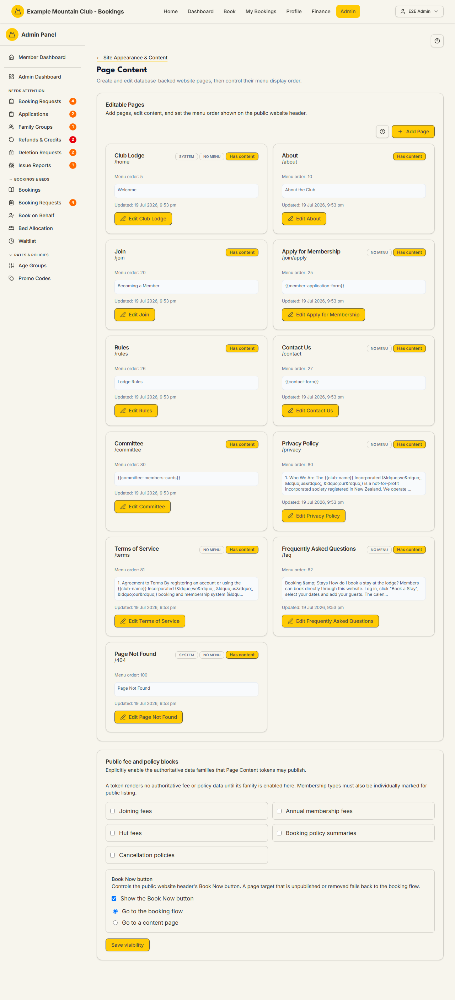

# Page Content

Audience: Operator

## What it is

The editor for your database-backed public website pages — About, Join, Rules,
Contact, Privacy, FAQ, and any custom pages — including their menu order,
publishing state, rich text, and content tokens. Find it at **Admin →
Setup & Configuration → Site Appearance & Content → Page Content**
(`/admin/page-content`). It has no direct sidebar entry — open it from the
**Page Content** card on the Site Appearance & Content hub.

It also holds two site-wide controls: which **authoritative fee and policy
blocks** may be published by content tokens, and the public header's **Book Now**
button. Page Content is edited under the **content** permission area.

## When you'd use it

- You want to reword a public page (About, Rules, FAQ) or add a new page.
- You need to change what shows in the public site menu or its order.
- You want a page to publish authoritative fees or a booking policy via a token,
  or to point the **Book Now** button somewhere specific.

## Step-by-step

### Edit or add a page

1. Open **Page Content**. Each **Editable Page** card shows the page title, its
   `/slug`, badges (**SYSTEM**, **NO MENU**, **Has content**), the **Menu
   order**, and the last-updated time.

   

2. Click **Edit &lt;page&gt;** to open its editor, change the title, menu title,
   menu order, rich-text content (with content tokens such as
   `{{member-application-form}}`, `{{contact-form}}`, or
   `{{committee-members-cards}}` — the editor's token help button lists every
   token the page supports), and its published state. Use **+ Add Page** to
   create a new page.
3. **System** pages (e.g. Club Lodge `/home`, Page Not Found `/404`) cannot be
   unpublished and keep their fixed menu order.

### Enable authoritative fee/policy blocks

1. Under **Public fee and policy blocks**, tick the families a token is allowed
   to publish: **Joining fees**, **Annual membership fees**, **Hut fees**,
   **Booking policy summaries**, and **Cancellation policies**. A token renders
   no authoritative data until its family is enabled here (and membership types
   must also be individually marked for public listing).
2. Under **Book Now button**, choose whether to **Show the Book Now button** and
   whether it goes to the **booking flow** or a **content page**. A page target
   that is unpublished or removed falls back to the booking flow.
3. Click **Save visibility**.

## Settings reference

| Setting | What it controls | Default | Notes / constraints |
| --- | --- | --- | --- |
| Page title / menu title | The page name and its public menu label | Per page | Length-capped by `PAGE_CONTENT_LIMITS` |
| Slug (`/path`) | The page's public path | Derived from the page | System pages are fixed; slugs must be valid, non-reserved |
| Menu order | Position in the public site menu | Per page | Between the `PAGE_CONTENT_LIMITS` sort-order min/max; system pages fixed |
| Published / NO MENU | Whether the page is live and whether it appears in the menu | Per page | System pages can't be unpublished |
| Content (rich text + tokens) | The page body | Per page | HTML sanitised; only recognised `{{tokens}}` render |
| Joining fees / Annual membership fees / Hut fees | Whether fee tokens may publish those authoritative amounts | Off | Money stays in integer cents; types must also be marked public |
| Booking policy summaries / Cancellation policies | Whether policy tokens may publish those blocks | Off | — |
| Show the Book Now button | Whether the public header shows Book Now | On | — |
| Book Now target | Booking flow, or a specific content page | Booking flow | An unpublished/removed target falls back to the booking flow |

## Troubleshooting

| Symptom | Likely cause | Fix |
| --- | --- | --- |
| A fee token shows nothing on the public page | Its family isn't enabled under Public fee and policy blocks | Tick the family and **Save visibility**; also mark the membership types public |
| The Book Now button goes to the booking flow, not my page | The target page is unpublished or was removed | Publish the target page, or re-select it |
| I can't unpublish a page | It's a **System** page | System pages can't be unpublished by design |
| Save is rejected | A field exceeds `PAGE_CONTENT_LIMITS`, or the slug is invalid/reserved | Fix the flagged field; keep slugs valid and non-reserved |
| Everything is read-only | Your admin role can view but not edit under the content area | Ask a full admin for content edit access |

## Related links

- Back to the [documentation hub](../README.md).
- Parent hub: [Site Appearance & Content](appearance.md).
- Sibling guides: [Site Content](site-content.md),
  [Image Manager](image-manager.md).
- Reference: the token catalogue and publishing rules in
  [`PUBLIC_PAGE_CONTENT_TOKENS.md`](../PUBLIC_PAGE_CONTENT_TOKENS.md).
