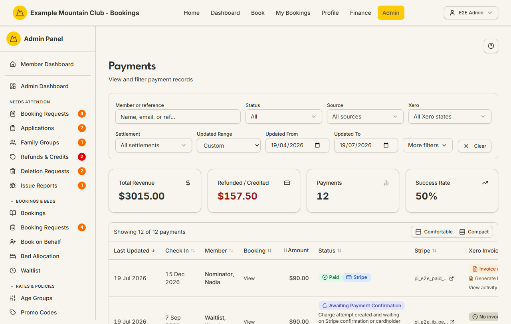

# Payments

Audience: Operator

## What it is

A filterable, sortable ledger of every booking payment — Stripe card payments
and Internet Banking bank transfers — showing the amount, status, Stripe link,
Xero invoice state, and any cancellation-settlement breakdown, with an inline
action to generate a missing Xero invoice. Find it at **Admin → Finance →
Payments** (`/admin/payments`).

Payments is a **finance** permission area: you need finance view access to open
it, and finance **edit** access to generate invoices. Amounts are stored as
integer cents and shown as dollars.

## When you'd use it

- A member asks whether their payment went through, or for a receipt/invoice.
- You are reconciling Stripe or Internet Banking payments against bookings.
- A payment is refunded or credited and you want to see the settlement
  breakdown.
- A successful payment has no Xero invoice yet and you want to generate one.

## Step-by-step

### Open and read the ledger

1. Go to **Admin → Finance → Payments**. The stat cards summarise the current
   filter (Total Revenue, Refunded / Credited, Payments count, Success Rate),
   and the table lists each payment.

   

2. Each row shows the last-updated date, check-in, member, a **View** link to
   the booking, the amount, the status chip (with a Stripe or Internet Banking
   sub-chip), the Stripe payment link, and the Xero invoice state.

### Find a payment

1. Type a name, email, or payment reference into **Member or reference**.
2. Narrow with **Status**, **Source** (Stripe / Internet Banking), **Xero**
   state, **Settlement** kind, and the **Updated** date range. Open **More
   filters** for exact/min/max amount and a check-in date range. Click **Clear**
   to reset.

### Generate a missing Xero invoice

1. Find a **Paid** (succeeded) Stripe payment whose Xero column shows **Invoice
   missing**.
2. Click **Generate Invoice**. The chip changes to **Queued** while Xero
   processes it. This action needs finance edit access; a view-only finance role
   sees it disabled.

### Follow a payment into Stripe or Xero

1. Click the Stripe id to open the payment in the Stripe dashboard, or the Xero
   invoice link to open the invoice in Xero. **View activity** opens the record
   activity log for the payment.

## Settings reference

Payments is a read-only ledger (aside from Generate Invoice). Its controls:

| Control | What it does | Default | Notes / constraints |
| --- | --- | --- | --- |
| Member or reference | Free-text search on member or reference | empty | — |
| Status | Filter by payment status | All | Pending, Processing, Succeeded, Failed, Refunded/Credited, Partially Refunded/Credited |
| Source | Filter by payment method | All sources | Stripe or Internet Banking |
| Xero | Filter by Xero invoice/activity state | All Xero states | Invoice linked/missing, failed/partial/pending activity |
| Settlement | Filter by cancellation-settlement kind | All settlements | None, Card refund, Account credit, Mixed, Restored credit |
| Updated range | Filter by last-updated date | last 3 months | NZ date-only, club time zone |
| Amount exact / min / max | Filter by amount | empty | Entered in dollars |
| Check-in range | Filter by booking check-in | empty | NZ date-only |
| Generate Invoice | Create a Xero invoice for a succeeded payment | — | Needs finance **edit**; only for succeeded, non-Internet-Banking payments with no invoice |

Page size is fixed at 25. **Total Revenue** and **Refunded / Credited** reflect
the whole filtered set; **Success Rate** is computed from the visible page.

## Troubleshooting

| Symptom | Likely cause | Fix |
| --- | --- | --- |
| "No payments found" | Filters are too narrow, or the date range excludes the payment | Click **Clear** and widen the **Updated** range |
| **Generate Invoice** is disabled | Your finance role is view-only, or the payment is not an eligible succeeded card payment | Ask a finance-edit admin; Internet Banking payments generate invoices differently |
| Xero shows **Failed activity** or **Pending activity** | A Xero sync attempt failed or is still running | Open **View activity**, then retry from the finance/Xero tools |
| A refund isn't reflected | The settlement is still processing, or you filtered it out | Check the **Settlement** filter and the row's settlement breakdown |
| Amounts look off by 100× | Amounts are stored as cents and shown as dollars | Enter amount filters in dollars (for example `90.00`) |

## Related links

- Back to the [documentation hub](../README.md).
- Feature hub: [Finance dashboard](../finance-dashboard/README.md).
- Sibling guides: [Reports](reports.md), [Bookings](bookings.md),
  [Booking Requests](booking-requests.md).
- Reference: the
  [payment lifecycle](../STATE_MACHINES.md#payment-lifecycle) and
  [refund and credit lifecycle](../STATE_MACHINES.md#refund-and-credit-lifecycle),
  the [Stripe](../ARCHITECTURE.md#stripe) and
  [operational Xero](../ARCHITECTURE.md#operational-xero) boundaries, and
  [payment and settlement invariants](../DOMAIN_INVARIANTS.md#payment-and-settlement).
