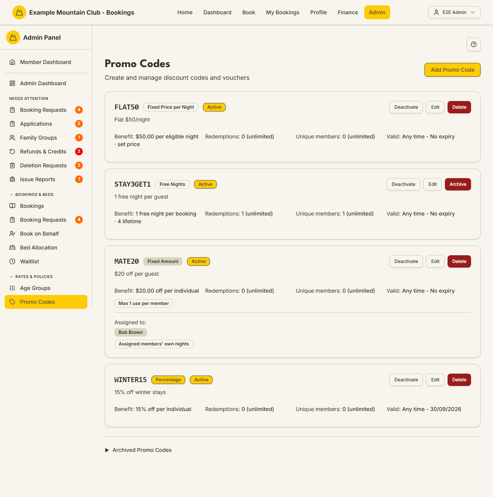

# Promo Codes

Audience: Operator

## What it is

The page for creating and managing discount codes and vouchers — percentage
off, a fixed amount off, free nights, or a fixed nightly price — with usage
caps, date windows, member restrictions, and optional Xero accounting codes.
Find it at **Admin → Rates & Policies → Promo Codes**
(`/admin/promo-codes`).

Managing promo codes needs **bookings edit** access. The create/edit form can
also pull your Xero chart of accounts and items; if your role has no finance
access, those fields fall back to plain text entry. Money is entered in dollars
and stored as integer cents; dates are NZ date-only lodge nights.

## When you'd use it

- You are running an early-bird or seasonal discount and need a code members can
  enter at booking.
- You want to give specific members a personal voucher (for example free nights
  as a prize or thank-you).
- You want to cap how many times a code can be used, or restrict it to certain
  dates, lodges, or members.
- You need to deactivate, archive, or restore a code.

## Step-by-step

### Review existing codes

1. Go to **Admin → Rates & Policies → Promo Codes**. Each active code is a card
   showing the code, its type badge, its benefit, redemptions, unique members,
   and validity, plus **Deactivate**, **Edit**, and **Delete**/**Archive**
   actions.

   

2. Open the **Archived Promo Codes** section at the bottom to see and restore
   archived codes.

### Create a code

1. Click **Add Promo Code**.
2. Enter a **Code** (auto-uppercased, for example `WINTER20`) and an optional
   **Description**.
3. Choose the **Discount Type** and fill the fields it reveals:
   - **Percentage Off** — a percentage per individual (1–100).
   - **Fixed Amount Off** — an amount off per individual (NZD).
   - **Free Nights** — free nights per individual, with an optional lifetime cap.
   - **Fixed Price per Night** — a fixed nightly price per eligible individual,
     used either as a set price or a cap.
4. Set any **Usage limits** (guests per booking, unique members, uses per
   member, total redemptions — leave blank for no limit) and any date windows.
5. Set the flags — **Members only**, **Member guests only**, **Active** — and,
   if you use Xero, the optional item/account codes. Optionally restrict the
   code to specific lodges (multi-lodge) or assign it to specific members.
6. Click **Create Promo Code**.

### Deactivate, archive, or restore

1. Use **Deactivate** to stop a code being used without deleting it. A code
   that has been redeemed is **archived** rather than deleted (its history is
   kept); use **Restore** from the Archived section to bring it back.

## Settings reference

| Setting | What it controls | Default | Notes / constraints |
| --- | --- | --- | --- |
| Code | The text members enter | — | Required; auto-uppercased |
| Discount Type | Percentage / Fixed Amount / Free Nights / Fixed Price per Night | Percentage | Reveals type-specific fields |
| Percentage / Amount / Free nights / Fixed nightly price | The discount value | — | Percent 1–100; money in dollars stored as cents |
| Fixed nightly mode | Set everyone to this price, or use as a cap | Cap only | Fixed-price type only |
| Max nightly value covered | Cap the discount applied to any one night | unlimited | Percentage and Free Nights only |
| Usage limits | Guests/booking, unique members, uses/member, total redemptions | unlimited | Blank = no limit |
| Valid From / Until, Check-in From / Until | When the code and eligible stays apply | none | NZ date-only |
| Members only / Member guests only | Restrict who the code applies to | off | — |
| Active | Whether the code can be used now | on | — |
| Xero Item Code / Account Code | Post the discount line to a specific Xero item/account | none | Item's mapped account wins over the account code |
| Restrict to Lodges | Limit redemption to chosen lodges | all lodges | Multi-lodge only |
| Assign to Specific Members | Limit use to named members, with a scope choice | none | Own-nights-only or whole booking |

## Troubleshooting

| Symptom | Likely cause | Fix |
| --- | --- | --- |
| The page is read-only | Your admin role is view-only for bookings | Ask a full admin for bookings edit access |
| Xero item/account fields are plain text boxes | Your role has no finance access, or Xero data failed to load | Enter the codes manually, or ask a finance admin — the code still works |
| Delete became Archive | The code has redemptions and its history must be kept | Use Archive; **Restore** it later from the Archived section |
| A code won't apply to a booking | It is inactive, expired, capped out, or restricted to other members/lodges/dates | Check the Active flag, date windows, usage caps, and any member/lodge restriction |
| No promo codes appear | None have been created (the demo seed ships none) | Click **Add Promo Code** to create one |

## Related links

- Back to the [documentation hub](../README.md).
- Sibling guides: [Book on Behalf](book.md), [Booking Policies](booking-policies.md),
  [Seasons](seasons.md), [Payments](payments.md).
- Reference: promo application in the
  [booking/payment flow](../ARCHITECTURE.md#booking-and-payment-flow), the
  [payment lifecycle](../STATE_MACHINES.md#payment-lifecycle), and money rules in
  [`DOMAIN_INVARIANTS.md`](../DOMAIN_INVARIANTS.md#money).
