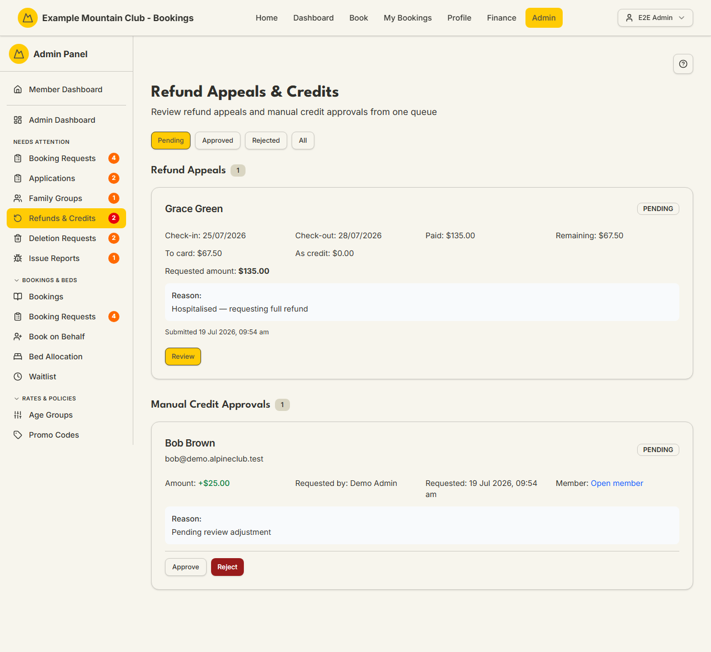

# Refunds & Credits

Audience: Operator

## What it is

One review queue for two money-back flows: member **refund appeals** (approve a
refund to the original card or as account credit, or reject) and admin-raised
**manual credit approvals** (a second admin approves a credit adjustment). Find it
at **Admin → Finance → Refunds & Credits** (`/admin/refund-requests`). It also
appears under **Needs Attention** while requests are pending.

Refunds & Credits is a **finance** permission area: finance view to read the
queue, finance **edit** to approve, reject, or process. Amounts are integer cents;
a refund is capped at the remaining refundable amount on the payment.

## When you'd use it

- A member has appealed a cancellation refund and you need to decide the amount and
  method.
- An admin has requested a manual account-credit adjustment that needs a second
  admin's approval.
- You are auditing approved or rejected refunds and credits.

## Step-by-step

### Review the queues

1. Go to **Admin → Finance → Refunds & Credits**. Filter by **Pending** (the
   default), **Approved**, **Rejected**, or **All**. The page shows **Refund
   Appeals** and **Manual Credit Approvals**.

   

### Approve or reject a refund appeal

1. On a pending appeal, click **Review**. Set the **Refund Amount ($)** (pre-filled
   to the smaller of the requested and maximum refundable amount; the max is shown)
   and optional **Admin Notes** (visible to the member).
2. Click **Approve & Refund** — a dialog asks whether to email the member; the
   refund is processed either way and your choice is recorded in the audit log. Or
   click **Reject** (also with an email choice).
3. The settlement shows how much went **to card** versus **as credit**, including
   any restored prior credit.

### Approve or reject a credit adjustment

1. On a pending manual credit approval, click **Approve** or **Reject**. If *you*
   raised the request, you cannot approve it — "Needs another admin to approve this
   request" — this is the two-person rule. An approved adjustment is applied to the
   member's credit ledger.

## Settings reference

This is a review queue — its per-review inputs:

| Control | What it does | Notes / constraints |
| --- | --- | --- |
| Status filter | Pending / Approved / Rejected / All | Default is Pending; synced to the URL |
| Refund Amount ($) | The amount to refund | Entered in dollars; capped at the remaining refundable amount |
| Admin Notes | Note visible to the member | Optional |
| Notify choice (approve/reject) | Whether the member is emailed | Recorded in the audit log either way |
| Approve / Reject (credit) | Action a manual credit adjustment | Two-person rule: the requester cannot approve |

Paid membership subscriptions are not refunded; cancellation credit and GST are
governed by the [cancellation policy](../CANCELLATIONS.md#refund-policy).

## Troubleshooting

| Symptom | Likely cause | Fix |
| --- | --- | --- |
| Everything is read-only ("… can view refund appeals and credit approvals but cannot approve, reject, or process them") | Your finance role is view-only | Ask a finance-edit admin |
| A credit approval is disabled for me | You raised it — the two-person rule needs a different reviewer | Ask another admin to review it |
| The refund amount won't go above a certain figure | It is capped at the remaining refundable amount (paid minus already refunded) | Refund up to that cap; the rest may already be refunded |
| The queue is empty | The status filter excludes the request | Switch to **All** to see approved/rejected items |

## Related links

- Back to the [documentation hub](../README.md).
- Feature hub: [Finance dashboard](../finance-dashboard/README.md).
- Sibling guides: [Payments](payments.md), [Subscriptions](subscriptions.md),
  [Cancellation Requests](membership-cancellations.md), [Members](members.md).
- Reference: the
  [refund and credit lifecycle](../STATE_MACHINES.md#refund-and-credit-lifecycle),
  the [refund policy](../CANCELLATIONS.md#refund-policy) and
  [GST treatment](../CANCELLATIONS.md#gst-treatment) in `CANCELLATIONS.md`, and
  the [payment and settlement invariants](../DOMAIN_INVARIANTS.md#payment-and-settlement).
