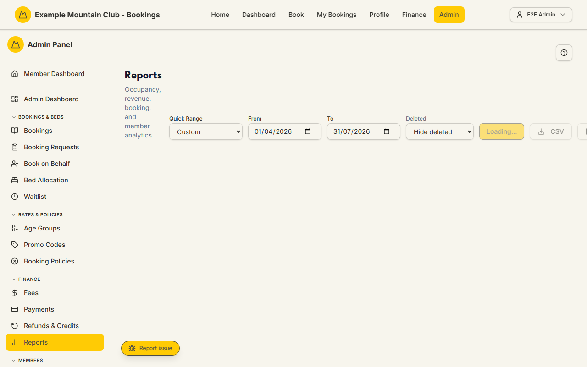

# Reports

Audience: Operator

## What it is

A read-only analytics dashboard for booking occupancy, revenue, booking-status
trends, and member-subscription stats over a date range you choose, with CSV and
PDF export. Find it at **Admin → Finance → Reports** (`/admin/reports`).

This page is a **finance** permission area: you need finance view access to open
it. Money is stored as integer cents and shown as whole dollars; dates are NZ
date-only lodge nights, interpreted in the club time zone.

## When you'd use it

- You want the season's or month's occupancy, revenue, and guest totals for a
  committee update.
- You need to see booking trends or the split of member vs non-member guests.
- You want a snapshot of member subscription health (paid-up, unpaid, overdue,
  new members).
- You need to export the figures as CSV or a PDF.

## Step-by-step

### Open and set the range

1. Go to **Admin → Finance → Reports**. Set the **From** and **To** dates (or
   pick a **Quick Range** such as This Month or Last Quarter), choose whether to
   include deleted bookings, and click **Update**.

   

2. If the club runs more than one lodge, a **Lodge** selector lets you scope
   occupancy and metrics to one lodge or all lodges.

### Read the figures

1. The top cards show **Total Bookings**, **Total Revenue**, **Total Guests**,
   and **Avg Occupancy** for the range. The second row shows member stats
   (Active, Paid-Up, Unpaid, Overdue, New) for the current season.
2. The charts show **Occupancy Rate**, **Revenue by Day/Week/Month** (the
   granularity is chosen automatically from the range length), **Booking Trends
   (by week)**, **Member vs Non-Member Guests**, and **Booking Status
   Breakdown**.

### Export

1. Click **CSV** to download the figures as a spreadsheet, or **Download PDF**
   for a printable version. Both are enabled once the data has loaded.

## Settings reference

This page is read-only. Its controls:

| Control | What it does | Default | Notes / constraints |
| --- | --- | --- | --- |
| Quick Range | Preset date range | Custom | This Month, Last Month, Last Quarter, Year to Date, Last Year |
| From / To | The reporting date range | month-of (today - 3 months) to end-of-month of today | NZ date-only, club time zone; To must be after From |
| Lodge | Scope metrics to one lodge | All lodges | Only shown with more than one active lodge |
| Deleted | Include soft-deleted bookings | Hide deleted | Include deleted, or Deleted only |
| Update | Re-run the query | — | — |
| CSV | Download the figures as CSV | — | Filename `tac-report-<date>.csv` |
| Download PDF | Generate a printable PDF | — | Falls back to the browser print dialog on error |

Notes: **Total Revenue** excludes cancelled and bumped bookings; the member
stat cards always use the current season's data (shown in the print header);
occupancy is sampled to keep long ranges readable.

## Troubleshooting

| Symptom | Likely cause | Fix |
| --- | --- | --- |
| A red error banner appears | The date range is invalid (To not after From) or the query failed | Fix the dates and click **Update** |
| CSV / PDF buttons are greyed out | The data has not finished loading | Wait for the dashboard to load, then export |
| A chart says "No … data for this period" | There is no matching data in the range | Widen the range or change the Deleted / Lodge filter |
| Occupancy shows 0% | No bed-nights were occupied in the range, or capacity is unset | Check the range and the lodge's capacity setup |
| Revenue looks low | Cancelled and bumped bookings are excluded by design | Compare against the [Payments](payments.md) ledger for the full picture |

## Related links

- Back to the [documentation hub](../README.md).
- Feature hub: [Finance dashboard](../finance-dashboard/README.md).
- Sibling guides: [Payments](payments.md), [Bookings](bookings.md).
- Reference: [finance reporting](../ARCHITECTURE.md#finance-reporting) in the
  architecture doc, and the
  [booking/payment flow](../ARCHITECTURE.md#booking-and-payment-flow).
